# 乳腺图像分割中的转置卷积与图像大小调整

> 原文：<https://medium.datadriveninvestor.com/transpose-convolutions-vs-resizing-images-in-segmentation-of-mammograms-d38fc96bb492?source=collection_archive---------1----------------------->

我在之前的中写过[如何将我的乳房 x 光片卷积分类器应用于一个网络，该网络将对每个像素进行密集预测，从而将图像分割成正常和异常。](https://medium.com/@ericscuccimarra/segmenation-of-cbis-ddsm-images-f383d3e583ea)

我最近做了两个重大的改变，这两个改变都极大地改善了结果。变化是使用调整大小而不是转置卷积来进行上采样，并将预测从硬最大值改为软最大值。

当我开始调整分类器以进行密集预测时，我遵循了 Long 等人[23]的“语义分割的完全卷积网络”的蓝图。这种方法非常简单地从分类器中删除了最后一个完全连接的层，并用一系列变换卷积来替换它，以将图像上采样回全分辨率。从后面的缩小层到相应的上采样层增加了跳跃连接，以便允许输出更接近地类似于输入。

这对于有异常的图像足够有效，但是没有异常的图像产生的输出与输入相似，如图 1 和图 2 所示。注意，在这一点上，预测是逻辑上的硬最大值。

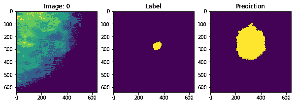

Figure 1 — Image with an abnormality

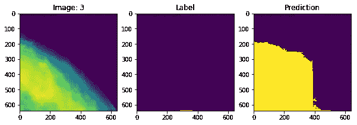

Figure 2 — image without abnormality

在图 1 中，预测大多与标签匹配，但问题出在图 2 中，预测似乎只是突出显示了具有较高像素值的输入部分。我假设这是由于跳过连接将输入的不相关特征引入上采样部分造成的，并且我试图通过在加法之前添加 1x1 卷积来解决这一问题，以便仅从先前的层中提取相关特征。不幸的是，这并没有多大帮助，如图 3 所示。

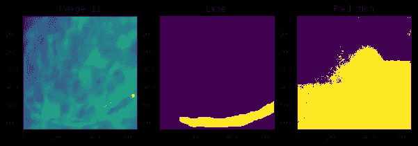

Figure 3 — output with bottleneck before skip connection

如图 10 所示，在预测之前从模型中提取图层会显示带有大量伪像的高噪声图像。

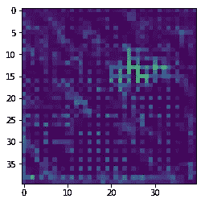

Figure 10 — image extracted from second transpose convolutional layer

我首先关注的是伪像，这让我找到了 Odena 等人[22]的“[反卷积和棋盘伪像](https://distill.pub/2016/deconv-checkerboard/)”，它建议用最近邻尺寸调整替换转置卷积，以减少转置卷积产生的伪像。由于不愿意完全提交，我用 resizes 替换了一些中间的变换卷积，但保留了前两个和后两个。这确实改善了结果，并显著提高了训练速度，但对负面图像的错误预测没有帮助。

在研究问题时，我发现查看软最大概率比硬预测有用得多。我还意识到，对于使用这种系统的放射科医师来说，这是正确的，所以我将输出从硬预测改为软最大概率。这些变化无疑改进了模型，但是正常图像导致假阳性的问题仍然存在，如图 4 和图 5 所示。

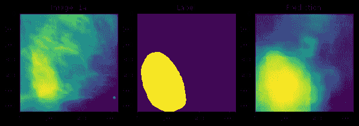

Figure 4 — soft prediction for image with an abnormality

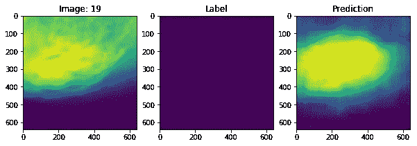

Figure 5 — soft prediction for image without an abnormality

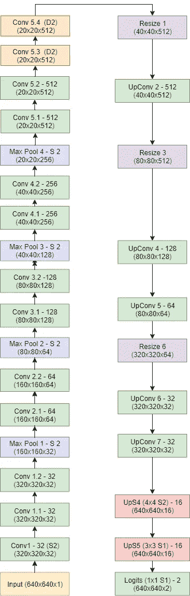

Figure 11 — Architecture of network

此时，我从这个项目中抽出几天时间来思考这些问题，并阅读了一些关于密集预测的论文。这让我想知道，将输入从 640x640x1 下采样到 5x5x1024 有什么意义，只是必须反转这一过程，然后将其上采样回原始分辨率。这种级别的下采样对于分类器来说是有意义的，在这种情况下，我们希望以单个预测结束，但在网络末端没有完全连接的层的情况下，下采样的最终层似乎会适得其反，唯一的好处是它允许我通过利用我预先训练的分类器来加快训练。

对这一问题的研究导致了关于扩展卷积的论文[24],它结合了更大接收范围的优点，同时还保持了分辨率。因为我怀疑跳过连接导致了我的大部分问题，任何能让我消除它们的方法都值得一试。我花了几天时间修补一些不同的变化，然后决定放弃整个上采样部分，从头开始重新构建。最终的模型如图 11 所示。

在以前的模型中，conv 5.2 之后是一个最大池、一个跨距为 5 的 5x5 卷积以将维度减少到 2x2x512，然后是两个完全连接的层，在本例中是 1x1 卷积。将其全部移除，并替换为两个额外的 3×3 回旋，扩大 2 倍。这将上采样部分的输入从 2x2x2048 更改为 20x20x512，这保持了足够的分辨率来移除跳过连接和第一转置卷积。

然后，按照 Odena 等人的说法，我将转置卷积替换为最近邻居大小调整，然后是普通卷积，并且只保留两个转置卷积层，第二层到最后一层从 320x320 向上采样到 640x640，然后是步长为 1 的转置卷积以消除伪像，之后是逻辑。

图 6 和图 7 示出了具有第一上采样层 a 的图像的输出，其中转置卷积的步幅为 2。请注意图 6 中的棋盘状伪像和图 7 中的大量噪声。

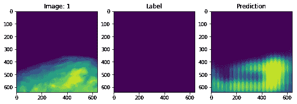

Figure 6 — output with transpose convolution as first upsampling layer

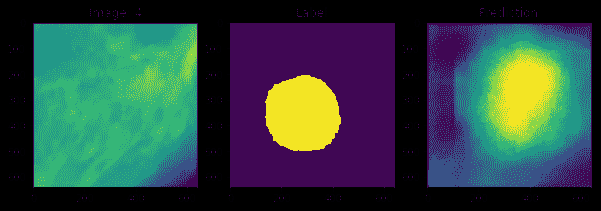

Figure 7 — output with transpose convolution as first upsampling layer

图 8 和图 9 显示了所有上采样都使用 resizes 完成的输出，只有转置卷积作为最后两个预 logit 层。这些图像是在从先前的模型中初始化下采样部分的权重并且仅针对五个时期训练上采样层之后生成的。

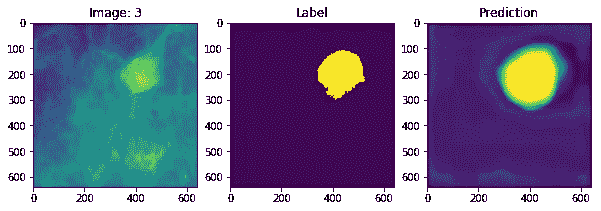

Figure 8 — output with transpose convolutions only as last two layers

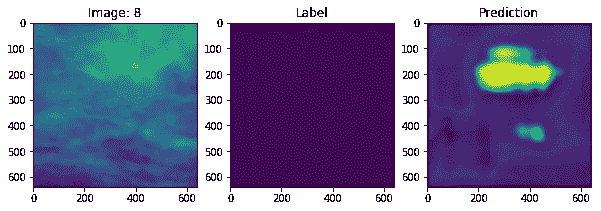

Figure 9 — output with transpose convolutions only as last two layers

尽管训练量非常小，但我们可以看到，正负图像中的噪声量都大大减少了，棋盘格伪影完全消失了，预测也更加接近标签。最重要的是，图 9 中负像的输出突出显示了图像中更可能包含异常的区域，而不是类似于输入图像的模糊版本。

我想重申的是，图 8 和图 9 中的结果是在对网络的上采样部分进行五个时期的训练之后生成的，而之前的图是由经过 20+个时期训练的网络生成的。虽然初步结果非常有希望，但这并不能保证该模型在额外训练后也能表现良好。

# 参考

[1] D. Levy，A. Jain，使用深度卷积神经网络从乳房 x 光片进行乳腺肿块分类，arXiv:1612.00542v1，2016

[2]邓格尔、卡内罗和布拉德利。使用级联深度学习和随机森林的乳房 x 线照片中的自动质量检测。《数字图像计算:技术与应用》, 2015 年国际会议，第 1-8 页。IEEE，2015。

[3] N.Dhungel，G.Carneiro 和 A.P.Bradley .乳房 x 线照片中肿块分割的深度学习和结构化预测。医学图像计算和计算机辅助介入国际会议，605-612 页。斯普林格国际出版公司，2015 年。

[4] J .阿雷巴洛、F.A .冈萨雷斯、R .拉莫斯-波尔兰、J.L .奥利韦拉和 M.A.G .洛佩兹.利用卷积神经网络进行乳房 x 线摄影肿块病变分类的表征学习。生物医学中的计算机方法和程序，127:248–257，2016。

[5]杜瓦和卡拉·塔尼斯基杜(2017 年)。http://archive.ics.uci.edu/ml 的 UCI 机器学习知识库。加州欧文:加州大学信息与计算机科学学院。

[6]用于筛查乳房 x 线照相术的数字数据库，迈克尔·希斯、凯文·鲍耶、丹尼尔·科潘斯、毛利小五郎和 w·菲利普·凯格尔迈耶，《第五届数字乳房 x 线照相术国际研讨会会议录》，M.J .亚菲编辑。，212–218 页，医学物理出版社，2001 年。国际标准书号 1–930524–00–5。

[7]《乳房 x 线摄影筛查数字数据库的现状》,迈克尔·希斯、凯文·鲍耶、丹尼尔·科潘斯、w·菲利普·凯格尔迈耶、毛利小五郎、张京和 s·穆尼什·库马兰，载于《数字乳房 x 线摄影》, 457-460 页，Kluwer 学术出版社，1998 年；第四届数字乳腺摄影国际研讨会会议录。

[8]丽贝卡·索耶·李、弗朗西斯科·吉梅内斯、阿萨夫·胡吉、丹尼尔·鲁宾(2016)。DDSM 乳腺影像子集。癌症影像档案。

[9] Clark K，Vendt B，Smith K，Freymann J，Kirby J，Koppel P，Moore S，Phillips S，Maffitt D，Pringle M，Tarbox L，Prior F .癌症成像档案馆(TCIA):维护和运营公共信息储存库，数字成像杂志，第 26 卷，第 6 期，2013 年 12 月，第 1045-1057 页。

10 o . l . manga sarian 和 W. H. Wolberg:“通过线性规划进行癌症诊断”，《暹罗新闻》，第 23 卷，第 5 期，1990 年 9 月，第 1 和 18 页。

[11] William H. Wolberg 和 O.L. Mangasarian:“应用于乳腺细胞学的医学诊断模式分离的多表面方法”，美国国家科学院学报，第 87 卷，1990 年 12 月，第 9193-9196 页。

[12] O. L. Mangasarian、R. Setiono 和 W.H. Wolberg:“通过线性规划进行模式识别:理论和在医疗诊断中的应用”，载于“大规模数值优化”，Thomas F. Coleman 和李玉英编辑，SIAM Publications，费城，1990 年，第 22-30 页。

[13]k . p . Bennett & o . l . Mangasarian:“两个线性不可分集合的鲁棒线性规划判别”，优化方法与软件 1，1992，23–34(Gordon & Breach Science Publishers)。

[14] K. Simonyan，A. Zisserman，用于大规模图像识别的极深度卷积网络，arXiv:1409.1556，2014

15s . Ioffe 和 C. Szegedy。批量标准化:通过减少内部协变量转移加速深度网络训练。《第 32 届机器学习国际会议论文集》，第 448–456 页，2015 年

[16]塞格迪、刘、贾、塞尔马内、里德、安盖洛夫、埃汉、万霍克和拉宾诺维奇。用回旋越走越深。IEEE 计算机视觉和模式识别会议论文集，第 1–9 页，2015。

[17]塞格迪、万霍克、约菲、施伦斯和沃伊纳。重新思考计算机视觉的初始架构。arXiv 预印本 arXiv:1512.00567，2015。

[18] C. Szegedy，S. Ioffe，V. Vanhoucke，Inception-v4，Inception-ResNet 和剩余连接对学习的影响，arXiv:1602.07261v2，2016

[19]何国光，张，任，孙，深度残差学习在图像识别中的应用，arXiv:1512.03385，2015

[20] J. Redmon，S. Divvala，R. Girshick，a .法尔哈迪，你只看一个:统一的实时对象检测，arXiv:1506.02640，2015

[21] R. Girshick，J. Donahue，T. Darrell，J. Malik，用于精确对象检测和语义分割的丰富特征层次，arXiv:1311.2524，2013

[22] Odena 等人，“反卷积和棋盘伪影”，Distill，2016。[http://doi.org/10.23915/distill.00003](http://doi.org/10.23915/distill.00003)

[23] J. Long，E. Shelhammer，T. Darrell，“面向语义切分的全卷积网络”，2014，【www.arxiv.org/abs/1411.4038】T2

[24] F. Yu，V. Koltun，“基于扩张卷积的多尺度上下文聚合”，2015，