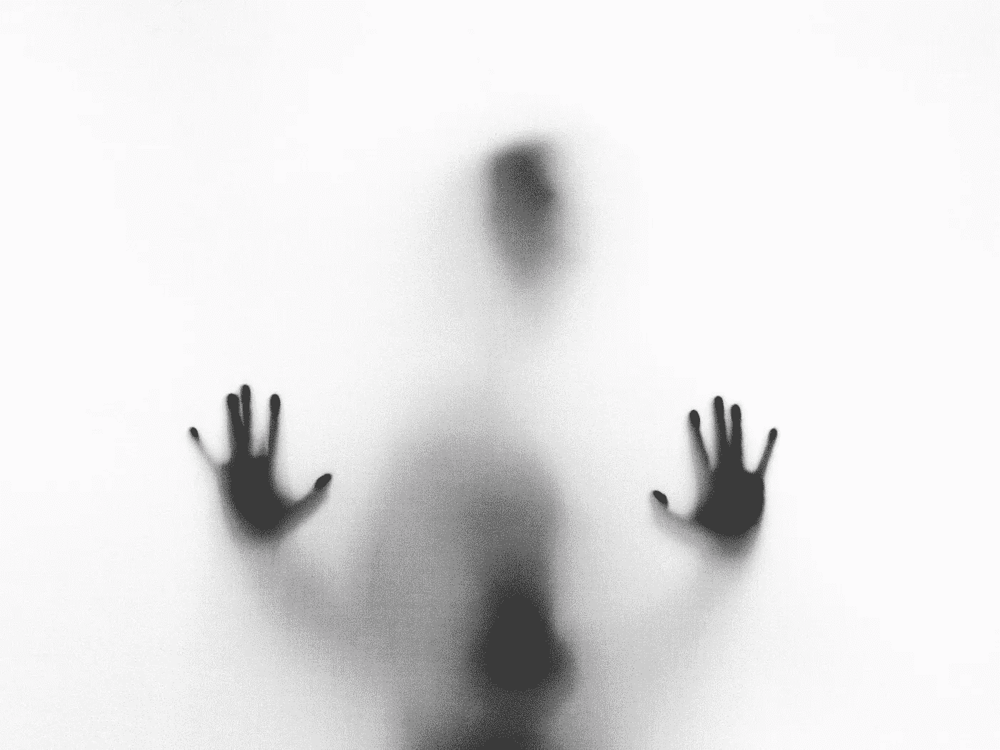

# 陷入债务:当你的过去控制了你的钱包

> 原文：<https://medium.datadriveninvestor.com/trapped-in-debt-when-your-past-controls-your-wallet-a6275615f14d?source=collection_archive---------12----------------------->

# 虐待、宗教和贫穷对你金钱心态的潜意识影响

Photo by [Stefano Pollio](https://unsplash.com/photos/ZC0EbdLC8G0?utm_source=unsplash&utm_medium=referral&utm_content=creditCopyText)

我刚刚读完了《T2》《T3》《T4》《T5》，这是一本普立兹获奖漫画小说，描述了一个家庭在纳粹占领下的波兰的经历。几年后，这个犹太家庭失去了一切，因为德国人接管了他们的家和生意。最终，他们被送往奥斯威辛，大多数家庭成员都死在那里。

撇开个人损失不谈，这些生活事件的财务影响怎么强调都不为过。即使在战争结束几十年后，这个家庭仍然害怕失去一切。特别是父亲——弗拉德克——开始沉迷于存钱。

*Maus by Art Spiegelman*

弗拉德克会一路开车去商店，把他试过但不喜欢的麦片盒子退回去——盖子用胶带封好。然后他会和经理争论，直到他们让步并退还他几美元。

为了节省火柴，他甚至让煤气炉整天开着。

Maus 提醒我们，我们处理财务的方式并不局限于我们自己的创伤——它来自于过去的几代人。

> [DDI 编辑推荐——青少年杂色傻瓜投资指南:8 个步骤让你拥有比你父母梦想的还要多的钱，作者大卫·加德纳](http://go.datadriveninvestor.com/invest1/matf)

我已经写了一些关于我祖父母的大萧条经历如何导致类似的行为——如果不那么激烈的话。例如，我妈妈的父母曾经为他们女儿的房间买了可怕的橙色墙漆，因为它正在打折。最有可能的是，其他一些顾客不喜欢它，并退回了它。😬

全文请点击此处:

 [## 稀释汤:大萧条如何塑造我

### 以富足的心态节俭

medium.com](https://medium.com/makingofamillionaire/frugal-abundance-how-my-great-depression-heritage-shaped-me-c1c104779042) 

我的家庭继续经历这种结果。我妈妈的大多数兄弟姐妹都非常节俭和恐惧，有着世界末日式的心态，对食物和毒素非常焦虑。

博客上最近一篇关于“是时候财务独立了”的报道说明了童年受虐的经济后果。《虐待父母的长期财务影响》详细描述了作者童年的虐待经历，包括因涉嫌用继父的钱买糖果棒而被殴打。15 岁时，他被迫开始全职工作。

在遭受了一生的虐待后，这位作家对金钱有如此多的痛苦，以至于他试图不去想它。结果他花起钱来好像无所谓一样。他也没有自学理财知识(原因显而易见)。这使他负债累累。

不是每个人都经历过这种程度的虐待，但我们很多人都有艰难的过去，这比我们愿意相信的更影响我们的金钱选择。

许多人在成年后经历过伴侣的经济虐待。根据 2016 年澳大利亚统计局[个人安全调查](http://www.abs.gov.au/ausstats/abs@.nsf/Lookup/4906.0.55.003main+features242016)，38%的女性和 22%的男性都有过试图向他们隐瞒家庭财务信息或剥夺他们决策权的伴侣。

在我的案例中，宗教在我糟糕的理财决策中扮演了重要角色。一些教会在财务上虐待成员，鼓励他们捐出收入的 10%,即使他们的成员负债累累。与此同时，这些教会除了“给我们 10%，因为上帝!”之外，不为他们的成员提供理财教育。!"

(让我们不要忘记我们中那些花费数万美元进行治疗以克服我们滥用信仰背景的人。)

然而，我的错误决定却是另一种味道。我在一个以信仰为基础的家庭中长大，相信金钱是肮脏的，想到它就是贪婪的。我也相信上帝会提供一个基督徒丈夫来供养我。快进到 22 岁，我毕业时学的是无用的文科专业，也没有虔诚的丈夫。我不知道下一步该做什么。

第二年，大萧条来袭。随之而来的是一年的失业。23 岁就失业，甚至无法在巴诺书店找到工作，这是一种耻辱。当我的朋友们工作和读研时，我穿着运动裤坐在家里，绝望地申请另一份零售工作，做另一份保姆工作。

这种地狱般的经历动摇了我财务思维的每一部分。我不想在没有多重安全网的情况下再次失业。这也是我从传统的朝九晚五的工作场所中寻求财务独立的部分原因。

在这里阅读更多关于我的经历:

 [## 有毒货币谬论:“上帝会提供”

### 当依赖上帝只是懒惰的借口时

medium.com](https://medium.com/swlh/harmful-life-fallacies-god-will-provide-5971cfec0279) 

事情也可以向相反的方向发展。有些人在如此优越的环境中长大，以至于他们不知道如何削减开支来拯救自己的生命。

这些享有特权的人以匮乏的心态体验生活。他们认为自己是受害者，只是想赚足够的钱“维持生活”——所谓“维持生活”，他们的意思是继续他们难以置信的奢侈生活。他们第一次不得不对度假说“不”，他们开始生闷气，抱怨生活有多艰难，他们做出了多少牺牲。

(有一次，我的表弟抱怨说，为了维持 6 个孩子的生活，他们可能不得不卖掉第二套房子。🙄)

你的过去对你的财务有什么影响？请在评论中告诉我。

我是吉纳。我在我的博客 [*【节俭的风筝】*](http://www.frugalkite.com) *中写道在生活中寻找更多——少花钱多生活。在 frugalkite@gmail.com 联系我。*