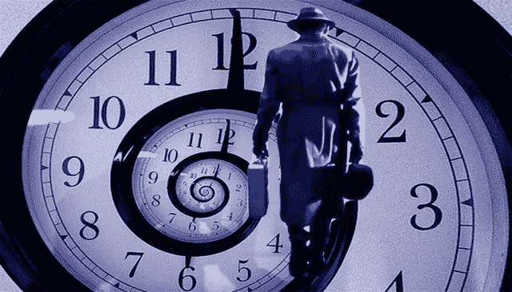

# 穿越时间，让它变得更好

> 原文：<https://medium.datadriveninvestor.com/travel-through-time-make-it-better-23c8259948dd?source=collection_archive---------7----------------------->

**文章概述**

《旅行者》是一部由“showcase”制作的电视连续剧，在“网飞”频道播出。它是关于来自未来的“时间旅行者”，回到地球上的当前时间。

这些“旅行者”不时回来“撤销”或“改变”一些事件或事故，这些事件或事故共同导致地球受到大规模破坏性社会灾难的影响。

通过改变这些事件，“旅行者”拯救了地球。导致大规模破坏和杀戮的一连串事件被打破，因此，历史上的一些灾难被“取消”。

眼睁睁看着一个 ICO 在失去投资机会后获得成功，众筹结束，这种灾难必须由 ICOPremier 来消除。

“初始投资者团队”购买了大部分股票，在获得成功后，他们清算股票，为他们放弃的所有股票赚取“边际利润”。从经济上来说，这是一场“稳赚不赔”的游戏。

几天前，我在找一些“科幻”视频，突然发现了一个名字，“旅行者”。这是一部‘科幻’电视剧，已经在‘网飞’上播出。这是一部《橱窗》的作品。看起来，这是一部合拍作品。

这部电视剧是关于未来人类社会的，将未来“专家”的意识发送到当前的 2018 年。他们称这个世纪为“二十一世纪”。这些专家被训练来执行不同的任务，因此有不同的专业。一个人可以记住一切，另一个是机械宝石，一个是医生兼生物学家，一个是战略家，然后是战士和许多其他人。这些专家被赋予了不同的任务，当他们穿越时间回到今天的时代，重写地球上发生的事情，以确保开始并最终改变事件进程的一连串事件不会以过去的方式发生。

所有这些努力都是为了防止这个星球出现“后启示录”的未来，那些“旅行者”从那时回来。当时的居民不希望地球那么‘浪费’。他们想要改变过去，改变那个时代的“现在”。在国际范围内，不同项目的变化将由这些“专业”旅行者来完成。

从一开始，这些“旅行者”就被描绘成“英雄”。他们都有不同的“技能集”，以完成他们的指定目标，他们使用“改变”的“微妙”事件，最终在更大的画面上创造了非常多样化的效果。这些“旅行者”一直在拯救“世界”免于“毁灭”。

ICOPremier 有一个类似的“回到过去”的概念，投资于“已经成功的”ico。小组中 ico 的“初始投资者”在众包销售中表现成功后，会再次出售大量购买的代币。他们还没有上市，一旦上市，他们将会给投资带来指数级的增长。“旅行者”在这里“经济地”拯救世界。成功率已经是 100%了，除了坐在躺椅上，只是盯着，等待时机卖出去，或者长期持有。