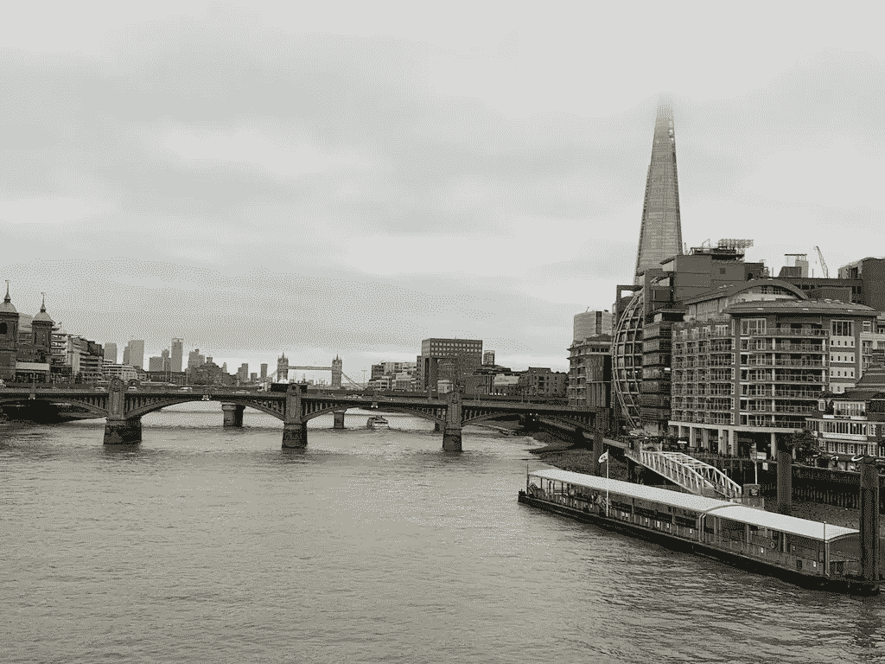
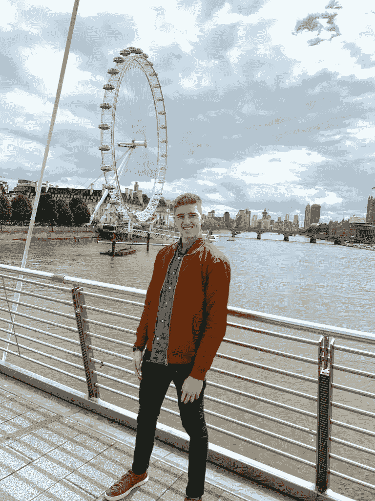
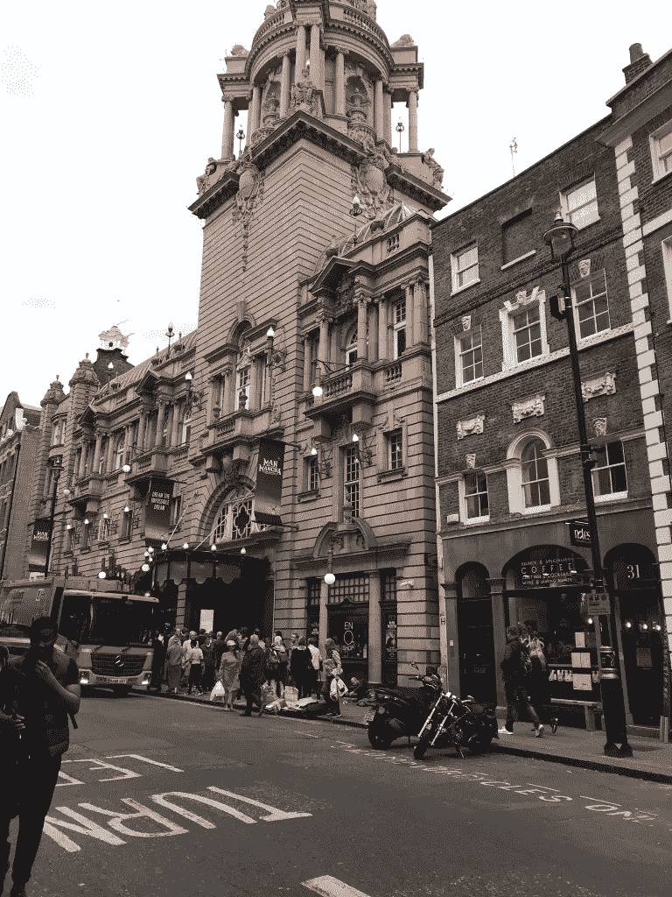

# 旅游角。1、国际上

> 原文：<https://medium.datadriveninvestor.com/travelingpt1-internationally-baa05209a704?source=collection_archive---------16----------------------->

The things that happen, happen.

希望你不会迷路。

希望你不会上错车。

希望你不会被骗。

希望你会说母语。

希望你知道你住在哪里。

希望你在这个地区至少有联系。

在我最近一次去英国伦敦的旅行中，我做了所有的 6 件事。

当我旅行时，尤其是国际旅行时，我喜欢故意迷路。我想有当地人的感觉。如果我在国外旅行，我的目标是尽可能体验当地文化。我相信，至少对我来说，最好的方法是去地图上的一个地方，然后随便逛逛。

 [## 摔倒不是失败。-数据驱动型投资者

### 你只有在放弃的时候才会失败。每个英雄都会倒下，我们活着就是为了失败者出现的时刻；上升到…

www.datadriveninvestor.com](https://www.datadriveninvestor.com/2019/01/17/falling-isnt-failing/) 

我在伦敦的时候没怎么做过。但是，我确实上错了火车，然后它就发生了…

我在去伦敦竞技场的路上。因为他们有拉曼查人的音乐表演，我想我会参加。

London is always quite the city

如果你熟悉伦敦，竞技场在莱斯特广场的西南端，我住在城镇北端的肯特镇。

为了到达那里，我打算乘地铁，因为我在整个逗留期间都是乘地铁出行的。

对我来说不幸的是，我上了一辆向南行驶的火车，即北线，但后来犯了一个错误，没有正确检查终点路线，结果到了城镇的东边。

此时大约是 7:05，下一班火车还有 8 分钟才到。表演 7:30 开始，我想去那里。

所以我走出了车站。我迷路了。

在英国旅行对我来说很有趣。我做了几件事。第一天，我在卡姆登镇闲逛，感受当地的一些规范，因为我的红眼航班在早上 6:30 到达希思罗机场。

在最初离开西棕榈滩(West Palm Beach)后，我在下午 1 点到达了机场。然后我飞到 JFK，下午 6:00 从那里出发，随着时间的变化，第二天早上 6:30 着陆，5 月 27 日，星期一。我乘公共汽车进城。

但是，我到了那里。第一个晚上我有点低调。我放下了一件行李(一个耐克行李袋)。顺便说一句，这是我参加过的最轻的国际旅行，更不用说是我回到美国后额外增加的三个晚上。

之后，我去了伦敦眼，作为一名真正的游客，在大本钟旁呆了一段时间。

Time to be a tourist.

我可能拍了一个人和两对夫妇的照片，也可能拍了一家人的照片。我想就是这样。我的想法是，我只是四处走走，他们在拍照，也许我可以帮忙。

这对我来说也很好，因为我得到了一张由巴西摄影师拍摄的照片，我遇到了一对来自亚特兰大的夫妇，他们能够支付现金购买我在桥上想要的一件艺术品，我通过 CashApp 给他们汇款，我得到了一些巨大的感谢。这是很棒的第一天。

我明白了人们在心理上被驱使去帮助别人。通过请人给我拍照，我给了别人一个给予的机会。当我给别人拍照时，我给了他们一个表达感激的机会。

接下来，我度过了一个轻松的早晨，第二天晚上在鲍勃·鲍勃·理查德餐厅享用了一顿浪漫的晚餐。那真是太棒了，我很高兴那晚还是那样。不过，我有点晚了，所以我点了一杯优步，而不是坐火车。但是，奢华的经历是值得的。

星期三，我起得很早。吃了点早餐，早上稍微放松了一下。在那之后，我决定去哈罗德百货公司。在去的路上，我看到了像保时捷设计、泰德·贝克·伦敦和宾利这样的商店。我想起了我的风格是如何受到欧洲的启发。然后我去了哈罗德百货公司，然后去了博罗市场。那是一段美好的时光，我喜欢看他们在商店里展示的各种品牌。虽然市场很凉爽，是吃东西的好时候，但那时，我回到哈罗德百货公司喝点茶。和爱人的“下午茶时间”一结束，我们就离开了。之后我回家，然后回到国王十字车站，然后回到我的 Airbnb。

周四是我在这个城市的最后一整天。睡了一会儿，去了一家意大利餐馆，然后去了白金汉宫。我在意大利餐馆的食物是美味的，但是我不喜欢它。我很高兴我去了皇宫，有这么棒的摄影师。我总是喜欢以那种方式欣赏建筑和优雅。跟着宫殿，我决定我应该去看看拉曼查的人。那是一次不寻常的经历。正如一位剧院经理所说，在经历了整个“可怕的经历”之后，我能够免费得到一个私人包厢。太棒了。我爱它，每时每刻。在早先的西班牙语课上学习了《堂吉诃德》之后，我很喜欢看这部音乐剧。

我的最后一天，或者说。八点起床后，我收拾好东西就出门了。到达国王十字车站后跳上火车，然后在去希思罗机场的中途意识到我的航班是从伦敦盖特威克机场起飞的……哎呀。我提前几个小时赶到了那里，为我的航班做好了准备。自我提醒…不要乘坐挪威航空公司的飞机。在被收取了 101 美元的“超重”行李费，在没有无线网络和食物的情况下飞行了 7 个小时后，我终于回到了美国。再见伦敦。

不过，我会完成这个的…

所以我迷路了，对吗？我走出火车站，维多利亚，我想是的，不，那不对…我把它从记忆中抹去了。不管是哪个站，我都找不到哪条路是向西的，我走错了 2 分钟。现在是 7 点 12 分。哇哦。哎呀。方向说是 1.8 英里。好吧，如果我运行它呢？

让我们开始吧。

于是，我开始跑。我大概跑了半英里，然后意识到等等…我已经有一段时间没锻炼了，我累了。也许，我可以租一辆自行车，我想。

结果，我租不到自行车。但是，在穿过隧道的中途，我看到了一个载人的摩托车手，一辆摩托车，或者人力车，或者随便你怎么称呼它。

我以为那能让我及时赶上 7:30 的演出。但是…我 7:35 就到了。还有……我的司机(骑车人)要求用英镑支付。我没有现金。

在告诉他我需要去剧院取钱后，他在外面等着。良好的..他们不能为我做，我需要支付他 60 英镑…10 分钟的车程？？？我们走到街尾的酒吧，他们又一次说我不能取现。然后他说我们去乐购吧，我可以给他买些香烟和可乐。

我们出发了。我开始给他录像，因为他说只要 40 英镑就够了。然后，我走得太慢了，他说他会骑自行车送我过去。我设法让他把金额降到只有 20 英镑。到达乐购后，他发现了两包香烟，当我继续记录时，他最终接受了 10 分钟车程的付款。

我和保安一起呆在商店的尽头，以确保一切都安排好了。当我离开乐购时，有人也检查了我，他说这种互动看起来很奇怪，这是故意的。我很不舒服，知道我不可能付给那个人那么多钱。

Man of La Mancha.

在他离开并骑车离开后，我回到了剧院，并得以买到一个较低的座位，他们说我可以在幕间休息时付钱。中场休息时，女经理说我真的很好，不需要支付任何费用，“你已经在这里了，你还不如就呆在这里。”

因此，尽管我有相当的经验，错过了第一两个场景，我只花了 22 英镑看了一场至少要花 35 英镑的演出。

整个旅行都是一次难忘的经历。这使得 4 年内有 4 个国家，但现在是时候增加一点，在 1 年内有 4 个国家。接下来去哪里？