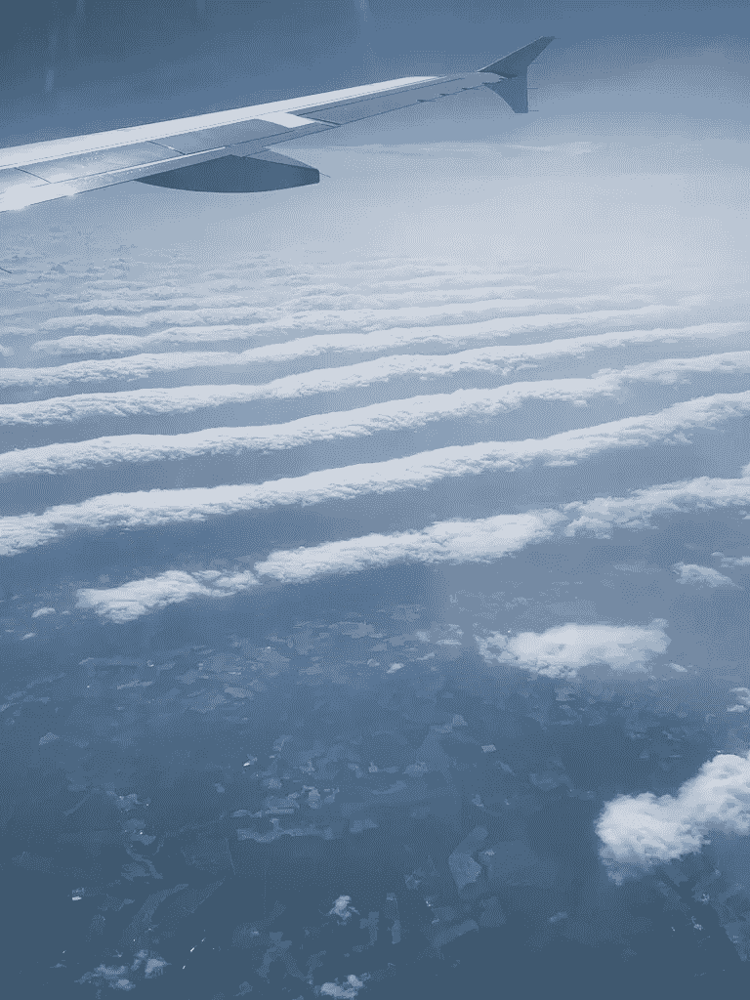
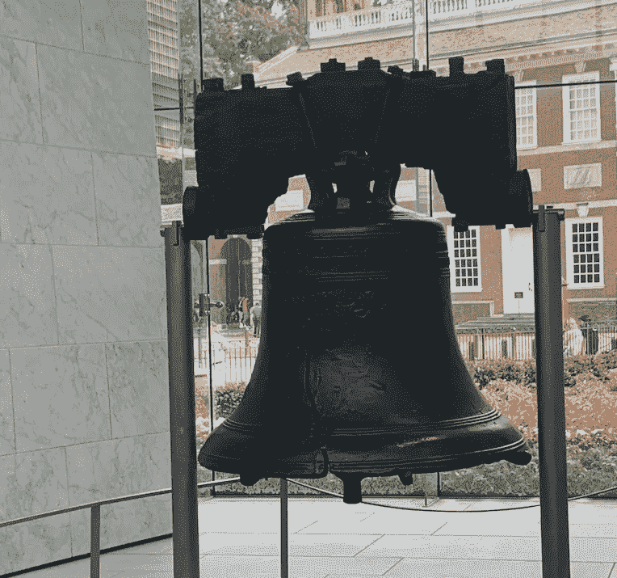
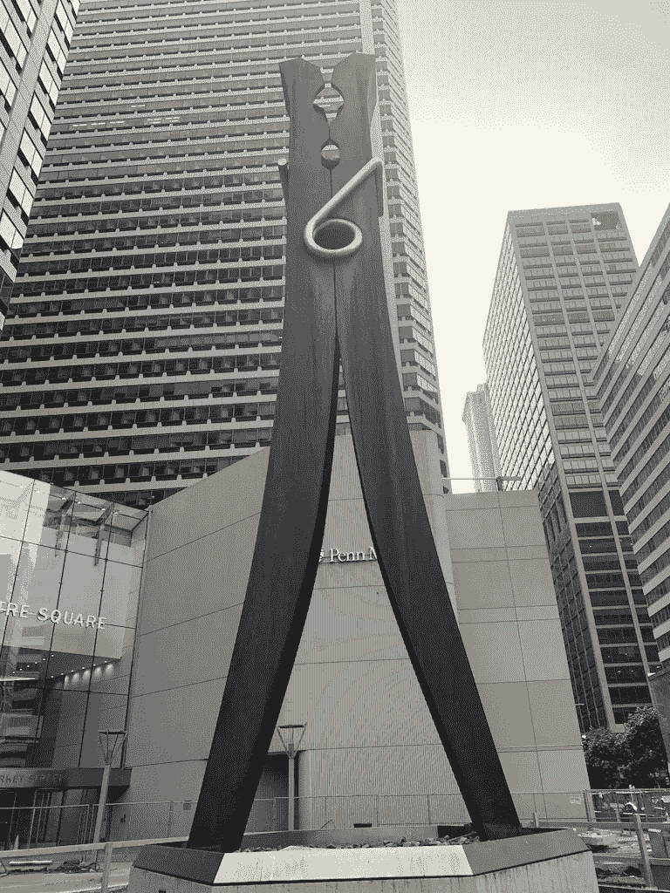

# 旅游角。2、国内

> 原文：<https://medium.datadriveninvestor.com/travelingpt2-domestically-83d1137ae434?source=collection_archive---------23----------------------->

我不是那种早早去机场的人。

通常，我会在飞机起飞前 50-60 分钟到达机场，刚好来得及在前台托运行李。

我的目标是把所有东西都装进一个行李袋和一个背包里，但这仍然是一个难题。当我把几双鞋放进我的(大)耐克行李袋时，它已经快满了。

最近大部分时间我都在中西部或东北部旅行。飞离棕榈滩国际机场真是轻而易举。我通常走得比较近，如果我没有行李要托运，我会在起飞前 40-45 分钟到达那里。

我从来没有错过航班，甚至从来没有跑着去赶飞机。

 [## 修复摄影-数据驱动的投资者

### 汤姆·津伯洛夫在转向摄影之前曾在南加州大学学习音乐。作为一个…

www.datadriveninvestor.com](https://www.datadriveninvestor.com/2019/03/22/fixing-photography/) 

与国际航班相比，国内航班对我来说是不同的。与我在欧洲旅行过的地方相比，这里的安全是如此不同。一切都显得更加低效和困难。

我带的东西通常都差不多。我在背包里塞满了很多东西。

我总是从我的笔记本电脑、纸巾、薄荷糖和 iPhone 充电盒开始。

接下来是我正在读的书，接下来的一两本，还有我的日记。

我的背包里总是放着钢笔和荧光笔，还有指甲钳、iPhone 充电器和水瓶(尽管我在过安检前会把它们清空)。

在我随身携带的另一个或几个包里，我想把所有东西都塞进去。随身携带的包对我来说很好，我可以把所有超重的东西，如书籍或电子产品，放在那里，其余的放在我的托运包里，如果我有一个的话。

我吃了苦头才知道，挪威航空公司甚至对随身行李都有重量限制，我的行李袋和背包被罚了 101 美元。我很高兴美国航空、联合航空、捷蓝航空和达美航空不这么做。虽然…有些机票对随身行李有限制…

为了避免这整个难题，我只是在一个更早的团体或区域中登机。如果我是第 9 组，我就上第 4、5 或 6 组。那样的话，我就能确定我能把我的随身行李带上飞机。

我还总是下载航空公司的手机应用程序，这样只有我一个人能看到我的机票。

一上飞机，我就带着刚刚重新装满水的水瓶和一些零食。

From my most recent trip to Philadelphia

起飞后，我总是要求空乘人员将我的整个水瓶装满，通常，他们会同意并允许我这样做。

如果你对迈克尔·布鲁斯的书《时间的力量》和《睡眠时间类型》很熟悉的话，我是狮子。因此，我非常注重效率，在飞机上很难入睡。

当我在整个机场听音乐时，我的飞机旅行通常包括阅读、写作、有声读物(同时玩大富翁、象棋或数独)和吃饭。

我在国内旅行的“正常”一天与我去另一个国家旅行时完全不同。白昼时间变化很大。在英国，白天很长。看起来比佛罗里达阳光充足的 12 个小时要长得多(虽然我知道在阿拉斯加这样的地方，有时一天有 20 个小时都是阳光充足的)。

我遇到的人都不一样。我经常遇到国外的人，最近在费城，我和一对奥地利夫妇聊了聊。

和我在一起的人和我在国外的时候不一样了。过去我去过的几个国家，我都是和我的大学在一起或者一个人。

但是，当我在美国旅行时，我会去看我的家人，我的另一半，或者和他们一起旅行。

我的日子看起来很不一样，我不会到处闲逛，也不会去任何我想去的地方。通常，我会计划一些我想做的事情，让我交往的人来计划其余的事情。

由于我已经离开大部分家人好几年了，所以旅行往往围绕着他们花时间和我在一起，做他们想给我看的或者想让我和他们一起参加的事情。

在这些旅行中，我通常感到没有收获。我在我爱的人身边，所以我想给他们 100%的爱。同时，我试图每周写 3 篇文章，并做一些其他的事情。

我仍然在努力保持平衡，尽管我确信随着我的不断成熟和成长，一种舒适的平衡会对我来说更加明显。

我喜欢和我爱的人在一起，我喜欢能够去他们那里旅行，通常是坐飞机。我很幸运，不仅有能力坐飞机，而且有经济能力购买机票。随着年龄的增长和收入的增加，我努力增加国内旅行的频率，因此也增加了探亲的次数。

虽然我确实喜欢旅行，但有时通过机场会很麻烦。我不是特别喜欢拖着所有的东西穿过机场，排队过安检。

私人飞机似乎很酷。绝对是旅行的好方法。我知道像杰西·伊茨勒这样的人一直在使用它们。

我知道像格兰特·卡尔多内这样的人也有自己的。

也许那是未来值得获得的东西？也许吧。我们走着瞧。

如果我买了一架喷气式飞机，你会和我一起旅行吗？我们要去哪里？