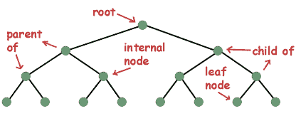
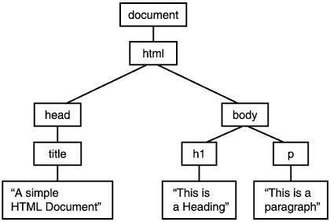
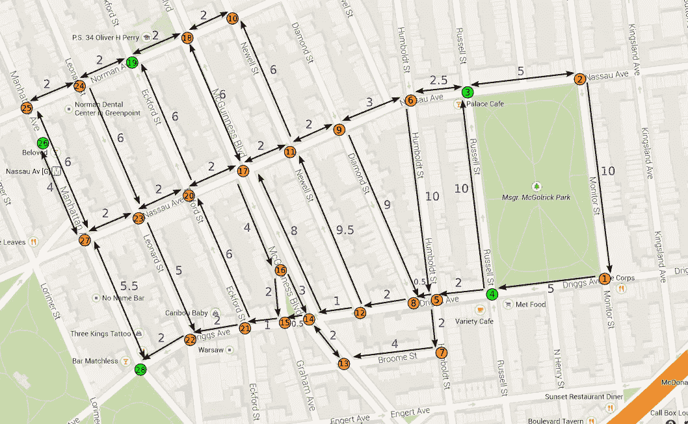

# 树和图形

> 原文：<https://medium.datadriveninvestor.com/trees-graphs-b282135e61a6?source=collection_archive---------19----------------------->

如果你正在学习数据结构，你可能听说过树和图的概念。

Tree Structure

树是非线性的或分层的数据结构，链接列表和数组。那些是线性数据结构。你可以在上面的树形结构图中看到一个例子。树实际上是一种特殊类型的图，从 A 点到 b 点只有一条路。

它们是通过边连接的节点的连接。每个节点都包含一个值，此外，它们可能有也可能没有子节点。

树数据结构的一个真实例子是 HTML 文档对象模型(DOM)结构。

DOM Tree Structure

# 树术语:

*   **根**是`tree`的最顶层`node`
*   **边**是两个`nodes`之间的链接
*   **子**是一个拥有`parent node`的`node`
*   **父**是一个`node`，它有一个`edge`到一个`child node`
*   **叶子**是一个`node`，它在`tree`中没有`child node`
*   **高度**是到 a `leaf`的最长路径的长度
*   **深度**是路径到其`root`的长度

**信用树术语** [TK](https://medium.com/u/9729fe8eb452?source=post_page-----b282135e61a6--------------------------------)

Graph Structure

图是通过边连接节点的非线性数据结构。上图说明了一个图形结构。

如果你曾经使用过谷歌地图或者像脸书这样的社交媒体网站，你就和图形结构有过互动。最终，您将了解 Dijktra 算法或用于图形的最短路径算法。尤其是在现实世界的应用中，比如谷歌地图。

Dijktra’s Algorithm in Google Maps: Graph Structure

# 结构之间的差异

## 图表:

*   网络模型
*   搜索节点
*   更高的复杂性
*   可能未连接
*   可能包含循环
*   区别在于有向或无向
*   边的数量不取决于顶点的数量

## 树木:

*   层次模型
*   降低复杂性
*   不包含循环
*   所有的树都是图
*   节点的横向
*   “N”个顶点意味着“N-1”条边
*   有向无环图

我希望这个简短的概述是有用的。