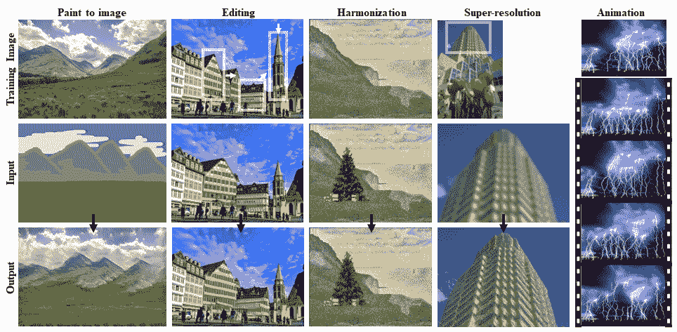
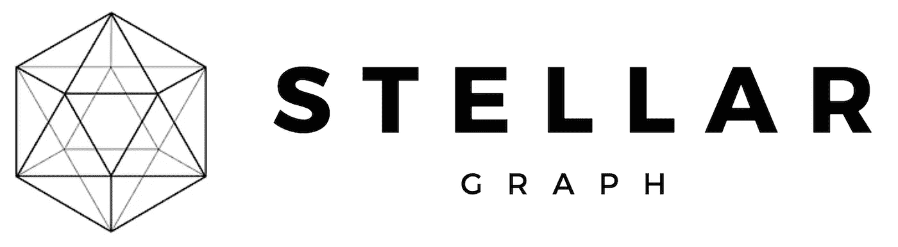
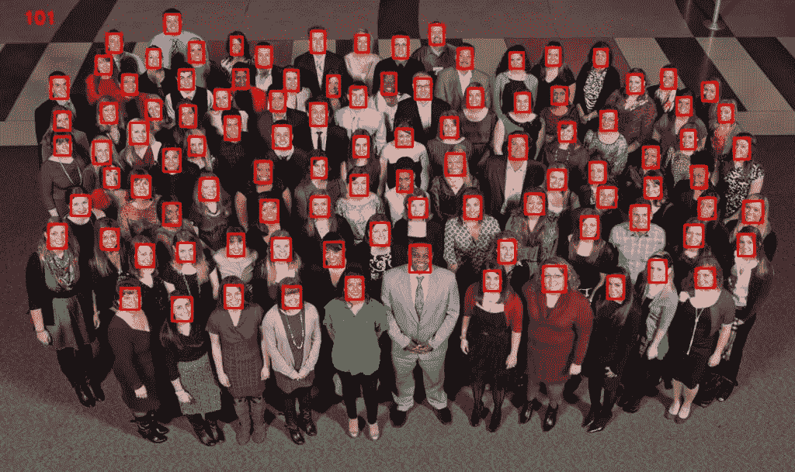
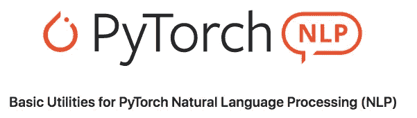

# 本周热门人工智能项目— 1420

> 原文：<https://medium.datadriveninvestor.com/trending-ai-projects-of-the-week-4519-a0999fa7897a?source=collection_archive---------1----------------------->

在这份每周时事通讯中，我展示了本周获得关注的 5 个有新闻价值的人工智能项目。万一你错过了前一周: [*前一周趋势 AI 项目*](https://towardsdatascience.com/trending-ai-projects-of-the-week-44-19-1fb4085edf59) *。*

**这里有几个你可能会感兴趣的链接:**

```
- [Labeling and Data Engineering for Conversational AI and Analytics](https://www.humanfirst.ai/)- [Data Science for Business Leaders](https://imp.i115008.net/c/2402645/880006/11298) [Course]- [Intro to Machine Learning with PyTorch](https://imp.i115008.net/c/2402645/788201/11298) [Course]- [Become a Growth Product Manager](https://imp.i115008.net/c/2402645/803127/11298) [Course]- [Deep Learning (Adaptive Computation and ML series)](https://amzn.to/3ncTG7D) [Ebook]- [Free skill tests for Data Scientists & Machine Learning Engineers](https://aigents.co/skills)
```

*上面的一些链接是附属链接，如果你通过它们购买，我会赚取佣金。请记住，我链接课程是因为它们的质量，而不是因为我从你的购买中获得的佣金。*

# 辛甘



SinGAN can be also used to a line of the image manipulation task

使用 [SinGAN](https://github.com/tamarott/SinGAN) ，您可以从单一自然图像中训练生成模型，然后从给定图像中生成随机样本。论文官方 PyTorch 实现: [SinGAN:从单一自然图像学习生成模型](https://arxiv.org/pdf/1905.01164.pdf)。

# Spleeter


Spleeter 是 Deezer 源分离库，具有用 Python 编写的预训练模型，并使用 Tensorflow。它使得训练源分离模型变得容易(假设你有一个孤立源的数据集)，并且提供了已经训练好的用于执行各种类型的分离的最先进的模型:

*   人声(歌声)/伴奏分离
*   人声/鼓声/低音/其他分离
*   人声/鼓声/贝斯/钢琴/其他分离

基本上，这允许你从一个 mp3 文件中分离出人声、鼓声、低音等等。有了 [Google colab](https://colab.research.google.com/github/deezer/spleeter/blob/master/spleeter.ipynbdafs) 你可以测试他们的工作，而不需要安装任何东西。
有一个用户还为它做了一个免费的 web 应用: [https://melody.ml](https://melody.ml) 。

# StellarGraph 机器学习库



[StellarGraph](https://github.com/stellargraph/stellargraph) 是一个 Python 库，用于对图形结构(或等价地，网络结构)数据进行机器学习。图结构数据将实体(例如，人)表示为节点(或等价地，顶点)，将实体之间的关系(例如，友谊)表示为链接(或等价地，边)。节点和链接可以具有相关联的属性，例如年龄、收入和友谊建立的时间等。

[](https://www.datadriveninvestor.com/2020/02/19/five-data-science-and-machine-learning-trends-that-will-define-job-prospects-in-2020/) [## 将定义 2020 年就业前景的五大数据科学和机器学习趋势|数据驱动…

### 数据科学和 ML 是 2019 年最受关注的趋势之一，毫无疑问，它们将继续发展…

www.datadriveninvestor.com](https://www.datadriveninvestor.com/2020/02/19/five-data-science-and-machine-learning-trends-that-will-define-job-prospects-in-2020/) 

他们展示的一个很棒的[演示](https://github.com/stellargraph/stellargraph/tree/master/demos/)是如何[使用基于随机游走的表示学习方法 Node2Vec 预测论文之间的引用链接/边缘](https://github.com/stellargraph/stellargraph/blob/master/demos/link-prediction/random-walks/cora-lp-demo.ipynb)。

# 超光速通用人脸检测器-1MB



[超轻型快速通用人脸检测器](https://github.com/Linzaer/Ultra-Light-Fast-Generic-Face-Detector-1MB)提供了一种为边缘计算设备设计的轻型通用人脸检测模型。模型大小方面，默认 FP32 精度文件大小为 1.04~1.1MB，推理帧 int8 量化大小约为 300KB。

# PyTorch-NLP



PyTorch-NLP 是一个用 PyTorch 进行自然语言处理的基本工具库。它扩展 PyTorch 为你提供基本的文本
数据处理功能。PyTorch-NLP 提供预训练的单词向量、数据集、迭代器、文本、编码器、神经网络模块和度量。从架构的角度来看，PyTorch-NLP 是低耦合的面向对象的。

想法、建议、反馈？请在下面的评论中告诉我们。

# 在你走之前

在 [Twitter](https://twitter.com/romanorac) 上关注我，在那里我定期[发布关于数据科学和机器学习的](https://twitter.com/romanorac/status/1328952374447267843)消息。

