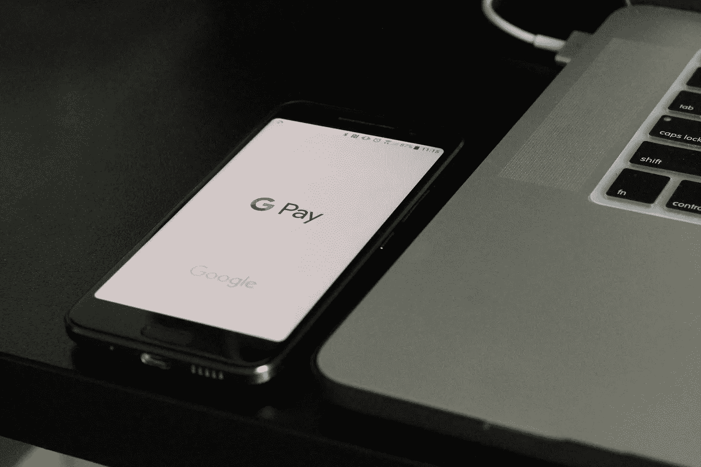

# 2019 年移动应用开发的热点趋势

> 原文：<https://medium.datadriveninvestor.com/trends-in-mobile-app-development-for-2019-d749d9036df9?source=collection_archive---------17----------------------->

Image source: apps101.co

技术总是在不断发展，但自从智能手机出现以来(始于 1994 年首次面向公众推出)，它只见证了增长，智能手机已经成为我们日常生活中不可或缺的一部分。

那么基于去年，我们可以期待在 2019 年看到哪些趋势呢？

## **即时应用**

基本上，[即时应用](https://en.wikipedia.org/wiki/Instant_(app))不需要你下载并安装在手机上。与常规应用相比，它们的尺寸更小，但仍具有网站的基本功能。

考虑到常规应用程序消耗的手机内存量，人们会更倾向于使用即时应用程序，从而为其他事情节省内存空间。

简而言之，它们提供了很好的用户体验，而不会消耗你手机的内存。

## **物联网**

过去几年，物联网仍在快速发展，未来还会有更多发展。全球企业已经开始利用互联设备的力量。最新的发展使我们能够使用智能手机[控制各种设备](https://www.analyticsvidhya.com/blog/2016/08/10-youtube-videos-explaining-the-real-world-applications-of-internet-of-things-iot/)(智能家居、联网汽车跟踪运输中的交付等。)而且这是一种很好的服务于多种用途的方式。

未来几年，移动应用开发中的物联网应用将更具颠覆性，在所有行业中，医疗保健将最有兴趣将物联网应用于移动应用。

## **移动支付**

如今，大多数消费者都通过移动设备(Google Pay、Paytm)购物和支付，而不是像过去那样。据 Businesswire 报道，全球移动钱包市场预计将在 2026 年前以 30%的 CAGR 速度增长。

考虑到移动商务的持续增长和消费者对移动钱包的偏好，人们将越来越多地转向这种支付方式，我们可以预计今年将会看到更多的移动支付应用。

## **可穿戴设备**

据 Statista 称，可穿戴设备的销售收入将从 2018 年的近 340 亿美元飙升至 2022 年令人难以置信的 730 亿美元。

说到医疗保健，随着越来越多的人投资于个人健康管理，可穿戴设备的销量大幅上升。可穿戴设备通过更新重要信息来帮助他们跟踪自己的进展:消耗的卡路里、心率、血压等等。您可以设置水摄入量或睡眠模式信息的提醒，这可以帮助您过上健康的生活。

考虑到这种增长，可穿戴设备将很快成为必备配件，特别是它们变得越来越实惠。

## **AR/VR**

增强和[虚拟现实](https://www.forbes.com/sites/robertadams/2016/10/17/5-ways-virtual-reality-will-change-the-world/#634bf2982b01)是为用户提供更真实体验的技术。在市场营销中，人们使用它来推广他们的品牌和锁定客户，而在游戏行业，这种情况已经很普遍了。

在未来几年，更多的企业将包括 AR/VR 技术，以便更好地与客户互动或促进购买过程；此外，移动应用程序将开发这样的 AR/VR 元素，以使社交媒体活动更具互动性。到目前为止，我们已经看到 Instagram 和 Snapchat 率先在该领域集成了 ar 滤镜。

## **聊天机器人**

这个话题已经被证明是有效的，因为它为用户或客户提供了实时的个性化回答。首先，机器人主要用于脸书、Slack、Skype 等即时通讯应用。但是人工智能领域的发展使得聊天机器人很容易集成到原生移动应用程序中。

它们可以极大地改善移动应用程序的功能——对话式界面增加了用户参与度，推动了应用程序的采用，同时应用程序在提供结果方面变得更加准确。

聊天机器人的例子有很多[(duo lingo，Whole Foods 等。)是或可能是未来的成功。](https://www.impactbnd.com/blog/marketing-chatbot-examples)

## **人工智能(AI)和机器学习(ML)**

人工智能在相当长一段时间内一直是一项主导技术，并将继续如此。好处是巨大的——分析大量的组织数据，并为业务管理提供有价值的见解。

[人工智能和人工智能可以帮助构建更智能的移动应用](https://medium.com/datadriveninvestor/ai-and-the-powerful-impact-on-mobile-technology-9bbc8909776)，为用户提供更加个性化的体验，从而提高用户的采用率和保留率。

我们将见证人工智能和人工智能在未来几年重新定义移动应用程序开发流程。

## **区块链**

嗯，当想到对移动应用程序开发的影响时，这是主要的技术中断之一——它将所有类型的数字交易的安全性和透明度带到了另一个水平。

区块链很快在金融服务和供应链应用中得到采用。零售、金融服务和医疗保健等企业是首批利用区块链优势构建移动应用的企业之一。

因此，让我们关注今年的趋势，看看它们将如何在 2019 年继续在移动应用开发中发挥作用。