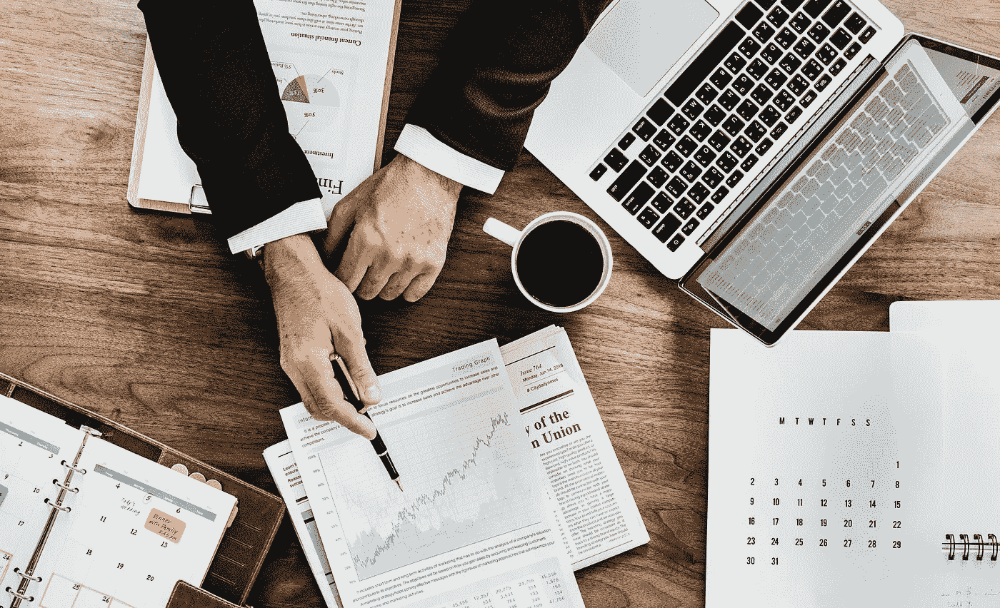

# 2019 年值得关注的趋势

> 原文：<https://medium.datadriveninvestor.com/trends-to-watch-out-for-in-2019-f7a3f63453e1?source=collection_archive---------24----------------------->

2017 年，我和很多善良有趣的人在一个美好的晚宴上。我告诉他们，2018 年将是人工智能最终接管营销的一年，我预测我们会看到许多团队因此改变他们的工作方式。人们非常怀疑。一些广告公司的销售人员甚至告诉我他们有解决方案，我坚持认为解决方案不是广告公司。更多的是朝着拥有你的数据的方向。

那周晚些时候，我指出营销自动化正在成为现实。我指出，当我们是最了解目标客户的人时，我们怎么能信任外部公司来经营我们的广告。自 2017 年以来，很多事情都发生了变化，展望 2019 年，我将其中一些趋势视为行业游戏规则的改变者。一定要遵守。

Photo by [rawpixel.com](https://www.pexels.com/@rawpixel?utm_content=attributionCopyText&utm_medium=referral&utm_source=pexels) from [Pexels](https://www.pexels.com/photo/photo-of-person-holding-black-pen-990818/?utm_content=attributionCopyText&utm_medium=referral&utm_source=pexels)

**亚马逊与谷歌在你的钱包上**

亚马逊不断从谷歌的产品搜索中获取越来越大的份额，但谷歌不会置身事外。2019 年，谷歌将推出其谷歌钱包和购物体验，使从一个地方购物成为可能，而无需注册多个网站。这将采用亚马逊已经采用的模式，使经销商能够使用亚马逊的流量来销售他们的产品，而无需维护网站或购买流量。

最有可能的是，脸书也不会落后，他们会试图反击亚马逊和谷歌。在接下来的几个月里，我们肯定会看到一些有趣的团队成立。

*在电子商务中，你应该注意什么？*光有广告预算可能还不够。很快，许多接触范围有限的小企业将经历流量的大幅下降，并将需要在三大流量创造者之一出售他们的项目。客户将有足够的选择，卖家将通过降低价格、运输成本和运输时间来争夺客户的钱包。这很可能会给许多小企业造成巨大的收入损失。

**人工智能将改变我们的工作**

第一轮被引入许多组织的人工智能。现在，在 2019 年的第二轮比赛中，团队将分为控制组(开发人员、产品经理)和挑战者(平面设计师、活动经理、会计)。为什么我们会有两个功能？控制器将根据一路上学到的知识创建机器的基础。

挑战者然后会告诉机器，“你什么都不知道，我会证明给你看。”挑战者将证明这台机器可以做得更好。

近年来，我们在机器学习方面经历了很多起伏，这来自于人们最初并不了解这些机器。他们的理解相当于一个 3 岁的孩子可以重复他看到的行为，但不能真正控制自己的想法。

*需要注意什么？如果你是一名控制者或挑战者，或者希望成为挑战者，现在就开始准备如何挑战机器。*

**交通和消费**

每个人都喜欢谈论欺诈和糟糕的流量。没关系。我们知道这成为一个问题，但这只是因为我们仍然错误地使用流量，并允许糟糕的流量继续存在。改变我们的收购模式将在很多方面改变市场。别告诉我它会一直在那里。愿意为高质量流量支付更多费用的目标导向营销将杜绝流量欺诈。我们应该停止询问成本，而是只关注它创造的价值。我们应该关注与我们的有机用户相比，会话的质量是否更高。

需要注意什么？如何评价好的流量？CPA 不够，ROI 也不再足够。好的流量应该受到我们的顶级客户的挑战，他们创造了我们最好的流量，并以此为基准。

我认为这三个领域将是 2019 年有趣的发展。你认为 2019 年的游戏改变者会是什么？明年你会有什么不同？