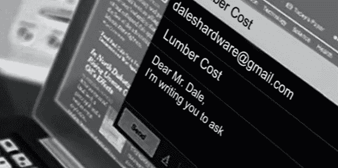

# 特立尼达和多巴哥小企业主和他们的商业电子邮件

> 原文：<https://medium.datadriveninvestor.com/trinidad-and-tobago-small-business-owners-and-their-business-emails-c43ba3305a46?source=collection_archive---------10----------------------->

“Thank you for understanding”

通过我创建的网站，我发现了当地企业主对商务电子邮件需求的潜在感受:你想知道为什么“不必要”的费用，因为你认为免费的电子邮件服务一样好。与此同时，你要给你的“hustle”可信度。

# **电子邮件地址的安全威胁，如*daleshardware@gmail.com***

这不仅仅是一封专业邮件的外观。这是关于在你想要的客户和你提供的合法服务之间创造最佳的信任氛围。当你的电子邮件后缀是 gmail.com*(或任何其他免费电子邮件服务)时，你不仅给了潜在客户形成对你的错误看法的空间，还让电子邮件欺诈变得轻而易举。*

*好的，你已经安排好了所有的事情，但是客户在 your-company@sample.com 联系你，但是一直没有收到。这封邮件在另一个账户里，也在 sample.com，只是用了你公司的名字，几乎不会被客户注意到，或者你的账户被黑了，你本该收到的资金现在在另一个账户里:诈骗者的天堂！*

*就在最近，我读到一对夫妇成为英国电子邮件诈骗的受害者。他们把 12 万英镑转到了错误的银行账户，因为指定接收人的电子邮件被黑客入侵了。有问题的账户是在一个类似的企业名下，有细微的变化，不幸的是在交易时银行工作人员没有发现。有趣的是，指定的接收者(尽管他们不是骗局的一部分)拒绝提供任何关于他们电子邮件系统安全的有用信息，给受害者留下了更多未解的问题。*

*在我看来，预期的接收者可能是他们自己头脑简单的受害者。可能他们没有适当的安全程序，为了防止任何可能的业务损失，拒绝提供任何帮助。我为特立尼达的律师设计了视觉品牌，他们通常使用免费的电子邮件服务。我知道，当你有一百万件事情要做来发送正确的信息时，成本会越来越高，但是这些安全漏洞的可能性非常高，会使企业(如果你愿意合作)背道而驰，因为这不仅不安全，而且会让你看起来好像没有把所有事情都做好。*

# ***不要因小失大***

*当地的小型服务企业主总是在寻找在这些看似“不重要”的事情上削减成本的方法，这可以使他们在未来免受巨大损失。难道您不应该关心您的企业和客户之间交换的数据的安全性吗？如果不是，那就应该是！我相信，当你处理敏感数据时，意识到一些事情是必要的，这只是职业的一部分。除此之外，你可能显得无知和缺乏经验。这些不是你想传达的信息。即使你不是一个技术专家，你需要知道的关于你的商务邮件的安全保证的水平，你将能够归因于你的客户，万一出了差错，你的服务提供商提供的技术支持的种类。*

*我用 G 组曲。这个平台对用户非常友好。技术支持很到位，我可以自动检查所有发出的电子邮件中的敏感信息，并自动采取行动防止数据泄露:要么隔离我的电子邮件进行审查，要么阻止电子邮件发送，这甚至不花费我每月 30 美元 TTD。一天只有一美元，可以给我的客户一些保密的礼遇，还可能让我免于被起诉。*

*所以，下次你想知道为什么有必要在你的新网站上附上一封商务邮件时，考虑一下没有商务邮件的负面影响。*

*我是 [**、品牌桶**](http://bit.ly/TheBrandTUB) 的创始人和视觉品牌策略师*