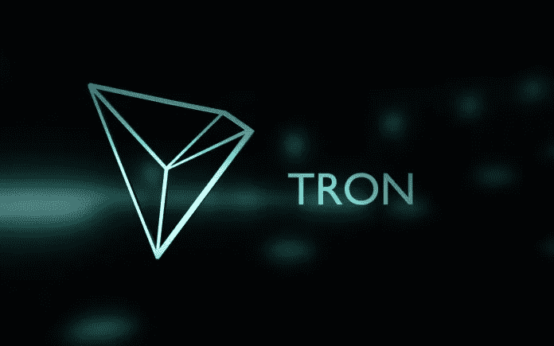

# 创|解释道

> 原文：<https://medium.datadriveninvestor.com/tron-explained-9f19eb8cb316?source=collection_archive---------10----------------------->

# **创概述**

TRON 是世界上最大的区块链开源操作系统之一，它运行 mainnet(它自己的区块链)和加密货币 TRX。TRON 的目标是为去中心化的互联网和去中心化的数字娱乐产业创建基础设施。

***简单来说，TRON 正在用自己的代币 TRX 作为潜在的支付机制，建立一个数字内容分发平台。***

# 创的创始人

TRON Foundation 于 2017 年夏天由曾供职于 Ripple 的 Justin Sun 创建， ***覆盖中国市场*** 。

目前，TRON 的主要办事处位于中国和美国，并与许多项目合作/赞助，尤其是来自中国的项目。Justin 通常在美国和中国市场都非常活跃。他还在学术上参与了盘瓠大学。

# 解决方案

数字娱乐市场估计约为 1 万亿美元(包括游戏、网络游戏、社交网络、互联网节目等。)并有望在未来十年呈指数级增长。TRON 下的协议试图解决可扩展性问题，并为 Dapps 提供一个更经济的平台。

***TRON 的分散协议基于区块链技术，目标是每个用户都可以自由存储和共享信息。***

从历史上看，TRON 的价值观深受万维网(www)创始人、英国工程师和计算机科学家 Timothy Berners-Lee 爵士的原则影响。其中一人认为，互联网应该为人们服务，而不应该主要用于为企业实现利润最大化，因此少数公司的集权违背了主要原则。

有效地分散 it 将为用户创造巨大的利益。

一般来说，TRON 的系统看起来对用户和内容制作者都有利，不需要中间商和广告商。

# 优势

创有很强的想法和大胆的愿景，令人印象深刻的营销和壮观的品牌。甚至创这个名字听起来都很棒。另一个优势来自它的创始人 Justin Sun，他很受尊重和认可。

从技术上来说，TRON 提供了很高的可扩展性，每秒可能处理 2，000 个事务(远高于 BTC 的 6tp 和 ETH 的 25tps 通常为 15tps， ***，但略低于 EOS*** )。

如果我们看一下实际的 [TRON 的区块链探索者](https://tronscan.org/#/)，我们会看到昨天有 65 万笔交易(实际上是 28/10/28 每天)，这非常令人印象深刻。

TRON 的另一个非常大胆和强大的举措是收购 BitTorrent，这可能有助于 TRON 的大规模采用，甚至可能为 Torrent 创建一个令牌。BitTorrent 是一个拥有大量用户的点对点文件共享应用程序，估计至少占互联网全球累计流量的 3%。

另一个优势是 TRON 的成本应该大大低于其竞争对手 EOS(对开发者而言)。从用户的角度来看，主要的好处是不需要为移动操作系统支付昂贵的应用程序。

最后，从硬币持有者的角度来看，强势的一方是强大的开发者团队、远大的抱负和雄厚的融资。

# 不足之处

在我看来，TRON 的主要缺点是有形产出与即时现金流的比率与宣传不符。贾斯汀最近也发表了一些有问题的主张和大口号，但缺乏证据，事实和采纳。

如果你仔细查看 TRON 的白皮书、技术文档(设计书、协议文档等)。)和路线图，您可以看到 6 个发展阶段，时间跨度长达十年以上。

第一阶段:《出埃及记》2017 年 8 月-2018 年 12 月(基本上是前区块链阶段，只是一种文件共享环境)；

**第二阶段:**奥德赛 2019–2018(股权证明等。);

**第三阶段:**大航海 2020–2021(用户运营 ICOs 的机会)；

**第四阶段:**阿波罗 2021–2022(分散平台)；

**第五阶段:**星际迷航 2023–2025；

**第六阶段:**永恒:2025–2027…2037(大胆的说法，但根据我在金融科技中预测和处理数据的经验，通常情况下，预测在时间上越远，就越不准确。这种技术上的长期预测有很大的误差，所以在评估 TRX 时，我不会对第 5 和第 6 阶段有太多的指望。这与传统的金融估值形成对比，在传统的金融估值中，我们总是尽可能地预测和做多，然后预测剩余价值和贴现。

不细说，路线图和想法本身绝对不是缺点，主要的风险是团队是否能够交付。

TRON | TRX

# 筹集的资金

TRON 在 2017 年 9 月 7 日和 8 日的 ICO 期间已经筹集了约***5700 万至 7000 万*** 美元的菲亚特等价物，该项目目前总体上融资状况良好。

最近在 6 月份发生了一次重大的现金外流，当时 TRON 以 1.4 亿美元的现金收购了 BitTorrent。

# **价格影响**

目前(世界协调时 29/10/18 日 11:30)的价格约为 0.02315 美元或 BTC 0.00000364 (=1/275k)，有 53.7 万名买家和投资者。[基于当前流通供应量(TRX65.7 亿)的市值](https://coinmarketcap.com/currencies/tron/)约为 15 亿美元，基于总供应量(TRX99 亿)的市值为[23 亿美元](https://tron.network/index?lng=en)，这足以使 TRON 成为截至目前的第 11 大加密货币。

从根本上来说，如果我们现在淡化预测和炒作，这是一个主要的驱动因素，决定 TRX 价格的实际上是应用程序的数量和使用: ***应用程序在 TRON 区块链上运行的次数越多，*** 就越有价值。这种关系几乎是线性的，潜在的好处就在那里。

# 竞争

TRON 的主要直接竞争对手是 ETH，但是(与 EOS 相比)，TRON 实际上可以与 ETH 愉快地共存。

有趣的是，当我们查看区块链上的活动时，我们可以看到，最近，在 10 月 18 日，当我们[比较来自](https://blocktivity.info/) [tronscan](https://tronscan.org/#/) 和[以太链](https://etherscan.io/)的数据时，TRON 的交易数量已经超过了 ETH。

另一个潜在的(但规模更小、更小众的)竞争对手是 TaTaTu，它打算建立一个公平透明的娱乐平台，其中包括社交媒体等。