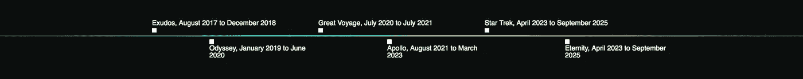

# 创(TRX)过于简化:创初学者指南

> 原文：<https://medium.datadriveninvestor.com/tron-trx-oversimplified-a-beginners-guide-to-tron-bafa4eb580e0?source=collection_archive---------25----------------------->

# **什么是 TRON？**

TRON (TRX)是一个基于区块链的操作系统，带有一个分散应用程序(dapp)平台。该项目团队由新加坡的一个非盈利基金会 Tron Foundation 成立，旨在解决全球娱乐行业的问题，自成立以来，他们已经大大扩展了他们的视野，抢占了整个 dapps 市场。

*根据其最初的白皮书，“TRON 的团队成员是蒂姆·伯纳斯·李爵士的追随者，他们相信协议从发明的那一刻起，就是人类的资产，而不是小团体的盈利工具。”蒂姆·伯纳斯·李是万维网的创始人。*

TRON 的开放、分布式存储技术和去中心化平台使数字内容的创作者能够避开 google play 商店和 Apple Store 等中间商。内容制作者因此能够直接从他们的消费者那里获得资金。

目前，大部分流量和用户数据被脸书、亚马逊和谷歌等少数公司控制。通过将数据的所有权放回创作者手中，创(TRX)试图减轻这种控制。

## **更深入的舞台回顾**

创和他们的团队雄心勃勃。仅仅在 8 到 10 年内，他们试图实现许多区块链技术，这些技术直到今天仍然处于实验阶段，包括类似于整个以太坊平台的东西。

# **创的主要特点**

TRON 旨在通过以下功能“治愈互联网”:

数据解放:自由和不受控制的数据

他们希望建立一个内容生态系统，用户可以从内容传播中获得数字资产

使用个人 ICO 分发数字资产的能力

允许市场预测和分布式数字资产交换(如游戏)的平台。

Tron 的项目是长期的，有几个阶段，从 2017 年的《出埃及记》开始，将在 2023 年走向永恒。

*如果你想了解更多，请访问 BIDITEX 页面并提出你的问题，关注我们的* [*推特*](https://twitter.com/biditex_com) *，* [*脸书*](https://www.facebook.com/biditex/) *，* [*中型*](https://medium.com/@biditex) *，* [*电报*](https://t.me/biditex%20%28edited%29) *，*[*LinkedIn*](https://www.linkedin.com/company/biditex)*。投标变更用* [*投标变更用*](https://medium.com/@biditex/biditex.com) *。*

Exodus:一个免费的点对点分发、内容和存储平台。

**Odyssey** :鼓励授权和内容创作的经济激励。

**大航海**:针对个人 ICO 能力

**Apollo** :内容制作者发布他们自己的个人令牌(TRON 20 令牌)的能力

第五步和第六步的目标是进一步增强游戏行业的去中心化能力。它们将允许开发者自由开发他们的游戏平台，然后在建立所述游戏时实现金钱激励。

***引文:***

*什么是创(TRX)加密货币？去中心化网络指南。(2019 年 1 月 22 日)。https://coincentral.com/trx-beginners-guide/*

*如果你想了解更多，请访问 BIDITEX 页面并提出你的问题，关注我们的* [*推特*](https://twitter.com/biditex_com) *，* [*脸书*](https://www.facebook.com/biditex/) *，* [*中型*](https://medium.com/@biditex) *，* [*电报*](https://t.me/biditex%20%28edited%29) *投标变更同***。**