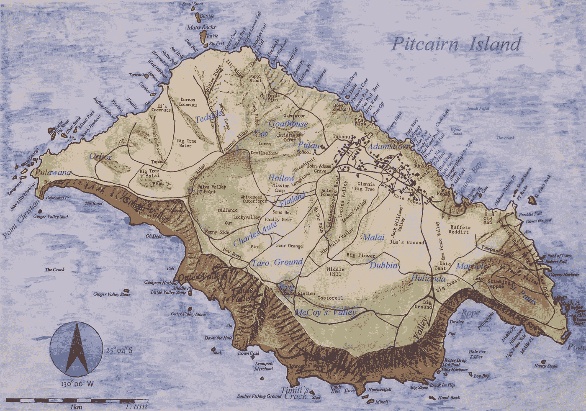
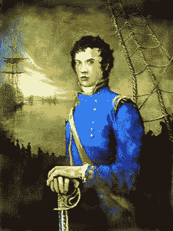
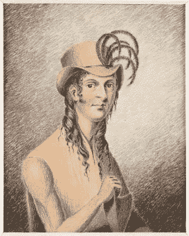
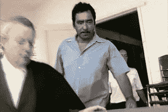

# 混乱的天堂:由反叛者建立的孤岛社区

> 原文：<https://medium.datadriveninvestor.com/troubled-paradise-the-isolated-island-community-founded-by-mutineers-aff5728a465f?source=collection_archive---------1----------------------->

## 1787 年，反抗当局的水手们发现自己被困在一块孤立的火山岩上。200 年后，他们的后代再次触犯了法律。

1787 年，一艘名为“邦蒂号”的小型海军舰艇在太平洋航行。它的任务是从塔希提岛收集面包果植物，并将它们运回西印度群岛，在那里英国人会用它们为奴隶提供廉价食物。收集了面包果植物，以及一些与船员建立了关系的塔希提妇女，这艘船开始了漫长的回家之旅。
号
返航时遇到了问题。这艘船的船长威廉·布莱对他的船员们醉酒和无能的行为越来越恼火。几天前，他们允许汤加当地人在船靠岸装载补给时偷走了船上的一个锚。结果，布莱船长严厉批评了他的船员，并将他们的朗姆酒和食物的配给量减半。

一天清晨，一个名叫弗莱彻·克里斯蒂安的人，受到了布莱最猛烈的攻击，决定夺取这艘船的控制权。船员们很快分成了反叛者和忠诚者，没有一枪一弹或匕首刺，兵变成功了。布莱和忠诚的船员被抛弃在船上的救生艇上。克里斯蒂安把珍贵的面包树扔进了海里。

当前船长布莱和他人数减少的船员们英雄般地跋涉 6500 公里到达帝汶岛的安全地带时，弗莱彻·克里斯蒂安和叛军船员们在南太平洋四处游荡，试图建立一个永久的基地，但没有成功，他们一直知道，一旦他们意识到“赏金”号不会回来，海军肯定会派出搜索队。克里斯蒂安是一个比布莱更糟糕的队长。每当船停下来，他就有更多的船员因开小差或被岛上居民的枪刺而丧生。

赏金号最后一次降落在一处无人居住的火山岩岸边。克里斯蒂安和他的反叛者们意识到这是他们能找到的最安全的机会。他们点燃了赏金号，并确保它沉入海底。他们被放逐了。

这个岛的名字叫皮特凯恩，它很小；面积为五平方公里。英国人以罗伯特·皮特开恩的名字给它命名，他是一名来自伯恩斯兰的 15 岁船员，距离伯恩斯兰很远，22 年前他通过望远镜发现了它。它不仅很小，而且很偏僻。新西兰和智利之间的中途，从下一个岛屿到那里需要 36 个小时的现代船。弗莱彻·克里斯蒂安的反抗军成员迅速自首。现在他们是英国水手、塔希提女人和波利尼西亚男人的混合体，船员们已经说服他们加入。这个群体中的英国人认为其他人不如他们，几乎是他们的财产。他们喝得烂醉，把女人们打发走了。与此同时，波利尼西亚人从事耕作、捕鱼和建设基础设施的艰苦工作。

在一个英国人提议把所有的农田都分给英国人并把波利尼西亚人排除在外之后，这种观点就站不住脚了。这是最后一根稻草，波利尼西亚人迅速谋杀了大多数英国人。他们英国人分而治之的态度不适用于 30 人左右的社区。弗莱彻·克里斯蒂安是受害者之一，他实际上反对排斥波利尼西亚人。当他在照料庄稼时，他们用斧子把他砍死了。

死前，克里斯蒂安与妻子育有一子。这个孩子的名字叫“星期四，十月基督教徒”,他是皮特凯恩岛原住民离开后的第一个岛民。

Fletcher Christian

Thursday October Christian

200 多年后，哗变者的后代仍然生活在皮特凯恩岛上。现任市长肖恩·克里斯汀可以直接追溯到弗莱彻·克里斯蒂安，岛民们仍然崇敬他们的开国元勋。市长克里斯蒂安统治着 49 个人口，他们的方言带有他们祖先的塔希提语和古英语的痕迹。皮特凯恩的居民已经与英国人讲和，于 1838 年成为大英帝国的一部分，当时是世界上最大的帝国。连同福克兰群岛，它现在是它的一个分散的残余。这个社区依靠旅游业和英国政府的拨款生存。

由于其位置和面积，皮特凯恩自动被认为是天堂。但是在 21 世纪初，一名警察的来访暗示了岛上生活的黑暗面。直到最近，这个社区在没有官方力量帮助的情况下自我监管。当一名穿制服的警察来访时，她与一名十几岁的女孩交谈，女孩告诉她，她至少被其中一名男子强奸过。展开了调查。

更多的故事出现了，来自各个年龄段的女性。有些人在年仅三岁时就遭到了攻击，这些故事可以追溯到几十年前。警察逮捕了七个人；岛上三分之二的成年男性人口，包括当时的市长史蒂夫·克里斯蒂安。但是英国当局对于是否继续追查此案犹豫不决。岛上居民对他们的接待充满敌意。一些人认为，以前从未干预过岛屿事务的警察别有用心；英国政府计划清除岛上的地雷。被捕男子声称这些性行为只是他们文化的一部分，在皮特凯恩自己的法律中是合法的。皮特凯恩法律规定，12 岁起允许发生性行为。他们声称英国法律从未在岛上公布过。如果它们从未在那里发表过，他们怎么申请呢？

无论你如何努力，你都无法想象生活在像皮特凯恩这样的社区。不得不在离你居住地不到一公里的地方寻找伴侣，在这个小社区里，大多数人的关系比世界上其他地方的人都要近。每天大约两个小时的电力。一个牙医。一个医生。两天旅行到下一个文明。所有这一切使得皮特凯恩人完全依赖彼此的认可和接受。

由于社区的珍贵，皮特凯恩人产生了一种令人衰弱的对抗恐惧。如果有人做了让你生气的事，比如在你家抽烟，你不要告诉他们。你给他们一个烟灰缸。当他们走了，你向你的朋友抱怨。反过来，他们告诉他们的朋友，那些朋友会友好地告诉吸烟者，他们不应该在别人的房子里吸烟，希望他们能明白这个暗示。

这种做法可能会阻止争论的爆发，但对于那些想要保守秘密或想要撒谎的人来说，这也是一份礼物。当一切都被间接查出来，所有的事实都成了谣言。对严重犯罪的谈论可以被视为纯粹的流言蜚语而不予理会。向警方报告的虐待受害者不仅克服了这种害怕节外生枝的恐惧，而且可能还指控了他们自己家庭的一名成员，以及他们必须在同一个小岛上共度余生的人。

Trouble in Paradise: The Pitcairn Story — A Channel 4 documentary about the case on Pitcairn from 2006

《天堂的烦恼:皮特凯恩的故事》——第四频道关于 2006 年皮特凯恩案例的纪录片。2004 年，前往该岛的定期补给船运载的货物比平时多。钢门、砖、栅栏。新建筑的组成部分:监狱。皮特凯恩第一。除一人外，所有人都被判有罪。他们共面临 96 项指控，从严重猥亵到性侵犯再到强奸。

然而，在上诉期间，这些人仍然可以在岛上自由走动。因此，作为社区中最强壮的成员和最知道如何操作岛上的小型拖拉机和其他机械的人，是他们将货物拖到岸上，并上山到空地上。他们将自己建造监狱，但将配备英国警察。皮特凯恩的生活将不再一样。

***Steve Christian, direct descendant of Fletcher Christian, during his trial on Pitcairn. He was convicted of raping several of the island’s children, including his own.***

19 世纪初，当英国人最终发现了兵变者的太平洋藏身处时，他们发现了一个虔诚的基督教团体。它的领导人是约翰·亚当斯，最后一个反叛者；少数几个逃过波利尼西亚特遣队谋杀的人之一。利用“邦蒂号”破损的《圣经》,他成功地将岛上剩余的居民团结在上帝之下。看到亚当斯统治下的岛屿生活明显虔诚的本质，英国人满足于名义上的岛屿所有权并离开，留下岛民追求完全独立的生活方式。“邦蒂”号的残骸继续在海底腐烂。

180 年后，当英国当局再次踏上该岛时，他们发现了一个与世隔绝的社会，那里虐待盛行；这是一个充满秘密的社区，由同一个家庭管理，和建国初期一样，有着同样的叛逆和狭隘的态度。这一次，这个岛国的领导人没能逃脱法律的制裁。

[*【怪异西班牙】*](https://weirdspain.substack.com/) *是一份时事通讯，面向那些想更深入了解他们的第二故乡及其人民的移民，以及世界各地想更多了解这个神奇国家正在发生什么以及为什么会发生的西班牙爱好者。* [*在这里订阅，在你的收件箱里收到这些文章。*](https://weirdspain.substack.com/subscribe)