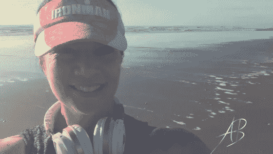

# 真正的耐力来自于爱上这个过程，这个旅程。

> 原文：<https://medium.datadriveninvestor.com/true-endurance-comes-from-falling-in-love-with-the-process-the-journey-b496bf9d244b?source=collection_archive---------15----------------------->

我很难理解大多数人。

那些不断抱怨生活的人。

抱怨做不了工作。

不快乐——除非通过酒精、毒品、色情或网络游戏脱离他们的现实生活。

我很难理解为什么每个人都对自己和自己的成长如此不耐烦。

我看到他们每次自省并发现另一个隐藏的恐惧，另一个狗屁信仰，另一个巧妙设计的自我破坏手段时都会生气。

他们希望这一切都消失。

立刻。

想着一旦他们释放了所有的内在干扰，生活将会变得精彩。

不明白生活的全部意义，

依我拙见，

**是自省。**

这是一个发现更多欲望，然后识别更多干扰，并与一个更纯粹的你重新组合来接受你的梦想的过程。

除了，在它完全显现之前，*你已经渴望更多。*

这意味着你要一遍又一遍地做这项工作，

直到你死去的那天。

坦白说，

当工作完成时，

每个人似乎都想这样，

你的灵魂不会再有新发现了，

因此，

你肯定会不可避免地按下重置按钮，让一切重新开始？

从这个角度来看， ***你对工作的不耐烦，就是对生活本身的不耐烦！***

固执地认为你只需要摆脱一个信念或一个障碍，

OMG 然后，

你会很开心的！

生活会变得美好。

选择痛苦直到那一天到来，坚持寻找彩虹尽头的那罐金子。

事实是，你完全可以选择这样的生活方式。

你可以选择在早晨醒来时感到气馁、沮丧、愤怒和沮丧，

再一次想到那些堆在你身上的狗屎，

别人所有烦人的要求，

你需要解决的问题。

我知道这也曾是我的默认设置。

这种方法让生活变成了人间地狱。

我不再相信了。

反而， ***我选择了爱上工作。***

我选择了爱上旅行。

我选择了爱上我的生活。

事实上，我喜欢每天早上做心态工作。就像过去的探险家一样，我进入潜意识，发现新的事物，我开始调查，或者保留或者释放。我开始对我的生活有不同的看法，我开始选择我想保持不变的东西和我想改变的东西。

这难道不令人兴奋吗？？？

我喜欢建立自己的事业！我喜欢每天与她的本质连接，问她在这个美好的时刻还想做什么。我喜欢她一直呈现给我的新难题，她不断变化的动态，她充满爱心地呈现的新障碍，给了我找到以前没有的解决方案的机会。我喜欢她给我带来潜在的机会，让我眼前一亮，而我必须找到勇气去答应她。那些真正让我进步的事。真正带给我前所未有的深度。

**这难道不令人兴奋吗？？？**

*我喜欢在自行车上、跑步上、瑜伽垫上拼命训练。*每当我遇到痛苦时，我都很激动，我必须找到克服痛苦的方法，这样我才能获得更多，并把更多带到起跑线上。我发现尝试我的营养和补充剂是令人兴奋的，然后当我采取正确的措施给我带来新的优势时，我会感受到它给我的注意力和耐力带来的变化。

这难道不令人兴奋吗？？？

我喜欢各种形式的关系。那些每天都让我感到美味的，让我微笑，让我歌唱的人。也有像士兵一样疼的。那些让我拔掉白发的照片。感觉就像被扇了一巴掌。知道我所有的关系都是为我而发生的。它们是我内心正在发生的事情的美丽镜子——有时反映了我不想承认的行为，有时反映了缺乏界限，因为我认为我不值得拥有这些，有时反映了拍马屁的恶劣习惯，对他人的感受负责，或者只是想得到认可。

这难道不令人兴奋吗？？？

这是不是意味着我从来不哭？不要因为害怕、沮丧或愤怒而尖叫？这是否意味着我每时每刻都保持平静？

你在开玩笑吗？？？

你见过我吗？？？

亲爱的，我是风暴、雨水、阳光、飓风和凉爽的晚风的结合体。

那也是完美的。

我的观点不是你必须变成这个没有感情的僵尸。

嗯，实际上，如果你环顾四周，大多数人都被麻醉了，对存在麻木了，这就是他们的生活方式。

我的观点是，如果你只是放松自己，如果你只是学会多嘲笑自己一点，如果你不再认为你必须在快乐之前到达终点，

***你现在可以选择快乐！***

你可以选择热爱工作、过程和旅程，

因此更想做这件事，

***因为好玩。***

期望在你的余生中这样做，从而消除不耐烦。

和

我向你保证，

你会得到更好的结果。

毕竟只有死亡是不可避免的。

繁荣永远是勇敢者的选择。

带着深深的爱和感激，

# 阿内尔