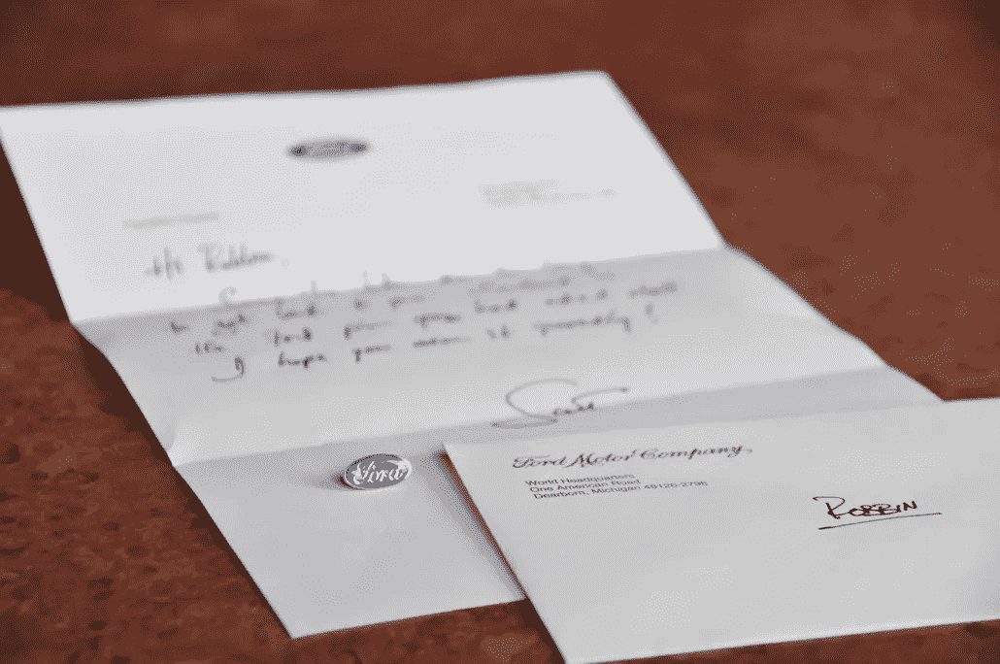

# 真正的个性化不需要人工智能。

> 原文：<https://medium.datadriveninvestor.com/true-personalization-doesnt-require-a-i-c408fdb9c26d?source=collection_archive---------37----------------------->

这个世界可以少用一点科技。

我不想成为像康拉德·盖斯纳博士 那样的坏脾气的人。只是时不时地(希望现在比那时更*)，放下设备和一个真正的人交谈是有帮助的。*

*是的，我意识到我在网上对你说这些话的讽刺意味。*

*我们已经到了这样一个地步，当人们被提到名字或收到一封手写的信时，他们会感到惊喜。这是反直觉的，因为我们生活和呼吸着短信、短信、短信、邮件等等。*

*但对我来说，个性化的精神和模拟的力量依然存在。这就是为什么我在桌子上放了一堆钢笔和文具。我养成了一个习惯，每周给人们发送真实的短信。*

*这种程度的努力和个人接触对接受它的人来说意义重大。这不仅不同寻常，而且告诉他们，他们对你很重要。*

*上面的照片是我最喜欢的照片之一。这是九年前的，它代表了一种姿态，我并不认为这有多重要，但这对接受者来说意义重大。*

*我在明尼阿波利斯的一次活动中遇到了罗宾·菲利普斯，她注意到了我的福特别针。在我们的谈话中，她说她也想要一张，所以我拿了她的名片，塞进我的口袋，继续我们的谈话。*

*回到底特律后，我给罗宾写了一张短笺，在信封里放了一枚别针，然后寄给了她。我原以为故事会就此结束。*

*事实证明，这种互动和简单的手势对 Robbin 意义重大——以至于她拍了张照片，并在自己的网站上写下了自己的感受。*

> ***爱情是买不来的，亲情是无价的* ***。”*** —圣杰罗姆**

**虽然有可能给客户很大的折扣，或者与昂贵的影响者签订合同，但这些战术营销努力是脆弱和暂时的。为什么？因为你已经购买了一种行为。**

**但是什么是亲情呢？**

**通常，这是父母对孩子的感觉，或者主人对宠物的感觉。对接受者来说，它象征着安全、保护和舒适。它还允许接受者学习和成长。**

**那么，缺乏感情的背后是什么？因为爱是单方面的——也就是说，没有回报的期望——没有爱会被认为是自私的。当品牌只是寻求一笔交易时，它会让人觉得好像他们把情感保留作为客户行动的一个条件。**

> **“无论我们生活中有多少坚实而持久的幸福，十分之九都要归功于爱情。” — C.S .路易斯，*四爱***

**当客户、员工、朋友和同事不希望听到你的消息时，一个简单的手势很重要。虽然数据库、算法和其他系统可以帮助你记住某人的生日或周年纪念日，或者他们何时完成了人生大事，但打电话或写便条仍然取决于你这个人。**

**我们可以教机器如何学习，如何回答问题，如何执行邮件合并，以及如何预测我们的需求，但我们不能教它们做真正人类所需要的事情:即感受和表达情感。**

**那就完全靠**你**了。**