# 特朗普对在南部边境寻求庇护的移民急剧增加负有主要责任

> 原文：<https://medium.datadriveninvestor.com/trump-is-primarily-responsible-for-the-sharp-increase-in-immigrants-seeking-asylum-at-the-southern-6999c0675b3e?source=collection_archive---------8----------------------->

特朗普的不人道政策是在保护我们的边境吗？不，特朗普的政策正在让我们的边境变得更不安全。

Photo by [Nitish Meena](https://unsplash.com/@nitishm?utm_source=medium&utm_medium=referral) on [Unsplash](https://unsplash.com?utm_source=medium&utm_medium=referral)

没有理由在这个故事中详述当前移民和边境政策的不道德之处。我写了另一个关于这些反人类罪的故事。我会在下面插入图片，让图片来说话。

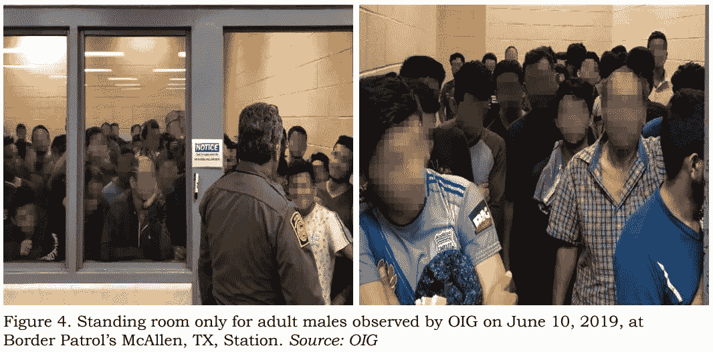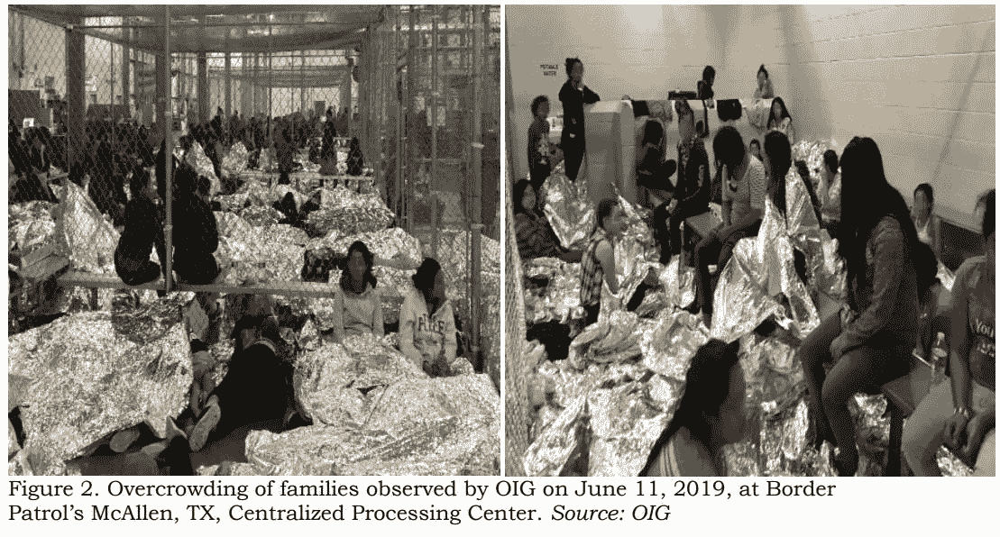

这些照片来自美国政府监察长办公室。

 [## 保护主义、政治和经济动荡|数据驱动的投资者

### 美国股市昨日出现 400 多点的大幅反转，为未来的事情发出了警告信号。市场…

www.datadriveninvestor.com](https://www.datadriveninvestor.com/2018/06/28/protectionism-politics-economic-turmoil/) 

我们目前的政策不仅是不道德的，而且对美国纳税人来说也贵得离谱。我们都在为寻求庇护者支付过高的住宿费用。我们要把这笔钱付给谁？为特朗普竞选做出巨大贡献的私人监狱行业。

现行政策有效吗？不。请看下图，看看非法越境是如何激增的:

**图表 1:**

An interactive version of Graph 1 is available at [this link](https://docs.google.com/spreadsheets/d/1ayQ-c8xWEbEu0fQ6wWJbwWIOg0BsHFIH2AERSD5jC6Y/edit?usp=sharing).

2007 年至 2018 年的数据来自[该站点](https://www.cbp.gov/sites/default/files/assets/documents/2019-Mar/BP%20Apps%20by%20Sector%20and%20Citizenship%20FY07-FY18.pdf)的海关和边境巡逻队(CBP)。2019 年的数据来自本网站的[CBP。](https://www.cbp.gov/newsroom/stats/sw-border-migration)

# 移民危机的原因

任何事件都有许多原因。在这里，我们将研究边境危机的三个主要原因:母国暴力、母国贫困和特朗普政策。

## 母国的暴力

在过去的几年里，来自北部三角国家萨尔瓦多、危地马拉和洪都拉斯的寻求庇护者人数大幅增加。查看这些图表:

**图表 2:**

An interactive version of Graph 2 can be found at [this link](https://docs.google.com/spreadsheets/d/1ayQ-c8xWEbEu0fQ6wWJbwWIOg0BsHFIH2AERSD5jC6Y/edit?usp=sharing).

图表 2 的数据来自[CBP 的这个链接](https://www.cbp.gov/sites/default/files/assets/documents/2019-Mar/BP%20Apps%20by%20Sector%20and%20Citizenship%20FY07-FY18.pdf)。

**图表 3:**

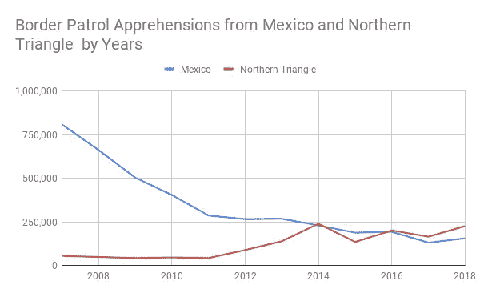

An interactive version of Graph 3 can be found at [this link](https://docs.google.com/spreadsheets/d/1ayQ-c8xWEbEu0fQ6wWJbwWIOg0BsHFIH2AERSD5jC6Y/edit?usp=sharing).

图表 3 的数据来自[该链路](https://www.cbp.gov/sites/default/files/assets/documents/2019-Mar/BP%20Apps%20by%20Sector%20and%20Citizenship%20FY07-FY18.pdf)的 CBP。

在过去几年中，来自墨西哥的移民一直在减少。来自三个北方三角国家的移民现在超过了来自墨西哥的移民。尽管事实上墨西哥就在美国的隔壁，那些来自北部三角地区的人不得不步行一千多英里穿越墨西哥。所有三个北部三角国家的总人口约为 32，500，000，而墨西哥的人口约为 129，200，000。那么为什么这些来自北三角的人如此渴望来到这里呢？

这些北三角国家是世界上最暴力的国家之一。请参见下表:

**表 1:**

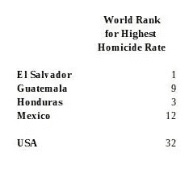

The data for Table 1 above is from Wikipedia at [this link](https://en.wikipedia.org/wiki/List_of_countries_by_intentional_homicide_rate).

所以移民是为了逃离暴力，对吗？逃离暴力无法解释最近的激增，因为暴力一直在减少。请参见下图:

**图表四:**

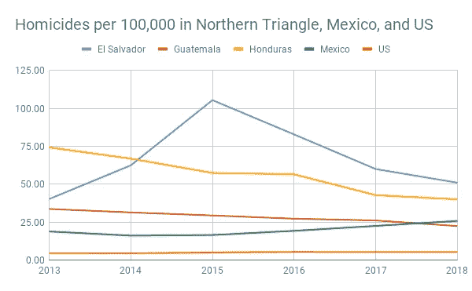

An interactive version of this graph can be found at [this link](https://docs.google.com/spreadsheets/d/1ayQ-c8xWEbEu0fQ6wWJbwWIOg0BsHFIH2AERSD5jC6Y/edit?usp=sharing).

准备图表 4 的数据来自联合国毒品和犯罪问题办公室(UNODC)，通过这个[维基百科文章](https://en.wikipedia.org/wiki/List_of_countries_by_intentional_homicide_rate)。

不像以前移民到美国的大多数是单身男子，他们在边境上来回移动，这些来自北三角的移民带着他们的家人。这表明这些人正在逃离暴力。如果一个人只是为了赚更多的钱而离开，他们就不太可能把家人带到这个昂贵的新国家，而是赚到钱并寄回给家人。美元在这些北方三角国家的低生活成本中走得更远。见下图，该图显示了在移民从墨西哥转移到北三角的同时，跨越边境的家庭数量的增加:

**图表 5:**

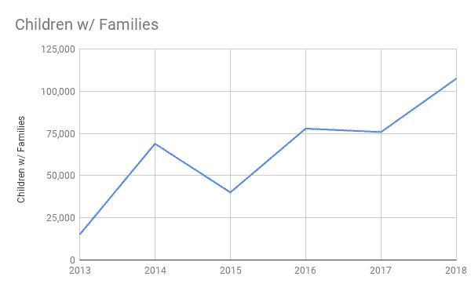

An interactive version of Graph 5 can be found at [this link](https://docs.google.com/spreadsheets/d/1ayQ-c8xWEbEu0fQ6wWJbwWIOg0BsHFIH2AERSD5jC6Y/edit?usp=sharing).

图表 5 中的数据来自[处的 CBP，该链接](https://www.cbp.gov/sites/default/files/assets/documents/2019-Mar/bp-total-monthly-family-units-sector-fy13-fy18.pdf)。

## 母国的贫困

这些人逃到美国是因为贫穷吗？数据并不支持这些人正在摆脱贫困的结论，因为与现在相比，过去的贫困程度更大。此外，美国的经济机会与 2007 年相似，当时来自这些国家的移民要少得多。2007 年，美国的失业率介于 4.4%和 5.0%之间。

下图显示了 2013 年至 2018 年三个北三角国家的人均 GDP 增长:

**图表 6:**

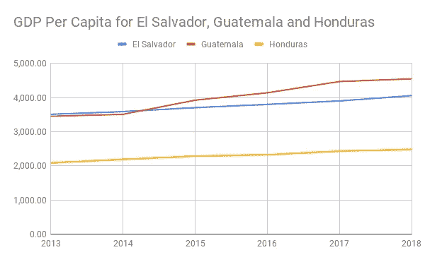

An interactive version of Graph 6 can be found at [this link](https://docs.google.com/spreadsheets/d/1ayQ-c8xWEbEu0fQ6wWJbwWIOg0BsHFIH2AERSD5jC6Y/edit?usp=sharing).

下图 6 和表 2 的数据来自世界银行，可在[此链接](https://data.worldbank.org/indicator/NY.GDP.PCAP.CD?locations=SV-GT-HN)找到。

基于上图的下表 2 显示，2013 年至 2018 年，三个北部三角国家中的两个国家的人均 GDP 增长超过了美国:

**表 2:**

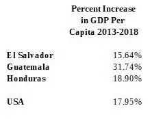

尽管人口也在快速增长，但人均国内生产总值仍在增长。即使移民到国外，人口仍在增长。最新的人口数据是 2017 年的。请参见下表:

**表三:**

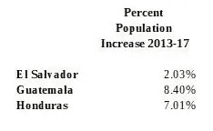

The data for Table 3 is from Google’s public data at [this link](https://www.google.com/publicdata/explore?ds=d5bncppjof8f9_&met_y=sp_pop_totl&idim=country:SLV:HND:NIC&hl=en&dl=en#!ctype=l&strail=false&bcs=d&nselm=h&met_y=sp_pop_totl&scale_y=lin&ind_y=false&rdim=region&idim=country:SLV:HND:GTM&ifdim=region&hl=en_US&dl=en&ind=false).

随着贫困加剧、暴力加剧以及美国经济好转，移民美国的人数大幅增加的原因已被排除，这就给我们留下了另外两种可能性:

1.  这些移民知道美国的机会更好，墨西哥人不会像以前那样移民到美国，和/或
2.  这些移民被告知，他们在美国获得更好的安全和机会的机会即将结束，因为隔离墙正在修建。总统不断散布关于移民的恐惧，这增加了这些潜在移民的焦虑，他们在美国获得安全的机会可能很快就会结束。边境上的残酷威胁当然不会让这些人放慢脚步。

那么，是谁告诉这些人墨西哥人移民到美国的人数要少得多？可能从移民中获利最多的人是人口贩子。人贩子是谁？毒品卡特尔是那些最负责将这些人运过边境的有利可图的企业。参见[失败的移民政策支撑着一个无法无天的卡特尔帝国](https://www.wsj.com/articles/failed-immigration-policy-sustains-a-lawless-cartel-empire-11556232571)。你可以打赌，这些卡特尔正在敦促这些人现在去美国，因为由于特朗普的隔离墙，边境很快就会关闭。特朗普的疯狂政策是卡特尔的主要卖点。这些人贩子告诉他们的潜在客户，他们最好现在就去美国，否则就再也没有机会了。

## 特朗普的边境政策

在边境以南，骗子从特朗普的移民政策中赚了很多钱。边境的北边呢？在边境的北边，美国纳税人每天为每个移民支付高达 750 美元。请看[流动儿童的第一站:营利性看守所](https://www.reuters.com/article/us-usa-immigration-children/first-stop-for-migrant-kids-for-profit-detention-center-idUSKCN1Q3261)来自*路透社*。这些私人监狱公司中有许多为特朗普提供了大量竞选捐款。见[私人监狱支持川普，可以在*今日美国*看到新政策](https://www.usatoday.com/story/news/politics/2017/02/23/private-prisons-back-trump-and-could-see-big-payoffs-new-policies/98300394/)的巨大回报。特朗普的政策肯定有利于私人监狱行业——一个没有理由存在的行业。纽约市中央公园丽思卡尔顿酒店的豪华单间价格为每晚 895 美元。对于每晚 750 美元，人们会认为这些私人监狱公司可以提供比饮用水更好的服务。更多关于移民在边境遭受的不人道待遇，请点击[链接](https://medium.com/@coblelaw/a-christain-analysis-of-the-trump-administrations-treatment-of-asylum-seekers-331de857bdd6)查看我的故事。

我敢肯定，人贩子会忘记在移民离开祖国、穿越墨西哥之前告诉他们特朗普的残忍。一旦这些移民到达边境，他们已经走了很远，付出了太多的代价才返回。

## 为什么人们来自这些北方三角国家，而不是尼加拉瓜？

尼加拉瓜与洪都拉斯接壤，距离萨尔瓦多只有几英里。参见下表，了解 2018 年来自尼加拉瓜和北三角国家的移民人数:

**图表 7:**

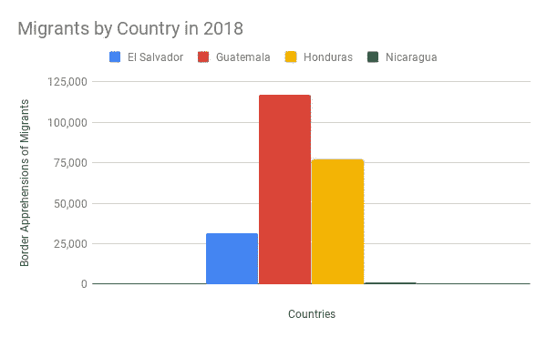

An interactive version of Graph 7 can be found at [this link](https://docs.google.com/spreadsheets/d/1ayQ-c8xWEbEu0fQ6wWJbwWIOg0BsHFIH2AERSD5jC6Y/edit?usp=sharing).

上图 7 的数据来自[该链路](https://www.cbp.gov/sites/default/files/assets/documents/2019-Mar/BP%20Apps%20by%20Sector%20and%20Citizenship%20FY07-FY18.pdf)的 CBP。

相比之下，几乎没有人来自尼加拉瓜。为什么？根据世界银行的数据，2016 年尼加拉瓜的故意杀人率为每 10 万人中有 7 人。参见[此链接](https://data.worldbank.org/indicator/VC.IHR.PSRC.P5?locations=NI)世界银行了解更多关于尼加拉瓜凶杀率的信息。同年，萨尔瓦多、危地马拉和洪都拉斯每 10 万人中分别有 83、57 和 27 起故意杀人案。同年，美国每 10 万人中有 5 人故意杀人。所以，尼加拉瓜不是一个暴力的国家。

尼加拉瓜公司有钱吗？不。尼加拉瓜的财富与北三角国家相比，见下图。

**图表 8:**

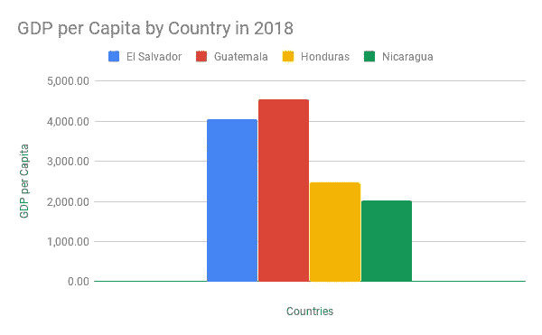

An interactive version of Graph 8 can be found at [this link](https://docs.google.com/spreadsheets/d/1ayQ-c8xWEbEu0fQ6wWJbwWIOg0BsHFIH2AERSD5jC6Y/edit?usp=sharing).

图表 8 的数据来自世界银行，可以在[链接](https://data.worldbank.org/indicator/NY.GDP.PCAP.CD?locations=SV-GT-HN)找到。

为什么尼加拉瓜比北三角国家更穷，却没有那么暴力，而且几乎没有移民到美国？尼加拉瓜的收入不平等程度远低于其他国家，甚至低于美国。请参见下表:

**表 4:**

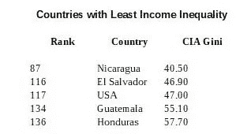

The data for Table 4 above can be found on Wikipedia at [this link](https://en.wikipedia.org/wiki/List_of_countries_by_income_equality).

不要误解我，我不是丹尼尔·奥尔特加的粉丝，但桑地诺党确实比他们的右翼邻居做得更好。尼加拉瓜人不会冒着一切风险离开自己的国家，尽管他们比邻国的公民更穷。20 世纪 80 年代，美国支持萨尔瓦多、危地马拉和洪都拉斯使用右翼行刑队的政权。我们资助了尼加拉瓜的反政府武装。也许美国应该对这些国家的政府形式比对它们的经济体系更感兴趣。自 1980 年代以来，桑达主义者通过选举被赶下台，并通过选举重新掌权。如果索摩查继续掌权而桑地诺没有接管，尼加拉瓜可能会在 2019 年陷入与其邻国类似的困境。如果是这样的话，美国将会有更多的寻求庇护者。参见[这篇来自维基百科的关于尼加拉瓜历史的文章](https://en.wikipedia.org/wiki/History_of_Nicaragua)。

## 为什么墨西哥移民如此减少？

下图或许可以解释墨西哥移民减少的原因:

**图表 9:**

An interactive version of Graph 9 can be found at [this link](https://docs.google.com/spreadsheets/d/1ayQ-c8xWEbEu0fQ6wWJbwWIOg0BsHFIH2AERSD5jC6Y/edit?usp=sharing).

图表 9 的 GDP 数据来自世界银行在[这一环节](https://data.worldbank.org/indicator/NY.GDP.PCAP.CD?locations=MX)。图表 9 中 2007 年至 2018 年的移民数据来自 CBP 的[链接](https://www.cbp.gov/sites/default/files/assets/documents/2019-Mar/BP%20Apps%20by%20Sector%20and%20Citizenship%20FY07-FY18.pdf)。图表 9 中 2000 年至 2006 年的移民数据来自 CBP 的[链接](https://www.cbp.gov/sites/default/files/assets/documents/2019-Mar/bp-total-apps-other-mexico-fy2000-fy2018.pdf)。图表 9 中 1992-1999 年的移民数据来自 CBP 的[链接](https://www.cbp.gov/sites/default/files/assets/documents/2019-Mar/bp-southwest-border-sector-apps-fy1960-fy2018.pdf)。一个乘数被用来估计 1992-1999 年的墨西哥移民。更多关于这个乘数的信息，请参见互动版的图表。

1992 年生效的《北美自由贸易协定》导致墨西哥移民减少。到 2000 年代初，墨西哥移民低于北美自由贸易协定启动前的水平。图表显示，当人均 GDP 达到大约 7500 美元时，墨西哥移民到美国的人数开始急剧下降。如果采取更现代的贸易政策，让更多的钱进入普通墨西哥人的口袋，同时减少美国制造业工人的收入，我们本可以取得同样的结果。我将在如何解决移民危机的文章中详细阐述这样的政策。自 2009 年以来，墨西哥人均国内生产总值进一步增加到 9 700 美元，2014 年达到近 11 000 美元的高点。2018 年，墨西哥移民不到 2009 年的一半。

# 结论

目前，边境南部卡特尔和美国私人监狱公司形式的骗子正从这些寻求庇护者的痛苦中获得巨大利润。特朗普正在从这一移民热潮中受益，因为他的基础将他视为最终打击非法移民的英雄。他的基地没有注意到特朗普引起了移民热潮。

我们可以通过摆脱特朗普和他无能而残酷的政策来解决移民危机。然后，我们需要切断卡特尔的资金来源，以警察顾问、军事顾问和人道主义援助的形式向这些北部三角国家提供援助。最后，我们需要与这些国家制定贸易政策，迫使他们减少腐败，并根据这些国家的生活成本向工人支付生活工资。

上述政策将减少这些国家的暴力，增加这些国家普通公民的财富，并减少这些人穿越墨西哥到达美国的愿望。对这些策略的深入描述超出了本文的范围。如故事即将来临。作为预演，这些项目的一部分将涉及真正的边境安全，这将阻止毒品和人口贩运受害者流入美国。应该有边境围栏，但不能有无效且昂贵的中世纪风格的边境墙。