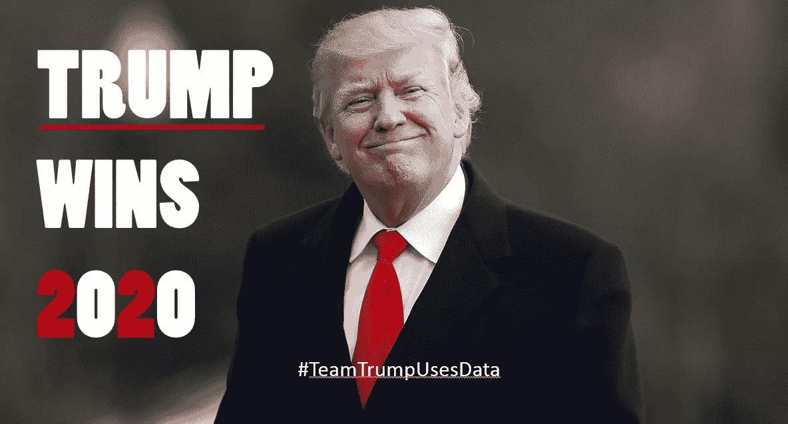
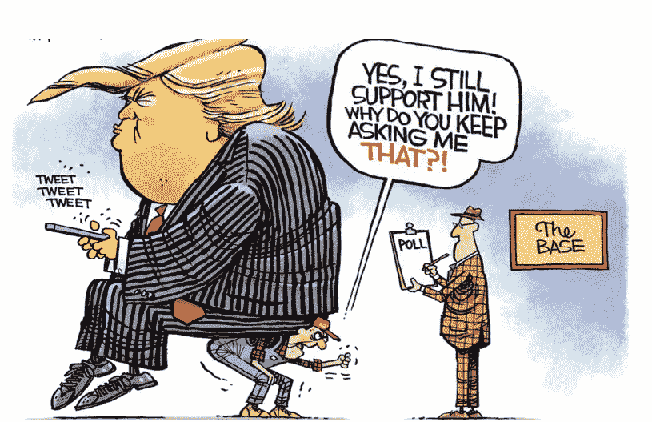
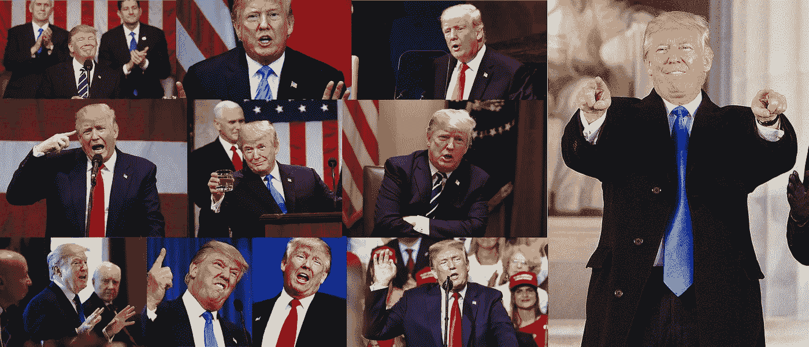
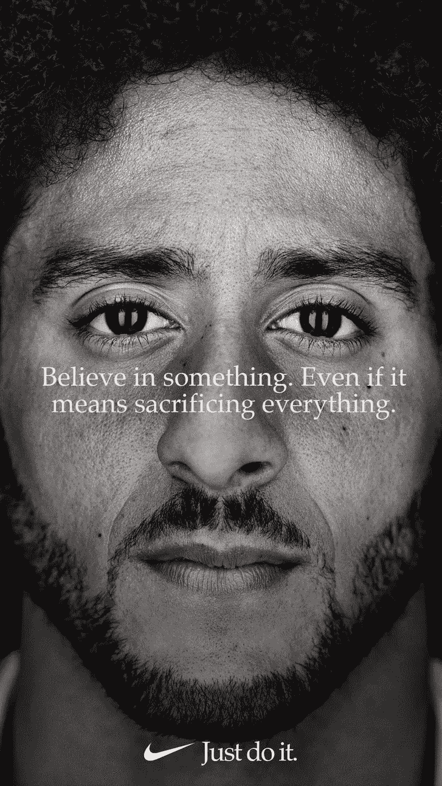
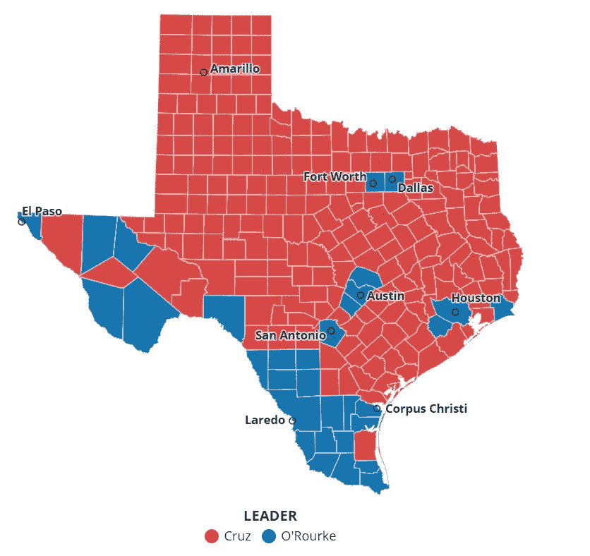

# 特朗普将在 2020 年赢得连任！原因如下。数据和营销策略。

> 原文：<https://medium.datadriveninvestor.com/trumps-going-to-win-reelection-in-2020-heres-why-data-marketing-strategy-f482f99dbce2?source=collection_archive---------9----------------------->

## 要点:特朗普团队正在利用精湛的营销技巧和相关数据，而不是使用主观或本能的活动执行方法的传统方法，来解决增长和参与问题。

不管我们任何人对特朗普的看法如何，他绝对会赢得 2020 年的大选。事实是，这不是关于他在推特上的滑稽动作。这不是关于他在核裁军、民权运动和贸易战等非常重要的话题上制造一场国际争论的能力。基于我们作为人类和同一个社会成员的共同价值观，我们希望这些事情会削弱对他的支持。大多数人会说这是合乎逻辑的，但事实上，认为这些事情会导致特朗普的衰落主要是一种情绪反应。具体来说，这是一种情绪化的话语，它在特朗普团队如何吸引、吸引和留住他的追随者的真实操作流程之上制造噪音。尽管他有很多缺点，但他的优势之一是倾听营销和数据团队的意见，并且执行得非常出色。这不是一个新问题。它和我们的民主进程一样古老。不同的是游戏变了。民主党拒绝参与。2016 年就像百视达醒来发现网飞在吃他们的午餐。2020 年就像美国电话电报公司几周前收购康卡斯特(Comcast)并推出流媒体服务一样，只晚了 15 年。民主党甚至不在同一个领域，因为他们不接受游戏已经改变。因此，共和党人将几乎不受限制地走下去。

Photo by [Johanneke Kroesbergen-Kamps](https://unsplash.com/@johannekek?utm_source=medium&utm_medium=referral) on [Unsplash](https://unsplash.com?utm_source=medium&utm_medium=referral)

以下是一些因为好玩而在方向盘上睡觉的行业的例子:

Carvanna 与可怕的亲临经销商购买体验。(另一篇关于这个假期的文章要过来了。)

根保险与笨重缓慢的保险业。在接下来的 24 个月里，看着老型号倒下，或者买下这个，或者复制它的商业模式。

像 Loom & Leaf 这样的公司正在扰乱 Sealy 和其他床垫巨头，它们将价格冲击到现有成本结构的下限附近。

Wayfair 正在修复家居商品市场的所有问题，它将强大的营销和购物体验捆绑在透明和数据丰富的物流能力上，建立了一个令人难以置信的新服务标准。

好了，够了。

这些公司正在玩一场全新的游戏，而他们的竞争对手仍在坚持过时的商业模式，这些模式无疑仍在产生巨额利润。但这将会改变。当这种情况发生变化时，竞争将为时已晚。就像上面这只大狮子一样，民主党人正处于被改变的游戏中，然而他们却在睡觉。他们在特朗普团队在球场上打一场民主党人甚至没有出现的比赛时打盹。

# 胜过营销和数据利用战略

## 观察 1:特朗普团队对他们的目标客户并不困惑。

从一开始，特朗普团队对美国目标群体只有一个信息。有句话说，当每个人都是你的潜在客户时，没有人会成为你的客户。特朗普团队对他们需要迎合谁并没有失望。在很大程度上，我客观地感觉这个决定是一个简单的数学问题，它确定了可行的选项来使数字工作。特朗普团队认为他的品牌结构是他权力的基础。他们使用客户细分，并根据对特朗普来说碰巧很自然的特定信息和行为的亲和力来预测潜在投票。

## 观察 2:特朗普团队通过真实性和争议最大化参与度。

做真实的自己一直被认为是高度参与的关键。困难在于将这一点清楚地传达给你的目标客户。我们看到许多公司在这个问题上挣扎和挣扎了很多年，有些公司从来没有做对过。特朗普团队已经就特朗普有多真实展开了对话，他们的平台(Twitter、CNN、FOX 等)每周都反复强调这一点。他们通过各种媒介一致地传递信息。

现在来谈谈争议。特朗普团队利用争议作为迫使客户做出选择的手段。每个美国人都面临着一个情绪化的决定，但特朗普的基地必须每天明确决定，他们是要加倍下注特朗普，为他辩护还是离开。这对于建立一个纯客户社区是非常有效的。即。-耐克和今年早些时候的科林·卡佩尼克争议。

## 观察 3:特朗普团队将部署到美国的一些地区，这些地区符合产生最多分数的数据模型。

## 观察 4:特朗普团队让同样的数据决定他们在地理上分配广告支出的位置。

观察结果 3 和 4 基本上可以合并，因为它们说的是类似的事情，但它们对团队特朗普的成功都有各自不同的影响。首先，特朗普团队可能已经对美国各地符合以下类别的所有地区进行了分类:

1.  特朗普拥有的选区。
2.  特朗普必须争取的选区。
3.  特朗普必须保护的地区。
4.  品牌(政党)转换概率低的地区。

然后，根据潜在的选举人票，所有地区都被给予高、中、低优先级。特朗普团队在所有四个类别的这些高优先级地区部署，并直接向这些地区的纯客户部署营销支出。

2018 Texas Senate Race Outcome.

我们今年在得克萨斯州参议员竞选中看到了同样的处决，贝托诉克鲁兹。贝托玩了传统的自己动手的草根游戏，让人们去投票，而且做得很出色。唯一的问题是他们在问题上的立场并不重要。贝托在玩老游戏，而克鲁兹和共和党机器在竞选期间几乎没有访问过一个大城市。他在得克萨斯州的农村地区，在阿马里洛和像这样的无名之地获得了无争议的选票，因为数据就是这么说的。更准确地说，这是数学告诉我们要做的。最终，民主党人不得不让共和党人一次又一次地击败他们。

旁注:这一次失败几乎可以保证特朗普团队在 2020 年取得胜利，因为没有德克萨斯州，没有任何可以想象的方式来取得共和党的胜利。一段时间以来，它一直是美国共和党政治的重要基础。

特朗普团队正在实现无法实现的目标吗？绝对不行。他们正在利用当今现成的标准技术来做得更好。有这么多的公司在那里的领导，经营业务和营销计划从斜倚的位置，当有人真的认真对待他们的市场份额。

民主党拥有如此庞大的公司追随者，他们拥有令人难以置信的数据和分析能力，但他们仍以 20 世纪初的方式做事为荣，但现在他们也使用短信。好像这就是破解密码。

特朗普团队将在 2020 年获胜，年轻公司将击败笨重的老在位者，因为像民主党人一样，他们拒绝在游戏已经转移的地方玩游戏。