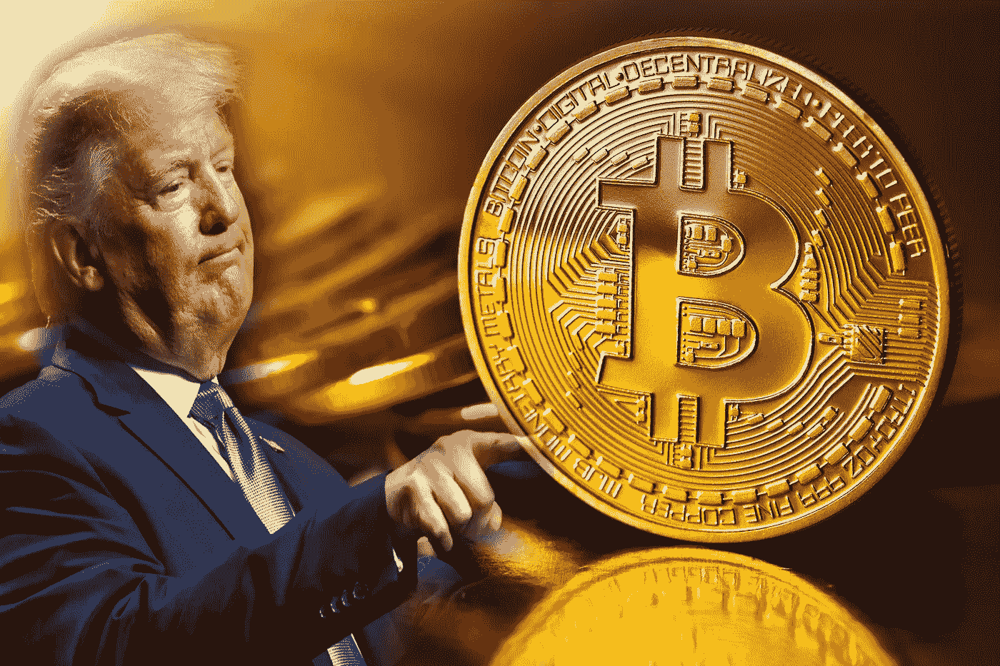

# 特朗普的推文导致加密货币价格暴跌

> 原文：<https://medium.datadriveninvestor.com/trumps-tweets-causes-cryptocurency-price-to-tumble-7c9bd867ae3d?source=collection_archive---------8----------------------->

美国总统唐纳德·特朗普的推特风暴已经成为美国公民娱乐和怪异的来源。从发明一个新词“covfefe”到向该国的对手发出不受监管的威胁，特朗普的推文似乎是全世界永无止境的嘲笑来源。最有新闻价值的咆哮几乎总是感觉即兴的、情绪化的和被动的。然而，历史性的一系列推文构成了美国在任总统对加密货币**的首次公开评论，但似乎不符合同样的模式。**

**它似乎非常不合时宜地描绘了一致性，并被战略性地定时和异常清晰地表达出来。7 月 11 日的推文称，“我不是比特币和其他加密货币的粉丝，它们不是货币，其价值高度不稳定，并且基于稀薄的空气。不受监管的加密资产会助长非法行为，包括毒品交易和其他非法活动。同样，脸书天秤座的“虚拟货币”也没有什么地位和可靠性。如果脸书和其他公司想成为一家银行，它们必须寻求一个新的银行章程，并像其他银行一样，接受所有银行监管。”。**

****

> **[**✔@realdonaldtrump**](https://twitter.com/realDonaldTrump)**
> 
> ****我不是* [***比特币***](https://www.thecoinrepublic.com/bitcoin-accepted-3-million-on-valletta-palazzo-mansion-in-malta-which-is-on-sale/) *等加密货币的粉丝，它们不是货币，其价值波动性大，建立在凭空之上。不受监管的加密资产会助长非法行为，包括毒品交易和其他非法活动。****
> 
> ***[*72.4K*](https://twitter.com/intent/like?tweet_id=1149472282584072192)***
> 
> ***[*2019 年 7 月 05:45–12 日*](https://twitter.com/realDonaldTrump/status/1149472282584072192)***
> 
> ***[*推特广告信息和隐私*](https://support.twitter.com/articles/20175256)***

***[39.3K 人都在说这个](https://twitter.com/realDonaldTrump/status/1149472282584072192)***

***它以对加密货币的一般性评论开始，然后将打击范围扩大到脸书备受讨论的未来数字货币 Libra，并以一份感觉良好的声明结束，称赞美元是“世界上最具主导地位的货币”四天后，很明显特朗普的推文不是他发布的，因为财政部长史蒂文·穆钦在新闻发布会上几乎一字不差地回应了总统的担忧，他在新闻发布会上声称加密货币构成了“国家安全威胁”。在这一点上，很难不把来自政府的信息看作是一个协调的观点。***

***然而，这导致加密货币价格立即暴跌，然后在进入更大的打击之前短暂反弹，在整个市场上闪烁红色信号。金融服务公司 Circle 的联合创始人兼首席执行官杰里米·阿莱尔(Jeremy Allaire)称，这一发展“可能是 BTC**有史以来最大的牛市信号”，而《福布斯》的比利·班布罗(Billy Bambrough)认为，川普“无意中使比特币和加密货币成为总统议题，并对新兴的比特币技术给予了宝贵的认可。”特朗普的 6000 万粉丝对加密货币的负面介绍可能会损害加密货币在数百万美国人中的地位。*****

*****作为对美元有如此大影响力的人，一位在任的美国总统没有资格对可能威胁美元作为交易媒介和储备货币的因素发表任何公开支持。然而，特朗普总统提出的那种浅薄的批评在面对任何系统性的反驳时都站不住脚。*****