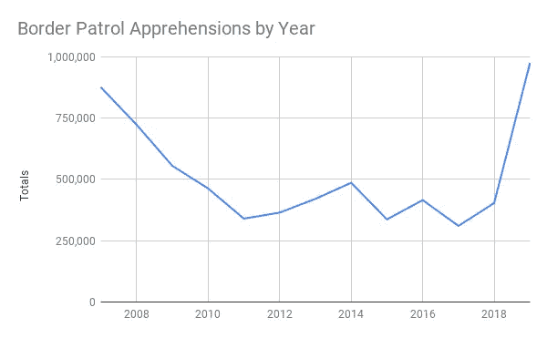
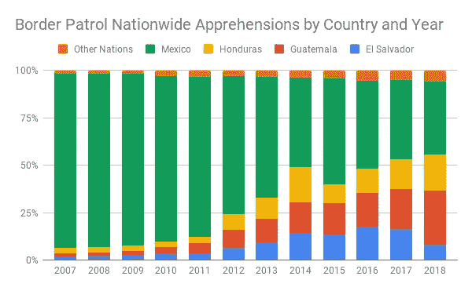
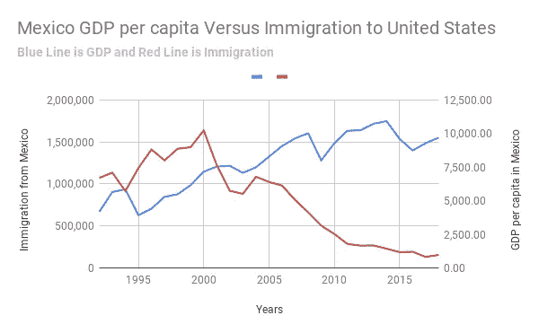

# 特朗普的墙不会奏效，但南部边境的睦邻政策会奏效

> 原文：<https://medium.datadriveninvestor.com/trumps-wall-will-not-work-but-a-good-neighbor-policy-at-the-southern-border-would-work-e22c8ad04512?source=collection_archive---------4----------------------->

明智的边境政策将使我们的国家实现减少非法移民和更大的边境安全。

Photo by [Fabian Fauth](https://unsplash.com/@fabster74?utm_source=medium&utm_medium=referral) on [Unsplash](https://unsplash.com?utm_source=medium&utm_medium=referral)

他的故事将集中在合理的边境安全政策上。我不会深究目前在南部边境犯下的反人类罪。这些罪行是美国刑事法庭和国际刑事法庭的事情。显然，特朗普残酷的边境政策不起作用。特朗普政策无效的证据见下图。

An interactive version of this graph is available at [this link](https://docs.google.com/spreadsheets/d/1ayQ-c8xWEbEu0fQ6wWJbwWIOg0BsHFIH2AERSD5jC6Y/edit#gid=334079672).

上图中 2007-2018 年的数据来自[该站点](https://www.cbp.gov/sites/default/files/assets/documents/2019-Mar/BP%20Apps%20by%20Sector%20and%20Citizenship%20FY07-FY18.pdf)的海关边境巡逻队(CBP)。2019 年的数据来自[这个站点](https://www.cbp.gov/newsroom/stats/sw-border-migration)的 CBP。

 [## 保护主义、政治和经济动荡|数据驱动的投资者

### 美国股市昨日出现 400 多点的大幅反转，为未来的事情发出了警告信号。市场…

www.datadriveninvestor.com](https://www.datadriveninvestor.com/2018/06/28/protectionism-politics-economic-turmoil/) 

# 解决问题的第一步是定义问题

## 移民来自哪里？

今天来到美国的大多数移民来自北部三角国家萨尔瓦多、危地马拉和洪都拉斯。见下图。

An interactive version of this graph is available at [this link](https://docs.google.com/spreadsheets/d/1ayQ-c8xWEbEu0fQ6wWJbwWIOg0BsHFIH2AERSD5jC6Y/edit#gid=334079672).

上图的数据来自[链路](https://www.cbp.gov/sites/default/files/assets/documents/2019-Mar/BP%20Apps%20by%20Sector%20and%20Citizenship%20FY07-FY18.pdf)的 CBP。

来自北方三角国家的移民在美国寻求庇护有两个原因:贫困和暴力。如果我们扮演‘好邻居’的角色，帮助这些国家解决这些问题，那么非法移民和寻求庇护者就会少得多。

## 为什么我们过去的政策失败了？

就像“邻居”经常发生的情况一样，美国是邻国问题的一部分。美国对非法毒品的需求为贩毒集团和贩毒团伙提供了资金。没有这笔钱，这些卡特尔和帮派就会分崩离析。如果没有卡特尔和帮派，这些国家的暴力事件将会大大减少。如果没有暴力，北部三角国家的公民就不会有逃往美国的欲望。如果没有暴力，外国人会有更大的意愿在这些北部三角国家投资。外国投资导致这些国家的贫困减少。同样，贫困的减少也降低了徒步穿越墨西哥到达美国的欲望。

像特朗普提议的那样简单地使用一堵中世纪的墙是行不通的。在最近对 El Chapo 的审判中，他利用飞机、火车、汽车、拖车、油轮、渔船甚至潜艇将毒品运入美国。见[川普的墙不会阻止埃尔查普的潜艇、铁路油罐车、隧道和其他毒品走私伎俩在布鲁克林审判中被揭露](https://www.nydailynews.com/news/politics/ny-metro-el-chapo-trial-evidence-trump-border-wall-20190112-story.html)来自*纽约每日新闻*。特朗普的隔离墙无法提供针对这些方法的安全保障。我们需要边境安全的主要原因是防止毒品和其他违禁品的跨境贸易。没有这种安全保障，我们就把美国的钱放进了这些罪犯的口袋，从而为卡特尔和黑帮提供了权力。另外，我向你保证，墨西哥不会为我们的墙买单。

## 哪些政策被证明是有效的，我们如何在这些政策的基础上再接再厉？

事实证明，减少非法移民最有效的方法是通过北美自由贸易协定来减少我们的邻国墨西哥的贫困。有了一个更好的北美自由贸易协定，我们可以减少北部三角地区邻国的贫困和收入不平等。一个更好的北美自由贸易协定将减少美国制造业工作的流失。随着贫困的减少，我们可以期待更少的非法移民。

任何“睦邻政策”我们需要做的第一步就是为梦想者提供一条获得公民身份的道路。这是美国的错，不仅仅是无辜儿童的错，他们在美国长大，却不知道自己不是美国公民。我们不能通过对这些梦想家实施严厉的措施来纠正我们过去的政策失误。

第二，我们需要一个大赦/外来工人计划，帮助那些在美国居住了一段时间的人。将等待期定为七年而不是目前的五年并无不妥。一些国家要求申请公民身份的人必须成为合法居民长达 10 年，居民才能申请公民身份，例如瑞士。一些国家要求等待时间超过二十年。参见[这篇来自维基百科的关于入籍的文章](https://en.wikipedia.org/wiki/North_American_Free_Trade_Agreement)了解更多关于在不同国家申请公民身份的等待时间。任何特赦计划都应该与员工举报非法雇佣他们的雇主联系在一起。

# 虚拟墙和物理墙

## 贸易政策

“墙”的第一层是将北部三角国家纳入北美自由贸易区，并提出加入北美自由贸易区的新要求。首先，北美自由贸易协定的每个成员国都必须支付比工人所在国家特定地区生活成本高出 20%的最低工资。对于这些北方三角国家，这可能是整个国家的单一最低工资。对于美国等较大的国家，根据国内不同地区的生活成本，最低工资会有所不同。除了新北美自由贸易协定的要求之外，还应该有环境要求、温室气体排放要求、劳动法要求以及对民主承诺的要求。

这层“墙”将减少这些北部三角国家的贫困，从而降低这些国家的公民移民到美国的愿望。最低工资要求仍然会导致公司在该地区落户，因为那里的工资仍然低于美国。然而，由于工资必须是可以维持生活的工资，这一改进的北美自由贸易协定不会像最初的北美自由贸易协定那样对美国制造业产生毁灭性的影响。

参见下图了解北美自由贸易协定对来自墨西哥的非法移民的影响。

An interactive version of this graph is available at [this link](https://docs.google.com/spreadsheets/d/1ayQ-c8xWEbEu0fQ6wWJbwWIOg0BsHFIH2AERSD5jC6Y/edit#gid=334079672).

红线代表非法移民，蓝线代表人均 GDP。

上图的 GDP 数据来自世界银行[链接](https://data.worldbank.org/indicator/NY.GDP.PCAP.CD?locations=MX)。上图中 2007-2018 年的移民数据来自 CBP[此链接](https://www.cbp.gov/sites/default/files/assets/documents/2019-Mar/BP%20Apps%20by%20Sector%20and%20Citizenship%20FY07-FY18.pdf)。上图中 2000 年至 2006 年的移民数据来自 CBP 的[链接](https://www.cbp.gov/sites/default/files/assets/documents/2019-Mar/bp-total-apps-other-mexico-fy2000-fy2018.pdf)。上图中 1992-1999 年的移民数据来自 CBP。一个乘数被用来估计 1992-1999 年的墨西哥移民。更多关于这个乘数的信息，请参见互动版的图表。

NAFTA 于 1994 年实施。此后不久，墨西哥的人均国内生产总值开始呈上升趋势。北美自由贸易协定实施六年后，来自墨西哥的非法移民开始下降。从那以后，墨西哥移民一直呈下降趋势。

## 打击贩毒集团和贩毒团伙的战争

**供应方药物政策**

“墙”的第二层是禁止外国毒品进入美国。正是卡特尔和帮派给北三角国家带来了难以置信的暴力。关于这些北部三角国家谋杀率的更多信息，请参见下表。

An interactive version of this graph is available at [this link](https://docs.google.com/spreadsheets/d/1ayQ-c8xWEbEu0fQ6wWJbwWIOg0BsHFIH2AERSD5jC6Y/edit#gid=334079672).

美国跨越半个世界去国外打仗，为的是不用在国内打仗。我们这样做是因为将近 3000 名美国人在 18 年前的 911 袭击中丧生。然而，仅在 2017 年，美国就有 70，237 人死于药物过量。参见[疾病控制中心(CDC)关于药物过量死亡的数据](https://www.cdc.gov/drugoverdose/data/statedeaths.html)。这只是过量死亡；它不包括与毒品有关的犯罪造成的死亡。

为了减少这些北部三角国家的暴力，我们需要采取三管齐下的方法来切断卡特尔和帮派的主要资金来源:毒品交易。首先，我们把“墙”的重点放在阻止非法毒品流入美国。第二，我们和北美自由贸易区的其他国家一起，必须通过部署军事和执法顾问来协助北部三角国家的安全。第三，我们需要用现代药物治疗项目来打击美国的毒品需求，而不是无用和昂贵的监禁。

**实体墙**

一堵阻止毒品交易的墙看起来很像我们已经有的那堵墙。它将是城市地区的一堵墙。边境城镇可以通过公民投票来决定他们是否想要在他们的城镇之外或边境修建隔离墙。这种本地选择对于保持跨境商业的利益是必要的。

这是这座“睦邻墙”与特朗普提议的墙唯一的相似之处。在边境城镇之外，这堵墙会变成安全栅栏。政府将获得沿着围墙内侧的一条砾石路的通行权。无人驾驶飞机、摄像机和探地雷达将被用于整个边境墙和围栏。边境巡逻基地将沿着边境每隔几英里就有一个。边境巡逻队将被要求在维护美国法律的同时尊重移民。边境巡逻队的首要任务是阻止毒品和其他违禁品的流入。

过境入境口岸将重新配备大大扩展的卡车检查通道。这是为了防止毒品贩运和人口贩运，同时不减缓跨境贸易。入境口岸是毒品跨越边境的主要场所。除了这些过境点，我们的机场和海港也将大大扩大货运安全措施。这意味着进入美国的每个集装箱都有足够的扫描设备。这不仅可用于缉毒，还可用于抓捕任何支持违禁品的恐怖分子。

海岸警卫队在缉毒方面应该发挥更大的作用。过去，海岸警卫队一直在打一场败仗。随着无人机技术和更大的机队，这种情况可能会改变。

最后，需要加大努力，追踪从美国流入卡特尔和黑帮手中的资金。在可行的情况下，应努力查封与毒品交易有关的银行账户。这些封锁措施的综合效应将导致卡特尔的资金枯竭。没有钱，贩毒集团和帮派就没有权力。没有力量，他们就会分崩离析。没有卡特尔和帮派，这些北方三角国家的人民就不必与持续不断的暴力作斗争。

**来自美国、墨西哥和加拿大的安全顾问**

这些顾问将来自美国、墨西哥和加拿大。这三个国家都希望阻止毒品流通。这些北部三角国家形成了一个相对狭窄的毒品通过陆路进入北美三个较大国家的咽喉要道。贸易政策为北方三角国家的公民带来了更多的机会，顾问们加强了这些国家的安全，这两者的结合将为这些国家的居民带来比他们现在必须忍受的更好的生活质量。

**现代药物需求政策**

我们不应该关心像大麻这样成瘾性低的毒品。毒品交易从上瘾的顾客身上赚钱。较高的成瘾率来自诸如甲基苯丙胺、阿片类药物和可卡因之类的药物。我们需要减少对这些药物的需求。最好的方法是治疗对这些药物上瘾的人。使用这些药物需要合法化。一个强有力的戒毒治疗项目比多年监禁花费要少得多，并且会减少对毒品的需求。葡萄牙已经证明，战胜毒瘾并不像我们被误导的那样毫无希望。请看这个 TED 演讲，以更好地理解上瘾以及如何战胜它。

This TED Talk on addiction can be found at [this link](https://www.ted.com/talks/johann_hari_everything_you_think_you_know_about_addiction_is_wrong).

不要误解我的意思，我仍然主张对那些贩卖和贩运高度成瘾药物的人进行严厉的刑事处罚。我认为我们不应浪费执法资源去检控最终使用者。对这些药物需求的显著减少削弱了卡特尔和帮派的力量。权力越小意味着暴力越少。更少的暴力意味着更少的移民到美国，以及更适合外国投资的国家。更多的外国投资意味着本国公民有更多的机会。更多的机会和随之而来的更多的繁荣意味着走一千英里穿越墨西哥到达美国的欲望减少。

## 对非法移民劳动力的弯曲需求

这是最简单的部分。我们需要大幅提高对雇佣非法移民的美国公司的惩罚力度。我们应该要求每个美国雇主使用电子认证。我们需要确保[电子验证](https://en.wikipedia.org/wiki/E-Verify)有效。我们需要追究剥削非法移民劳工的雇主，而不是惩罚移民本身。这些犯罪雇主的监禁时间将有助于这一过程。使用 e-verify 的唯一证明应为雇佣非法劳工的起诉提供法律辩护。有了这样一个程序，我们可以抓住真正的罪犯，比如下面这篇文章中提到的那个家伙:[给川普总统铺床:一个没有文件的管家](https://www.nytimes.com/2018/12/06/us/trump-bedminster-golf-undocumented-workers.html)来自*纽约时报*。

为了找到这些犯罪雇主，我们应该为雇佣非法移民的工厂员工提供一个获得公民身份/外来工人计划的途径。接受这个项目的条件是参与雇主的报告。这样的计划将大大增加雇佣非法劳工的风险，从而减少对非法劳工的需求。美国对外国劳动力的任何需求都可以通过客工计划来满足，客工计划在某些情况下可以提供获得公民身份的途径。

# 结论

即使有了这些更加“开明”的计划，我们仍然需要一堵物理墙/围栏。好篱笆造就好邻居。我们不需要一堵墙来阻挡人们。我们需要一堵墙来控制进入我们国家的通道。我们需要一堵墙/栅栏来阻止违禁品，如危险药物和恐怖分子用品进入我们的国家。

这些比较开明的方案会用到最基本的经济学规律；减少非法移民的供求。通过减少这些潜在移民祖国的暴力，我们减少了这些移民的供应。通过扩大北美自由贸易协定来改善经济和减少收入不平等，我们减少了非法移民和寻求庇护者的供应。通过减少美国对毒品的需求以及进入美国的毒品供应，我们减少了毒品团伙/卡特尔的资金和权力。这将使这些帮派/卡特尔无法制造他们在过去几十年中一直从事的暴力。通过让美国雇主承担雇用非法移民的刑事处罚，我们减少了对非法劳工的需求。这些开明的“睦邻”计划对所有相关国家来说都是一个双赢的解决方案。这些睦邻政策对美国来说成本会低得多。

这项政策最昂贵的部分是真正的边境安全费用。这是加强海岸警卫队的作用，以及在我们的边境口岸、机场和海港加强对入境货物的安全保护。即使没有非法移民问题，我们也需要这种安全。

20 世纪 80 年代末，当我还是个孩子的时候，我记得在阿拉巴马州和拉斯维加斯、洛杉矶等目的地之间穿越西南部沙漠。当时，有传言说利比亚的穆阿迈尔·卡扎菲说他已经得到了一些美国的毒刺导弹，这些导弹是我们提供给阿富汗的 T2 圣战者组织的。有传言称，他正派遣导弹小组穿越美国南部边境击落客机。由于卡扎菲已经在苏格兰击落了一架客机，这不仅仅是一个无聊的担忧。更多关于[泛美 103 号航班](https://en.wikipedia.org/wiki/Pan_Am_Flight_103)被击落的信息，请看维基百科的这篇文章。这给一个飞越沙漠的孩子带来了一些轻微的不适。这可能导致我在飞越该地区时需要额外的饮料。

自 2001 年以来，人们对恐怖分子越过南部边界有些担忧；也许是核材料。看来恐怖分子更喜欢加拿大边境。见[他们带着炸药从美国边境溜过——来自加拿大](https://www.cnn.com/2019/01/08/us/us-canada-border-terror/index.html)来自 CNN。我们确实需要关注这些问题。我们还需要关注任何进口危险入侵物种的人，例如亚洲鲤鱼。出于这些原因，我们需要在我们所有的边界和所有的入境口岸实行有效的安全措施。

我们不需要的是种族主义和不人道的边境政策，这些政策旨在将疲惫、贫穷、拥挤的群众和无家可归者拒之门外。’参见[爱玛·拉札勒斯的诗](https://en.wikipedia.org/wiki/The_New_Colossus)，这首诗是关于自由女神像的，更多关于那些寻求庇护的人，美国应该接受他们。如果我们使用这个故事中提出的方法，我们将保持美国为受迫害者提供庇护的方式，同时减少在美国需要庇护的受迫害者的数量。做一个好邻居总是值得的。正如《圣经》所说，我们需要“像爱自己一样爱我们的邻居。”参见[马可福音 12:31 (GNT)](https://www.biblegateway.com/passage/?search=Mark+12%3A31&version=GNT) 。如果我们拒绝奉行睦邻政策，我们可能一觉醒来发现我们的边界上有中国和俄罗斯的盟友。