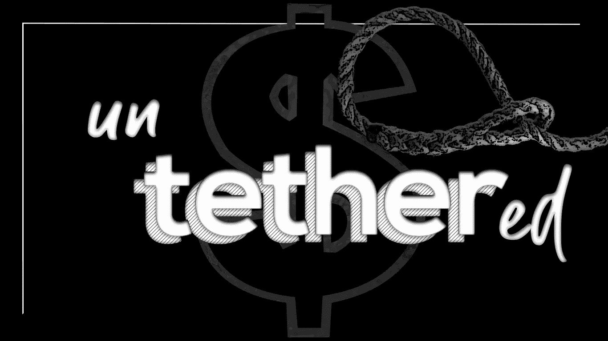

# 捆绑和拴系:稳定的未来

> 原文：<https://medium.datadriveninvestor.com/trussed-and-tethered-the-future-of-stablecoins-2d923334ca64?source=collection_archive---------24----------------------->

The truth behind the **stablecoin**

木槌已经摆动；Bitfinex 在唱它的垂死挣扎。Tether 的潜在骗局，在 8 月份引人注目地被提及，已经慢慢地完全渗透到个人密码交易员和金融观众的生活中，并积累了足够的点击量，以至于被认为处于破产的威胁之下。

首先也是最重要的:什么是系绳？

根据 Bitfinex 的说法，Tether 是一种使用 Omni 层(用于产生该资产平台的软件层)构建的数字货币，位于比特币和以太坊区块链之上。每个系绳应该由 1 美元支持，在系绳有限公司的储备中持有:根据其尊敬的创造者，1 USD₮总是相当于 1 美元。Bitfinex 的用户可以像 USD₮一样将资金撤回到他们各自的比特币和以太坊地址，将他们的收益转化为“1 比 1 支持的稳定货币”。

Tether 最初的通用目标是创造一种“数字美元”:一种吸收美元价值的加密货币，以及稳定货币所具有的所有优势:波动性降低、易于转移。一个可持续的、有利可图的生态系统本可以维持下去。将一种加密货币与一种国有化的法定货币的价格“捆绑”在一起，这是一个相当合乎逻辑的提议:为 Bitfinex 等非法定交易所提供某种程度的流动性，并让交易员在动荡的加密市场中获得一定的稳定性。Tether 是(或打算是)一种具有优势的加密货币；一种与最可靠的法定储备货币——美元——挂钩的加密货币，由泰瑟基金会(Tether foundation)进行定期审计的承诺提供支持。它充当免费通行证；授予缺乏这种特权的交易所法定交易能力，即 Bitfinex、币安和北海巨妖，它们都是公认的系绳采用者。

**谁是负责人？**

在一个什么是去中心化的空间里，这是一个令人惊讶的问题——但却是一个必要的问题。可以预见的是，Tether Ltd .负责这一操作的机制:他们接受 fiat 的存款，他们各自的提款，并根据需求创建和销毁 Tether。他们保管支持系绳令牌的法定储备(最值得注意的是，波多黎各 Noble 银行——或不那么 Noble——最近报告了价格波动),促进系绳与第三方的集成，以及管理促进系绳的存储和转移的主要平台。越来越多的责任危险地仅仅授予了少数几个精选的人。

听起来很熟悉？向过于集中的系统的潜在危险转向？

## 1:1 钉住？它是由塑料制成的。

Tether 的合法性正处于边缘，被围绕其与 Bitfinex 的动荡关系流传的无数谣言所咀嚼；它声称拥有美元储备，而这种储备可能会变得不存在。当一项资产以过高的溢价交易时——正如比特币上周在 Bitfinex 上飙升至 7778 美元那样——怀疑的种子理所当然地被播下了。Tether 和 Bitfinex 是潜在的非法伙伴——双方都暗中迎合对方的需求。

## 新的证据出现了

Tether 还保留着它声称拥有的美元储备吗？巴哈马中央银行发布的报告显示，Tether 有限公司可能从未将资金存入该国。这些发现可能表明，Tether 可能在其他地方拥有储备:或者，储备可能不存在。无论哪种情况，对加密货币市场来说，结果都可能是灾难性的。

## 我们真的需要稳定的硬币吗？

稳定币的存在——它们持续存在的使命——驳斥了加密货币的核心支柱，该支柱是在比特币声名狼藉的 2008 年诞生时建立的。一种法定货币支持的稳定币将会给这个行业带来一定的稳定性——如果稳定性和可获得性是这个行业唯一的问题，那么稳定币将会是一个完美的解决方案。稳定币的必要性实际上取决于比特币在未来的用途:作为交易机制、交换媒介还是价值储存手段。

## 最合法的菲亚特支持的稳定资本

当一个咬下数字子弹，另一个很容易取代它的位置。我们有无数稳定的货币在市场上浮动，都试图完成不同的事情，从热情洋溢的“如何建立最好的加密货币”教条中划掉不同的项目，这是一个被划掉的，墨水飞溅的列表。

解决稳定币难题有多种方法。戴通过算法与美元挂钩，还有各种稳定货币——USDT、帕克斯、GUSD、TUSD 和 USDC——都提供 1:1 的汇率。

**Digix** : Digix 从字面上理解了区块链金本位的概念，承诺每个 DGX 代币代表藏在新加坡金库里的一克真正的纯金(我们希望如此)。与直接购买黄金或购买期权合约相比，这是一个更有效的过程吗？现在下结论可能还为时过早——然而，该机制本身就有潜力，其核心是一个坚定的逻辑过程。一旦基本的出处证明协议确认金库中有相应盎司的黄金，就铸造 Digix 令牌。自上市以来，价格波动幅度在 25%以内，这是一个表面稳定的指标。

**戴**:由**马克尔道**创造的一种分散的稳定货币，以 1 比 1 的比率与美元挂钩。要创建 Dai 代币，潜在用户必须购买以太坊代币，并下注等值的美元。随着戴价格的上涨，用户将被激励去创造更多。随着价格下跌，用户会反其道而行之，将自己的资产卖回池中。

Digix 采取了不同的方法，将其 DGX 代币的价值与 1 克黄金挂钩:它将代币兑换成存放在金库中的实物金条。赎回必须亲自进行，主要是为了安全，但也是因为国际安全运输黄金的高成本。Digix 开发了一种有趣的方法来跟踪其在交易所的金条。每一根金条都被仔细扫描到系统中，收据信息被清晰地附上并组织好，然后与待售的代币相关联。也就是说，本质上，当你交易或持有 DGX 代币时，你就持有黄金的所有权证书。有一个最低赎回要求，但这种代币仍然可以在交易策略中发挥关键作用。

我们将在以后的帖子中描绘出马可道和戴的未来路线。请继续关注令牌组学的下一期文章及其众多发展。