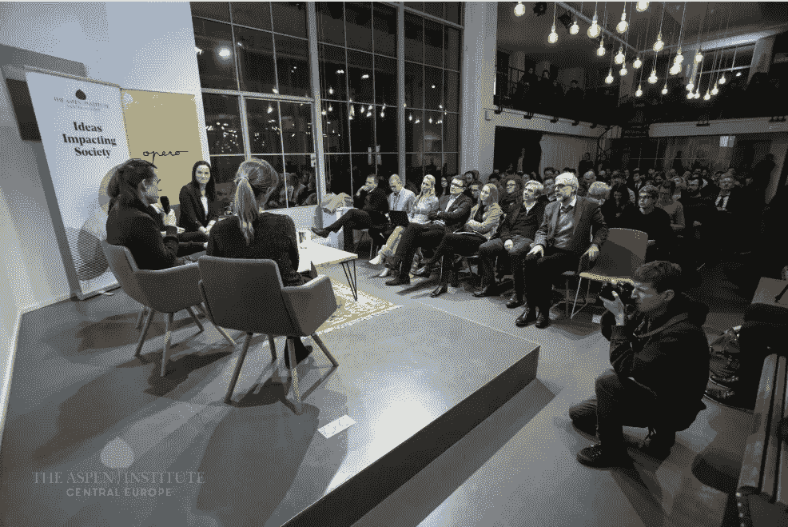
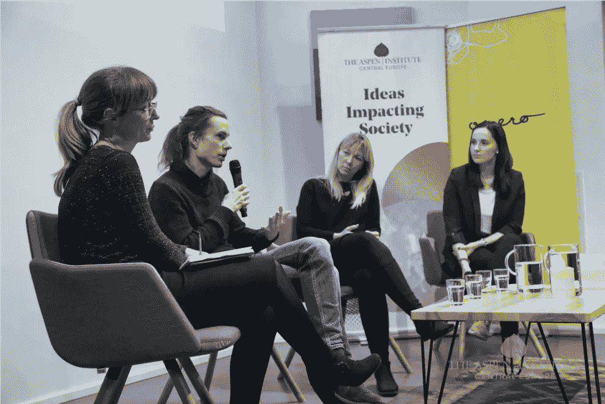
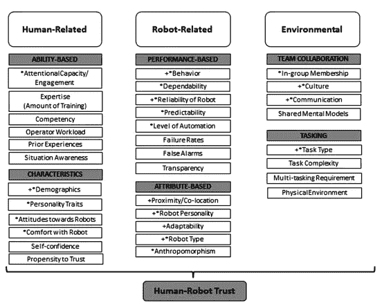
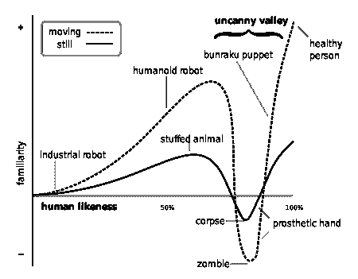

# 对机器和人工智能的信任

> 原文：<https://medium.datadriveninvestor.com/trust-in-machines-and-ai-1010828fa5e7?source=collection_archive---------11----------------------->

感谢支持科学的慈善基金 Neuron，我很荣幸主持了阿斯彭研究所关于人工智能带来的机遇和挑战的 ***公开辩论。*** *当晚的目标是进行知情讨论，这是我们在这个时代迫切需要的，在人工智能的社会影响等多层面话题中尤为重要的。*

Photo credit: Opero, Aspen Institute

通过邀请三位专家嘉宾，从技术、法律和社会角度提供他们的意见，确保了讨论的平衡。

脸书的研究科学家 Tomámiko lov 代表了技术观点，他的长期研究目标是开发能够学习并使用自然语言与人交流的智能机器。托马斯在人工智能研究的重要主题和倡议上投入了相当多的时间和精力——比如 GoodAI 的[通用人工智能挑战赛](https://www.general-ai-challenge.org/)，我很高兴成为 org 团队的一员。我完全同意他在这个话题上的立场—

> **机器学习往往会放大现有的偏见，数学模型中没有种族主义或意识形态，只有人类才有**。正如任何足够复杂的技术一样，没有人能保证 ML 和 AI 只会被用于好的方面，但是通过理解这项技术是如何工作的，我们可以向前迈进。

**Cornelia Kutterer** ，**欧盟政府事务高级主管@微软**，展示了一些最先进的人工智能实现“永久”的鼓舞人心的例子。视觉人工智能研究项目利用人工智能的力量为盲人和弱视群体描述人、文本、货币、颜色和物体。然而，关于人工智能领域的监管和责任问题，她证实，我们可能不会有像[阿西莫夫的机器人三定律](https://www.auburn.edu/~vestmon/robotics.html)那样普遍和简单的东西——需要一个**更复杂的结构，它不太可能从当前的立法**演变而来。

至于三大法则——如果你仍然认为它们是避免世界末日的现成药方，试着想想乔治·德沃斯基说的话

Photo credit: Opero, Aspen Institute

Kozminski 大学助理教授、麻省理工学院集体智能中心研究员 Aleksandra Przegalińska 为小组成员就信任问题进行更具哲学意义的讨论奠定了基础。你如何定义**信任**？我们真的能相信自己或他人吗？

**在人类和人工智能的情况下，我们谈论的是同样的信任吗？一个简单的答案和我个人的看法是:不**在自动化领域，Gregor 和 Madsen (2000)将信任视为*“用户对人工智能决策辅助工具的建议、行动和决策的信任程度，并愿意根据这些建议、行动和决策采取行动的程度”*，这是我更愿意坚持的定义。

在详细阐述这个主题时，Alexandra 提出了信任的三个维度:能力/专业知识、隐私/安全和拟人化。**能力/专业知识维度似乎是最表面的**:它将专业知识和可测量的效率作为与可信度相关的一个因素，主要基于用户对系统专业知识的感知。例如，聊天机器人的专业知识被认为会影响用户的信任——我相信这是我们在运行良好的系统中已经达到的信任水平。

然后**，考虑到商业智能虚拟助手(IVA)中存在的漏洞和隐私威胁的规模，隐私和安全就更加难以解决。**

拟人是一个有趣的现象。根据 Alexandra 的研究，已经发现用户认为聊天机器人具有类似人类的个性，因此她认为可以假设拟人化可能会影响对聊天机器人的信任。

(这个概念实际上吸引了我，我鼓励你深入研究最初的研究:[彼得·A·汉考克(Peter A . Hancock)](https://pdfs.semanticscholar.org/825d/a8b02ae885404bab1924dcdafa9958a83e9b.pdf)对影响人机交互信任因素的元分析)

Factors of trust development in human-robot interaction. These factors were identified a priori via literature review and subject matter expert guidance. Factors included in the correlational analysis are starred (*). Factors included in the experimental analysis are crossed (+): A Meta-Analysis of Factors Affecting Trust in Human-Robot Interaction Peter A. Hancock

这与**恐怖谷**的理论产生了共鸣(下图中的“谷”是“负面情绪反应的区域”)。它表明，进化中的我们人类倾向于避免和排斥任何在我们看来不健康的东西——偶尔被用来解释为什么机器人或具有某些人类特征的虚拟角色会引发这种精神不安。此外，有人提出，山谷效应引发了对死亡的天生恐惧，“因为它们(机器人)似乎经常像没有生命的木偶一样移动，提醒我们自己的死亡”。

*Image:* [*Wikipedia/Smurrayinchester*](https://en.wikipedia.org/wiki/Uncanny_valley#/media/File:Mori_Uncanny_Valley.svg) *via* [*CC by SA 3.0*](http://creativecommons.org/licenses/by-sa/3.0/)

也许这将是友好的自我意识智能机器的罕见正面例子的原因之一，也是流行文化和小说中提出的人工智能的主要负面结果的原因之一。

## 你呢，读者？你认为智能机器对人类的行为可能比人类对彼此的行为更糟糕吗？

## 来自 DDI 的相关故事:

 [## 成为数据科学家所需的 8 项技能——数据驱动型投资者

### 数字吓不倒你？没有什么比一张漂亮的 excel 表更令人满意的了？你会说几种语言…

www.datadriveninvestor.com](https://www.datadriveninvestor.com/2019/02/07/8-skills-you-need-to-become-a-data-scientist/)  [## 用 7 个步骤解释深度学习——数据驱动投资者

### 在深度学习的帮助下，自动驾驶汽车、Alexa、医学成像-小工具正在我们周围变得超级智能…

www.datadriveninvestor.com](https://www.datadriveninvestor.com/2019/01/23/deep-learning-explained-in-7-steps/)