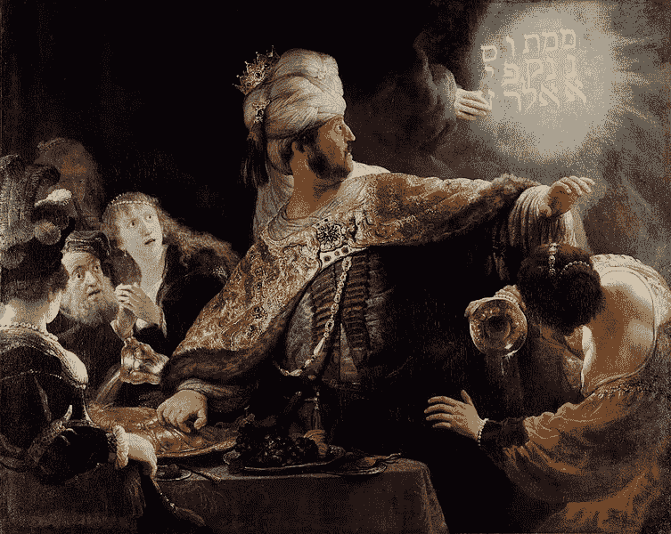
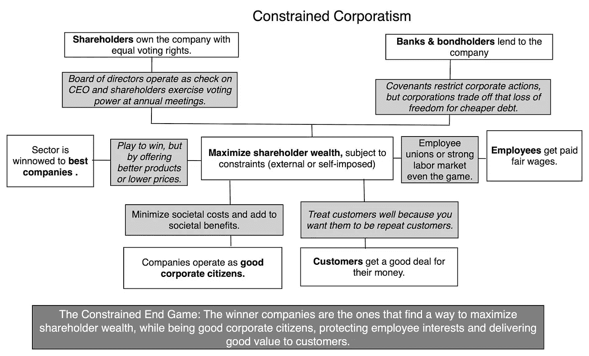

# 股东时代的信任

> 原文：<https://medium.datadriveninvestor.com/trust-in-the-age-of-the-shareholder-343db120a227?source=collection_archive---------10----------------------->

*本帖原载于* [*创意图库*](https://the-idea-gallery.com/blog/trust-in-the-age-of-the-shareholder) *。*

Wikimedia Commons: Belshazzar’s feast oil on canvas 167,6 x 209,2 cm signed c.r.: Rembrand.

一群穿着三件套细条纹西装的秃顶老人围着一张红木桌子坐着，桌子中间放着黄铜“正义天平”。坐在桌子一头的人身后的墙上挂着一幅 72 英寸乘 108 英寸的罗伯特·伯梅林的油画《20 美元钞票》。

“阿伦敦工厂又落后了，阿伯纳西先生，”马丁·威瑞迪安用大胆而雄心勃勃的语气说道。42 岁的维里迪安是作战部主任，他希望有一天能接替阿伯纳西，因为他认为阿伯纳西既可怕又无能。“工人们已经连续第七周加班了。他们很疲劳，我想建议改变轮班配置，这样他们就可以恢复精神。通过雇用另一个班次，我们将增加工厂的劳动力成本，但我们将提高安全性和质量。”

 [## 为什么包容性财富指数比 GDP 更能衡量社会进步？|数据驱动…

### 你不需要成为一个经济奇才或金融大师就能知道 GDP 的定义。即使你从未拿过 ECON 奖…

www.datadriveninvestor.com](https://www.datadriveninvestor.com/2019/03/08/why-inclusive-wealth-index-is-a-better-measure-of-societal-progress-than-gdp/) 

阿伯纳西奇怪的结合了锐利的、鸟一样的特征和年老的虚弱，使他有一个大的食道和一个不讨人喜欢的“四重下巴”,这是 Veridian 和他的同龄人经常暗中责备他的地方。阿伯纳西像一个肥胖的稻草人一样蹒跚前行，从他的黄铜阅读眼镜上方怒目而视，打趣道，“艾伦镇下一季度的利润会是多少？”

管理团队将阿伯纳西视为他曾经的躯壳。Veridian 知道 Abernathy 的受欢迎程度因行业竞争而下降。其他公司在创新，而阿伯纳西麻木地专注于生存。该公司杠杆率过高，唯一可用的股权融资来自鲨鱼。Abernathy 在十年前让公司上市，但这次看起来老了 30 岁。过去三年，随着股息枯竭，华尔街向他施压，要么刺激增长，要么进行重组，股价稳步下跌。

Abernathy 在寻找方法来解开隐藏的增长和 Veridian 知道星星排列得到他的方式。这似乎是一个显而易见的权衡:牺牲已经被华尔街视为平淡无奇的收益，以换取长期增长。尽管他现在有优势，但他讨厌像政治家一样思考。他非常关心艾伦镇员工的福祉，希望公司能够生存下去。此外，他还有未来晋升的额外激励。

Veridian 允许短暂的停顿，以避免看起来绝望。“实际上，我们认为我们可以提高工厂的生产能力，这将在 18 个月内将我们每天的贡献利润提高 25%。不过，下一季度我们的利润率会下降。该工厂将生产更多、更安全的产品，产品召回的风险也将更小，但我们将在一段时间内失去一些盈利能力。”

Veridian 知道 Abernathy 对他有很高的评价，几乎总是听从他的建议。令他惊讶的是，Veridian 的谨慎做法遭到了怀疑的目光。阿伯纳西镇定下来，平静地说:“我 1:30 要和银行见面。我们正处于违背盟约的边缘。我不能拿整个公司冒险。各位，我很抱歉，因为我得去参加一个电话会议。会议休会。”

Veridian 震惊了。他知道银行的情况，但是阿伦敦的工人们如果得不到一些救济，就会像树枝一样折断。一个错误可能会让某人失去一条腿，或者更糟，伤害数百万最终用户。Veridian 试图赶走对他耳语的自私的声音:*如果 Allentown 失败了，你将永远不会成为 CEO，你将不得不在其他地方重新开始。*

*二十年后*

马丁·威瑞迪安站在他新办公室的落地窗前，俯瞰着匹兹堡市中心的 PNC 公园。灰白的头发是年龄的迷人伴随物，有助于 Veridian 的行政外观。他相当英俊，但看起来总是有点太年轻。他太忙了，没有时间认真锻炼，但饮食健康，经常跑步，这让他看起来很苗条，下巴线条也很有力。明亮的 LED 灯泡充分照亮了玻璃鱼缸风格的办公室，周围是一片开阔的工作空间。灯光赋予这个地方与 Veridian 风格相称的能量——明亮、热情、干净。他在思考两点钟时《财富》杂志的采访。

十年前在 Allentown 工厂的召回是发生在他身上最好的事情，但 Veridian 绝不会对记者说这种话。他和几个同事在公司破产时雇佣了一家投资银行，并领导了管理层收购。

Veridian 的第一个命令是关闭 Allentown 工厂，这起初是一个不受欢迎的举动。该公司现金大量流失，关闭使他们几乎立即再次盈利。《纽约时报》刊登了一篇关于该公司的文章，暗示其新的私募股权所有者将“让它背负债务，用现金充实自己，让公司喘着气。”Veridian 希望他们不会这样做；他把他们带进来是为了拯救他自己的事业和公司。

他专注于他能控制的东西。他为阿伦敦的工人设立了一个项目，以获得遣散费，并与阿伦敦的社区领袖协调，帮助工人找到新职业的培训机会。对于那些感兴趣的人，他把他们转移到公司在全国的其他四个工厂。

在他担任首席执行官的第二年，他通过合资企业将公司与两家颠覆性的初创公司结合起来，恰当地引导公司度过了黑暗时代。当然，他们放弃了价值，但事实证明这是经过精心计算的。合资企业让公司能够驾驭技术创新的浪潮，而不是被淹没。这引起了该公司大多数长期雇员的愤怒，他们中的许多人拥有使合资企业运转所需的技术洞察力。其中一名工作了 26 年的员工给 Veridian 写了一封电子邮件，表达了他对“那些认为企业靠康普茶和桌上足球经营的年轻、精明的硅谷潮人”的鄙视。

他尽力管理好遗产和当代股东。他发起了一项名为“我们如何制造”的社交媒体活动，展示了该公司其他现代化、安全、符合人体工程学的制造设施。这些视频是由艾伦镇的一名前雇员讲述的，他现在是布法罗的值班经理。最后，他聘请了一家创意公司来改造公司的包装，将真实员工的照片贴在带有二维码的标签上，这些二维码可以追溯产品的起源。该公司的座右铭是“自 1902 年以来总是最好的”，但 Veridian 将其改为“它需要一个村庄”，指出该公司帮助振兴的旧工业城市的城市环境。

当《财富》记者走进房间时，Veridian 带着热情自信的微笑走向她。他知道客户、股东和媒体对公司的信任得到了恢复。他也知道，一句不合时宜的话就可能毁掉一切。

亲爱的主啊，让我成为一个真正的信徒

我们有一种危险的倾向，将他人讽刺为极端的化身。很容易想象以清晰和洞察力(以及像马丁·维里迪安那样强健的下巴)主持微妙的环境。在选择有限、条件苛刻的情况下，将恶意甚至无能归咎于他人，可不是一件小事。不管怎样，在阶级、股东和股东的时代，我们都是逍遥法外的重罪犯。

这个故事是对我在过去 10 年中工作过的几十家公司的事件的虚构概括。重点是提供一个错误的二分法。所有的读者都渴望成为 Veridian，而不是 Abernathy。类似于 Veridian 所采用的策略随处可见。问题是阿伯内西是否太愚蠢而没有实施它们，或者他是否受到环境的限制。当然，Veridian 显然是一个熟练的经营者、营销者和政治家，但我们永远不会知道他如何通过 Abernathy 的情况来管理公司。

在 Abernathy 的案例中，公司没能跟上创新竞争的步伐。其结果是，该业务的盈利能力下滑，这影响了贷款人和股东。为了取悦他们，Abernathy 试图最大化 Allentown 工厂的效率，这导致了召回。或许他应该听听 Veridian 的，但如果他这么做了，并违反了银行契约，整个公司可能就都完了。此外，他之前的经验告诉他，改变轮班配置和在一家工厂雇用几十名新工人可能会有风险。

当威瑞迪安接手后，历史被抹去了。他有了新股东，他们很乐意以低廉的价格收购这家公司。企业没有债务，阿伦敦工厂也关闭了。Abernathy 曾经在一个贸易展上被偷听到说他羡慕 Veridian 的处境。也许 Veridian 更好，或者也许两者之间唯一真正的二分法是环境。无论如何，Abernathy 和 Veridian 都认识到要取悦所有的利益相关者几乎是不可能的。

**股东与利益相关方**

商业圆桌会议，一个首席执行官游说团体，最近发布了一份名为[的关于公司目的的声明。以下是我对其信息的执行摘要:](https://opportunity.businessroundtable.org/ourcommitment/)

> “我们并不总是很好。我们现在真的很好。我们要善待顾客，给他们价值。我们会善待员工，给他们公平的报酬，给他们好的福利，给他们成长的机会。我们将对供应商友好和讲道德。我们将善待社区。我们要善待环境。从长远来看，我们会善待股东，这样我们就能进行创新，因为创新是好事。”

什么是好？对客户的价值是什么？什么是公平薪酬？有哪些成长的机会？供应商的道德待遇如何？什么是社区支持？什么是长期价值和短期价值？

请不要把我的讽刺误解为愤世嫉俗。商业圆桌会议包括像杰夫·贝索斯(亚马逊)和蒂姆·库克(苹果)这样的人，这些只是“A”这些人面临着我无法理解的压力。也就是说，不可能将这种缺乏具体性的宽泛“声明”视为政治辞令之外的任何东西。

如果你在大学或商学院上过金融课程，你一定听说过 NYU 大学教授阿斯瓦特·达莫达兰。他是金融界的万神殿之一，因为他在我们如何看待公司估值方面发挥了决定性作用。他有一篇关于这个主题的精彩博文，名为 [*从股东财富到利益相关者利益:CEO 投降还是空洞的空话*](http://aswathdamodaran.blogspot.com/2019/08/from-shareholder-wealth-to-stakeholder.html) 。

在这篇文章中，Damodaran 将利益相关者定义为投资者(也称为股东)、贷款人、竞争对手、员工、客户、供应商和整个社会。

他总结了社团主义的五个版本(我推荐这篇冗长的文章，因为他对每个版本都有深刻的见解):

1.  **残酷的社团主义**:在公司其他利益相关者的参与下，最大化投资者的财富。
2.  **裙带社团主义:**投资者财富最大化，政府官员与投资者一起受益。
3.  **管理合作主义**:将管理层的利益最大化，因为投资者未能实施强有力的治理。一般来说，管理层用“足够好”的薪酬“收买”了员工。一般来说，竞争力量要求其他公司处于类似的情况。达摩达兰说，这是二战后的真实情况。
4.  **受约束的社团主义:**在其他利益相关者(外部的或自我施加的)的相应约束下，使股东财富最大化。
5.  **迷茫的社团主义:**没有一方是主要富裕的，所以管理层不对任何人负责，最终没有人受益。

他说，虽然所有五种模式都存在，但美国主要采用受限的或混乱的社团主义。下面是一张他用来说明受限社团主义的引人注目的图表:

Credit: Aswath Damodaran

他认为混乱的社团主义可能是最糟糕的，并给出了他非常熟悉的研究型大学的例子:

> “美国的研究型大学是没有中心焦点的实体，为利益相关者群体服务，目标是不同的，这取决于你在什么时候和大学管理层的什么人谈话。最终结果不仅仅是经济效率低下的运营，无论收取多少学费都会出现赤字，而且每个利益相关群体都会感到委屈；学生们觉得他们支付了太多的学费，而对自己的教育却没有多少发言权，教师们认为他们的权利被一无是处的管理人员剥夺了，社区感到不被尊重和被欺骗了。如果你希望上市公司在经济效率或照顾利益相关者群体利益方面看起来像研究型大学，困惑的资本主义就是你的答案。”

在其他政府经营的实体中，邮局是一个未能确立任何利益相关者主导地位的例子，这导致各方普遍不满。

最后，他提出，受约束的资本主义和约束本身一样好。政府施加的限制可能会在一些利益相关者中产生短期满足，但可能会使美国公司在全球化竞争中处于不利地位。只要有人处于首要地位，自我施加的约束就能让利益相关者满意。股东愿意接受更少的经济利益来换取其他利益，比如雇佣更优秀人才的优势。

达摩达兰认为，市场驱动的约束是最好的。例如，在食品行业，消费者现在拒绝生产成本更低的加工食品，从而使食品公司股东获利。今天的食品公司必须利用资本主义的冲动来制造天然食品，否则他们将无法竞争。然而，这只能到此为止:这种市场约束是否会永久存在，将在下一次经济低迷时决定，届时人们将继续优先考虑健康而不是廉价食品(补充说明:这就是为什么我认为制造更便宜的天然食品是该行业最大的挑战)。正如本杰明·格拉哈姆所写，“从短期来看，市场是一台投票机，但从长期来看，它是一台称重机。”

**信任:终极市场力量**

沿着达摩达兰的约束资本主义，七月号的《哈佛商业评论》发表了一篇名为[信任危机](https://hbr.org/cover-story/2019/07/the-trust-crisis)的文章，其中学术和行政二人组桑德拉·苏彻和沙琳·古普塔(“S & G”)研究了这些约束的实质:信任。Sucher 和 Gupta 将信任定义为我们愿意变得脆弱并相信他人对我们有善意。公司通过向利益相关者做出承诺来建立信任。

许下承诺很容易。将这些承诺与不同的利益结合起来是困难的部分。S&G 是这样说的:

> “当然，在一个利益相关者群体中，期望值可能会有所不同，从而导致对公司需要达到的目标的模糊不清。投资者是一个典型的例子。一些人认为公司的唯一职责是实现股东回报最大化，而另一些人认为公司有义务通过采用良好的环境、社会和治理实践来创造积极的社会效应。

你站在哪一边？

S&G 是对的，除了他们忘了为细微差别敞开大门。事实是，大多数人在很多方面都是利益相关者。对于“你想要哪个？”微妙的答案是“是的。”我想要股东、社会、环境和政府的繁荣。

我们希望有一天退休，所以希望我们积累的财富能够增长，或者至少不会在股票市场上丢失。我们希望我们的孩子生活在一个有可呼吸空气的社会。我们希望其他人可以被信任，否则生意会很难做，机会也会枯竭。我们希望被边缘化的人可以通过这个系统变得富有。

**结论:变得具体**

S&G 提供了几个失去信任又重新赢得信任的公司的例子。展现人性的总是那些透明的人。多米诺比萨用他们以前糟糕的比萨变得受人喜爱。这位日本员工将一个空前的[毁灭性丑闻](https://en.wikipedia.org/wiki/Recruit_scandal)变成了一个创造透明文化和作为一家诚信公司脱颖而出的机会。

我同意达摩达兰的观点，受约束的资本主义是我们经济体系的操作系统；S&G 会说信任就是代码。约束是管理系统的法则。我们不反对物理世界中的约束。重力是重力，但是有了燃料和空气动力学，我们就能飞了。同样，约束可能代表粗糙的区域，通过信任可以使其变得平滑。

作为客户，我们可以在社交媒体上用我们的钱或时间投票。作为供应商，我们可以选择我们的客户。作为投资者，我们可以选择不受约束的[脆弱的](https://en.wikipedia.org/wiki/Antifragility)公司，或者至少是稳健的。我们可以帮助这些公司找出制约因素并解决它们。总的来说，所有利益相关者都能感同身受，并认识到，尽管我白天可能是供应商，但晚上我是消费者，周末可能是投资者。是的，有坏人，但是如果建立起信任，这个系统将会得到最好的服务。如果信任作为一种货币贬值，我们就有麻烦了。

也许本·格雷厄姆是对的。对于所有的叫嚣、行动主义和“目的声明”，谦逊和透明地维护信任是让系统运行的唯一途径。在接收端，我们用我们的时间、金钱和才能在短期内投票。从长远来看，我们的真实动机将被权衡，并以信托货币计价。愿我们不会被发现有所欠缺。

更多类似的文章和帖子，请查看我的博客，**。**