# 信任与隐私:浏览器之战

> 原文：<https://medium.datadriveninvestor.com/trust-privacy-battle-of-the-browsers-6e208b48b4b0?source=collection_archive---------9----------------------->

## 算法跟踪者，谷歌的广告公告，新的浏览竞争者，以及设计公平价值交换。

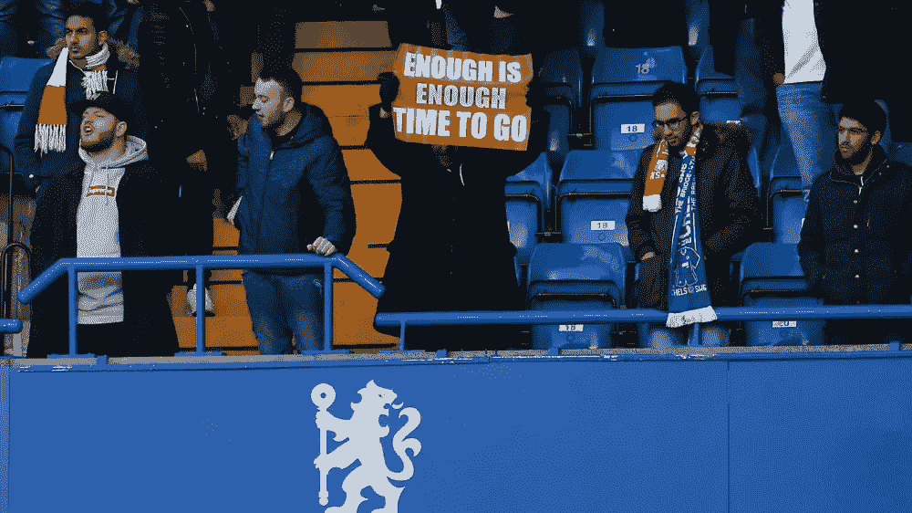

本周，谷歌有益地提醒世界，你实际上可以*选择退出*定向广告*。*然而，问题显而易见:

> 如果你关闭个性化，我们仍然会轰炸你，你对内容没有具体的控制权，任何与你相关的都是巧合。

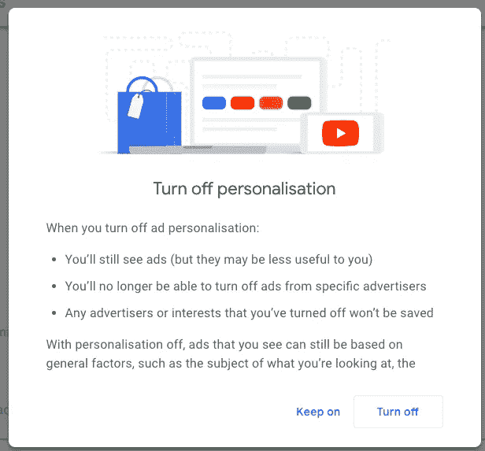

这个搜索引擎巨头接着告诉你，准确地看到有多少公司在互联网上使用算法跟踪你是多么容易。有趣的是，这份清单没有包含我所期待的任何东西。除了乐购和多米诺(此处不做评判)，总共有 115 家公司上榜，下面的选择甚至没有包括所有的 A:

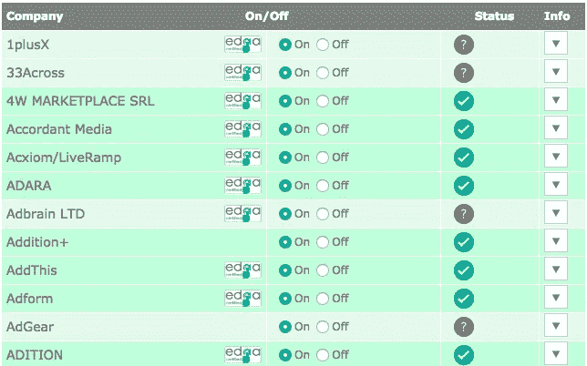

所以你不必，我去挖掘这些公司实际上做什么。答案几乎总是数据收集和分析。Vision DNA(就在列表的底部)甚至会直接将你带到一个“量化自我”测验模块，丰富机器中的幽灵已经收集的内容，毫无疑问，已经售出。

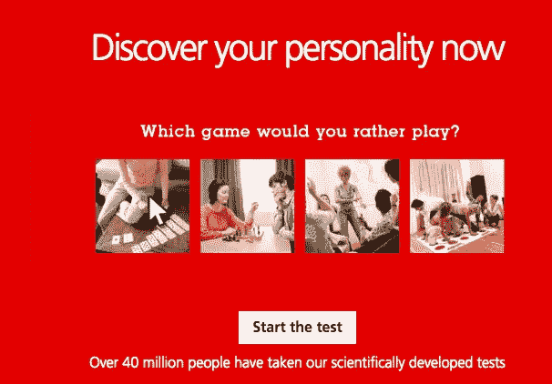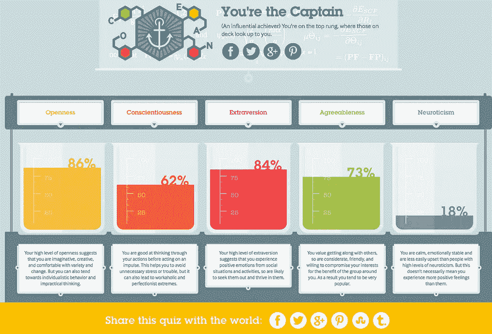

这个问题是显而易见的，你的普通投注者(包括我自己)完全不知道收集了多少关于他们的显性和隐性信息。手动将数据放入表单只是开始。一开始，可以通过每天清理饼干来管理，但按照便利经济的标准，这是劳动密集型的。

便利和隐私之间的冲突正在升温，消费者正在逃离无休止的广告轰炸。路易威登高跟鞋的咔哒声萦绕在他们的梦中，他们无论走到哪里都能看到特斯拉汽车。当他们在新的服务中寻求安慰时，浏览行业正在分裂，垄断正在被打破。

> “自由！正义！真相！价格合理的爱情！还有一个煮鸡蛋！”—中华人民共和国糖浆矿山路

那么在数据隐私革命的情况下，用户可以合理地期待什么呢？他们希望脸书记住他们的密码，他们希望一键支付，他们希望能够免费使用谷歌。当昏睡支配着他们的点播欲望，免费增值经济迫使品牌依赖广告收入时，哪些机制会让他们坚持安全性？在本文的其余部分，我们将看看消费者的方向，以及品牌如何保持领先地位。

**主要趋势:掌控你的数据(尽可能以最懒散的方式)。**

用户希望能够免费浏览，但他们不一定希望浏览器记住他们点击过的每一个广告，并将内容反馈给他们。那场化装舞会是几个月前的事了，从那以后，每一件僵尸麦当劳叔叔的服装都会让他们想起一个 6 岁的孩子能发出的尖叫。

对于消费者来说，最简单的选择是选择一个浏览器，或者培养浏览习惯，让他们重新掌控自己。广告拦截器是最简单的答案，除此之外还有新的浏览器，甚至微型服务器。目标很简单:不再有免费收集信息的 cookies，不再有边栏广告，不再有闪烁的横幅。作为一个品牌，了解消费者的习惯，支持他们保持控制，并发展平等的数据价值交换至关重要。

**消费者选项 1:广告拦截器**

广告拦截器是一个很好的东西，直到网站开始抓住并限制服务，如果插件是活跃的。然而，仍然有一些工作，我们最近开始使用 Ghostery 和分析仪表板是迷人的。您可以看到追踪器按类型分类，根据您共享数据的愿望阻止和解除阻止类别，并使用智能阻止来确保基本功能仍在运行。

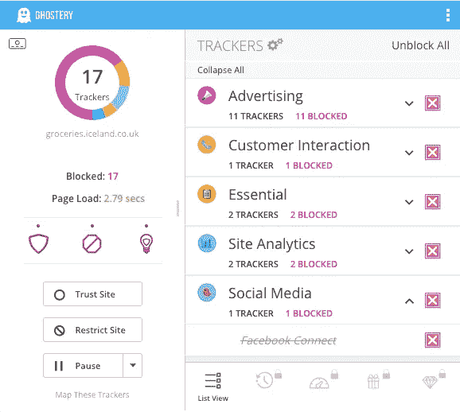

这种方法允许用户屏蔽插件检测到的追踪器，这在一定程度上缓解了无休止广告的困扰。然而，正如谷歌警告的那样，用户仍然会看到广告，只是不会看到与他们相关的广告。它也不一定会让个人对他们的数据拥有更积极的所有权，或控制其分布。

**消费者选择 2:新浏览器**

Cliqz 等被称为“谷歌回避机”的浏览器承诺给你在互联网上漫游的自由，而没有泄露私人数据的风险。用户不再只是屏蔽广告，他们正在积极采取措施控制自己的行为数据，不让第三方知道。

该浏览器可以单独下载，也可以作为附加组件安装在 Firefox 浏览器中。Mozilla(Firefox 的母公司)对 Cliqz 进行了战略投资，作为他们向用户提供有用建议的动力的一部分，而不是作为一个被动的搜索引擎。

Mozilla 对待隐私的方式得到了广泛的认可。他们在发布前宣布所有的测试，使用*不要惊讶*作为他们的 5 个数据隐私原则之一。就 Cliqz 而言，他们[宣布](https://blog.mozilla.org/press-uk/2017/10/06/testing-cliqz-in-firefox/)在德国只有不到 1%的用户会看到开箱即用的插件。

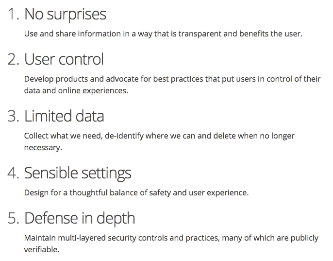

他们还指出，“Cliqz 不会为个人用户建立浏览档案，一旦收集到数据，就会丢弃用户的 IP 地址。Cliqz 的[代码](https://github.com/cliqz-oss/browser-core/blob/master/modules/human-web/sources/human-web.es)可供公众查阅，关于这些技术的描述可以在[这里](https://gist.github.com/solso/423a1104a9e3c1e3b8d7c9ca14e885e5)找到用户还可以完全禁用或删除附加组件。他们被告知并控制着。这种透明度是在测试和优化中建立消费者信任的关键。

**消费者选择 3:数据货币化**

更进一步，用户不仅可以控制品牌可以看到的信息，还可以积极参与价值交换，从而参与到数据货币化的基础层面。我希望在这个领域看到一些竞争者，但现在[Brave.com](https://brave.com/)是一个很好的例子:

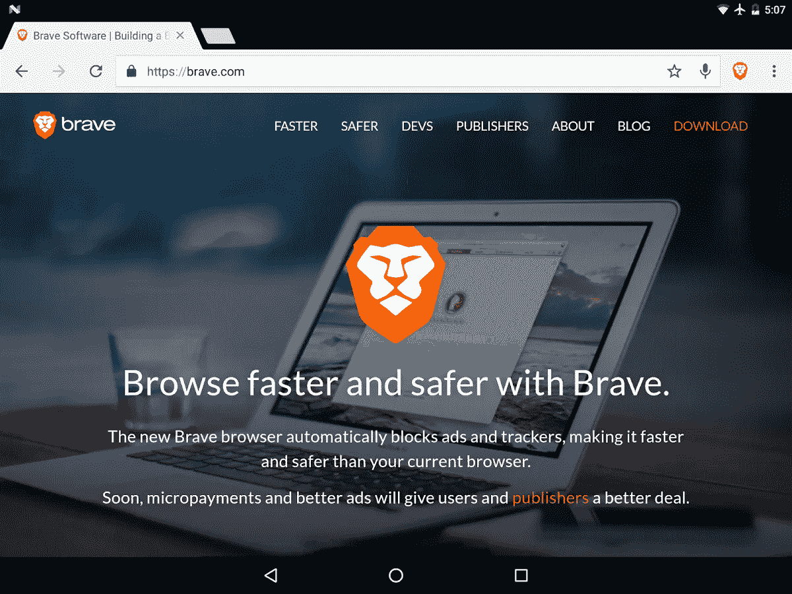

它的运作方式是消除广告和追踪器，加快浏览速度，保持体验不受干扰。但是它是如何工作的呢？这当然不是利他主义，尽管它完全可以免费使用，也不依赖广告收入。他们正在通过引入一种新的加密货币——基本注意力令牌(BAT)来改变这种模式。

英美烟草允许品牌向消费者付费，让他们用加密钱包里的代币做广告。想要参与并向品牌出售数据的用户可以这样做，如果他们想保持流畅，也没问题。一如既往，选择才是最重要的。

**品牌有哪些选择？**

如果你，作为一个品牌，还没有与你的顾客进行战略性的、深思熟虑的和同等价值的交流，那么你需要好好把握并对你的战略进行一次深入的回顾。首先，GDPR 正迫使品牌关注每一份数据的价值，并根据为客户创造的价值来证明持有这些数据的理由。除此之外，大玩家改变游戏还有一个原因，这完全是客户驱动的。

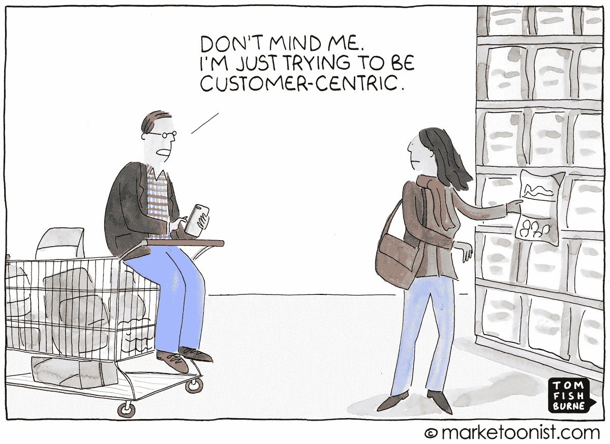

谷歌的举动(还记得吗？)的设计符合更好广告联盟制定的标准。该联盟进行的研究是全面的，以消费者为中心。它涉及 25，000 多个人，并确定了与用户安装广告拦截器的倾向最密切相关的广告类型。低于消费者可接受性阈值的例子包括如下:

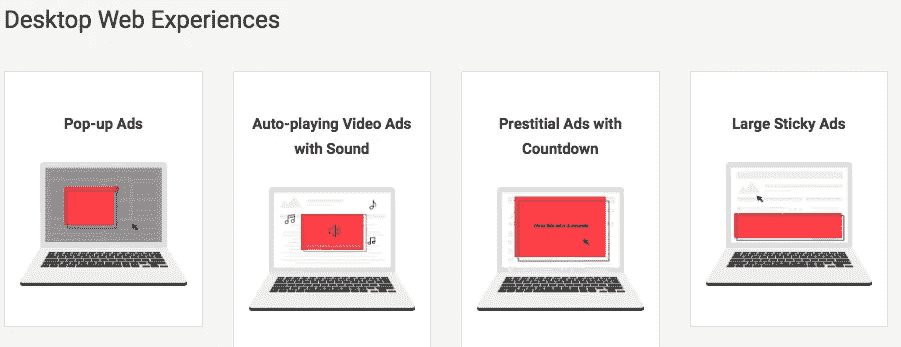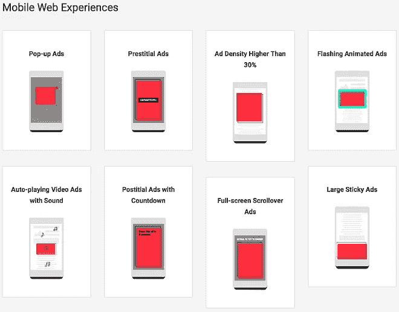

我们的建议是像谷歌和 Mozilla 一样，跟上潮流，否则将面临可用客户数据的长期低迷。如果你建立数据收集机制的方式能够为你的客户带来价值，并与他们保持开放的对话以建立信任，他们就不太可能阻止你进入他们的生活。

如果你想了解更多，欢迎来到英国 Adeptiv 与我们交流。我们是伦敦的一家数据驱动的对话机构，专门帮助客户获得、保持和发展大规模的客户关系。

*原载于* [*DMA*](https://dma.org.uk/article/trust-privacy-battle-of-the-browsers) *。*