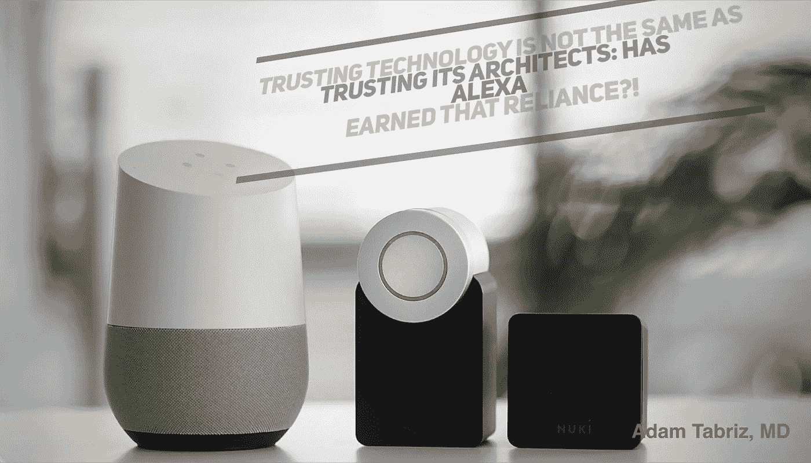

# 信任技术并不等同于信任它的设计师:Alexa 赢得了这种信任吗？！

> 原文：<https://medium.datadriveninvestor.com/trusting-technology-is-not-the-same-as-trusting-its-architects-has-alexa-earned-that-reliance-91129fa44303?source=collection_archive---------4----------------------->

Alexa

最近新闻媒体报道的最引人注目的标题之一是科技行业与政府的国家卫生系统的合作。最近，英国广播公司( [BBC 新闻](https://www.bbc.com/news/health-48925345))宣布，亚马逊 Alexa 将很快通过与英国国家卫生系统(NHS)的合作为消费者提供医疗建议。政府举措与私人实体的全面整合是英国政府迈出的可喜一步。这场激进运动遭到了公众的强烈批评。

违反健康信息隐私和健康保险便携性和责任法案(HIPAA)的想法是主要关注的问题之一。然而，政府采取如此激烈措施的理由是，政府希望通过整合亚马逊的人工智能技术，Alexa 将减轻人类负担，从而提高效率，降低医疗成本。该措施的反对者担心其潜在的安全和隐私缺陷。

 [## 医疗保健的未来正在被一场大型技术入侵所塑造|数据驱动型投资者

### 过去十年，全球经济的所有部门都经历了大规模的数字颠覆，而卫生部门现在…

www.datadriveninvestor.com](https://www.datadriveninvestor.com/2018/11/02/the-future-of-healthcare-is-being-shaped-by-a-big-tech-invasion/) 

关于大数据行业在医疗领域的技术呈指数级涌现的论文也是一个多维关注的主题。这些问题如果不尽快解决，可能会带来不可逆转的后果。有些问题与数据存储和拥有、所用算法的质量和有效性以及信息安全和 HIPAA 合规性有关。

事实上，公众在谈论‪concerns 健康信息时最常用的术语之一就是 HIPAA。我们经常看到人们在与健康信息安全和隐私无关的事情上互换使用它。为了针对有效的信息安全问题制定正确的解决方案，我们必须让每个用户了解个人信息安全、健康信息安全、隐私、数据和 HIPAA 合规性之间的区别。

 [## 大笔资金和尖端技术:人工智能/人工智能投资将如何革新医疗保健…

### 在过去几年人工智能(AI)和机器学习(ML)的显著发展中…

www.datadriveninvestor.com](https://www.datadriveninvestor.com/2018/03/22/big-money-and-cutting-edge-technology-how-investment-in-ai-ml-will-revolutionize-the-healthcare-industry/) 

从技术角度来说，任何信息，无论其性质、用途和内容如何，都被认为是数据，或者具体来说是“元数据”构成数据(在大规模大数据中)的内容是由这些元数据的域定义的。例如，健康信息表示在医疗保健领域中生成、使用和分析的数据的摘要。同样适用于个人信息等等。当然，我们可能会经历大数据的融合，因为健康信息也被视为隐私，反之亦然。

定义数据类型的准确定义的概念是关键，因为它将有助于揭露其误解和漏洞背后的一些秘密，大多数公司利用这些误解和漏洞来使其访问私人和有价值的选择性信息的意图合法化。

数据是指在计算工作中被转换成虚拟基本(也称为原始数据)格式的信息。保护数据库中的数字数据免受破坏性力量和未经授权的实体或个人的不良行为，如网络攻击或数据泄露，统称为数据安全。个人信息是被视为敏感和机密的个人识别熵。后者的一个子类是健康信息，使用与个人病史相关的数据和个人信息，包括症状、诊断、程序和结果。

比尔·克林顿总统签署了《1996 年责任法案》( HIPAA ),该法案主要关注卫生信息流动的现代化。

HIPAA 规定了如何维护“个人身份信息”,防止医疗机构欺诈和盗窃，并解决了保险范围的限制。

当务之急是要认识到这些定义及其在法律体系中的地位，以及企业和大行业如何利用当前的报告找到回旋余地，在这样一个巨大增长但部分受监管的空间中航行。例如，不管传播的是什么；在当前的立法状态下，加强 HIPAA 规则将很少或没有对公司实体的监督，或限制对患者私人信息的访问，因为实体对原始数据感兴趣，根据当前的定义，他们可以访问原始数据，而不必违反 HIPAA 规则或在理论意义上披露“患者的身份”根据最初的裁决，隐瞒患者的个人身份信息，包括姓名、讨论或社会安全号码，足以防止随后对该患者进行描述。然而，在现代数字信息技术和复杂的算法下，IP 地址会使传统的识别信息的解封变得不必要和多余。简而言之，人工智能支持的系统可以提取个人信息，并通过连接网络空间的点将其与身份进行匹配。

由于 HIPAA 法案的通过最初是为了基于纸张的医疗记录和信息处理，因此它将无法覆盖其现代应用的范围，并且跟不上科学的发展。毫无疑问，大公司在大数据扩张和征服公民信息方面行动更快、更明智，立法者无法跟上信息安全政策的步伐。如果他们能从政治游戏中抽出时间，远离企业游说者，他们很可能会这么做。

# Alexa 会违反 HIPAA 吗？

简单明了的答案是肯定的！—但要进一步细化，需要回到我之前分享的关于数据和数据隐私的定义。最初实施时，HIPAA 的主要范围是防止不当使用患者隐私信息。但今天，患者的信息，如吸烟史，可以通过 Alexa 简单地点击鼠标或说出一句话，并与识别信息和 IP 地址匹配，随后与保险公司共享。不管合法与否，仅仅根据这个数字就可以影响个人的医疗保险费。

鉴于目前的技术进步，为了支持最佳的数据隐私，技术行业设计的算法比以往任何时候都更有必要透明。人们需要记住，加强专有算法的透明度将为更多与知识产权和专有法律相关的挑战打开大门。

误导公众和立法者，以及用于从中央数据库中提取公共信息各个方面的算法的便利性，保证了企业实体对政府实体的优势。

HIPAA 不会约束不被视为医疗保健实体且无权访问成熟患者身份或披露患者身份信息的科技公司。但它们确实间接侵犯了用户隐私，损害了患者的利益。因此，在当前的数据隐私丑闻中，这无异于双重标准。

# 你能相信技术吗？

换句话说，你能信任 Alexa 听你的对话，并与中央系统共享你的健康信息，从而在数学上能够进一步分析，分发和做旨在牟取暴利的行动吗？那些经常接触每日新闻的人一定注意到了医疗保健对这项技术的不信任。这种日益增长的态度与实际问题无关，因为技术只不过是一种复杂的工具。它通过其设计者的目标来发挥作用。在当前的社团主义趋势下，让技术创新者承担不信任的负担更合理。如果没有高层次的透明度和对其战术任务的责任，创新者倾向于通过制定任务策略来改变商业模式，只关注收入流的最大化。信任技术或技术官僚在千禧一代中有着巨大的吸引力。然而，在过去的几十年里，它在婴儿潮一代中遭受了巨大的反弹——一个可能的原因是期望、知识和政策之间的差异。

# 收紧法规

在没有适当的监管程序范围的情况下，增加监管和实施严厉的惩罚类似于通过守卫前门通道来保护房屋免遭盗窃，同时让罕见的门大开着让小偷进入房屋。这意味着更严格的监管并不等同于更好的规则。传统的 HIPAA 法规执行与防止数据盗版无关。

问题的本质不一定是监管不足或监管不力本身。在一个开放的竞争市场中，过度的监管是完全适得其反的。必须做的是堵住说客的漏洞和对侵犯病人主权的误解。对 HIPAA、信息和健康数据的错误解释分散了对实际问题的关注。

# 集权与分权为什么重要？

假设我们考虑一个对存储、维护和分析您的数据拥有完全控制权的行业，即使他们通过多层技术实现了最重要的安全性。在这种情况下，它将失败，以防止黑客获取信息。此外，存储数据的集中性质使其对黑客很有吸引力，就像在中央银行持有数百万美元一样。不管安全性如何，集中化仍然会成为数据黑客的一个硬停站。现在想象一下，将同样数量的数据分配给一千个合法所有者！对于黑客或公司来说，要访问相同数量的信息，他们必须通过个人所有者或用户来访问数据。不考虑安全级别的黑客攻击，分散的系统进行更少的诱导，因为它需要更多的努力。

# 通过政府运营技术实现集中化

在政府管理完全由其医疗保健和数据库控制的国家或系统中，只要政府采用并管理其技术，集中式系统可能是一种实用的选择，因为它将减少数据泄露和滥用。但如果同一个政府通过与私人盈利实体合作创造了一种混合模式，那么公众肯定会有很大的担忧。未经公民个人控制和同意而共享重要数据被视为剥夺个人权利。

将数据所有权交给主权所有者的分散系统是最有效的方法，尽管被认为是不完美的，但却是最可行的选择。它通过将潜在的数据收入价值转移给患者来增加个人价值。权力下放是一种工具，因为它激励患者通过保持健康增加收入，并为增强全球医疗保健做出贡献。

重要的是显示所有技术算法的透明度，并让利益相关者对违反某人设想他们的系统要做的事情或为替代目的而改变负责。通过让领域所有者参与到业务流程、验证和质量保证中来增强他们的能力是至关重要的，对于特定行业的功能需求来说也同样重要。在这个概念中，政府的义务是通过确保[正确遵守预先定义的战术方法](https://medium.com/datadriveninvestor/data-science-medicine-tactics-vs-strategy-the-commencement-of-unclaimed-domain-abdbe8f60195)来监督企业的商业战略及其偏差。

公众对技术的基础知识不足比技术不足更具破坏性，因为这就像操作一挺机枪而不学习如何使用它。的确，这就像搬起石头砸自己的脚。这就是我们今天在医疗信息安全和公众对数据科学的看法方面所面临的问题。数据安全和 HIPAA——责任在我们身上，因为企业实体只有一个使命，那就是牟取暴利，包括但不限于亚马逊的 Alexa 技术。