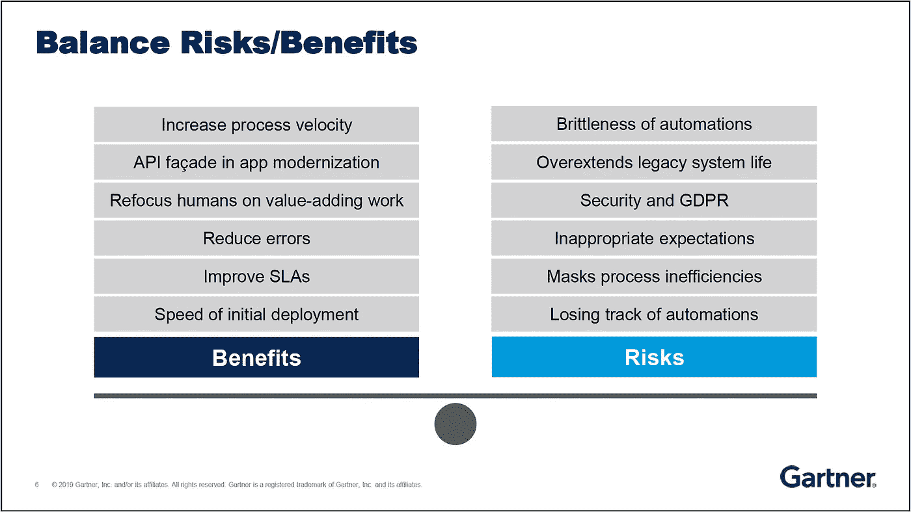

# 机器人过程自动化(RPA)的真相

> 原文：<https://medium.datadriveninvestor.com/truth-about-robot-process-automation-rpa-cf3de14068e1?source=collection_archive---------1----------------------->

Photo by [Franck V.](https://unsplash.com/@franckinjapan?utm_source=medium&utm_medium=referral) on [Unsplash](https://unsplash.com?utm_source=medium&utm_medium=referral)

自动化从未像今天这样重要。在[数字化转型](https://smatechnologies.com/blog/digital-transformation-overview)的时代，自动化已经无处不在。

*Gartner* 将[超自动化](https://www.gartner.com/smarterwithgartner/gartner-top-10-strategic-technology-trends-for-2020/)命名为 2020 年的头号战略技术趋势。在最近的[IT 未来报告](https://go.forrester.com/the-future-of-it)*中，Forrester* 将自动化确定为转变成功企业的五大趋势之一。

 [## 不管准备好了没有，革命就在我们面前|数据驱动的投资者

### “对于技术如何影响我们的生活和重塑经济，我们必须形成全面的全球共识……

www.datadriveninvestor.com](https://www.datadriveninvestor.com/2019/02/12/ready-or-not-the-revolution-is-upon-us/) 

> 机器人流程自动化(RPA)是一种数字化支持技术，主要利用用户界面和表面层功能的组合来创建脚本，以自动化日常、可预测的数据转录工作— Gartner

RPA 可以被描述为“虚拟工作人员”，最适合于组织希望帮助甚至取代手动工作人员的情况。机器人过程自动化产品可以通过“机器人”或“机器人程序”自动执行需要 GUI 交互的特定活动。比人类更快、更准确、更不知疲倦地执行重复性任务。

RPA 机器人有两种类型。有人值守的机器人，通常用于前台活动，嵌套在用户桌面上。人类员工与这些机器人并肩工作——自动化简单、重复的任务。另一方面，无人值守机器人不需要人类参与它们执行的过程，由特定事件提示，或预编程为在后台自动执行任务。

# 市场格局

RPA 是增长最快的软件细分市场，年增长率为 **60%** ,相比之下，其他细分市场为 15%。

三个最大的供应商显示年收入在 1 亿到 2 . 5 亿之间。然而，大部分市场由较小的供应商组成，每个供应商的收入不到 5000 万英镑。2019 年，RPA 软件市场超过 10 亿美元，仅服务市场就超过 4 倍，达到 40 亿美元。

> “到 2021 年， **40%** 的企业将会因为不恰当的孤岛使用和无法扩展而产生 **RPA 购买者懊悔**。”— Gartner

在排名前 10 的供应商中，有 9 家在过去 12 个月中改变了彼此的市场地位，而在此之前的 12 个月中也发生了同样的变化。这意味着这一领域的波动性很大。

去年，Deloitte 对 400 家全球公司的调查发现，63%的被调查组织没有满足 RPA 项目的交付期限。对于那些成功的项目，比预期时间更长的实施延迟了投资回报(ROI)。

> “我们正进入 RPA 的颠覆阶段。无法保证目前在这一领域中的供应商能够经受住这种破坏。”——Gartner

# 技术

RPA 起源于“图形用户界面自动化测试”,通过脚本语言记录的屏幕抓取技术和击键激活来模拟**人类做出的动作。**

Photo by [Markus Spiske](https://unsplash.com/@markusspiske?utm_source=medium&utm_medium=referral) on [Unsplash](https://unsplash.com?utm_source=medium&utm_medium=referral)

> RPA 和 QA 自动化框架，共同的根源——机器人充当激活特定击键的脚本——大约是 20 年前的技术。

B 爆炸性新闻——没有机器人。但是很好的营销，将技术定位为与人类同等。**由集成脚本**驱动，有时由好看的“工作流”设计器和屏幕记录器生成，“T10”机器人或**机器人**被**编程为**模仿或**模仿**选定的人类**任务**。

用于表面自动化的计算机视觉是这些产品中常见的人工智能**和**的自然形式。包括从文档中识别和提取文本的 [OCR](https://en.wikipedia.org/wiki/Optical_character_recognition) 和解释手写文本的 [ICR](https://en.wikipedia.org/wiki/Intelligent_character_recognition) 。

创新供应商利用**流程挖掘**概念，旨在发现用户手动和重复性任务，这些任务有可能利用 RPA 实现自动化。通过将这种能力作为产品模块或与专业的第三方合作。

# 成功的记录

通过将**有人值守的机器人集成到桌面**工作空间以自动化特定任务，组织创建了一个机器人和人类工作互补的环境**——自动执行重复、低价值的任务，并更快、更准确地完成工作。**

专注于用户界面不会经常改变的稳定的本地应用程序——SaaS 应用程序更有可能收到静默更新，从而导致随机自动化中断。

这些桌面 RPA 实施将员工解放出来，让他们专注于更复杂、更难自动化的高价值工作。当基于桌面的有人值守机器人被用作整体端到端案例自动化的一部分时，投资回报甚至更为显著——将****机器人流程自动化与** [**工作负载自动化平台**【WLA】](https://www.absyss.com)**相集成，释放出企业范围的自动化计划。****

# **故障场景**

**供应商和服务提供商兜售的故事，兜售 RPA 可以自动化任何事情，以转变每个业务的每个方面，设定了不切实际的期望。**

**当**组织将任务误认为流程**或低估自动化目标流程的**复杂性，以及完全集成和**自动化无人值守机器人**所需的**时间**时，问题就会出现。****

**无人值守的 RPA 可能成为另一个孤岛，即 IT 堆栈中另一组分散工作流和流程的互不关联的传统应用程序，即*影子自动化*。由于缺乏集中式规则管理、调度、编排和全局监控的优势，它们不可避免地成为复杂、孤立的后台批处理程序。**

**RPA 实际上是一个非常有针对性的工具，**功能强大** **在其上下文中**。如果使用得当，它可以成为战略转型计划中非常有用的工具。但是如果处理不当，它可能会延续遗留系统问题，并从长远来看对您的业务造成损害。RPA 不是自动化的通用解决方案。**

> **你本质上是在实施 **RPA** 的同时**建立** **技术债务**。在遗留系统上创建一个门面，而遗留系统又可能变得**不可维护**。**

**可能是针对没有 API 可用的**遗留系统的**临时**解决方案，在这种情况下，这是一种权宜之计——当然不是最适合无人值守自动化的方法，在无人值守自动化中，工作负载自动化平台更适合或补充其他场景。****

**API 契约是稳定的，与用户界面相反，用户界面会因破坏相关的自动化而发生变化。在没有更好的解决方案时引入 RPA，优先考虑应用程序现代化，以在您的数字化转型之旅中展示更多 API。**

****

> **RPA 必须是自动化工具链中的一个工具。考虑将**机器人流程自动化与工作量自动化和人工智能平台**相结合，以实现[超自动化](https://www.gartner.com/smarterwithgartner/gartner-top-10-strategic-technology-trends-for-2020/)。**

**为工作选择正确的工具是实现可持续数字化转型的关键。组织需要更好地了解 RPA 可以在哪里以及如何最好地增加价值，以及它的局限性，并相应地进行规划。**

**点击此处【https://www.absyss.com 了解更多关于 Visual TOM 工作负载自动化的信息**