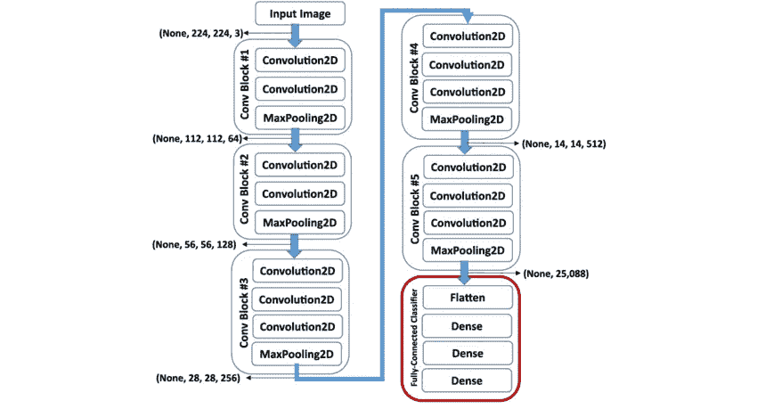

# 尝试现有的 CNN 模型:让我们用 Keras 构建 VGG16

> 原文：<https://medium.datadriveninvestor.com/try-already-existing-cnn-model-lets-building-vgg16-with-keras-8b1ce6839b5e?source=collection_archive---------3----------------------->

[](http://www.track.datadriveninvestor.com/1B9E)

source: [https://i.pinimg.com/originals/67/ae/c3/67aec3290117ba1536ca1ef0255a6aaf.jpg](https://i.pinimg.com/originals/67/ae/c3/67aec3290117ba1536ca1ef0255a6aaf.jpg)

为了用*卷积神经网络* (CNN)对 MNIST 数据集进行分类，我们只需要几层 CNN 就可以让它很好的预测。在我以前的博客中，我已经记录了它(建立 CNN 来分类 MNIST 数据集)[在这里](http://jonsharing.blogspot.com/2018/02/klasifikasi-mnist-menggunakan.html)(印度尼西亚语)。

MNIST 数据集只有二维(宽度和高度)，因为它们只是黑白图像。彩色图像有 3 个维度(宽度、高度和颜色通道),现实世界中物体的特征比手写更加复杂。额外的维度使得计算过程更重，复杂的特征要求我们向 CNN 模型添加层(更重的过程和更多的超参数要求我们设置它)。所有这些使得我们中的大多数人几乎不可能从零开始建立 CNN。

如今已经有几个 CNN 的模型公开发布了。这些模型有一个非常深的层，并使用高规格的计算机进行训练(其中最突出的是它们的 GPU 和 RAM)。我们将在此讨论的其中一种型号是 VGG16。VGG16 可以将你的图像分为 1000 种可能的类别。你可以在这里找到所有关于 T4 课程。



source: [https://www.researchgate.net/profile/Kasthurirangan_Gopalakrishnan/publication/319952138/figure/fig2/AS:613973590282251@1523394119133/A-schematic-of-the-VGG-16-Deep-Convolutional-Neural-Network-DCNN-architecture-trained.png](https://www.researchgate.net/profile/Kasthurirangan_Gopalakrishnan/publication/319952138/figure/fig2/AS:613973590282251@1523394119133/A-schematic-of-the-VGG-16-Deep-Convolutional-Neural-Network-DCNN-architecture-trained.png)

为了立即构建和使用它，我正在使用 keras + tensorflow。


source: [https://cdn-images-1.medium.com/max/1600/0*a6XSwHsfvz_oWSSJ.jpg](https://cdn-images-1.medium.com/max/1600/0*a6XSwHsfvz_oWSSJ.jpg)

加载 VGG 模型就是用这个

```
from keras.applications.vgg16 import VGG16#build model
mod = VGG16()
```

当您第一次运行这段代码时，您将首先被自动引导到**下载 VGG 模型的权重**(550 MB)。

要使用这个模型进行预测，您必须**将输入图像的宽度和高度**调整为 224 x 224。不要忘记将图像的数组从 8 位整数**转换为 64 位浮点**。

```
from PIL import Image as pil_imageimg = pil_image.open(imgdir+'/'+allimgname[i])
img = img.resize((224, 224))
dataimg = np.float64(np.array(img))
dataimg = np.reshape(dataimg,(1,224,224,3))
```

然后**改变数组中数字的比例**,使其适合 VGG 模型(某种符合 VGG 模型的标准化或规范化)

```
dataimg = preprocess_input(dataimg)
```

然后把它放到这个函数里

```
pred = mod.predict(dataimg)
#*update from mod.predict(dataallimg) to mod.predict(dataimg)
#thanks to [@rajuyadav7532](http://twitter.com/rajuyadav7532)
```

要使它输出分类的结果，添加以下内容

```
predlabel = decode_predictions(pred)
predlabel = predlabel[0][0]
print(predlabel[1]+" ("+str(predlabel[2]*100)+")")
```

仅此而已。我已经做了一个脚本，可以让你把所有你想要的图片分类到一个文件夹中。你可以在这里 git 克隆它[。只需阅读自述文件，您就可以开始了。脚本的运行结果将在 result.txt 文件中。](https://github.com/genomexyz/tryC)

这部作品和我在[前作](https://medium.com/datadriveninvestor/the-tool-that-will-help-you-build-training-sets-of-object-detection-algorithms-88e0fec4908)中想做的项目有关。另一个故事再见。