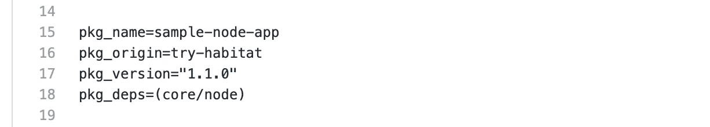
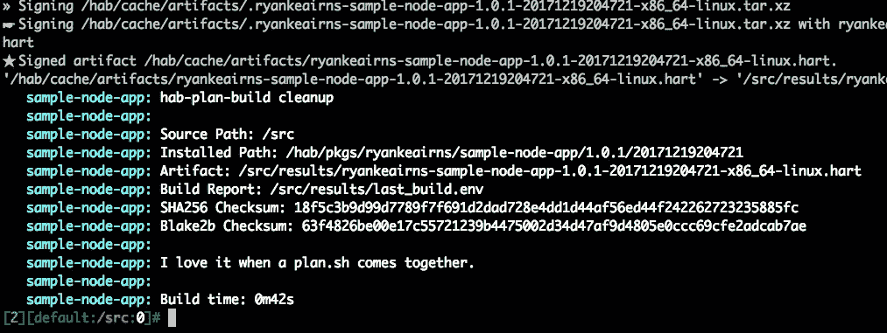
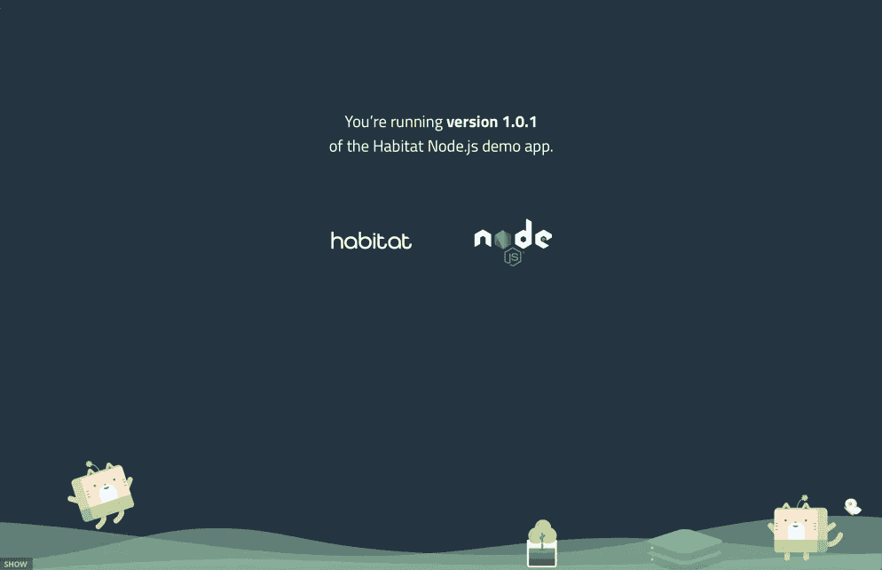

# 尝试与集装箱服务的家园

> 原文：<https://medium.datadriveninvestor.com/try-habitat-with-container-service-ca68e20263d?source=collection_archive---------13----------------------->

[](http://www.track.datadriveninvestor.com/1B9E)

*作者 Ilhan Adiyaman，* [*阿里云科技分享*](https://www.alibabacloud.com/campaign/techshare?spm=a2c41.13069099.0.0) *作者。*[*Tech Share*](https://www.alibabacloud.com/campaign/techshare?spm=a2c41.13069099.0.0)*是阿里云的激励计划，旨在鼓励在云社区内分享技术知识和最佳实践。*

# 概述和目标

这篇文章展示了如何使用阿里云的[容器服务](https://www.alibabacloud.com/product/container-service?spm=a2c41.13069099.0.0)在几分钟内设置并开始使用 [Habitat](http://www.habitat.sh/?spm=a2c41.13069099.0.0) 。您将构建、部署和管理一个包含负载平衡器的基本 web 应用程序，这一切都在您的工作站上完成。

# 关于栖息地

Habitat 是 Chef 的一个开源项目，通过创建一个独立于平台的构建构件，帮助您将应用程序配置、管理和行为转移到应用程序本身。它使您能够打包您的应用程序，并且在您准备好部署它之前不用担心它将被部署到哪里。

[](https://www.datadriveninvestor.com/2019/03/26/agile-management-the-good-the-bad-and-the-downright-ugly/) [## 敏捷管理:好的、坏的和彻头彻尾丑陋的数据驱动的投资者

### 公司不断重塑自己，以获得或保持竞争优势和市场份额。这是…

www.datadriveninvestor.com](https://www.datadriveninvestor.com/2019/03/26/agile-management-the-good-the-bad-and-the-downright-ugly/) 

如果您将它部署在一个虚拟机上，现在决定将运行时环境切换到 Docker 容器，您不需要重新打包或重写您的应用程序。同一个 Habitat 包可以在两种环境中运行，而无需重构它。Habitat 支持新的和现有的应用程序。您可以使用它来:

*   构建包含应用程序运行所需的一切的包。
*   在任何平台上部署您的应用程序，包括裸机、虚拟机、云、Docker、Mesos、Kubernetes 等等。
*   管理您正在运行的应用程序，并响应同一网络中其他服务所做的配置更改。

所以我们可以很容易地说，Habitat 使您能够打包您的应用程序，并且在您准备好部署它之前不用担心它将被部署到哪里。如果您决定切换运行时环境，例如，从 VM 到 Docker 容器，您不需要重新打包或重写您的应用程序——相同的 Habitat 包可以在两个环境中运行。

如果你的团队正在探索或积极开发微服务，这篇文章将让你了解 Habitat 如何通过阿里云[容器服务](https://www.alibabacloud.com/product/container-service?spm=a2c41.13069099.0.0)和[容器注册](https://www.alibabacloud.com/product/container-registry?spm=a2c41.13069099.0.0)提供简单一致的方式来部署和管理云原生应用。

# 先决条件

你应该有一个阿里云账户。如果您还没有帐户，请访问[免费试用页面](https://www.alibabacloud.com/campaign/free-trial?spm=a2c41.13069099.0.0)获取免费帐户。

在您的工作站中，您还应该安装 Docker。如果你是 Docker 的新手，你可以阅读[入门指南](https://docs.docker.com/get-started/?spm=a2c41.13069099.0.0)来更好地理解它是如何工作的。你还需要一个 GitHub 账户，这样你就可以通过 Habitat 的 Builder 服务进行认证。Habitat Builder 是一个供您存储自己的包和获取他人构建的包的地方。

# 安装栖息地

# 步骤 1:在 Habitat Builder 上创建一个帐户

Habitat Builder 是 Habitat 的主要中枢，它允许您存储、自动构建和部署您的 Habitat 软件包。在开始配置您的工作站之前，我们应该在 [Habitat Builder](https://bldr.habitat.sh/?spm=a2c41.13069099.0.0) 上设置一个帐户。在本演练中，我们将需要我们的 Habitat Builder 帐户的个人访问令牌，以便配置我们的工作站与我们的 Habitat Builder 帐户进行对话。

要在 Habitat Builder 上创建帐户，请打开 [Habitat Docs](https://www.habitat.sh/docs/using-builder/?spm=a2c41.13069099.0.0) ，其中介绍了如何开始创建帐户。对于本演练，只需完成前三个步骤:

*   [创建一个建造者账户](https://www.habitat.sh/docs/using-builder/?spm=a2c41.13069099.0.0)
*   [在生成器上创建原点](https://www.habitat.sh/docs/using-builder/?spm=a2c41.13069099.0.0)
*   [生成访问令牌](https://www.habitat.sh/docs/using-builder/?spm=a2c41.13069099.0.0)

完成上述步骤后，您可以设置`HAB_ORIGIN`和`HAB_AUTH_TOKEN`环境变量。我们可以添加这些环境变量，以便使用 builder 轻松处理您的包名和身份验证。

如下所示，用您的原始名称替换`try-habitat`。

```
$ export HAB_ORIGIN=try-habitat
```

用您的实际`auth_token`值替换令牌。

```
$ export HAB_AUTH_TOKEN=<replace-this-with-your-auth-token>
```

# 步骤 2:在您的工作站上安装 Habitat

名为`hab`的 Habitat 命令行界面(CLI)是您在 Habitat 中需要做的一切。同样，[文档](https://www.habitat.sh/docs/install-habitat/?spm=a2c41.13069099.0.0)解释了设置和配置工作站所需的一切。

现在，只需完成前两步:

*   [下载并安装 Habitat CLI 工具](https://www.habitat.sh/docs/install-habitat/?spm=a2c41.13069099.0.0)
*   [配置您的工作站](https://www.habitat.sh/docs/install-habitat/?spm=a2c41.13069099.0.0)

在“配置您的工作站”步骤中，它会要求您提供 __ 个人访问令牌 _ _。在这一部分，粘贴上一步设置的令牌。

为了验证安装，您可以运行`hab --version`命令。

```
$ hab --version
hab 0.57.0/20180530114142
```

# 示例应用程序

对于本演练，我们将使用 [Habitat sample Node.js 应用程序](https://github.com/habitat-sh/sample-node-app?spm=a2c41.13069099.0.0)。

将此存储库克隆到您的工作目录中。

```
$ git clone [https://github.com/habitat-sh/sample-node-app.git](https://github.com/habitat-sh/sample-node-app.git)
```

该项目包括示例应用程序的源代码和描述如何构建该包的 Habitat [plan](https://www.habitat.sh/docs/developing-packages/#write-plans) 。

为了便于演示，已经在`/habitat`目录下为您生成了人居计划文件。在您最喜欢的编辑器中打开`plan.sh`文件，并将`pkg_origin`的值更改为您之前创建的原始名称。



# 构建栖息地包

在这一步中，我们将开始为 web 应用程序构建 Habitat 包。Habitat 以自己的格式构建应用程序，称为`Habitat artifact(.hart)`。将应用程序构建为`.hart`包使您能够完成以下任务:

*   将您的应用程序导出为各种云原生格式
*   当依赖关系更新时获得自动重建
*   通过人居主管管理生产中的服务

首先，让我们从应用程序 repo 的根目录运行`hab studio enter`进入 Habitat Studio，这样我们就可以开始构建我们的工件了。

```
$ hab studio enter
```

[Habitat Studio](https://www.habitat.sh/docs/glossary/#glossary-studio) 是一个交互式的 Linux 环境，作为创建 Habitat 包的“干净房间”。工作室里除了你定义的，没有其他软件。您可以在 Studio 内部运行简单的 Linux 命令，如`ls`或`pwd`。

```
[1][default:/src:0]# pwd
/src
```

在这里，当你运行`pwd`时，你可能期望看到`sample-node-app`目录和它的父目录，然而，它会显示给你`/src`。原因是工作室运行在一个 [chroot](https://en.wikipedia.org/wiki/Chroot) 环境中。这种环境通常被称为“Unix 监狱”或“chroot 监狱”，因为它不能访问指定目录树之外的文件。`chroot`的使用在容器等虚拟化环境中很常见。事实上，工作室运行在一个 Docker 容器中，不包含其他软件。这有助于确保您创建的包只包含您需要的内容。

接下来，运行`build`命令来生成一个栖息地工件(。hart)用于我们的应用。Habitat 将生成一个包(一个. hart 文件)并将其放在`results`目录中。

```
[2][default:/src:0]# build
```

构建完成后，您会在输出的末尾看到下面的消息(见下面的截图):“我喜欢 plan.sh 组合在一起。”您的包现在已经构建好了。



您还可以通过在 Studio 上使用 Linux 命令`ls`列出目录来检查工件是否是生产的，如下所示。

```
[3][default:/src:0]# ls ./results
last_build.env  try-habitat-sample-node-app-1.0.1-2017121904721-x86_64-linux.hart
```

您的包现在已经构建好了。让工作室为下一部分开放。

# 运行应用程序

既然构建已经完成，让我们通过运行包来测试它。有两种运行栖息地包的常见方式。

您可以导出。hart 到 Docker 映像并使用`docker run`或者您可以通过使用 [Habitat Supervisor](https://www.habitat.sh/docs/glossary/?spm=a2c41.13069099.0.0) 直接从 Habitat Studio 启动服务，Habitat Supervisor 是一个进程管理器，很像 linux 中的 PID 1，它负责启动和监控 Habitat 包中定义的服务，并接收和处理来自其他管理器的配置更改。如果您想了解更多关于如何使用 Habitat Supervisor 运行您的应用程序的信息，请查看 [Habitat 的文档](https://www.habitat.sh/docs/using-habitat/?spm=a2c41.13069099.0.0)，其中也解释了 Supervisor 的详细信息。

在这里，我们将使用 docker 映像导出，以便稍后使用该映像来上传阿里云 Docker 注册表并在云中启动我们的容器。

通过 Habitat Studio 中的一个命令，您将已经导出了。hart 文件作为 Docker 图像如下所示。

```
[4][default:/src:0]# hab pkg export docker ./results/<path to .hart>
```

导出完成后，可以运行`exit`离开工作室。

```
[5][default:/src:0]# exit
logout
```

现在，运行 Docker 容器，看看结果。

```
$ docker run -it -p 8000:8000 try-habitat/sample-node-app
```

最后，在您的浏览器中进入 [http://localhost:8000](http://localhost:8000/) ，查看示例应用程序 UI，如下图所示。



# 将图像发布到容器注册表

尽管 Habitat 与 Docker 配合得很好，但是您可以将 Habitat 包部署到几乎任何环境，包括裸机、VM、云、Mesos、Kubernetes 等等。在这里，我们将把我们的图像发布到[阿里巴巴容器注册表](https://www.alibabacloud.com/product/container-registry?spm=a2c41.13069099.0.0)中，这是一个由阿里云提供的完全托管的 Docker 注册表。为了在阿里云上运行我们的示例应用程序容器，我们可以将图像发布到容器注册表中，然后创建一个容器实例。

发布我们的图像有几个简单的步骤:

*   从阿里云控制台进入阿里巴巴容器注册表
*   为您的原点创建一个名称空间(例如:try-habitat)
*   为您的应用程序创建存储库。在这一步中，为代码源部分选择`Local Repository`,因为我们将只发布我们的 docker 图像。
*   创建存储库后，点击`Manage`查看指南，该指南解释了如何将 docker 映像发布到注册表中。

现在，您已经准备好将您的映像发布到容器注册中心了。你可以按照阿里巴巴提供的指南或者只是按照下面的步骤。

首先，登录阿里云 Docker 注册表。

```
$ sudo docker login --username=<your-email-address-here> registry-intl.us-west-1.aliyuncs.com
```

然后，将我们导出的 Docker 映像推送到阿里云 Docker 注册表中。这里，不要忘记替换基于帐户详细信息的参数。

```
$ sudo docker login --username=<your-email-address-here> registry-intl.us-west-1.aliyuncs.com
$ sudo docker tag try-habitat/sample-node-app registry-intl.us-west-1.aliyuncs.com/try-habitat/sample-node-app:latest
$ sudo docker push registry-intl.us-west-1.aliyuncs.com/try-habitat/sample-node-app:latest
```

现在您可以使用这个映像创建一个容器，并在 Kubernetes 上运行您的应用程序。

# 原始资料

[](https://www.alibabacloud.com/blog/try-habitat-with-container-service_594945?spm=a2c41.13069099.0.0) [## 尝试与集装箱服务的家园

### 阿里巴巴 Clouder 2019 年 6 月 14 日 710 由 Ilhan Adiyaman，阿里云技术分享作者。技术股是阿里云的…

www.alibabacloud.com](https://www.alibabacloud.com/blog/try-habitat-with-container-service_594945?spm=a2c41.13069099.0.0)