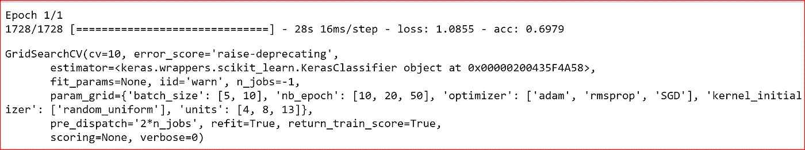
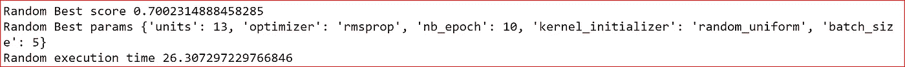

# 调谐人工神经网络

> 原文：<https://medium.datadriveninvestor.com/tuning-artificial-neural-network-b028dcc3b9d0?source=collection_archive---------1----------------------->

在本帖中，我们将了解如何使用 GridSearchCV 和 RandomizedSearchCV 调整人工神经网络。


我们将继续对[汽车评估数据集](http://archive.ics.uci.edu/ml/datasets/Car+Evaluation)使用多类别分类。

**先决条件:**

参见这里的[构建人工神经网络概念](https://medium.com/datadriveninvestor/neural-network-simplified-c28b6614add4)和[用 Keras 构建 ANN](https://medium.com/datadriveninvestor/building-neural-network-using-keras-for-classification-3a3656c726c1)

[K 折交叉验证概念](https://medium.com/datadriveninvestor/k-fold-and-other-cross-validation-techniques-6c03a2563f1e)和[代码](https://medium.com/datadriveninvestor/k-fold-and-dropout-in-artificial-neural-network-ea054a89fb4e)

我们需要导入基本库，读取数据，并通过将分类变量转换为数字变量来预处理数据，这将输入标准化，以便所有变量都在相同的标准范围内。最后，我们将把数据分成训练数据集和测试数据集。

```
import numpy as np
import pandas as pd
import seaborn as sns
import matplotlib.pyplot as plt
%matplotlib inline**#Reading the dat**a
dataset = pd.read_csv('car_acceptability.csv')**# creating  target variables**
from sklearn.preprocessing import LabelEncoder
le = LabelEncoder()
y=le.fit_transform(dataset['Car Acceptability'])from keras.utils import to_categorical
output_category = to_categorical(y, num_classes=None)
output_category**#creating dummy variables for categorical data**
dataset_1= pd.get_dummies(dataset, 
                          columns=['Doors','Persons','Buying Price', 'Maintenance Price', 'Lug Boot', 'Safety'],
                          prefix= ['Doors','Persons','Buying Price', 'Maintenance Price', 'Lug Boot', 'Safety'])
dataset_1.head(2)**# creating input features**
X = dataset_1.iloc[:,[1,2,3,5,6,8,9, 10,12,13,14,16,17]]**#standardizing the input feature**
from sklearn.preprocessing import StandardScaler
sc= StandardScaler()
X= sc.fit_transform(X)**# creating training and test data**
from sklearn.model_selection import train_test_split
X_train, X_test, y_train, y_test = train_test_split(X, output_category, test_size=0.3)
```

我们将使用 **KerasClassifier** 进行多类分类。

我们有两种不同类型的参数:

*   作为神经网络训练的一部分学习的参数，如权重；
*   固定的参数，也称为超参数。这些不是作为神经网络的一部分学习的，而是作为参数传递给分类器或回归器。例如学习率、优化器或内核初始化器，它们是我们在构建神经网络时设置的。

调整超参数被称为**超参数优化**。

**超参数优化的目标是找到超参数的组合，这将产生一个能使损失函数最小化的最佳模型。**损失函数是**实际值和预测值之间的**差。

在机器学习中，有三种不同的超参数优化方法:

1.  手动方法——对超参数的不同组合进行反复试验。
2.  GridSearchCV 对指定的参数执行彻底的搜索。网格搜索是网格中所有指定参数的笛卡尔乘积，其中我们取一个参数，而保持所有其他参数不变，以最小化损失。这在计算上非常昂贵。
3.  随机搜索选择列出的参数，因此不会尝试每个参数组合。从指定的分布中仅采样固定数量的参数设置。当参数数量增加时，随机搜索是一个更好的选择，因为它可以快速找到一个好的组合。此外，就计算成本而言，对于超参数优化，随机搜索比网格搜索更有效。

我们将对汽车预处理数据运行 GridSearchCV 和 RandomizedSearchCV。

我们定义一个函数 ***build_classifier*** 来使用包装器 KerasClassifier。 ***build_classifier*** 创建并返回 Keras 序列模型。

我们向该函数传递三个参数:

*   **优化器**是我们希望用于神经网络的优化技术
*   **内核**用于设置内核初始化器
*   **单位**是隐藏层中隐藏节点的个数

```
def **build_classifier(optimizer,kernel, units)**:
    classifier = Sequential()
    #First Hidden Layer
    classifier.add(Dense(units=**units**, activation='relu', kernel_initializer=**kernel**, input_dim=13))
    classifier.add(Dropout(rate=0.1))
    #Second  Hidden Layer
    classifier.add(Dense(units=**units**, activation='relu', kernel_initializer=**kernel**))#Output Layer
    classifier.add(Dense(4, activation='softmax', kernel_initializer=**kernel**))#Compiling the neural network
    classifier.compile(optimizer=**optimizer**,loss='categorical_crossentropy', metrics =['accuracy'])
    return classifier
```

在构造 **KerasClassifier** 类时，我们将***build _ classifier***函数传递给 **build_fn** 参数。

```
classifier = KerasClassifier(build_fn=build_classifier)
```

我们正在使用 GridSearchCV 调整神经网络。我们想要优化的超参数是:

*   批量大小
*   纪元
*   优化器—这将在构建神经网络时传递一个参数给函数***build _ classifier***
*   kernel_initializer —这将在构建神经网络时传递一个参数给函数***build _ classifier***
*   单位—这将在构建神经网络时作为参数传递给函数***build _ classifier***

```
from sklearn.model_selection import GridSearchCV
parameters =**{'batch_size':[5,10],
            'nb_epoch':[10,20,50],
            'optimizer':['adam','rmsprop','SGD'],
            'kernel_initializer':['random_uniform'],
            'units':[4,8,13]}**gridSearch = GridSearchCV(estimator=classifier,
                          param_grid=parameters,
                          cv=10,
                         n_jobs=-1,
                         return_train_score=True) 
```

定义的参数现在被应用于 GridSearchCV，在 GridSearchCV 中，所有参数的组合将被评估以最小化损失函数。

**return_train_score** 属性设置为 true，因为我们要返回 cv_results 属性。cv_results 让我们深入了解不同的参数设置如何影响过拟合/欠拟合的权衡。计算 cv_results 的计算量很大。

我们将输入特征和目标变量与 GridSearchCV 对象相匹配。

```
gridSearch.fit(X, output_category)
```



我们现在可以打印最佳参数和最佳分数

```
print('Grid Search Best score',gridSearch.best_score_)
print('Grid Search Best Parameters', gridSearch.best_params_)
print('Execution time',gridSearch.refit_time_)
```


best score, best params and execution time

*现在我们用****RandomizedSearchCV。***

我们将使用同样的***build _ classifier***函数来构建神经网络和 KerasClassifier。

```
from sklearn.model_selection import RandomizedSearchCV
parameters ={'batch_size':[5,10],
            'nb_epoch':[10,20,50],
            'optimizer':['adam','rmsprop','SGD'],
            'kernel_initializer':['random_uniform'],
            'units':[4,8,13]}random_search= RandomizedSearchCV(estimator=classifier, param_distributions=parameters,n_iter=20,n_jobs=-1,cv=5) 
```

然后，我们将数据拟合到输入特征和目标变量

```
random_search.fit(X, output_category)
```


我们现在可以打印最佳参数、最佳分数和执行时间。

```
print('Random Best score',random_search.best_score_)
print('Random Best params',random_search.best_params_)
print('Random execution time',random_search.refit_time_)
```



best score, best param and execution time

我们看到 randomizedSearchCV 的执行时间为 26 秒，而 GridSearchCV 的执行时间为 28 秒。我们看到，尽管最佳参数不同，但我们的最佳得分都是 70%。

## 参考资料:

[http://www . jmlr . org/papers/volume 13/bergstra 12a/bergstra 12a . pdf](http://www.jmlr.org/papers/volume13/bergstra12a/bergstra12a.pdf)

[http://jmlr . org/papers/volume 15/srivastava 14 a . old/srivastava 14 a . pdf](http://jmlr.org/papers/volume15/srivastava14a.old/srivastava14a.pdf)