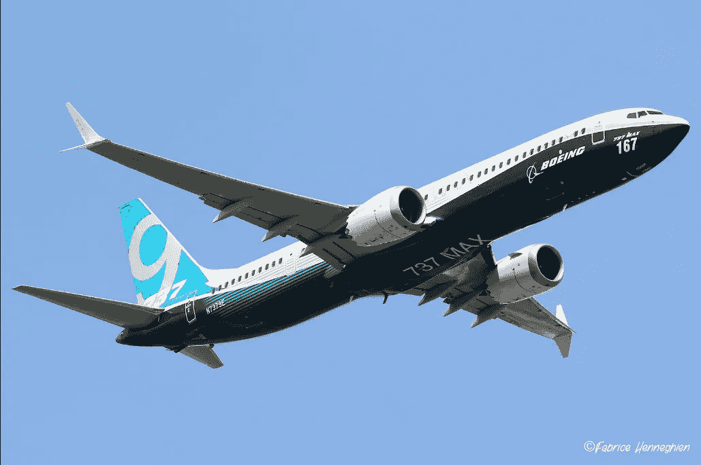

# 波音的动荡时期|数据驱动的投资者

> 原文：<https://medium.datadriveninvestor.com/turbulent-times-at-boeing-data-driven-investor-aa6a54b0b4cc?source=collection_archive---------13----------------------->

Source: [https://www.flickr.com/photos/fakbe/](https://www.flickr.com/photos/fakbe/)

*原载于 2019 年 9 月 25 日*[*【https://www.datadriveninvestor.com】*](https://www.datadriveninvestor.com/2019/09/25/turbulent-times-at-boeing/)*。*

今年第二季度和第三季度，oeing 经历了动荡。这与波音 737 Max 在全球范围内停飞有关，此前两起致命的 737 Max 坠机事件被归咎于新波音 737 Max 上安装的新防失速技术。波音股价在 9 月的最后一周飙升至 380 美元以上，徘徊在 2019 年 3 月 737 Max 停飞以来的最高水平。这比 2019 年 8 月中旬 320 美元的低点反弹了近 29%。在路透社 8 月下旬报道波音公司宣布，如果监管机构批准 737 Max 在 2019 年第四季度飞行，预计到 2020 年 2 月将生产 52 架 737 Max 飞机，到 2020 年 7 月将生产 57 架 737 Max 飞机后不久，反弹开始。目前，波音已经计划本周在迈阿密进行第一轮飞行员培训，并计划在英国、新加坡、中国和土耳其进行额外的培训。该股仍比 2019 年 2 月底至 3 月初 737 Max 停飞前的创纪录高点 446 美元低 20%。许多投资者会认为，波音公司已经达到了调整区域，股价在最坏的情况下将保持在 300 美元左右，最糟糕的情况已经过去。一些专家会提出不同的观点，认为波音公司在可预见的未来不太可能实现这个高度乐观的目标。不幸的是，波音公司的股票价格几乎是波音公司目前唯一可以看到蓝天的方面。至于波音的其余部分，预计将会看到持续的动荡。

波音公司与供应商之间存在问题，停飞的飞机看不到恢复飞行的迹象，来自监管机构、航空公司和员工的压力越来越大。

即使波音公司设法找到解决方案来解决困扰 737 Max 的固有问题，并且飞机恢复商业飞行，也不能保证他们能够实现到 2020 年 6 月每月生产 57 架飞机的目标。这是因为 737 Max 的问题是波音公司整体上持续存在的系统性问题的结果，而且有很多。这里只是几个问题。

# 驾驶舱里睡着的领导

737 是波音公司最受欢迎的窄体中短程商用客机，也是波音公司的面包和黄油客机。最初的 737 于 20 世纪 60 年代初首次推出，此后经历了几次重大更新。2006 年，波音首次宣布对 1993 年问世的 737ng(下一代)进行重大更新。然而，直到 2011 年，空中客车公司推出了更省油的新型空中客车 A320neo(新发动机选项)之后，开发才获得批准。

不是波音缺乏创新，而是他们遭遇了*开发者困境，*这是大多数公司在高度竞争的市场中普遍遇到的问题。马丁·克雷奇默在他的文章[中解释了这种困境，博弈论:开发者的困境](https://www.strategy-business.com/article/15872?gko=873f3)。从波音高管的角度来看新飞机的发展，人们可以说，开发新市场，甚至改变历史上成功的市场都是有风险的。然而，不进入一个新市场的风险同样很大，尤其是在有竞争对手公司激烈竞争的情况下。

当两家竞争公司卷入时，开发商的困境以象限的形式提供了四种不同的结果。如果 A 公司开发了一种新产品，而 B 公司没有，A 公司就获得了 100%的新市场份额(潜在的垄断)，而 B 公司则失去了在这个新市场中占有任何份额的机会。如果新的市场被高估，A 公司会因为开发未知市场而亏损，而这让 B 公司处于优势。如果两家公司都决定在一个新的市场发展，他们都有可能亏损，如果有利润，潜在的收益必须分享。当金融风险很高时，允许你的直接竞争对手首先进入未知领域作为 beta 测试者的谨慎做法可以说是一个好的举措。然而，在这种情况下，波音公司并没有考虑他们的竞争对手正在哪些地区进行“测试”,以及他们将在市场上取得的成功。例如，一个对波音公司来说不太重要的特性是燃油效率。燃油成本占航空公司总运营成本的 25%。一个新的，更省油的 737 应该被认为是一种需要，而不是一个冒险的发展。然而，波音公司在开发阶段未能就此采取行动。随着空中客车公司全力以赴创新，推出了一款具有节油发动机选项的新 A320，考虑到航空公司的燃料费用，波音公司应该预计到对这种选项的高需求和激励，并优先将它们作为航空公司机队的替代品，以取代非常受欢迎的，但老化且燃油效率较低的窄体飞机。

Source Illustration: Martin Kretschmer, [Game Theory: The Developer’s Dilemma](https://www.strategy-business.com/article/15872?gko=873f3).

# 当时钟滴答作响时，快速解决问题

随着竞争的到来，波音高管被迫在短时间内生产新的 737。通常，这样的任务可能需要很多年，但波音公司已经有了另一架飞机，787 梦想飞机也在开发中，距离生产就绪还有几年时间，这对波音公司不利。事实是，波音公司不能花费超过 10 年的时间来开发另一种新的飞机，以确保波音公司的市场份额地位。中短程窄体客机市场竞争激烈。美国航空公司过去从波音公司订购窄体飞机，现在已经订购了 130 架新型节能空客 A320neo 喷气式客机。因此，为了缩短从开发到生产的时间，波音公司决定用一种新的、更强大、更省油的发动机动力装置来改造现有的 737ng，同时采用新技术和更新的内饰选项，航空公司可以很容易地重新配置和修改。

新发动机的问题是，它们最初是为更大的 787 梦想飞机设计的。对于新的 737 飞机来说，发动机功率太大，位置太高，靠近前机头。工程师们担心这将导致飞机的机头在飞行中突然向上倾斜，这可能会导致失速。

他们没有为 737 开发更合适的发动机和发动机布局，而是选择开发一个依靠 AOA(迎角)传感器与 MCAS(机动特性增强系统)通信的防失速系统。这解决了潜在的失速问题，然而，遗留在框架内的金属屑可能导致传感器短路和故障，向 MCAS 发送不正确的俯仰读数，迫使飞机俯冲。最初的设计只有一个传感器。从那时起，他们增加了第二个传感器。目前提出的解决方案要求两个传感器在向 MCAS 系统发送任何信号之前具有相似的读数。此外，修改将只允许 MCAS 系统低头一次，飞行员可以安全地纠正更有限的俯仰。

根据福布斯关于 737 Max 的一份报告，专家认为，如果其中一个传感器无法提供正确的读数，增加第三个传感器可以作为一个平局决胜器。前波音工程师 Peter Lemme 告诉[华盛顿邮报](https://www.washingtonpost.com/business/2019/04/01/five-months-after-indonesia-plane-crash-boeing-still-working-software-fix/?noredirect=on)关于两个 AOA 传感器的问题，“如果一个是错的，你不能取两个的平均值，也不能用好的那个，因为计算机不知道哪个是对的。”

# 外包解决一切

波音公司历来在西雅图地区生产和组装飞机。为什么要改变有效的方法？时间和金钱通常是催化剂。在其发展过程中，787 梦想飞机不仅拥有最新的技术，而且还是第一架使用碳纤维的商用飞机，碳纤维是一种比铝更强更轻的材料，具有更好的燃油经济性。787 梦想飞机是波音公司在现代航空领域最伟大、最大胆的成就。然而，为了控制制造和劳动力成本并缩短生产时间，波音公司的高管决定将 787 梦想飞机的大部分零件，包括飞机的整个结构，外包给其他国家的制造商。从理论上讲，购买预制材料可以通过分散给许多供应商来减少内部库存、组装时间和财务风险。

然而，这并没有发生。不幸的是，过度依赖外包供应商造成了比预期更多的延误。更糟糕的是，缺乏纠正不可预见问题的专业知识。这些问题包括零件与其他零件不匹配，因为大多数零件来自不同国家的制造商。很多时候，零件到达时要么是部分组装的，要么是不完整的。其他时候，零件会在装配过程中无序到达。例如，紧固件因制造商而异。临时解决方案是对临时紧固件进行颜色编码，以便在正确的紧固件到达时可以替换它们。直到所有紧固件都被永久性紧固件替换后，装配过程才能进行。临时紧固件通过颜色编码进行跟踪。总体而言，供应链上缺乏协调和故障排除，给承担主要航空公司交付任务的波音公司造成了困难。最糟糕的外包案例涉及飞机的(易着火)电池，该电池由日本的一家公司制造，由法国的另一家公司组装，这导致了 787 梦想飞机的停飞。

从长远来看，代表波音公司的外包战略导致了更多的延迟，并增加了波音公司的成本。波音公司花费数十亿美元重新设计了 787 梦想飞机的整个部分，并改进了供应链上的流程。尽管 787 梦想飞机的已知问题已经解决，但它将第一架飞机的交付时间推迟了 3.5 年。787 个零件中约 70%外包给来自 135 个不同地点的约 50 家供应商，并交付给波音西雅图和查尔斯顿组装厂。我们也有可能看到对波音及其外包业务的重大负面影响，因为美国和其他国家之间持续的贸易紧张局势导致供应链成本的不确定性不断增加，导致市场不稳定。

# 如果你不知道任何问题，那就没有任何问题

波音公司对派出远未准备好飞行的飞机并不陌生。虽然梦想飞机和 737 Max 有着困扰该公司的问题的良好记录，但这并不新鲜。1965 年，最近推出的 727，被波音公司吹捧为当时最先进的飞机之一，在三个月内发生了三起坠机事件，三架飞机上的所有人遇难。问题出在翅膀上。异常大的机翼允许在低速时有更大的升力。这被认为对空中交通流量较高的城市密集区的机场更有帮助。虽然飞机本身没有任何问题，但波音公司未能就飞机独特的飞行特性提供足够的飞行员培训，这反过来包括更快的下沉率，这对不熟悉的飞行员来说是灾难性的。

在 20 世纪 90 年代，737 遭遇了三起事故，其中两起导致了人员死亡，之后 NTSB 最终发现了问题的根源——方向舵服务器故障导致设备堵塞跑道入口。代表波音公司的另一个不成熟的推出是 787 梦想飞机，正如前面提到的，它遭受了与外包有关的重大挫折。虽然不是导致 787 在 2013 年停飞的唯一问题，但困扰梦想飞机的主要电气问题在很大程度上可以归因于容易着火的电池系统，该系统与同年发生的两起独立事件有关。虽然波音公司一直从供应商那里外包电池，但 787 梦想飞机的大部分零件都是外包的，这可能是波音工程师的疏忽被归咎于 787 梦想飞机过度依赖外包零件所导致的大量供应问题的原因。

2014 年 2 月，机翼制造商[三菱重工](https://www.reuters.com/article/us-boeing-cracks/boeing-reports-wing-cracks-on-787-dreamliners-in-production-idUSBREA261QG20140307)通知波音公司，定于今年晚些时候交付的 787-9 梦想飞机(787 在产的新版本)可能出现应力裂纹。波音公司迅速通知客户，并告知目前已经服役的 787 梦想飞机没有受到该问题影响的任何危险。2019 年，一个不同的故事-当 737 Max 使用新技术时，新技术未经充分审查，也不为受过训练驾驶以前的 737 飞机的飞行员所知，AOA 传感器出现故障，向 MCAS 发出错误信号，使飞机进入受控的机头俯冲，以防止从未发生的失速。这个问题是后面提到的至少两起重大空难的罪魁祸首。

# 理论上来说，它只需要飞起来

外界指责波音公司偷工减料，尤其是其员工，据报道，在埃塞俄比亚航空公司 302 航班坠毁的调查结果公布后不久，一些员工就向联邦航空局官员举报了波音公司。波音北查尔斯顿工厂的技术员约瑟夫·克莱顿(Joseph Clayton)和十多名现任和前任员工在 737 Max 停飞前一个月发表在《纽约时报》上的一篇文章中详细描述了工厂的恶作剧。《纽约时报》的文章(其中提到了一个普遍存在的问题，涉及*金属屑*，它们经常被留在飞机内，危险地靠近电子元件)采访了 Joseph Barrett。

巴雷特先生声称，他一再敦促他的老板，以确保生产去除刨花。联邦航空局证实了这些索赔和刨花带来的危险，包括短路和潜在的火灾，导致飞机软件发出错误信号，这被认为是多起灾难的原因。据来自 CBSNews.com 的 [Kris Van Cleave](https://www.cbsnews.com/news/boeing-737-max-8-at-least-4-potential-whistleblower-calls-made-to-faa-about-jetliner/) 称，美国联邦航空局在波音公司认证为无碎片的飞机上发现了金属屑。Cleave 还报告说，在 2019 年 4 月 5 日联系美国联邦航空局的四名举报者员工和前员工中，有一人将金属屑形式的异物碎片(FOD)归因于导致埃塞俄比亚航空公司 302 航班和狮航 JT610 航班坠毁的 AOA 传感器故障的潜在原因。这个问题实际上是众所周知的，空军两次拒绝交付 767 型 KC46 加油机，因为他们发现了 FOD。

Source: time.com

在 2019 年 5 月 9 日由[彭博商业周刊](https://www.bloomberg.com/news/features/2019-05-09/former-boeing-engineers-say-relentless-cost-cutting-sacrificed-safety)发表的一篇文章中，Peter Robison 报道说，波音公司邀请 FAA 工程师到波音公司检查新 737 Max 的新模拟模拟器，以确定现有的 737ng 飞行员是否需要接受 D 级培训， a 级需要在实际的 737 Max 飞机上进行至少 20 小时的飞行员飞行时间培训，才能获得驾驶新 737 Max 飞机的认证，或者如果他们可以通过 B 级培训获得驾驶新 737 Max 飞机的认证，B 级培训只需要 2 小时的培训，可以在 iPad 上完成。 这将使波音公司加快交付飞机，立即投入商业使用。

前波音工程师 Rick Ludtke 一直对波音的管理持批评态度。Ludtke 告诉《商业周刊》“[波音公司]正在瞄准高薪、经验丰富的工程师，”他认为随着时间的推移，这降低了质量和安全性。"他们严格按照成本来做，每架飞机都是如此."

# 延误和取消，不是那种乘客体验

波音公司在按时交付新订单方面有着悠久的历史。生产线的问题、测试问题和 FAA 认证的延迟都导致了新飞机的延迟。过去，供应商问题、质量控制问题和停工都造成了生产瓶颈。全日空是第一家在 2004 年订购 50 架 787 梦想飞机的航空公司，该公司预计在 2008 年交付首架飞机，但直到 2014 年才收到首架飞机，推迟了 6 年。全日空将节省的燃料成本纳入了 2008 年以后的开支预测中。不幸的是，由于延迟，这些预计的节省并没有实现整整六年。

当 737 Max 首次亮相时，它迅速成为波音公司的宠儿和航空公司中的宠儿。自首次亮相以来，波音公司已售出 5000 多架飞机，成为波音公司历史上销售最快的飞机。自 2019 年 3 月停飞以来，波音公司售出了 0 架飞机。取消订单、延迟交付现有订单以及不清楚 737 Max 飞机何时获得认证恢复飞行和生产的时间表，都给客机留下了不确定性。

这为波音公司最激烈的竞争对手空中客车公司创造了更高的需求。许多至今仍忠于波音的航空公司可能会发现更难坚持下去。这对空客来说是好消息，对波音来说是坏消息。

7 月，国营沙特阿拉伯航空公司旗下的廉价航空公司 Flyadeal 取消了 30 架 737 Max 的订单，其中包括额外 20 架 737 Max 飞机的期权，如果飞机按标价出售，价值为 59 亿美元。雪上加霜的是，Flyadeal 宣布了一项从空客购买 50 架 A320neo 飞机的新交易。由于延迟交付、取消订单和与直接竞争对手的新订单，航空公司和波音公司的机会成本凸显了波音公司的问题如何直接影响波音公司的未来收益、航空公司的未来收益以及最终可以避免的燃油成本，这些成本最终通过机票价格转嫁给了乘客。

由于订单被取消和延迟，波音公司面临的运营亏损不断增加，这并不是波音公司唯一需要担心的事情。波音公司必须面对音乐，并与购买和交付 737 Max 的航空公司做正确的事情，这些飞机现在处于停飞的第七个月。对于严重依赖 737 Max 机队的航空公司来说，停飞相当于巨大的损失，并且由于停飞，不得不取消数千个航班。根据美国消费者新闻与商业频道的一份报告，西南航空公司和其他航空公司也在通过与波音公司就 737 MAX 停飞造成的损失谈判和解协议来减轻损失。到目前为止，今年第二季度，波音公司已经预留了 56 亿美元，以弥补因 737 MAX 停飞导致的航班取消给航空公司造成的损失。根据 2019 年 8 月[达拉斯晨报](https://www.dallasnews.com/business/local-companies/2019/08/02/southwest-airlines-ceo-on-737-max-there-s-no-better-175-seat-airplane/)的一篇报道，自 1971 年以来几乎只使用 737 的西南航空公司迄今为止至少报告了 2.25 亿澳元。

# 一架停飞的 737 Max 能装下多少律师？

俄罗斯飞机租赁公司 Avia 最近提起诉讼，不仅要求返还 350 亿美元的押金，还要求额外赔偿 1 亿美元。这是我们预计将起诉波音公司因 737 Max 飞机停飞造成损害的许多航空公司之一。来自 12 家不同航空公司的 3000 多名飞行员也对波音公司提起集体诉讼，要求赔偿 737 Max 飞机停飞造成的工资损失。波音公司早在 7 月份就宣布，将设立一项财政援助基金，支付给在两起 737 Max 坠机事件中遇难者的家属。据路透社报道，9 月 23 日，该基金的管理人，华盛顿律师肯·范伯格·卡米尔·s·比罗斯宣布，该基金“将立即开始接受家庭成员的索赔”。每个遇难者家庭将获得 144，500 美元，总共 346 人死亡。索赔必须在 2019 年 12 月 31 日之前收到。支付给家属的任何索赔都不会要求家属放弃未来提起非正常死亡诉讼的权利，这可能导致数十亿美元的法律责任。[波音公司首席执行官丹尼斯·米伦伯格承认，737 MAX 上的新防失速系统导致了两起致命事故](https://seekingalpha.com/news/3448861-boeing-faces-billions-liabilities-ceo-acknowledges-737-max-problem)，随着越来越多的证据表明波音的组装过程可能导致了系统故障，这使得飞机制造商面临越来越多的法律纠纷。

# 劳动力士气也受到了影响

劳资纠纷对波音来说并不新鲜。波音公司有工会领导罢工的历史，并与国际机械师和航空航天工人协会(IAM)关系混乱。他们在华盛顿州西雅图的工厂有工会领导的罢工历史。工资和福利纠纷导致了工会领导的罢工。最近，波音公司在南卡罗来纳州开设工厂的有争议的决定导致了对波音公司开设新工厂试图摧毁工会的指控。

国家劳工关系委员会(NLRB)介入，对波音公司在南卡罗莱纳州开设非工会工厂提起联邦诉讼。在波音公司与 IAM 达成协议后，投诉被撤回。最后，在 2017 年南卡罗来纳州北查尔斯顿工厂组建工会的尝试失败后，最终投票通过，工会于 2018 年成立。尽管波音公司进行了咄咄逼人的广播广告宣传，并试图推迟甚至阻止选举，但这一目标还是实现了。他们就选举结果向国家劳工关系委员会提出上诉。

# 信任问题

2019 年巴黎航展让波音公司有机会获得 737 Max 的新订单。即使有大幅折扣的可能性，只有英国航空公司的母公司国际航空集团和其他较小的航空公司订购了 200 架 737 Max 飞机，价格未披露，将于 2023 年交付。这标志着该飞机自 2019 年 3 月停飞以来的首次销售。

波音公司将需要数年时间来重新赢得其最忠实客户的信任，这些客户现在正期待着空客的未来订单。具有讽刺意味的是，737 Max 很快成为现代客运航空公司历史上最受欢迎的飞机，却变成了波音公司历史上最臭名昭著的飞机。我们只是在工程界和商界最受关注的案例研究的开始。

# 扭转局势

困扰波音公司的问题很多。解决飞机和供应商的一些问题不足以确保他们目前的市场份额。波音公司的高管有机会改变公司，如果他们欣赏他们的客户和投资者，就必须这样做。但是波音公司做得够了吗？

**** * *更新*** *:就在本文提交给* [*数据驱动投资者*](https://www.datadriveninvestor.com/) *发表的几个小时前，波音宣布将创建一个新的安全委员会。尽管根据美国消费者新闻与商业频道的说法，这篇文章中的* [*似乎包含了一些建议*](https://www.cnbc.com/2019/09/25/boeing-adds-safety-committee-considers-changes-to-plane-development.html) *，但我还没有机会做充分的“深入探讨”来发表评论。我们知道的是委员会:*

波音公司周三表示，“T18”将监督该公司航空航天产品和服务的安全设计、生产和交付。

波音公司表示，美国参谋长联席会议前副主席埃德蒙·詹巴斯蒂亚尼上将将领导该委员会，该委员会是在董事会 8 月份的会议上成立的。

*其他成员包括* [*杜克能源公司*](https://quotes.wsj.com/DUK) *首席执行官林恩·古德和劳伦斯·凯尔纳，后者曾领导过* [*联合航空控股公司*](https://quotes.wsj.com/UAL)

该公司表示，由董事长兼首席执行官丹尼斯·米伦伯格领导的董事会还修改了公司的治理规则，将安全相关经验作为选择未来董事的标准。”

*——*[*华尔街日报，2019 年 9 月 25 日。*](https://www.wsj.com/articles/boeing-board-forms-safety-committee-11569422699)

它始于公司运营各个方面的企业文化:

***更好的沟通*** 将改善质量和工作流程:与监管机构、飞行员、航空公司、客户和外部专家更紧密地合作，寻找现有问题的解决方案，如在 737 Max 中发现的问题，并在制定问题解决方案时积极接触和涉及所有利益相关方。

***关注问题背后的系统*** 确保问题不会持续存在。从经验中学习，并进行必要的系统调整，以防止未来的制造和装配问题。解决问题时采取更主动的方法。调查导致波音公司现在和过去困境的系统中发生了什么。

当发现潜在问题时，采取积极主动的方法 开发一个系统，鼓励员工为了安全、质量和系统改进而报告问题。制定举报人政策，举报不安全的条件和质量问题，而不用担心来自主管的报复。培训员工，使他们有义务立即报告问题，并在问题没有立即报告时让员工承担责任。确保该流程是独立的，工程师有权做出决定、提出建议并实施必要的调整，不受财务影响。

***拥抱透明与包容*** 。制定程序计划，当潜在问题出现且纠正措施到位时，通知、更新并欢迎包括员工、航空公司、飞行员、独立顾问和供应商在内的所有利益相关方的意见。在潜在问题发生之前及时通知航空公司和监管机构，并制定独立于财务决策者的纠正措施计划。确保向航空公司飞行员和航空公司维护人员提供必要的工具和支持，以独立于财务审查的方式及时实施纠正措施计划。

***关注安全胜于利润*** 利润终将水到渠成。当然，与波音公司已经产生的财务成本相比，确保最高安全和质量水平的成本是微不足道的。废弃不起作用的安全程序。从零开始，用新系统更好地解决过去困扰公司的问题。

***经常评估、审查和改进当前的最低标准*** 并确保每次评估都对制造和装配过程中的当前最低标准有所改进。制定允许员工评估其专业领域当前最低标准的政策。

***持续教育和培训*** 员工的安全和质量，尤其是与最低标准相关的安全和质量，并在未达到最低标准时追究员工、经理、签约独立检查员和供应商的责任。

***推动全行业的改进。*** 创新安全，与整个航空业共享创新成果，包括直接竞争对手。重点教育行业，从航空公司高管和机组人员到所有利益相关者，关于改变企业文化的所有举措，从而发出一个明确的信息，即波音公司不再是“一切照旧”。当担忧出现时，尽可能公开上市，即使股价受到冲击。打击总是短期的。最终，分析师会对公司的发展方向做出自己的判断，从长期来看，股票价值会继续上升。

***对赔款保持主动。*** 为致命车祸的受害者家属提供持续援助和支持。协商对航空公司的成本赔偿，以确保波音和航空公司之间的长期关系保持稳固的伙伴关系。让波音公司关注所有受影响的利益相关者。

***对失败和成功负起责任并完全拥有*** 。展示你如何在你所有的过程中利用从过去的失败中获得的经验。一旦行业和监管机构看到波音公司在运营的各个方面都全力以赴提高质量和安全，信任就会重新获得。

波音有很多问题不会在一夜之间得到纠正。多年来，波音公司一直是一家有价值和盈利的公司，雇佣了几代有责任感和自豪感的家庭。该公司一直经历着动荡时期，并保持着活力和盈利，但在动荡时期的容忍度已经下降。同样的，飞行员也不能允许有任何失误，因为他们要把我们带到目的地，波音公司不能犯任何错误。这一切都始于高管层。

[**Fred Romero**](https://www.datadriveninvestor.com/author/fredromero/)

弗雷德是纽约一家著名大型非营利机构的首席执行官。他获得了哥伦比亚大学社会工作学院硕士学位和纽约城市大学巴鲁克学院齐克林商学院硕士学位。

***披露:*** *本文信息仅供参考和讨论之用，不代表数据驱动投资者的观点或情绪。在 Medium、Data-Driven Investor 或其他博客网站上发布的这篇文章和任何其他文章可能包含特定日期的信息，这些信息可能不再相关和/或反映作者在未来的观点或意见。*

*为了充分披露，虽然我在本文发表时可能没有直接持有波音(BA)股票，但我可能以投资基金的方式持有股票。我不隶属于任何金融机构。我不是机构投资者，注册财务顾问或专业投资者。我和数据驱动型投资者都不认可或推荐任何投资决策。无论是数据驱动的投资者还是我，都不会在本文中提供任何金融建议，本文中提供的任何信息都不应被理解为如此。请注意，投资任何非 FDIC 保险的证券都可能导致包括初始资本损失在内的损失。在你投资之前，和一个认证的财务顾问讨论风险和你的最佳选择。*

*原载于 2019 年 9 月 25 日*[*【https://www.datadriveninvestor.com】*](https://www.datadriveninvestor.com/2019/09/25/turbulent-times-at-boeing/)*。*