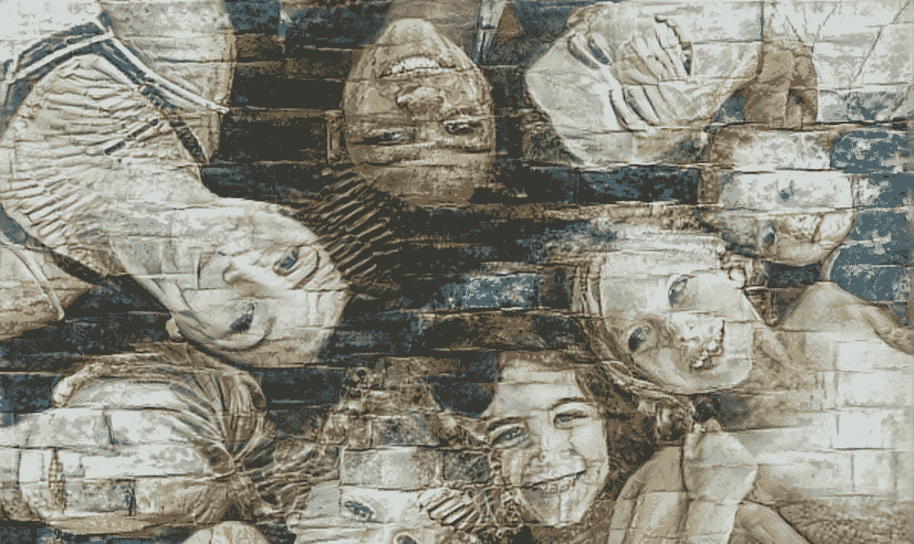
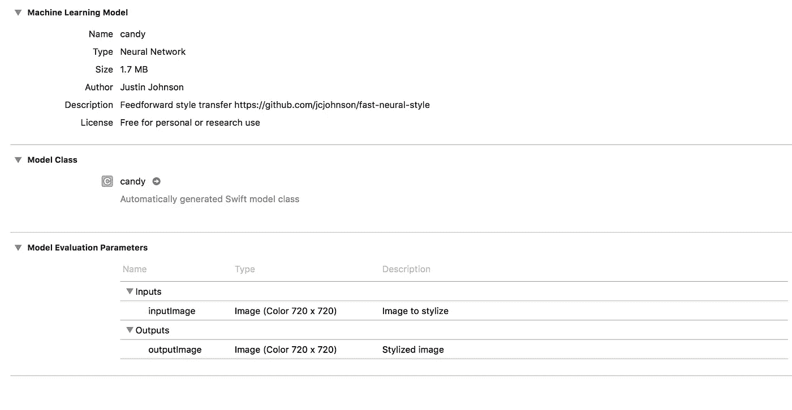
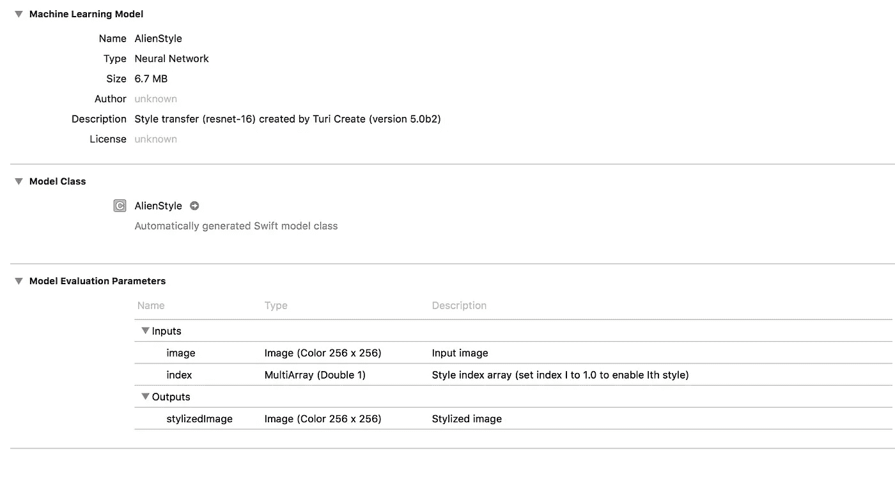

# 创建有效的风格转移

> 原文：<https://medium.datadriveninvestor.com/turicreate-style-transfer-that-works-13b9774c70b1?source=collection_archive---------1----------------------->

[turcreate](https://github.com/apple/turicreate)是苹果用于创建 CoreML 模型的解决方案。TensorFlow 等其他技术也可以构建模型。使用 Tensor，您可以转换为 CoreML 模型以用于 IOS。

苹果在 2018 年 WWDC 上展示的最新版本 5 turcreate 具有创建风格转移模型的新功能。相当狡猾。

因此，我决定在我正在开发的一个新应用程序中测试这个伟大的新工具，以便更快地部署风格转移效果。我们还计划在 RainMaker 照片编辑器中部署它，用于贺卡等[应用。](http://www.rainhut.com/raincards)

但是当我试图在代码中实现一个定制的风格转换模型时，我遇到了错误。我使用直接预测来设计图像。因此，我尝试使用 Vision 框架，但也出现了错误。基本上，这些 Turi 模型有一个需要传递给预测函数的额外特性。

经过几天的研究，在网上没有解决方案，我挖到了代码，想出了它。当其他方法都失败时，扔掉说明书。

下面是两个模型的 Xcode 快照，candy.mlmodel 和 AlienStyle.mlmodel，只要把你的模型拖进 Xcode 就可以了。Candy 是用 Tensorflow 创建的，转换成 CoreML。AlienStyle 是我用 TuriCreate 做的自定义模型。

**TensorFlow 建成模型**

**turcreate 建造模型**

要查看的重要部分是模型评估参数、它们的名称和大小。在 Candy 中，只有一个输入和一个输出参数。但是对于 TuriCreate 的 AlienStyle，有两个输入参数。所以用不同的代码来设计这些模型。

下面是让像 AlienStyle 这样的 TuriCreate 模型在 Xcode 中工作所需的基本代码。如果您想了解更多关于 Swift TuriCreate 模型的信息，请告诉我。

Class for passing both Image and Style Index Array selector

Code for Stylizing an image with TuriCreate built CoreML Model