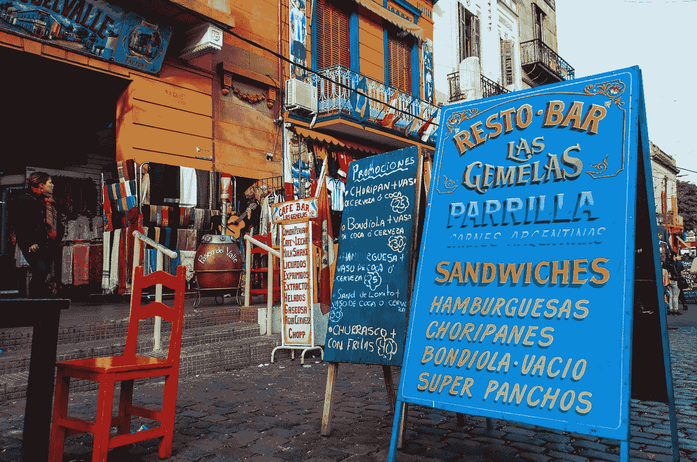

# 土耳其、阿根廷和似曾相识

> 原文：<https://medium.datadriveninvestor.com/turkey-argentina-and-that-d%C3%A9ja-vu-94245631fd65?source=collection_archive---------6----------------------->

土耳其和阿根廷在 20 世纪 80 年代就像是一对经济双胞胎。他们分享了许多关于国际收支、货币危机和国际货币基金组织条件性的故事。这对双胞胎后来分道扬镳，土耳其似乎表现更好。但最近的事件让他们又回到了同一阵营，而这一次，阿根廷似乎处于更有利的地位。让我解释一下。

2018 年 5 月对阿根廷和土耳其来说都是一个不祥的月份。土耳其里拉和阿根廷比索以两位数贬值。两国的中央银行都提高了利率。在这两个国家，罪魁祸首都很容易找到。过去三年经常账户赤字不断上升，债务水平高企，2018 年年初至今(同比)回报率为两位数。考虑到世界正从量化宽松(QE)转向量化紧缩(QT)，这是一个更可怕的组合。土耳其和阿根廷陷入了缩减恐慌，这是投资组合经理通常会怀疑的。唯一的区别是阿根廷的债务是公共的，而土耳其的债务绝大多数是私人的。阿根廷的情况类似于 2001 年的土耳其，而土耳其的情况很像 1997 年的朝鲜。如果你问我的话，这使得阿根廷的危机更容易处理。

阿根廷定于 2019 年 10 月举行总统选举，但该国冒险向国际货币基金组织请求“特殊准入”资源。国际货币基金组织已经在 5 月 18 日举行了一次非正式董事会会议，并“表现出愿意向阿根廷提供‘特殊准入’资源，以恢复市场信心，铺平调整之路”，CSIS 的斯蒂芬妮·西格尔指出，这似乎在那一刻让市场平静下来相比之下，土耳其尚未能为市场提供任何前景，里拉仍在下滑，有可能进一步下跌。为什么？

我认为有三个原因。首先，阿根廷总统马克里于 2015 年上台，有着清白的历史。阿根廷经济的脆弱不一定归咎于他。其次，他已经有了一个财政纪律计划，尽管过于渐进，但这表明马克里明白这个问题。第三，阿根廷总统在美国有一个亲密的朋友网络，包括特朗普总统本人。请注意，美国是 IMF 最大和最有影响力的股东。

与此形成对比的是，土耳其总统埃尔多安自 2002 年以来一直掌权，该国最近一直在远离财政纪律，实际上没有央行独立性，埃尔多安总统在华盛顿似乎也没有朋友。埃尔多安的选举原定于 2019 年 10 月举行，但不得不在本月重新安排。另一方面，马克里肯定有信心到 2019 年底他会过得更好。

地理因素也让土耳其的情况变得复杂。阿根廷与智利、巴西、乌拉圭、巴拉圭和玻利维亚接壤。这肯定比土耳其的邻国要和平得多:叙利亚、伊拉克、伊朗、阿扎尔拜扬、亚美尼亚、格鲁吉亚、希腊、保加利亚，以及在每一条战线上都非常活跃的俄罗斯势力。

也有理由认为土耳其的邻国在未来几年将会更加不稳定。这是因为土耳其许多最易燃的邻国都是石油和天然气出口国。随着生物技术、纳米技术、信息和通信技术的进步，全球对石化产品的需求将不再那么大。这意味着结构性的低油价。这将扰乱这些石油出口国的商业模式，其中许多是租金分配的采邑，而不是民族国家。他们管理如此复杂的转型过程的能力非常值得怀疑。

在拉丁美洲当然有安全因素要考虑，但土耳其的邻国是不同的。这是一个地缘政治因素最重要的地方，需要在经济和社会计算中加以考虑。在接下来的几十年里，我们的邻居会以各种错误的方式变得有趣。如果安卡拉能够从战略角度考虑这个问题，这可能会成为土耳其非常宝贵的资产。如果没有，我们也会继续变得越来越有趣。

[**这篇评论发表在 2018 年 6 月 2 日的《赫里耶每日新闻》上**](http://www.hurriyetdailynews.com/opinion/guven-sak/turkey-argentina-and-d-j-vu-132710)

【www.tepav.org.tr】最初发表于**。**