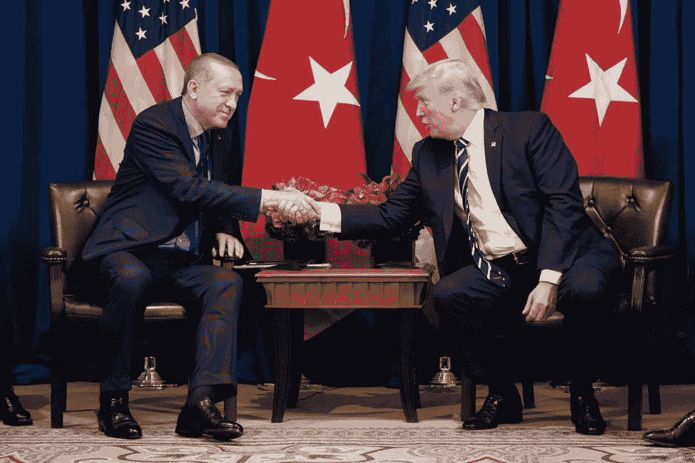

# 土耳其、关税、货币和建筑

> 原文：<https://medium.datadriveninvestor.com/turkey-tariffs-currencies-and-construction-7b93dbd3749f?source=collection_archive---------35----------------------->

Image: Wikimedia

一个关于经济周期、市场阴谋和对抗性外交政策的故事。

2018 年，土耳其股市(Borsa 伊斯坦布尔)以及更引人注目的是，其货币(里拉)损失了大量价值，原因是政治哗众取宠导致相当典型的经济困难失控。

谈到外汇，大多数非 T2 核心国家都在努力平衡资产负债表。在经济景气时期，当地企业和政府倾向于获得欧元和美元的优惠贷款；然而，当事情放缓时，他们偿还这些贷款变得更加困难，这种情况通常会演变成违约、破产、失业和衰退。

土耳其也不例外。在土耳其，好时光是以建筑热潮的形式到来的，虽然为就业和 GDP 增长提供了巨大的刺激，但几乎完全是债务融资。现在泡沫已经破裂，这个国家只剩下[未完成的项目和未偿还的债务。虽然整体经济增长仍然是积极的——尽管很低——但是投资者的信心动摇了，进口原材料和成品价格的上涨帮助推动通货膨胀率达到两位数。](https://www.wsj.com/articles/dreams-turn-sour-as-turkeys-building-boom-sags-1536658200)

经济崩溃一直以缓慢下降的形式发生，但最近的国际事件引发了快速下降。其中之一是美国对进口钢铁和铝实施关税，8 月份，美国对土耳其进口钢铁和铝的关税增加了一倍，此外还实施了个别制裁，以报复 T2 拘留一名美国公民和福音派牧师，罪名是与 2016 年试图推翻政府的 T4 有关的恐怖主义。美国总统唐纳德·特朗普(Donald Trump)和土耳其总统雷杰普·塔伊普·埃尔多安(Recep Tayyip Erdogan)之间的口水战引发了对土耳其资产的大规模抛售，导致里拉几乎在一夜之间暴跌。

让事情更加复杂的是，埃尔多安直接或通过代理人在很大程度上控制着土耳其的货币和经济政策，而不是拥有一个独立和专业的央行。这意味着遏制通胀和阻止里拉贬值所需的措施往往没有及时采取，如果有的话。例如，埃尔多安一直强烈反对提高利率来抑制通货膨胀，而土耳其中央银行在土耳其“危机”开始后的一个多月才不顾总统的反对这样做。

由于许多新兴经济体面临着同样的现实和挑战，一个经济体经历的市场困难往往会传染，土耳其的情况也不例外。里拉的暴跌蔓延到了其他新兴市场货币，并在全球市场产生了连锁反应，这就是为什么这个故事不仅让对土耳其感兴趣的人感兴趣，也让所有投资者感兴趣。这不是第一次出现这种现象，也不会是最后一次。