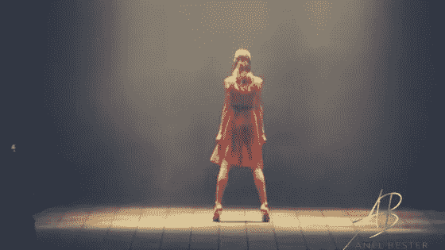

# 把仇恨变成果酱中的花生酱！

> 原文：<https://medium.datadriveninvestor.com/turn-haters-into-peanut-butter-to-your-jam-8e77da13e63e?source=collection_archive---------32----------------------->

如此这般，

你说你是来带来改变的。

扰乱系统。

去治愈生病的，中毒的大众。

你说你是来改变这一切的。

然后…

你在他们面前退缩。

仇恨者。

那些公开批评你观点的人。

向你的作品喷射有毒的酸。

或者，

在那些公开反对你的人不在场的情况下，

你说没人喜欢你的文章，

你的视频没有评论，

这意味着没人注意到。

在没有验证的情况下，

*你不再出现。*

**你怎么敢？**

让我们暂停一下，换个角度来看:

你说你想反对常规，反对流行的观点，

你想说出你的真相，

然后，

如果没有掌声，

如果你没有得到认可，说你和别人的唱诗班唱得很和谐，

你想坐下来保持安静吗？

我会给你我的两分钱，你可以做你想做的。

首先，

**当我决定反对机器的时候，**

在我看来，这个系统通过联系、荣誉、健康、宇宙，

强奸得面目全非。

把价值观变成赚钱的机构，

坦白说

一点都不在乎人性，

我做这件事不是为了得到别人的同意。

我这样做不是为了小孩子。

我甚至都不是为了我的孩子。

我这样做是因为这个系统排斥我。

从童话的角度来看，我相信这是我来这里的目的。

**当我决定利用我们此时可用的技术进步和社交平台时，**

我这么做并不是为了吸引追随者，

或者我的帖子上有上百个赞。

如果那是我的动力，我早就感到失败了。

我从来不相信玩“数字游戏”。

生命不是数字。

一条生命对我来说和一百万条一样重要！

我这样做是因为*我相信*每次我发帖子的时候，某个地方的某个人会花一点时间停下来重新评估他们的生活。

我不需要知道他们或者他们的具体情况。

**当我做出的决定被完全看到的时候，**

尽管我很奇怪，

生的，

未经过滤，

并不总是美好的画面，

我这样做不是因为我想让别人爱我，告诉我我很好。

是的，

第一个憎恨者像蜂王一样蛰人，

留下我的哭泣。

我不明白为什么陌生人会如此可怕，

他们不认识我。

你可以说我天真，

但我从未想过要对另一个人这么做。

一旦我的眼泪干了，鼻涕不再流进我的嘴里，

我走进去，

对我来说，

据我所知，

我接受了这样一个事实:如果我坚持走自己的路

*忠实于我的信仰，*

*真正达到我的目的，*

*真实的我，*

*那我必须愿意接受打击。*

我也知道我必须为自己重新定义这狗屎，

***因为我的拥抱痛苦，***

***但我不服苦。***

我决定把仇恨变成我果酱中的花生酱。

YOM YOM YOM 婊子。

我把它们放进我的冰沙里，放在我的吐司上，我舔了舔勺子，

用他们认为会让我慢下来的东西，

为了激发我的热情，

我的司机，

我的决心。

但是谁在乎我呢？

我想了解你！

我希望你坐下来，诚实地反省一下。

停止说那些让你听起来像个好人的废话。

没人会知道。

这是你和你之间的事。

是时候坦诚面对你真正想要的生活了。

你真的想成为领导者、破坏者、反叛者吗？

在一声孤独的嚎叫在满月下产生共鸣之前，你愿意在黑暗中孤独十年吗？

你真的渴望带来改变吗？

不为别人。

而是因为你不能容忍现状。

你愿意日复一日的出现，

没有公众的掌声，

尽管反对是必然会发生的？

如果没有，

如果你只想简单点，

如果你只想低调行事，

支付账单，

为周末而活，

去度一个愉快的假期，

拥有它！

想要那样没什么不好！

对自己诚实就好。

造成痛苦和折磨的是当人们说他们认为别人想听的话时，

**甚至采取一些行动，**

**而是因为他们出于诚信，**

他们灵魂中的裂缝正在将他们撕裂。

真他妈的扯淡。

我也想说，

如果你还在读书，

你还在点头，

如果你感觉到你内心的决心在增强，

一种炽热的激情，

如果你感到成为领导者的呼声比以往任何时候都高，

**然后锻炼他妈的阳光。**

我们没时间再偷偷摸摸了。

# 这是我对艺术家、反叛者、创意者和革命领袖的挑战！

你的时间到了。

你已经准备好做你来这里要做的任何事了。

站起来，

走上舞台，

带上你自己的灯，

让你们的声音被听到。

不是为了数百万人，

但是对于一个人来说。

你敢再坐下来。

死亡就在你身边。

如果你闭上眼睛，你可以感觉到她的影子轻轻地碰着你的手臂。

但你还没死。

你仍然可以选择茁壮成长。

你的选择是什么？

带着爱和感激，

阿内尔