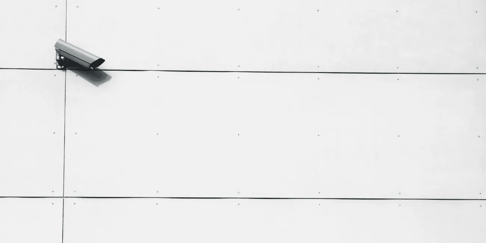

# 把你的旧智能手机变成一个安全摄像头

> 原文：<https://medium.datadriveninvestor.com/turn-your-old-smartphone-into-a-security-camera-514c5418cf9b?source=collection_archive---------20----------------------->

## 不用购买昂贵的家庭安全系统，这里有一个应用程序，可以把你的旧智能手机变成最先进的安全摄像头..

*最初发表于*[*【millennialmoderator.com】*](https://millennialmoderator.com/turn-your-old-smartphone-into-a-security-camera)*。*

家庭安全不是闹着玩的，你住的离城市越近，入室盗窃的几率就越高。但是当涉及到安全摄像头时，有大量昂贵的选项，并且需要时间来学习如何使用。现在有一个应用程序可以把你的智能手机变成一个安全摄像头-这是一个非常有效的方式来使用你的旧技术！

# 阿尔弗雷德视频监控摄像机

Alfred 应用程序提供了大量将智能手机变成安全摄像头的强大功能。只需将应用程序下载到您计划用作摄像头的设备上，以及您用来监控提要的设备上。您可以选择哪个设备用于什么用途！该应用程序提供了大量功能:

*   远程访问，这样你就可以在任何地方直播你的 feed(也许在[远程工作的时候](https://millennialmoderator.com/where-to-find-remote-freelance-jobs)？)
*   运动传感器和即时警报，让您随时知道发生了什么
*   免费云存储来存储您的视频
*   对讲机功能，以便您可以通过设备扬声器进行通话
*   强大的缩放功能，让您可以捕捉每一个小细节

你可以下载适用于安卓系统的 Alfred 应用程序。一旦您的摄像机启动并运行，您还可以从[网络浏览器](https://alfred.camera/webapp2/)查看实时流，以增加监控灵活性。

你觉得这个应用有用吗？如果是这样，请考虑订阅我的私人简讯，在那里我会分享其他有价值的商业工具、技术指南和个人提升技巧。一如既往，请考虑使用下面的链接分享这篇文章，让我们在 [Twitter](https://twitter.com/alekseyweyman) 上连线！

标记为: [TechApps](https://millennialmoderator.com/turn-your-old-smartphone-into-a-security-camera#)

*最初发表于*[T5【millennialmoderator.com】](https://millennialmoderator.com/turn-your-old-smartphone-into-a-security-camera)*。*