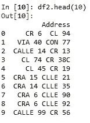

# 将地址转换成坐标

> 原文：<https://medium.datadriveninvestor.com/turning-addresses-into-coordinates-de6198b22905?source=collection_archive---------3----------------------->

[](http://www.track.datadriveninvestor.com/1B9E)

## 在 Python 中使用谷歌地图地理编码 API。


Photo by [Robert Penaloza](https://unsplash.com/@robertography?utm_source=medium&utm_medium=referral) on [Unsplash](https://unsplash.com?utm_source=medium&utm_medium=referral)

大学的最后一年，我作为一名数据科学家在做一个项目(这是我第一次以官方数据科学家:D 的身份工作)。在数据转换阶段，一个关键步骤是将地址转换为坐标，因为该项目的主要目标是创建一个时间序列模型，该模型可以预测每月道路交通事故的数量(在城市的不同区域)。

为了寻找这个问题的解决方案，我找到了谷歌的[地理编码 API](https://developers.google.com/maps/documentation/geocoding/start) 。本文的目的是解释如何使用 Python 来使用这个强大的工具。我们开始吧！

# 安装谷歌地图库

第一步是安装库，对于 python 这个过程和任何其他流行的 Python 模块是一样的，你可以通过 pip 或者 conda 安装谷歌地图库。

使用画中画:

```
pip install googlemaps
```

使用 Anaconda:

```
conda install -c conda-forge googlemaps
```

安装完成后，您将需要一个 API 密钥。为此你需要一个谷歌云账户，谷歌[在这里](https://cloud.google.com/maps-platform/?__utma=102347093.476252061.1546922996.1548561922.1548561922.1&__utmb=102347093.0.10.1548561922&__utmc=102347093&__utmx=-&__utmz=102347093.1548561922.1.1.utmcsr=(direct)|utmccn=(direct)|utmcmd=(none)&__utmv=-&__utmk=131204495&_ga=2.53883944.161471614.1548544866-476252061.1546922996#get-started)非常清楚地描述了这些步骤。

# 使用 API

每个请求的使用成本为 0.005 美元，因此 1000 个请求将花费您 5 美元，但每个月的前 40，000 个请求是免费的。


[source](https://developers.google.com/maps/documentation/geocoding/usage-and-billing)

在 Python 中，您只需要导入 *googlemaps* 模块，并使用 API 键创建一个客户端。

```
import googlemaps
KEY = 'INSERT_MAPS_API_KEY_HERE'
gmaps = googlemaps.Client(key=KEY)
```

现在，使用 Google Maps 客户端的函数 *geocode* 将地址作为字符串传递，用户将收到一个具有以下结构的 JSON:

```
{
   "results" : [
      {
         "address_components" : [
            {
               "long_name" : "277",
               "short_name" : "277",
               "types" : [ "street_number" ]
            },
            {
               "long_name" : "Bedford Avenue",
               "short_name" : "Bedford Ave",
               "types" : [ "route" ]
            },
            {
               "long_name" : "Williamsburg",
               "short_name" : "Williamsburg",
               "types" : [ "neighborhood", "political" ]
            },
            {
               "long_name" : "Brooklyn",
               "short_name" : "Brooklyn",
               "types" : [ "sublocality", "political" ]
            },
            {
               "long_name" : "Kings",
               "short_name" : "Kings",
               "types" : [ "administrative_area_level_2", "political" ]
            },
            {
               "long_name" : "New York",
               "short_name" : "NY",
               "types" : [ "administrative_area_level_1", "political" ]
            },
            {
               "long_name" : "United States",
               "short_name" : "US",
               "types" : [ "country", "political" ]
            },
            {
               "long_name" : "11211",
               "short_name" : "11211",
               "types" : [ "postal_code" ]
            }
         ],
         "formatted_address" : "277 Bedford Avenue, Brooklyn, NY 11211, USA",
         "geometry" : {
            "location" : {
               "lat" : 40.714232,
               "lng" : -73.9612889
            },
            "location_type" : "ROOFTOP",
            "viewport" : {
               "northeast" : {
                  "lat" : 40.7155809802915,
                  "lng" : -73.9599399197085
               },
               "southwest" : {
                  "lat" : 40.7128830197085,
                  "lng" : -73.96263788029151
               }
            }
         },
         "place_id" : "ChIJd8BlQ2BZwokRAFUEcm_qrcA",
         "types" : [ "street_address" ]
      },

   ... Additional results truncated in this example[] ...

   ],
   "status" : "OK"
}
```

经纬度坐标将在*几何图形*部分。

# 例子

为了说明我如何在我的最终项目中使用 API，我将使用我正在处理的数据的 10 个地址。



数据集来自一个城市，那里的街道可以用名字或数字来称呼。如你所见，有非常不同的格式。位置 *4* 的地址可以写成*‘穆里略孔 19’*或*‘卡列 45 卡雷拉 19’*或*‘CLLE 45 CRA 19’*等。有些地址实际上是用“CRA”开头的。

我写了一个函数，如果 API 响应成功，返回给定地址的纬度和经度值列表，如果不成功，返回缺失值 *NaN* 。然后，调用 *apply* 将列表作为两个不同的列添加到 Pandas 数据框中。

```
def get_coordinates(address):
    city = '<City Name>, <Country>'
    geocode_result = gmaps.geocode(str(address) +' '+ city)
    if len(geocode_result) > 0:
        return list(geocode_result[0]['geometry']['location'].values())
    else:
        return [np.NaN, np.NaN]
```

包含城市和国家的名称是提高 API 性能的最佳方式。

```
coordinates = df2['Address'].apply(lambda x: pd.Series(get_coordinates(x), index=['LATITUDE', 'LONGITUDE']))df2 = pd.concat([df2[:], coordinates[:]], axis="columns")
```


所以我们完了！所有的地址都被转换成坐标，剩下的工作就是检查这个过程之后你有多少个 NaN 值。(在我的例子中，总共 25，000 个地址中几乎有 160 个)我建议绘制这些点，以检查它们是否都在预期的城市中。[底图](https://matplotlib.org/basemap/)是一种简单的方法。

最后一个建议是，如果有大量地址，这个过程可能需要几个小时才能完成。我使用 [Kaggle](http://kaggle.com/) 中的内核执行代码，该内核将 df2 生成为 CSV 文件，该过程在 Kaggle 服务器上运行，您可以继续进行项目的其他部分。