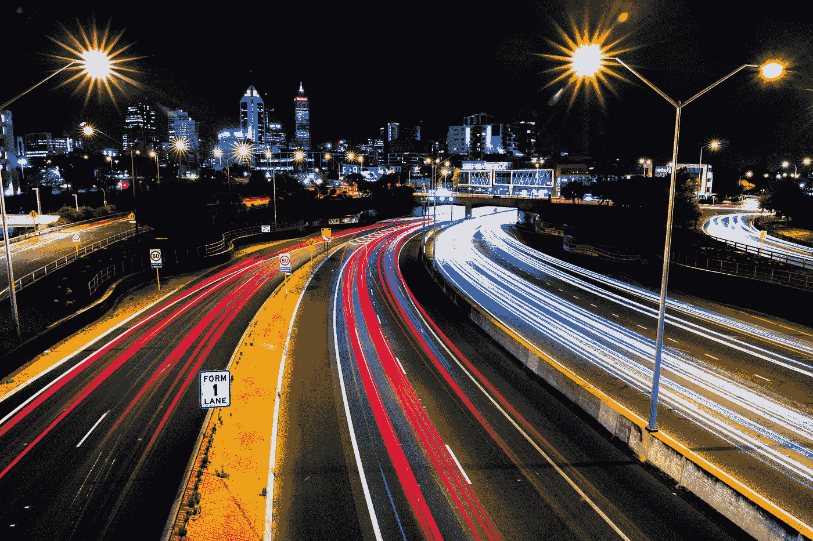
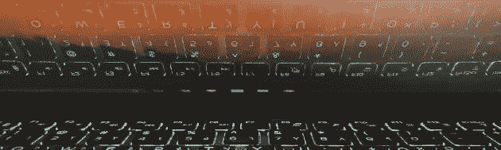

# 在信息高速公路上掉头

> 原文：<https://medium.datadriveninvestor.com/turning-around-on-the-information-highway-f8f32522f13f?source=collection_archive---------6----------------------->

Photo by [Amarnath Tade](https://unsplash.com/@amarnathtade?utm_source=medium&utm_medium=referral) on [Unsplash](https://unsplash.com?utm_source=medium&utm_medium=referral)

> “我们在知识中失去的智慧在哪里？我们在信息中丢失的知识在哪里？”
> ― **艾略特**

自从 24 小时新闻周期开始以来，我们现在发现自己所处的信息高速公路已经经历了一个多产的增长率，随着互联网和移动技术的出现，这种增长更加明显。我们被来自无数渠道的新闻狂轰滥炸，每一个新的标题都比上一个更拼命地抓住我们的注意力。

所有的点击诱饵、错误信息、夸大其词、不道德的报道——媒体在向公众传递新闻的记录上的显著瑕疵，把这种无休止的信息流变成了反问。

 [## 2019 年即将改变世界的技术|数据驱动的投资者

### 很难想象一项技术会像去年的区块链一样受到如此多的关注，但是……

www.datadriveninvestor.com](https://www.datadriveninvestor.com/2019/01/17/the-technologies-poised-to-change-the-world-in-2019/) 

不幸的是，我们已经到了这样一个地步，信息的传递变得如此微妙、如此错综复杂、如此复杂，以至于越来越难区分可靠的来源和不可靠的来源，或者准确猜测是否有其他利益在起作用。当然，我们现在知道某些消息来源是有偏见的，无党派的；我们生活在一个现实中，我们对每个故事都是半信半疑。但是某些偏见有多根深蒂固呢？在我们和技术之间的即时性和前所未有的带宽的现代背景下，信息实际上是如何被控制的？

假新闻——我们懂了。广告影响——我们也知道。很大一部分敏感信息不应公之于众——我们轻蔑地同意这一点。但是更深层和更黑暗的动机是什么呢？怀疑的商人和没有任何意义的机器人算法？对于我们来说，暴露在这种无休止的信息冲击中有多健康——真实与否，妥协与否，大部分是悲观和分散注意力的？

此外，对我们来说，知道世界上每一个角落、每一天都在发生什么事情可能并不自然。虽然这个旋转的蓝色大理石很漂亮，但它也有一些黑点，如果旁观者看得足够久，这些黑点会成为他们游行的亮点。

因此需要一个解决方案。是的，我们可以试着断开连接，或者我们可以试着设定界限。我们可以避免和回避，但这不是一个主动的解决方案。幸运的是，有一些更实质性的事情可以做，从一个人的头脑中喷涌而出，他甚至没有在过去的二十年里看到这种信息传输变得多么荒谬。

> “你是一个探险家，你代表着我们的物种，你能做的最大的好事就是带回一个新的想法，因为我们的世界正因为缺乏好的想法而濒临灭绝。我们的世界因为意识的缺失而陷入危机。”特伦斯·麦肯纳

麦肯纳因许多事情而闻名，其中最著名的是他的精神鼓励，但他对技术和我们在这个信息矩阵中的位置的思考现在比以往任何时候都更值得关注。

尽管他对社会结构进行了严厉的批评，主要针对编织社会结构的权力结构，但麦肯纳始终对技术、互联网和我们技术能力的未来保持着坚定的乐观。

因此，在他的话语深处，我找到了一个解决方案，乘着他的血性之波，抓住他充满希望的视角，就像一个安慰的浮标，让我们相信我们实际上处于一个非凡局面的顶峰。

这种情况下，任何能上网的人都能得到启发。由此，在线可获得的堆积如山的内容流不仅仅是由那些有权访问特权等级的资源的人创建的。

这不仅仅是吹捧我们的新奇前景，以扩大我们的存在并到达世界的各个角落——这是对信息高速公路的彻底解构，是我们与内容互动方式的重新发明。也许特伦斯能更好地解释。

> “这是一场关于如何看待和感受世界的斗争。只要你只是在消费来自有毒分配系统的手段，你就是一个受害者和一个标记，所以我们必须做的是生产，把东西送上电线……
> 
> ……你应该把你的信息放在那里，我们都应该生产尽可能多的艺术。我认为我们，这个世界上的富人(我们都属于这个阶层，占地球人口的上 5%)被允许的休闲和放纵，除非你有所回报，否则你无法与自己共存…
> 
> …分享你的艺术，分享你的灵魂。我们被我们的制度如此控制、虐待和误用的原因是因为我们彼此分离。他们以种族、阶级、性别、政治风格等各种方式将我们分割开来，而事实上，拥有一个未来，建设一个让孩子们在合理的期望下成长、人性得以保护的未来，符合每个人的利益…
> 
> ……这些大众媒体——广播电视、报纸，这是一小群人为亿万人设定议程的地方。**这叫自上而下，或者一对多的沟通。互联网提供的是一种叫做“任何对任何沟通”的东西** … **竞技场已经变得非常平坦。然后，我们生产的产品质量会进一步改变这种平衡。**”

我们每个人现在都有能力承担信息来源的角色，在哪里比在媒体上更好地表达这样的观点。

我们可以创造艺术——视觉的或文学的，物理的或听觉的。我们可以影响，我们可以激发兴趣，抓住耳朵，让眼睛流泪。我们可以制造，我们可以协助，我们可以建议。我们可以像病毒一样传播，我们可以影响变化，我们可以引发运动。

这篇文章可能有时代错误的味道，因为它似乎应该是几十年前写的。这些我们已经知道了很多，但是面对某些信息媒体的不宽容的做法，我们仍然有必要大声疾呼。

如果有的话，这应该只是一个提醒，作为继续做我们正在做的事情和制作伟大内容的动力，无论这些内容可能是什么。

下一个问题:我们如何确保我们的创造力不被利用？

[**继续阅读:从你的内容中获取更多:从我的暂停介质账户**](https://medium.com/datadriveninvestor/getting-more-out-of-your-content-lessons-learned-from-having-my-medium-account-suspended-67f8354f2670) 中吸取教训

A forced break from the platform provided me with some invaluable insight into this content-sharing network