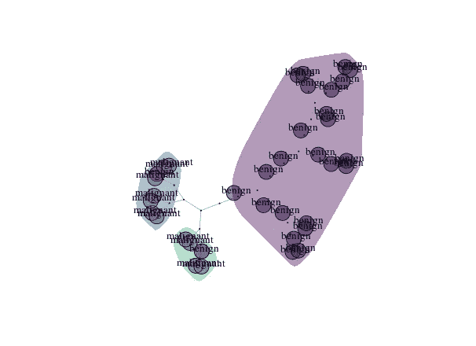
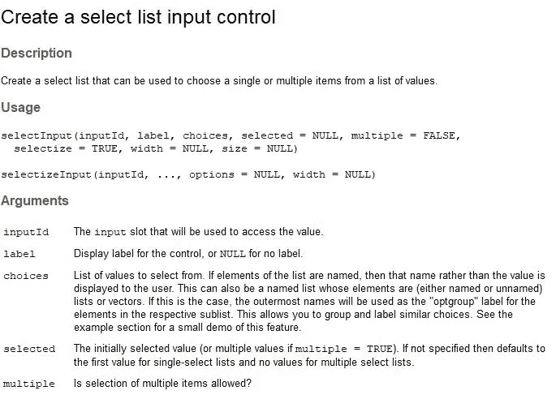
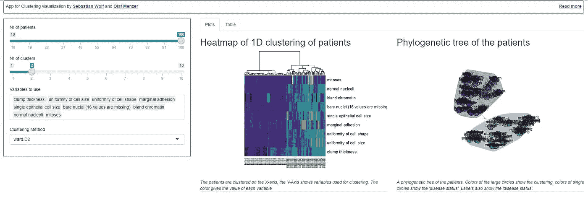

# 教程:R shiny 可视化活检数据的应用程序——在一家制药公司

> 原文：<https://medium.datadriveninvestor.com/tutorial-an-app-in-r-shiny-visualizing-biopsy-data-in-a-pharmaceutical-company-f15f06395f3e?source=collection_archive---------9----------------------->

[](http://www.track.datadriveninvestor.com/1B9E)

## 了解如何构建一个出色的应用程序来可视化聚类结果。该应用程序有助于更好地识别患者数据样本，例如在临床研究期间。



本教程是一个共同的工作成果。该教程由 [Olaf Menzer](https://github.com/olaf-menzer) 在 2018 年旧金山 [ODSC 西部会议的一个研讨会上展示。](https://odsc.com/training/portfolio/visual-elements-of-data-science) [Sebastian Wolf](https://github.com/zappingseb) 作为生物制药网络应用领域的专家参与了该应用的实施。

# 是关于什么的？

这个应用程序背后的故事来自于一个真实的应用程序，它在诊断领域评估临床研究。

由于临床研究的快速招募，患者队列似乎是不均匀的。因此，一名研究人员和一名临床研究统计学家想要找出，通过哪个参数，他们可以找到似乎不符合他们期望类别的患者。可能是病人疾病状态的标注有误？也许一次测量或者两次测量就可以轻松找到这样的患者？

这里使用的示例数据是来自 1990 年研究的真实数据，称为活检数据集，[也托管在 UCI ML 数据存储库](https://archive.ics.uci.edu/ml/datasets/breast+cancer+wisconsin+(original))。应该在本教程中构建的应用程序是初步的，是专门为本教程构建的。它的一部分被应用到现实世界的生物统计学应用中。

# 出发点

请在[https://github.com/zappingseb/biopharma-app](https://github.com/zappingseb/biopharma-app)开始分叉教程

然后在 R 会话中运行依赖项的安装:

```
install.packages(c("ape","dplyr","magrittr","igraph","viridisLite","MASS","shiny"))
```

如果你已经安装了所有的包，你将有一个文件可以使用。这个文件是`app.R`。这个`app.R`允许你构建一个[闪亮的](https://shiny.rstudio.com/)应用程序。

我们将使用这个文件为研究者插入正确的可视化和正确的表格，以完成上述任务。为了检查应用程序最终会是什么样子，你已经可以在控制台中执行`runApp()`，你的浏览器将会打开应用程序。

该应用已经包含:

一个拥有我们需要的所有输入的`sideBarPanel`

*   患者数量滑块
*   所需集群/组数量的滑块
*   选择测量值的空白输入—由您完成
*   聚类方法的下拉字段

一个`server`功能将提供

1.  用于选择测量的空输入
2.  查看聚类结果的热图
3.  一个系统进化树图来观察聚类的结果
4.  查看聚类结果的表

它已经包含了为您提供输入数据集`biopsy`和`biopsy_numeric()`的功能，因为`biopsy_numeric`是一个[反应](https://shiny.rstudio.com/tutorial/written-tutorial/lesson6/)。

在本教程中，我们将通过步骤 1-4 来构建应用程序

# 输入数据集

数据集内的患者来自威斯康星大学麦迪逊医院的 William H. Wolberg 医生。截至 1992 年 7 月 15 日，他评估了 699 名患者的乳腺肿瘤活检；九个属性中的每一个都按照 1 到 10 的范围进行了评分，结果也是已知的。有 699 行和 11 列。

数据集可以通过应用内部的变量`biopsy`调用。列 2-10 被存储在反应`biopsy_numeric()`中，其被`input$patients`输入过滤以不使用所有 699 个患者，但是在 1 和 100 之间。

# 1)构建一个`SelectInput`

`SelectInput`应允许用户不使用所有 9 个测量变量，而只使用他想要的变量。这将有助于找到对患者进行分类所必需的测量值。什么是闪亮的选择输入？因此，我们可以通过下式来看选择输入的描述

```
?shiny::selectInput
```

看看吧



我们现在需要构建`choices`作为活检数据集 2-10 的列名。`selected`输入将是相同的。我们将允许多个输入，因此`multiple`将被设置为`TRUE`。此外，我们将把`inputId`命名为“变量”。所以我们可以用下面的代码替换`app.R`文件中的部分`output$variables`:

```
output$variables <- renderUI({
    selectInput(inputId="vars", 
                label = "Variables to use", 
                choices = names(biopsy)[2:10],
                multiple = TRUE,
                selected = names(biopsy)[2:10]
    )
  })
```

你就完了。

# 2)查看聚类结果的热图

基本的`[heatmap](https://stat.ethz.ch/R-manual/R-patched/library/stats/html/heatmap.html)`功能允许您绘制热图。在这种情况下，我们想改变一些事情。我们希望将`hclust`函数中的聚类方法改为用户定义的方法。我们可以通过使用`input$method`来获取用户定义的方法，因为我们已经将该输入字段定义为一个下拉菜单。我们必须通过以下方式用我们的方法覆盖默认的 hclust 方法:

```
my_hclust <- function(...){
      hclust(method=my_method,...)
    }
    my_method <<- input$method
```

请注意，您在这里定义了一个全局变量`my_method`，这在本教程的范围内就足够了。但是，请记住，全局变量在许多其他情况下可能会有问题，请自行研究最适合您的应用程序的方法。

现在，对于热图呼叫，我们基本上需要更改一些输入。请看结果:

```
heatmap(x = t(as.matrix(biopsy_numeric())), Rowv=NA, hclustfun=my_hclust,
            labCol =biopsy$"disease status",
            col=viridis(15)
    )
```

我们需要转换 biopsy_numeric 矩阵，因为我们希望将患者放在列中。由于只有一维聚类，我们可以通过将`Rowv`设置为`NA`来切换行标签。`hclustfun`被我们的函数`my_hclust`覆盖。

对于图的着色，我们使用`viridis`调色板，因为它是一个色盲友好的调色板。我们列的标签现在不仅是病人 id，还有疾病状态。您可以看到我们在文件`R/utils.R`中定义的所有列的名称。你可以看到`biopsy`的最后一栏叫做“疾病状态”。这将用于标记每个患者。现在我们有了:

```
output$plot1 <- renderPlot({
    my_hclust <- function(...){
      hclust(method=my_method,...)
    }
    my_method <<- input$method
    heatmap(x = t(as.matrix(biopsy_numeric())), Rowv=NA, hclustfun=my_hclust,
            labCol =biopsy$"disease status",
            col=viridis(15)
    )
  })
```

第 2 部分已经完成

# 3)绘制系统进化树

为了绘制系统进化树，我们提供了一个名为`phyltree`的函数。你可以阅读`R/utils.R`里面函数的全部代码。该函数将作为输入

*   `biopsy_numeric()`一个数值矩阵>检查
*   `input$method`检查聚类方法>
*   `input$nc`检查集群的数量
*   `viridis`检查颜色功能>

你可以在这里阅读为什么要在`biopsy_numeric` [后面使用`()`。](https://shiny.rstudio.com/tutorial/written-tutorial/lesson6/)

现在最难的部分是标签。`biopsy_numeric`数据集根据患者数量进行过滤。因此，我们也必须过滤标签。因此我们使用

```
labels = biopsy %>% dplyr::select("disease status") %>% 
                filter(row_number() <= input$patients) %>% 
                mutate_all(as.character) %>% 
                pull("disease status")
```

这是一个使用 R 包`dplyr`的函数式编程的工作流程。功能`select`允许我们只选择“疾病状态”。`filter`函数过滤行数。`mutate_all`函数将`as.character`函数应用于所有列，最后我们使用`pull`将标签导出为向量。

*   `biopsy %>% ...`检查树节点标签

最终的结果看起来是这样的

```
output$plot2 <- renderPlot({
    phyltree( x = biopsy_numeric(),
              method = input$method,
              nc = input$nc,
              color_func = "viridis",
              labels = biopsy %>% dplyr::select("disease status") %>% 
                filter(row_number() <= input$patients) %>% 
                mutate_all(as.character)%>% 
                pull("disease status")
    )
  })
```

# 4)根据聚类结果创建一个表

现在，我们还想了解每位患者被分配到哪个组群。因此，我们自己执行聚类和树切割:

```
clust <- hclust(dist(biopsy_numeric()), method = input$method)
cluster_assigment = cutree(clust, k = input$nc) #cluster assignement
```

cluster_assignment 现在是一个向量，其中包含每个患者的集群编号，例如`c(1,2,1,1,1,2,2,1,...)`。如果我们将这些信息与 patientID 和 patients 表单中指定的疾病状态结合起来，会很有帮助。

该任务将使用 R:

```
out_table <- cbind(
      cluster_assigment,
      biopsy %>% filter(row_number() <= length(cluster_assigment)) %>% select(c(1,11))
    )# cbind
```

现在，该表将按`cluster_assigment`排序，以便更快地查看哪些患者落入了错误的群组。

```
out_table %>% arrange(cluster_assigment)
```

最终代码:

```
output$cluster_table <- renderTable({

    # --------- perform clustering ----------------

    # Clustering via Hierarchical Clustering
    clust <- hclust(dist(biopsy_numeric()), method = input$method)
    cluster_assigment = cutree(clust, k = input$nc) #cluster assignement

    # Create a table with the clusters, Patient IDs and Disease status
    out_table <- cbind(
      cluster_assigment,
      biopsy %>% filter(row_number() <= length(cluster_assigment)) %>% select(c(1,11))
    )# cbind
    # Order by cluster_assigment
    out_table %>% arrange(cluster_assigment)
  }

)
```

完成的

# 现在该怎么办？

现在您可以运行`runApp()`功能。



如果你选择 100 个病人，2 个集群，“病房。D2“聚类和所有变量你会很快看到，病人:

*   1002945
*   1016277
*   1018099
*   1096800

可能被归类错的病人。现在，您可以去搜索聚类中的问题，或者查看这些患者的病历。通过更改标签，例如在`phyltree`函数调用中使用 PatientIDs，您甚至可以检查哪些其他患者显示出与这些患者相近的测量值。**探索和游戏！**

# 进一步阅读

*   [了解对制药应用重要的其他包装](https://towardsdatascience.com/interesting-packages-taken-from-r-pharma-e89639788180)
*   [数据科学的视觉元素](https://odsc.com/training/portfolio/visual-elements-of-data-science)
*   [了解如何构建定制的闪亮输入](https://medium.com/@zappingseb/7-steps-that-make-custom-inputs-in-shiny-easy-504b303a2973)
*   学习如何在团队中快速起步