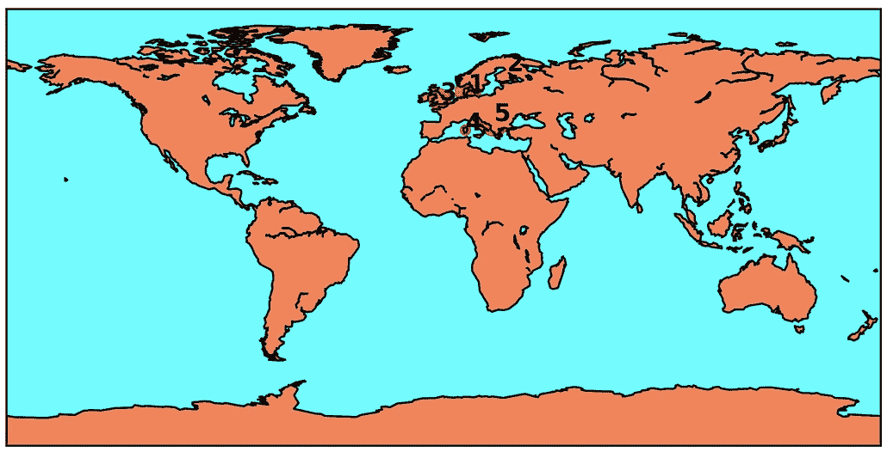
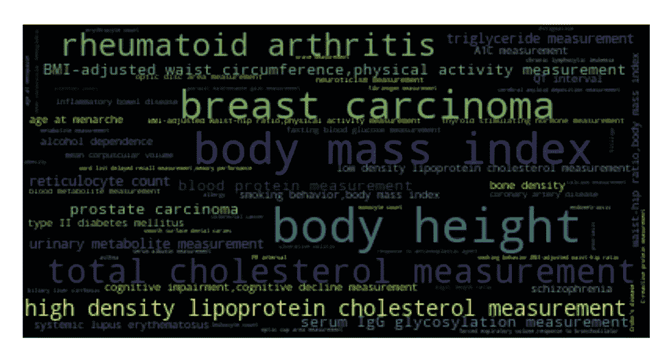
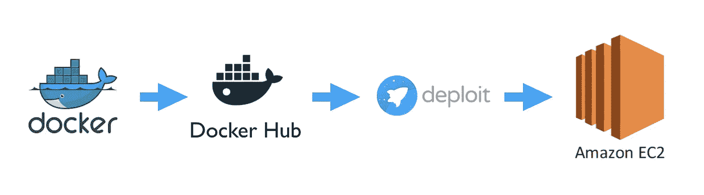
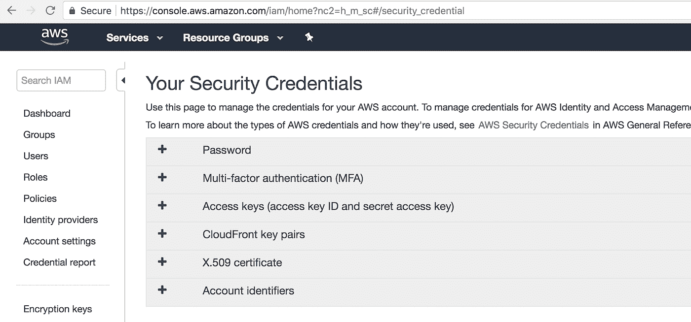
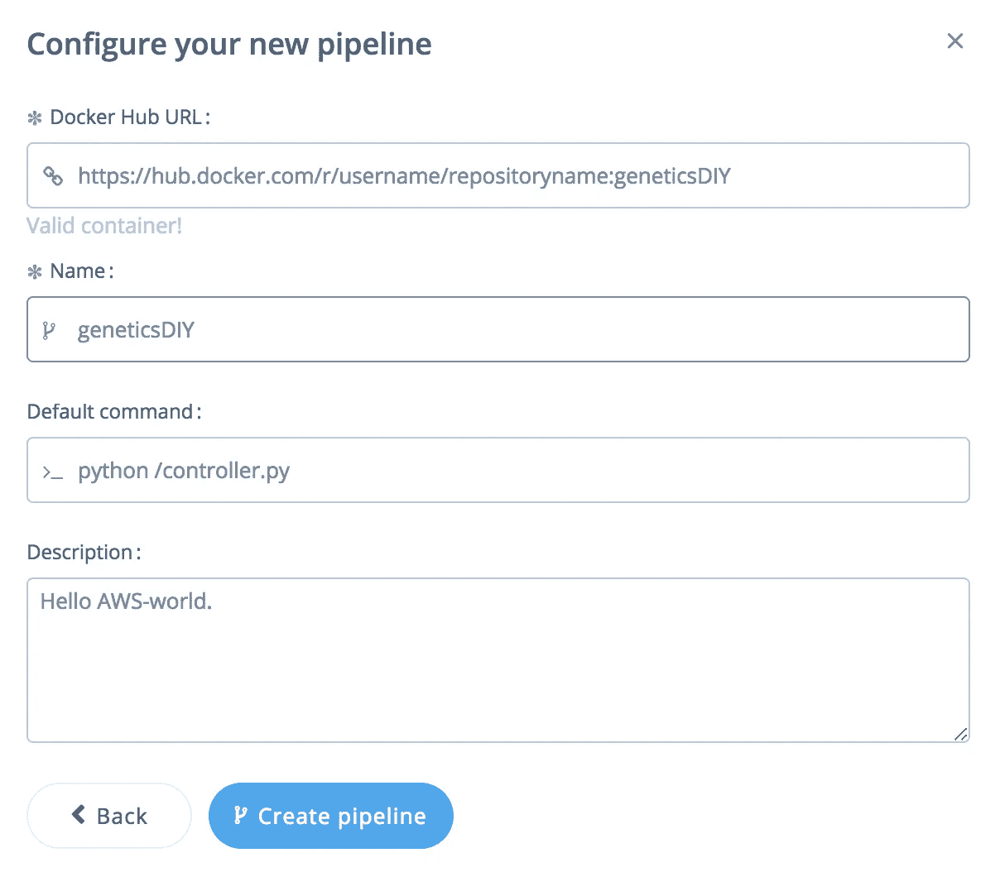
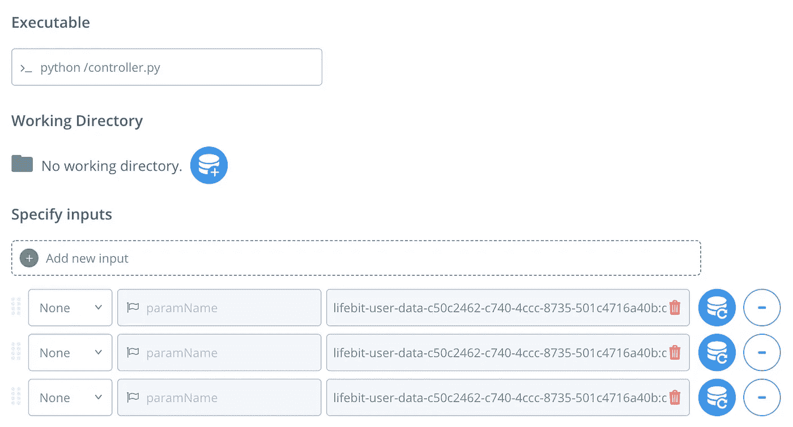
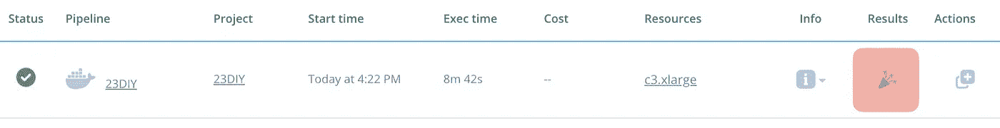
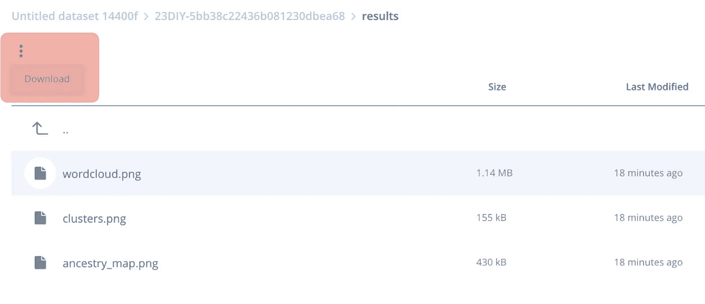

# 教程:在 15 分钟内启动你的个人基因组云应用(aws/genetics/python/ML)

> 原文：<https://medium.datadriveninvestor.com/tutorial-launch-your-personal-genomics-cloud-app-in-15-min-aws-genetics-python-ml-b0d1540e6e70?source=collection_archive---------12----------------------->



The outputs we will create: a map of your ancestry, a word-cloud of genetic traits and their frequency, and a t-SNE cluster of how traits correlate.

有没有想过学习使用 **AWS** ，钻研**遗传学**，或者用 **python** 摆弄 **ML** ？如果是这样，你很幸运，因为本教程正是关于这一点的！具体来说:

*   对原始的 23andMe 文件进行数据挖掘，寻找祖先+独特特征
*   使用 matplotlib/word cloud/base map/geo py 进行可视化
*   基于 K-均值+ t-SNE 降维的最大似然法
*   使用 docker+deploit 平台在 AWS 上部署

这一切都在 **~100 行 python** 中。然而，对于没有耐心的人(希望保持在承诺的 15 分钟之内)，可以通过 GitHub 和 Docker Hub 获得源代码；在这种情况下，您可以按照我这里的说明[部署现成的实现](https://github.com/thousandroses/geneticsdiy)。

*免责声明:A)部分代码改编自在线资源，该项目依赖于众多开源项目(参考文献附后)。感谢这些开发者让这个项目成为可能！b)创建的可视化并不意味着做出事实/医学声明，应该被解释为艺术而不是硬科学——也就是说，我知道它们在遗传学/统计学/ML 方面并不完全严谨*

编辑:祖先回购离线时出现了一个问题(作者可以 pm 我，如果他们希望我删除它)，所以代码已被修改为使用镜像。如果还有困难，请告诉我。

# 1)我们将创造什么，如何创造

我们将编写的脚本采用 23andMe 数据(如果您愿意，也可以是您的)，并创建这些简洁的可视化:

*   显示与你的基因变异相关的特征的单词云。也就是说，变化可能(强调 ***可能*** )与使你……嗯:你的方面有关。
*   一幅世界地图，显示你在某些种族群体中的血统比例
*   一个 t-SNE 降维图，展示了你不常见的受基因影响的特征是如何聚集在一起的。

代码将在 docker 容器(想想:轻量级 VM)中运行，使用 d [eploit](https://deploit.lifebit.ai/) 生物信息学平台部署在 [AWS](https://aws.amazon.com/) 上(该平台从 [Docker Hub](https://hub.docker.com/) 存储库中检索 d [ocker](https://www.docker.com/) 容器——类似 Docker 的 GitHub)。Deploit 允许轻松地将容器部署到 Amazon EC2，它对个人和社区使用都是免费的，也就是说*您不需要为 atm* 支付一分钱！



We’ll dockerize our python code, push it to Docker Hub, retrieve it in deploit, and deploy it in an EC2 instance

# 2)下载输入数据

接下来，让我们检索两个参考文件和一个示例 23andMe 原始数据文件。23andMe 文件由与你表达的基因变异相对应的行组成。这些[单核苷酸多态性](https://en.wikipedia.org/wiki/Single-nucleotide_polymorphism)(SNPs——读作“SNPs”)影响了许多个体特征。例如，发色或你不喜欢香菜的倾向。因此，我们将使用此文件来挖掘关于您(或匿名 openSNP 参与者)的信息！).应用程序需要的三个文件如下:

1.  欧洲生物信息学研究所制作的 CSV 文件，记录了来自数千项研究的 SNP-表型关联。你可以从[这里](https://bitbucket.org/thousandroses/reference_file/src/master/refpanel_public_ref.gz)下载。
2.  评估你的祖先的文件。从[这里](https://www.ebi.ac.uk/gwas/api/search/downloads/full)下载(重命名为 gwas_catalog.tsv)
3.  一个 23andMe 文件——你可以从[我的 GitHub repo](https://github.com/thousandroses/geneticsdiy) 下载一个 23andMe 样本文件。

将三个文件放在同一个文件夹中。如果您希望使用自己的 23andMe 数据，请用自己的文件替换 23andme.txt。

# 3)潜入！编写代码

现在是有趣的部分。首先创建一个名为“geneticsdiy”的文件夹，其中包含三个空文件:controller.py、Dockerfile(没有文件扩展名)和 requirements.txt。[这是整个文件，我将逐行浏览:](https://github.com/thousandroses/geneticsdiy/blob/master/controller.py)

第 1 行到第 18 行:导入所有好东西

第 21–48 行:脚本的主函数，它导入数据，进行预处理，调用 ancestry.cpp 函数来查找您的祖先，并调用各种图像创建函数。

第 22 行:方便参考的文件名列表。

第 23 行:使用[列表理解](https://www.pythonforbeginners.com/basics/list-comprehensions-in-python)，我们重命名输入文件并将它们复制到 docker 容器的根目录。

第 24 & 25 行:我们 gzip 了 23andMe 文件(ancestry c++可执行文件要求的格式)。

第 26 行:我们使用 python 的 subprocess.call 方法来调用祖先估计 c++模块，该模块使用概率聚类将我们的 DNA 与众多参考人群的 DNA 进行比较(详见 [Pritchard 的 bitbucket](https://bitbucket.org/joepickrell/ancestry) )。输出是文件名测试列表。*.我们将检索它来创建祖先图图像。您可以将“2”更改为一个更大的数字，以使估计更准确，但运行时间会更长。

第 27 & 31 行:我们使用 [pandas](https://pandas.pydata.org/pandas-docs/stable/10min.html) 模块读取我们的 reference 和 23andMe 文件作为类似电子表格的 DataFrame 对象，并重命名一些列。

第 28–30 行:删除非数字值，并仅选择参考文件中已被发现具有统计显著性的 SNP- [表型](https://en.wikipedia.org/wiki/Phenotype)关联数据，用于人群中不常见的 SNP。

第 32 行:去掉特征描述之间的空格。

第 33–36 行:为我们的两个数据框对象分配一个遗传变异列，它结合了 SNP 名称，以及哪个[碱基对](https://en.wikipedia.org/wiki/Base_pair)变异实际上是导致给定特征的罪魁祸首(参考数据框)与哪些是从父母那里继承的(23andMe 数据框)。

第 37 & 38 行:根据我们刚刚创建的列，找到两个数据帧之间的交集。

第 39-41 行:将染色体列改为数字，而不是以“X”和“Y”作为名称。

第 42 和 43 行，第 44 和 45 行:使用 scikit learn 的 K-means 模块，根据 SNP 的染色体和染色体位置对其进行聚类，然后对这些聚类的所有相关特征进行分组。这个想法是，影响相同基因的 SNP 更有可能在同一个群中。

第 46–48 行:调用各种图像创建函数。我们传递单词云的重叠函数和聚类可视化函数。后者还获取 cluster-grouped-associations 数组作为输入参数。

我们已经完成一半了！现在是图像创建函数:

第 51–72 行:创建祖先地图的函数。

第 52–53 行:祖先-组字典:位置映射，初始化我们需要的三个空字典。

第 54–58 行:使用 python 的 [glob](https://docs.python.org/2/library/glob.html) 模块，打开所有的测试。*.由 ancestry c++可执行文件生成的 q 文件，将来自每个文件的 ancestry 估计记录到我们的字典中，以及它们的频率。

第 59–62 行:使用 geopy 模块，我们初始化由 [ArcGIS](https://www.arcgis.com/index.html) 提供的地理定位服务。然后，我们取祖先估计值的平均值，如果祖先估计值的比例大于 1%，我们将在 ArcGIS 中查询与该祖先相关联的位置的纬度和经度。

第 63- 66 行:我们初始化[底图](https://matplotlib.org/basemap/)(我们将使用它来绘制地图)，并绘制大陆、国界和背景颜色。

第 67–72 行:我们遍历祖先位置，用对应于祖先组及其比例贡献的数字和圆盘来注释地图。最后，我们将高 dpi 的图像保存为 png 文件。

三分之二完成！

第 77-82 行:单词云。我们初始化 pyplot 图(第 78 行)，从您的变体列表(我们已经过滤了 p 值和稀有性)中创建 SNP 特征的频率列表，使用 word-cloud python 模块创建新的 word-cloud 对象，并将其保存为另一个 png。那很容易！

只差一个功能了:

第 85–99 行:SNP-cluster 函数。

第 86 行:我们在你的数据中创建了一个最常见的表型特征列表。

第 87 行:我们创建了一个 [one-hot-encoding](https://en.wikipedia.org/wiki/One-hot) 来描述各种特征是如何出现在我们的 SNP 组合聚类中的。也就是说，如果一个特征出现在一个集群中，它的列具有‘1’；否则为“0”。

第 88 行:我们找到了在 one-hot-encoding 中最常见的特征的值为“1”的行。

第 89 行:我们使用 Hinton 的 [t-SNE](https://en.wikipedia.org/wiki/T-distributed_stochastic_neighbor_embedding) 降维算法(使用 scikit learn 的 TSNE 模块)将这个高维数组映射到仅仅两个维度，其中相似的条目在欧几里德距离方面彼此接近。

第 90-96 行:对于每一个最常见的特征，我们绘制出该特征出现的行的 t-SNE 变形坐标。我们为每个特征使用独特的颜色和标记旋转来做到这一点，以使事情更容易理解，并注释特征的名称。最终结果是一个图表，其中表型性状的集群彼此更接近，性状标签徘徊在各种性状集群中出现的平均坐标周围。也就是说，如果两个性状名称在一起，它们往往会在你的 SNP 聚类中同时出现。

第 97–99 行:最后，我们使用 [adjust_text](https://github.com/Phlya/adjustText) 模块来阻止注释重叠过多，并保存图形和 png。

第 101–102 行:使脚本可执行。

搞定了。！！从这里开始就是小菜一碟，我保证。

# 4)部署

## a)操作:将所有东西归档

下一步:[安装 docker](https://docs.docker.com/install/) 。然后，在 Docker Hub 上创建一个 repo(这里是指令)——确保将其公开，以便在下面的步骤中可见。为了将我们的代码打包成一个容器，我们仍然需要快速完成剩下的两个文件:Dockerfile 和 requirements.txt。前者指定了如何设置我们的容器(例如下载 ancestry.cpp 代码和其他必要的包)。后者是要在容器中使用 pip 下载的 python 模块列表。你可以在这里复制[的代码，在这里](https://github.com/thousandroses/geneticsdiy/blob/master/Dockerfile)复制[的代码。](https://github.com/thousandroses/geneticsdiy/blob/master/requirements.txt)

现在只需调用(在 geneticsdiy 文件夹中)以下命令登录到您的 docker 帐户，构建容器，并将其推送到您的 Docker Hub repo:

```
docker login --username=username
docker build -t geneticsdiy **.** docker tag geneticsdiy username/repo_name:geneticsdiy
docker push username/repo_name:geneticsdiy
```

停靠完成！

## 部署这个坏男孩

让我们带这狗去跑跑步吧。您需要一个 AWS 帐户和 Amazon 密钥(通过编程方式与 AWS 交互的凭证)来部署在 AWS 上；你可以在这里获得(免费账号)，在这里获得。



Get your AWS credentials before deployment.

现在，在这里创建一个部署帐户[。注册后，转到数据集目录(左下方)，添加(使用右上方的“新建”→“导入”)一个新数据集，在同一个数据集内包含 23andme.txt、refpanel_public_ref.gz、gwas_catalog.tsv 文件。](https://deploit.lifebit.ai/register/)



Parameters for the docker pipeline.

让我们将容器添加为管道。转到管道部分，并选择新建。选择“docker”选项，并输入上图中的详细信息(明显带有您的用户名和 repo-name)。单击创建管道。现在，转到主页选项卡，单击绿色火箭图标，上面有“新建”。在“我的管道”下选择 geneticsdiy 管道。添加两个额外的参数(+符号)，为每个参数设置最左边的选项为‘None’，并选择三个输入文件(**按照下面图片中看到的顺序 pls :O** )。点击下一步，创建一个新项目来部署它(将其命名为*什么的*)。在 Guaranteed Instances 下选择一个实例来运行它(我推荐 CPUs = 4 类别下的 c3.xlarge ),然后运行作业。很好，您已经在 AWS 上部署了容器！



Input parameters for running the pipeline. Note: select None on the left, and add the input files in the same order as above.

等待作业初始化(状态图标将变为蓝色—需要几分钟)，然后运行(大约需要 10 分钟)。一旦执行，点击结果按钮，这将带您到数据界面。点击结果页面，查看我们所做的可视化。



Click on the results button to get the outputs.



After clicking results, double-click the first folder, then the ‘results’ folder, and finally select the PNGs one-by-one and download them using the three dots above the files panel.

# 呜！您刚刚获得了您的第一个云遗传学应用程序的处理结果！

这就结束了我们的迷你项目；希望你觉得这个教程有用:)

附录:感谢这些开源项目、在线回答等使本教程成为可能:

1)乔·皮克雷尔的[血统](https://bitbucket.org/joepickrell/ancestry) C++模块。2) [欧洲生物信息研究所](https://www.ebi.ac.uk/)，3) [openSNP](https://opensnp.org/) 4) [Docker 容器与 boost 集成](https://github.com/pblischak/boost-docker-test)，5) [Deploit](https://deploit.lifebit.ai/) 的免费提供，6) Python wordcloud，geopy(和 ArcGIS)，basemap，adjustText 模块 7)众多教程，8)其他我忘记的人— **抱歉！**