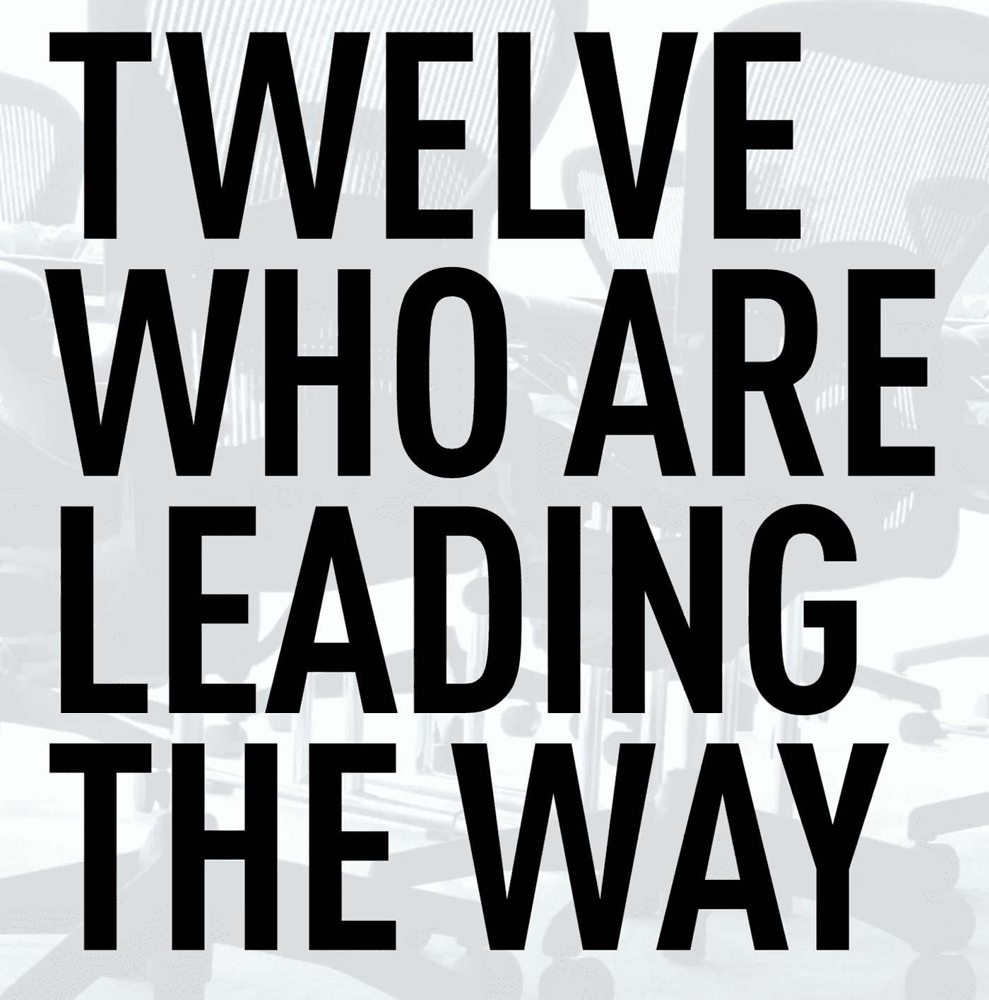
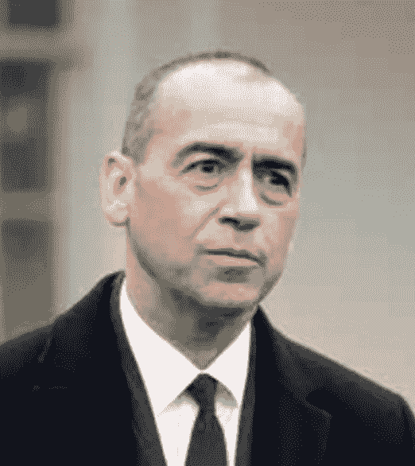
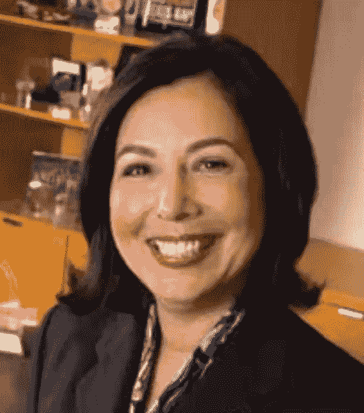
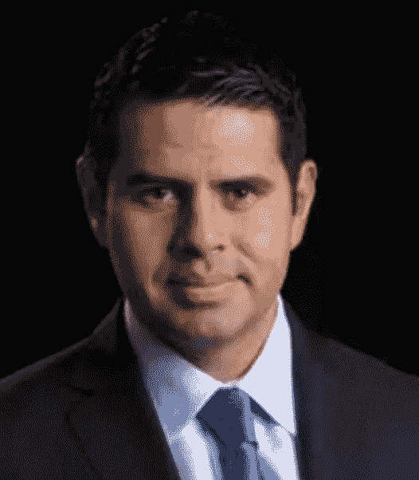

# 十二个在前面带路的人

> 原文：<https://medium.datadriveninvestor.com/twelve-who-are-leading-the-way-c0aa9c37b154?source=collection_archive---------7----------------------->

通往现代高管的道路陡峭而危险，对于西班牙裔专业人士来说更是如此，他们可能缺乏家族、制度和裙带关系方面的长期优势，而这些人的血统可以追溯到三代或四代以上。不言而喻，一群家庭最近才移民到一个国家的个人，在私营企业的高层职位上的代表性将会不足，因为这里居住着精英和其他获得良好开端的人的子女。

这份名单上的名字就代表了这一点——一个好的开始。考虑到 30 年前他在全国首席执行官职位上的恐慌影响几乎不存在，我们可以将这些企业成功的典范作为下一代的灯塔，这是一个积极的事实。

 [## 保护主义、政治和经济动荡——数据驱动的投资者

### 美国股市昨日出现 400 多点的大幅反转，为未来的事情发出了警告信号。市场…

www.datadriveninvestor.com](https://www.datadriveninvestor.com/2018/06/28/protectionism-politics-economic-turmoil/) 

像乔治·帕兹(George Paz)这样的创新思维，他从农村农场到经营行业领先的制药加工服务，以及像罗伯特·桑切斯(Robert Sanchez)这样努力工作的发电机，他经营着运输巨头赖德系统(Ryder System)，这些都可以为雄心勃勃的西班牙裔人——或者任何渴望进入商界高层的人——提供经验教训。让我们听听他们怎么说。

**Gerardo“Gerry”Lopez——AMC 娱乐公司首席执行官兼总裁**

作为移民的经历可以锻炼一个人，在[Gerardo“Gerry”Lopez](https://en.wikipedia.org/wiki/Gerardo_I._Lopez)的案例中，它有助于培养一种克服逆境并取得成功的心态。AMC 娱乐公司(AMC Entertainment)的首席执行官在去年对玛丽·桑切斯的采访中也说了同样的话。“这是一种动力，对我来说，给你一种心态，让你能够忍受许多不适，”他说。

很明显这对他有很大好处。在菲德尔·卡斯特罗掌权的六个月前，洛佩兹出生在古巴的奥连特，在他生命的第一年，他的家人离开这个国家去了美国。他获得了乔治·华盛顿大学的商业学士学位和哈佛大学的工商管理硕士学位。然后，他在菲多利、百事可乐、宝洁和国际家庭食品等公司担任了几个管理职位。然后，他成为星巴克咖啡公司的执行副总裁，领导公司的全球增长战略。

在 2009 年接任 AMC 首席执行官一职后，他领导了中国最大的娱乐公司大连万达集团以 26 亿美元收购 AMC 的谈判。这项轰动一时的交易创造了世界上最大的影院所有者，并开启了中国与好莱坞关系的新时代。对于这样卑微的开始来说，这是个不错的目的地。

**拉尔夫·德拉维加——AT&T Mobility 公司总裁兼首席执行官，61 岁**

许多人害怕面对障碍。不是[拉尔夫·德拉维加](https://www.linkedin.com/in/ralphdelavega)。出生于古巴的 T Mobility 公司[的首席执行官很喜欢它们，因为它们是他成功的关键。当德拉维加的家人在卡斯特罗掌权后决定离开古巴时，当局只让拉尔夫离开，并让他的父母留下来。他最终在美国度过了四年，没有父母，也没有多少钱。“经历那场磨难是我必须克服的最具挑战性的事情之一，”他说。"尽管有这些障碍，我还是能成功。"](https://www.att.com/wireless/)

但是他变得更坚强了。高中时，德拉维加想成为一名工程师时遇到了障碍，他的辅导员告诉他应该成为一名机械师。他的祖母鼓励他坚持自己的观点，他做到了。“不要让任何人限制你的成就，”德拉维加说。

他将这一理念运用到了工作中。在上世纪初的危机中，成为贝尔南美公司的总裁是一项挑战，比如阿根廷经济危机、哥伦比亚游击战和委内瑞拉政变。但是德拉维加认为这是一个机会。再说一次，当他还是 Cingular Wireless 的首席运营官时，许多人认为他的公司收购 AT T Wireless 会是一场失败的赌博。当美国电话电报公司失去 iPhone 的独家经营权时，他们又说了一遍。但是反对者错了。德拉维加直面挑战并取得了胜利。因此，德拉维加写了一本名为《欢迎障碍》的书也就不足为奇了。

**德勤 LLP 公司首席执行官乔·埃切瓦里亚**

对于 Joe Echevarria 来说，生活从一开始就不容易。Echevarria 是波多黎各人，在南布朗克斯的一个单亲家庭长大，没有多少资源。快进到现在，他负责美国 90 个城市和印度的约 60，000 名专业人员，他经常在顶级媒体机构如美国消费者新闻与商业频道和[华尔街日报](https://www.wsj.com/)发表演讲，并且是华盛顿的活跃成员。想知道他是怎么做到的，可以查阅他在父亲节写给女儿的建议。他给她的第一个建议是充满激情地生活。“不管你选择什么职业，也不管你如何度过你的一生——带着目的感和设计感去做，否则就有欺骗自己的风险，”他说。第二，他建议她在生活的许多曲折中保持灵活。“当你看到你认为正确的事情时，也要去追求它，”他说。“即使这意味着方向的改变。”最后，Echevarria 告诉她，重要的是不要将自己的生活与他人的生活相比较，而是要认识到她掌控着自己的生活。他最喜欢的一句话道出了一切:“预测未来的最佳方式是创造未来。”

**USAA 首席执行官乔苏·罗伯斯**

在顾客忠诚度方面， [USAA](https://www.usaa.com/) 多次被评为全国第一。该公司拥有或管理着 1820 亿美元的资产，为军人家庭服务了近一个世纪，并以其卓越的服务而闻名。该公司为 940 万会员和 96%的现役军官提供服务。这家金融服务公司的首席执行官乔苏·罗伯斯也奉行同样的忠诚原则。这位土生土长的波多黎各人是 9 个孩子中的老大，他在美国陆军服役 28 年，在德国、朝鲜、越南和中东沙漠风暴行动中服役，表现出了强烈的忠诚。他获得了许多奖章和荣誉，并被授予了基督教科学箴言报“商界第一老将”等荣誉。罗伯斯还身兼数职:他是圣诞老人玫瑰健康系统的主席，也是美国红十字会和美联储银行圣安东尼奥分行的董事。而他做到这一切，没有他家受过高等教育的先例。他的父亲在四年级时辍学帮助养家，而他的母亲在九年级后辍学。

**乔治·帕兹——Express Scripts 首席执行官**

乔治·帕兹(George Paz)从事着许多美国人想都没想过的行业:处理药房索赔，帮助医疗计划降低处方药的成本。虽然帕兹的作品可能会默默无闻地为普通市民所知，但对那些知情人士来说，他是一个巨人。在 2013 年财富 500 强中排名第 24 位的 [Express Scripts](https://www.express-scripts.com/) 于去年收购了 Medco Health Solutions，成为该行业中零售处方索赔额最大的公司。据《华尔街日报》报道，Express Scripts 的股票在 2012 年上涨了 21%，帕兹的薪酬在那一年上涨了 50%。帕兹出身卑微:他在一个农村社区长大，被商业所吸引，因为它似乎提供了一种不同的生活。帕兹今年早些时候告诉波德:“我记得在电视上看到像沃德·克里弗这样的人从商业工作中回家，过着不同的生活，这对我来说非常有吸引力。”Paz 自 1998 年加入该公司，在担任高级副总裁和首席财务官后，于 2005 年被任命为首席执行官。他还是霍尼韦尔的董事会成员，并拥有密苏里大学圣路易斯分校的商学学士学位。

**保罗·瑞恩斯——GameStop，首席执行官**

世界上最大的多渠道视频游戏零售商的首席执行官在哥斯达黎加圣何塞的 Barrio Cordoba 地区度过了童年的大部分时光。一位哥斯达黎加母亲和一位美国父亲的儿子说，那个有着铁窗和孩子们在街头踢足球的社区环境并不轻松。“我有一个有趣的名字，不是一个像其他人一样好的足球运动员，”雷恩斯说。"我必须同化。"

那段经历，加上在一个军人家庭的成长，促使 Raines 习惯于改变，这种意愿帮助他走上了管理一家财富 500 强公司的道路。作为一名工业工程师，Raines 曾在一家薯片厂工作，从事商品销售、家居装修，现在从事视频游戏。“你习惯了很多变化，这并不可怕，”他说。

现在他在 GameStop 应用这种智慧。四年前，该公司仅涉足游戏机业务，如今，由于手机游戏的新生力量，该公司正在适应一个不断变化的市场。如今，该公司运营网站，进行数字销售，并不断与硅谷的初创公司就可能的新收购进行谈判。Raines 还创建了一个名为 PowerUp Rewards 的关系项目，通过全球社区将消费者联系起来。

Raines 意识到公司的成功对员工有着深远的影响。“我工作中最棒的部分是看到我们的团队成长，”Raines 说。“我努力让我周围的人成功。如果你能让团队成功，最终你也会成功。”

**亨利·希斯内罗斯——city view 创始人&董事长**

当[亨利·希斯内罗斯](https://cityview.com/portfolio/henry-cisneros/)在 80 年代担任圣安东尼奥市市长时，他意识到他最喜欢的是“看着城市以物质发展的形式从地下冒出来”难怪希斯内罗斯后来成为比尔·克林顿政府的住房和城市发展部长，并在 2000 年成立了一家名为美国城市远景的公司，现在名为 CityView。

总部设在洛杉矶的 CityView 自称是专注于城市房地产的美国顶级机构投资公司之一。它负责 12 个州约 60 个社区数十亿美元的城市投资。该公司瞄准中产阶级家庭能够负担得起的住房，为消防员、教师、公务员和艺术家提供住房。投资者包括银行、私营企业和基金。

64 岁的希斯内罗斯住在圣安东尼奥，他不打算退休。“我得出结论，这是我余生想做的事情，”希斯内罗斯说。“这些天来，我生活中最精彩的部分是那些周六早上，当我们开放新的开发项目时，我能够看到一些家庭获得他们从未想象过的住房。”

**奥斯卡·穆尼奥斯——CSX，首席运营官**

奥斯卡·穆尼奥斯在南加州的一个工人家庭长大，在那里，教育作为一种向上流动的工具并不是一个重要的优先事项。“我的父亲是一名割肉工人，”穆尼奥斯说，他的家庭来自墨西哥的华雷斯城。“他没有受过高中以上的教育。人们的期望是，我会高中毕业，找到工作，结婚，然后幸福地生活下去。”当高中的一位辅导员问穆尼奥斯他要去哪里上大学时，这种情况发生了变化。穆尼奥斯甚至不确定大学是什么。但是他申请了，拿到了全额奖学金，并且已经上路了。那次经历促使穆尼奥斯帮助年轻的拉丁裔学生，现在他成功了。他建立了自己的基金会，帮助 67 个孩子上了大专、职业学校，甚至茱莉亚音乐学院。

在工作中，他也同样积极上进。作为首席运营官，穆尼奥斯帮助运输供应商 CSX 的市值从 2003 年的 60 亿美元增长到今天的近 240 亿美元。“这不仅仅是一家公司，而是整个行业的重大转变之一，”穆尼奥斯说。“这是一个战略重点，让铁路股重新变得有吸引力。我们有令人难以置信的能力来真正支持美国经济。”

**Gloria Santona——麦当劳执行副总裁、法律总顾问兼秘书**

作为一家在 118 个国家拥有餐厅的全球领先餐饮服务零售商的首席法律官，这可不是一件小事。她负责公司的全球法律、法规、合规和公司治理事宜。作为公司高级领导团队的一员，[桑托纳](https://www.bakermckenzie.com/en/newsroom/2018/03/gloria-santona-joins-baker-mckenzie)也为麦当劳的发展战略做出了贡献。

为了达到这一目标，桑托娜利用了她在印第安纳州一个西班牙家庭中长大的毅力和好奇心，她的母亲在古巴长大。“我真的很渴望知识，”桑托纳说。“在一个多元文化的环境中长大对我来说很棒。“当我开始工作时，我能学会如何成为一名有效的谈判者，这个想法很重要。”

桑托纳也很忠诚。法学院毕业后，她参加了麦当劳的求职面试。她在 24 小时内得到了这份工作，此后一直在这家公司工作。现在，Santona 面临的挑战包括确保该公司在看似不断的监管变化中遵守世界各地的法律，并找出如何应对社交媒体的法律影响。

**罗伯特·桑切斯——莱德系统公司董事长兼首席执行官**

罗伯特·桑切斯的父母 50 年前从古巴来到美国，口袋里只有几美元。他从父亲那里学到了伟大的职业道德，这帮助他几乎掌握了莱德运营的每一个方面。起初，桑切斯不确定他是否想从事运输行业。但是当莱德公司给他提供了一份工作时，他的妻子告诉他，她认为他会学会喜欢卡车。“她是对的，”她说。

Sanchez 开始是一名 IT 专家，后来转到了金融、资产管理、运输管理部门，并在最近的金融危机中担任首席财务官。现在，作为财富 500 强运输公司的首席执行官，Sanchez 喜欢寻找新的解决方案来应对客户挑战的机会。“为了支持这一目标，我能做的最重要的事情就是倾听我们的员工和客户。”

赖德最让桑切斯着迷的是，它在人们甚至不知道的情况下对经济的推动有多大。因为莱德的卡车有助于将其他公司的产品运送给消费者，所以它在任何地方都是商业的重要组成部分。“你早上使用的剃须刀很可能是通过完全由莱德管理和运营的分销网络分销和运输的，”他说。“你早餐吃的麦片很可能是打包好的，或者在某个时候被莱德移动过。甚至你在当地药店买的牙膏和肥皂，也可能是穿着药店公司制服的莱德员工用莱德卡车送来的。赖德真的在经济的大部分方面秘密运作。”

**Cesar Conde—Univision Networks 总裁**

当然，成为拉美裔美国领先媒体公司的总裁是一件大事。但在拉美裔人口迅速增长、政治影响力日益增强，使得拉美裔媒体比以往任何时候都更为重要的时候，这一点显得更为重要。

[Conde](https://en.wikipedia.org/wiki/Cesar_Conde) 在 2009 年的一次采访中告诉 PODER，Univision 可以成为美国任何语言的头号电视网。这不是不可思议的。自从康德接任首席执行官以来，Univision 的收视率一直很高，而其英语同行却在苦苦挣扎。

康德的经历可以帮助他实现这一目标。这位秘鲁出生的父亲和古巴母亲的儿子在公司担任过许多职务，从 Univision Interactive Media 的临时总裁到 Galavision Network 的副总裁，从企业发展副总裁到销售和业务发展副总裁。

他不仅关注自己公司的成功，还认识到帮助拉美裔青年对当地社区和整个国家都至关重要。他是 Futuro 计划的主席和联合创始人，这是一个为拉丁裔高中生提供工作室的非营利组织。

**达伦·雷贝雷兹——7-Eleven 的执行副总裁和首席运营官**

作为世界上最大的连锁便利店的首席运营官， [Darren Rebelez](https://www.bloomberg.com/research/stocks/private/person.asp?personId=61634493&privcapId=30133) 是 7-Eleven 积极发展计划的重要组成部分。他负责监督该公司在美国和加拿大现有约 7，600 家门店的基础上增加新店的战略。他还管理公司的设施、建设和维护项目，并负责公司的汽油业务、资产保护和业务转型项目。他还负责一项特许经营美国约 1，000 家仍由公司运营的商店的计划。

此前，Rebelez 负责埃克森美孚公司的经销商燃料定价项目，并为其名为 On the Run 的便利业务提供特许经营。他也是桑顿石油公司的销售副总裁，领导公司的战略规划、营销和品类管理。Rebelez 毕业于美国西点军校，拥有休斯顿大学的 MBA 学位和工程学学士学位。最近，丽贝卡出现在新闻中。在 9 名 7-11 特许经营店的老板和经理因涉嫌身份盗窃和移民剥削被联邦当局起诉后，他呼吁数千家特许经营店审查他们的招聘做法。

要阅读更多延斯·埃里克·古尔德的文章，请前往 jenserikgould.com