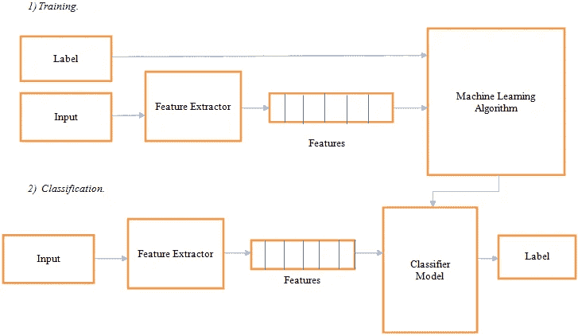
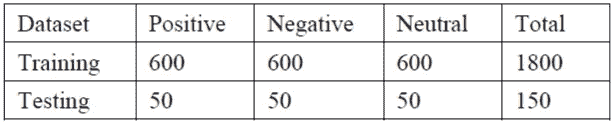
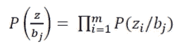
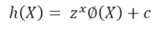
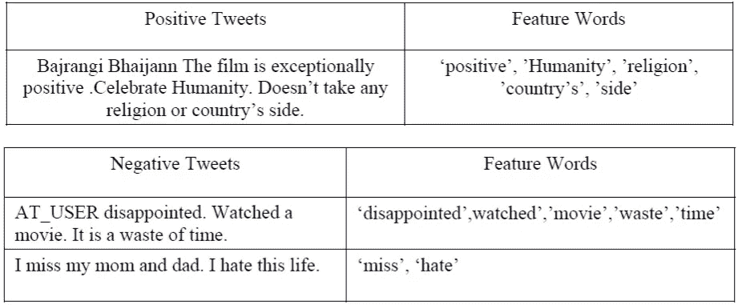
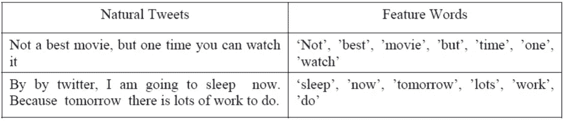
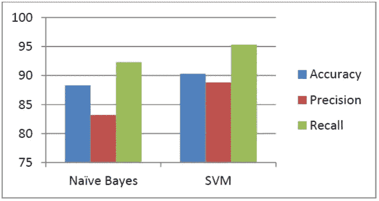

# 使用机器学习技术对电影评论的推特情感分析。

> 原文：<https://medium.datadriveninvestor.com/twitter-sentiment-analysis-of-movie-reviews-using-machine-learning-techniques-23d4724e7b05?source=collection_archive---------1----------------------->

> 情感分析基本上涉及从文本中分析情感和观点。我们可以把情感分析称为观点挖掘。情感分析找到并证明人对给定内容源的情感。社交媒体以推文、博客、状态更新、帖子等形式包含了大量的情感数据。对这些大量生成的数据进行情感分析对于表达大众的意见非常有用。与广泛的情感分析相比，Twitter 情感分析比较棘手，因为存在俚语、拼写错误和重复字符。我们知道 Twitter 中每条推文的最大长度是 140 个字符。因此，识别每个单词的正确情感是非常重要的。在我们的项目中，我们针对即将上映的宝莱坞或好莱坞电影的最新评论，提出了一个高度准确的推特情感分析模型。在支持向量机和朴素贝叶斯等特征向量和分类器的帮助下，我们正确地将这些推文分类为正面、负面和中性，以给出每条推文的情感。

1.  **简介**

随着社交网络、微博和博客网站的日益流行，产生了大量的数据。我们知道互联网是网络的集合。互联网时代改变了人们表达思想和感情的方式。人们在互联网的帮助下，通过博客帖子、在线对话论坛和许多其他方式相互联系。人们在电影院看电影之前会检查电影的评论或分级。信息量对于一个正常人来说，用幼稚的技术去分析是不合理的。

情感分析主要涉及对每条推文的观点或情感的识别和分类。情感分析大致分为两种类型，第一种是基于特征或方面的情感分析，另一种是基于客观性的情感分析。与电影评论相关的推文属于基于特征的情感分析类别。基于客观性的情感分析探索与恨、想念、爱等情感相关的推文。

通常，使用各种符号技术和机器学习技术来分析来自 twitter 数据的情感。因此，换句话说，我们可以说，情感分析是一个系统或模型，它获取分析输入的文档，并生成一个详细的文档，总结给定输入文档的意见。在第一步中，进行预处理。在预处理中，我们删除了停用词、空格、重复词、表情符号和#hash 标签。

为了正确分类推文，机器学习技术使用训练数据。因此，这种技术不需要像基于知识的方法中使用的单词数据库，因此，机器学习技术更好更快。

这几种方法用于从源文本中提取特征。特征提取分两个阶段进行:在第一阶段，提取与 twitter 相关的数据，即提取 Twitter 特定的数据。现在通过这样做，推文被转换成普通文本。在下一阶段，更多的特征被提取并添加到特征向量中。训练数据中的每个 tweet 都与类标签相关联。该训练数据被传递给不同的分类器，并且分类器被训练。然后对模型进行测试，并在这些训练好的分类器的帮助下进行分类。所以最终我们得到了被分为正面、
负面和中性的推文。

**2。相关工作**

有两种技术被广泛用于从文本中检测情感。它们是符号技术和机器学习技术[3]。

**A)使用符号技术的情感分析:**

一种符号技术利用词汇资源的可用性。Turney [4]提出了一种叫做“词汇袋”的情感分析方法。在上述方法中，单个单词被忽略，仅考虑单词的集合。他从搜索引擎 Altavista 中收集了具有形容词或副词极性的单词。

Kamps 等人[5]使用了一个名为 WordNet [6]的词汇数据库来确定一个单词中的情感问题。WordNet 带有同义词和距离度量来查找形容词的方向。

为了克服词汇替换任务中的障碍，Baroni 等人[7]开发了一个由单词空间模型形式主义支持的系统，从而表示本地单词。

EmotiNet 在概念上表示存储领域中真实事件结构的文本。这是由 Balahur 等人[8]提出的。

**B)使用机器学习技术的情感分析:**

在这种技术下，有两组，即训练组和测试组。通常，从不同来源收集的数据集，其行为和输出值为我们所知，属于训练数据集的范畴。与此相反，其值或行为未知的数据集被称为测试数据集。这里用训练数据训练不同的分类器，然后用未知数据训练，或者我们可以说给这个模型一个测试数据以得到想要的结果

机器学习包括各种不同的分类器，如集成分类器、k-means、人工神经网络等。这些用于对评论进行分类[8]。Y.Mejova 等人[1]在其研究工作中提出，我们可以使用每个字符的存在、每个字符出现的频率、被认为是否定的词等。作为创建特征向量的特征。他还表明，我们可以有效地使用一元和二元方法，使情感分析中的特征向量。

Domingos 等人[10]提出，朴素贝叶斯对于某些问题的相关特征工作得很好。牛阵等人[11]发现了一个新的模型。该模型基于贝叶斯算法。在该模型中，采用了一些有效的方法进行特征选择、权重计算和分类。Barbosa 等人[12]设计了一种两步分析方法，这是一种用于对推文进行分类的自动情感分析。第一步，将推文分为主观推文和客观推文。之后，在第二步，主观推文被分类为正面和负面推文。

Celikyilmaz 等人[13]开发了一种基于发音的单词聚类方法。这种方法使嘈杂的推文正常化。有些单词发音相同，但意思不同。所以，为了消除这种冲突，有上面提到的方法。在这种提到的方法中，具有相同发音的单词被聚类并被分配共同的标记。吴等[14]在论文中推荐了影响概率模型来分析微博情感。在这种情况下，如果在 tweet 中找到 [@username](http://twitter.com/username) ，它将采取影响行动并帮助影响概率。

通过收集自动推文，Pak 等人[15]开发了一种通过创建推特语料库进行情感分析的方法。在他提出的工作中，他表明，在创建特征向量时，我们可以使用表情符号作为一种特征。他使用了一个朴素的贝叶斯分类器来进行情感分析。为了解公众对电影、新闻等的看法而做的一些研究。从推特上。V.M. Kiran 等人[16]从 IMDB 和 Blippr 等其他公开数据库中获取信息。

**3。提议的工作**

各种各样的技术被用来做推特的情感分析。在我们的研究中，我们使用了特征向量的方法。下图显示了整个建议的系统架构。

Fig. 1\. System Architecture.

提议的系统包含不同的开发阶段。使用 twitter 上的电影评论创建了一个数据集。众所周知，tweets 包含俚语和拼写错误。因此，我们对推文进行句子层面的情感分析。这分三个阶段完成。在第一阶段，进行预处理。然后利用相关特征建立特征向量。最后，使用不同的分类器，将推文分为正面、负面和中性类别。

**A)数据集的创建:**

*   使用 twitter 上的电影评论和关于这些电影的相关推文来创建数据集。
*   下表显示了用于训练分类器的数据集以及用于测试的推文

TABLE I. Statistics of the Data-set Used

一个数据集是由 600 条正面的，600 条负面的，600 条中性的推文组成的。

**B)预处理:**

预处理是我们项目的主要部分。在预处理中，第一步是将 tweets 转换成小写。接下来是避免网址。目标名，即[@用户名](http://twitter.com/username)被替换为 AT_USER，标签被移除。接下来，我们用两次出现的字符替换重复的字符，并删除空格。

**C)特征向量的创建:**

推文中的特征分两个阶段提取。在第一阶段，提取与 twitter 相关的特征。这也被称为 twitter 特定特征的提取。然后，我们通过删除#符号，用完全相同的单词替换了 hashtags (# ),也就是说，如果单词是#BajrangiBhaijaan，则用 BajrangiBhaijaan 替换它。Twitter 的特定功能可能不会出现在所有的推文中。因此，我们进一步提取了推文，以获得更多的特征。此时，我们有了作为简单文本的 tweet。然后，使用 uni-gram 方法，整个 tweet 由其关键词表示。

**D)情感分类:**

在创建特征向量后，使用朴素贝叶斯、支持向量机进行分类，并比较性能。

**(i)朴素贝叶斯分类器-**

朴素贝叶斯分类器的主要优点是它独立地分析每个特征。因此它充分利用了特征向量中的所有特征。朴素贝叶斯分类器的概率如下所示:

Eq. 1

其中特征向量由 z 表示，b 是类别标签(即，阳性、阴性、中性)。使用朴素贝叶斯分类器的另一个原因是它易于使用并且可扩展。与所有其他分类器相比，该分类器具有高精度。但是它的缺点是准确率和召回率较低。朴素贝叶斯分类器基于数学中著名的贝叶斯定理。

**(二)支持向量机(SVM)-**

在大幅度的帮助下，SVM 进行了分类。每条推文都被分成单个单词。SVM 的描述函数如下。

Eq. 2

其中特征向量由 x 表示。z 表示不同权重的向量。非线性映射函数由给出，c 是偏置向量。z 和 c 都自动从训练数据集中学习。SVM 是所有分类器中准确率最高的一个。在我们的项目中，线性核被用于分类。这就是为什么它保持了两个阶级之间的巨大差距。与朴素贝叶斯分类器相比，SVM 具有更高的精度和召回率。

**4。实验和建模的细节**

**A)数据集:**

完整的训练数据集包含 21，000 条推文，并存储在 CSV 文件中。其中，我们使用 1200 条推文(600 条正面推文，600 条负面推文，600 条中性推文)来训练分类器。这些数据集是从各种来源收集的，并且每当类标签丢失时，类标签被手动标注。

**B)推文预处理:**

第一步，tweets 被转换成小写字母。因此，通过这样做，我们可以获得相同大小写(即小写)的每个 tweet 的单词。然后在下一步中，所有的 URL 都被删除，并替换为普通文本。然后我们把“[@用户名](http://twitter.com/username)”换成了通用词 AT_USER。下一步，我们将删除推文开头和结尾的标点符号，并用单个空格替换额外的空格。在那之后，#hashtag 被删除，去掉了 hash。

**C)特征向量的建模:**

首先删除推文中出现的任何停用词。然后用这两个字符替换在特定单词中出现超过两次的字符，即，修整重复超过一次的字符。例如，将“Smarttttttt”替换为“Smart”等。

从样本 tweets 中提取的特征词示例如下所示。

TABLE II. Example Showing Tweets of Positive & negative with Feature Words

TABLE III. Example Showing Natural Tweets with Feature Words

**D)推文分类:**

**(i)朴素贝叶斯分类器-**

首先，所有的推文和标签都被传递给分类器。在下一步中，完成特征提取。现在，这些提取的特征和推文都被传递给朴素贝叶斯分类器。然后用这个训练数据训练分类器。然后，以回写模式打开分类器转储文件，特征词与分类器一起存储在其中。之后，文件关闭。

**(二)支持向量机-**

对于 SVM，我们基本上使用了 3 个标签，分别是 0、1 和 2。这里 0 代表积极，1 代表消极，2 代表中性。tweet 中的每个单词都表示为 0 或 1。如果是特征词，则用 1 表示，否则用 0 表示。所以我们得到一系列 0 和 1。现在，这个特征向量和类别标签被交给 SVM 分类器，以将推文分类为正面、负面和中性。

**E)检索特定主题的推文:**

通过使用 twitter 帐户，我们已经为我们的项目创建了应用程序，然后将有效的凭证赋予这个 Json 文件。

我们将 config.json 定义如下

{
" Produser _ KEY ":" PROJECT Produser KEY "，
" Produser _ SECRET ":" PROJECT Produser SECRET "，
" Control ACCESS _ TOKEN ":" PROJECT Control ACCESS TOKEN "，
" Control ACCESS _ TOKEN _ SECRET ":" PROJECT Control ACCESS TOKEN SECRET "，
}

**5。结果和分析**

Fig. 2\. Performance of classifiers in Twitter Sentiment Analysis

由于我们使用了特定的选定领域，因此没有必要分别分析主观和客观推文。这显示了上下文或领域信息如何影响情感分析。如上图所示，SVM 和朴素贝叶斯具有几乎相似的性能。

与 SVM 相比，朴素贝叶斯具有更好的精确度，但精确度和召回率略低。SVM 比朴素贝叶斯具有更高的准确性以及更好的精确度和召回率。SVM 的准确率为 75%，而朴素贝叶斯的准确率为 65%。这显示了为该项目域选择的特征向量的质量。尽管选择了分类器，特征向量有助于更好的情感分析。随着训练数据的增加，分类的准确性也会增加。

该系统的性能取决于训练数据集以及这些数据集中的内容(即推文)。因此，这是一种非常简单有效的分析文本情感的方法。如果我们添加其他分类器，如最大熵和集成分类器，我们可以很容易地分析这些结果。

**6。结论**

因此，我们得出结论，机器学习技术比符号技术更容易和有效。这些技术很容易应用于 twitter 情感分析。Twitter 情感分析很难，因为很难从 tweets 中识别情感词，还因为重复字符、俚语词、空格、拼写错误等的存在。为了解决这些问题，创建了特征向量。在创建特征向量之前，对每个 tweet 进行预处理。然后分两个阶段提取特征:第一阶段是提取 twitter 特定的单词。然后将它们从文本中删除。现在提取的特征向量被转换成普通文本。

之后，从 tweet 中提取特征，tweet 是没有任何散列标签或俚语的普通文本。然后将这些提取的特征相加形成特征向量。有不同的机器学习分类器来对推文进行分类。从我们的结果，我们已经表明，朴素贝叶斯和支持向量机表现良好，也提供了更高的准确性。实验结果表明，SVM 分类器的准确率为 75 %，朴素贝叶斯分类器的准确率为 65%。因此，随着训练数据的增加，我们可以提高分类的准确性。通过这个项目，我们可以说特征向量在与电影评论相关的推文中表现更好。

***参考文献***

[1] Neethu M，S，Rajasree R，“使用机器学习技术进行 Twitter 中的情感分析”，第 4 届 ICCCNT，2013 年。
[2] Y. Mejova，“情绪分析:概述”，ymejova/publications/CompsYelenaMejova，第 2010–02–03 卷，2009 年，2009 年。
[3]e . boy，P. Hens，k .德尚希和 M. Moens，“在线文本中的自动情感分析”，
电子出版第 11 届国际会议，第 349360 卷，2007 年。
[4]p·特尼，“竖起大拇指还是竖起大拇指？语义定位应用于评论的非监督分类，计算语言学协会第 40 届年会，第 417424 卷，2002 年。
[5] J. Kamps，M. Marx，R. Mokken 和 M. De Rijke，“使用 wordnet 测量形容词的语义取向”，2004 年。
[6] C. Fellbaum，《Wordnet:一个电子词汇数据库(语言、言语和交流)》，1998 年。
[7] D .普奇，m .巴罗尼，f .库图格诺和 a .伦奇，“用词空间模型进行无监督词汇替换”，EVALITA
研讨会会议录，意大利人工智能协会第 11 届大会，Citeseer，2009 年。
[8] A. Balahur，J. Hermida 和 A. Montoyo，“基于评价理论模型的情绪检测知识库 Emotinet 的构建和开发”，情感计算，IEEE Transactions，vol. 3，188101，2012。
[9] G. Vinodhini 和 R. Chandrasekaran，“情感分析和观点挖掘:一项调查”，《国际期刊》，2012 年第 2 卷第 6 期。
[10] P. Domingos 和 M. Pazzani，“零一损失下简单贝叶斯分类器的最优性”，机器学习，第 29 卷，2–3，103130，1997 年。
[11]牛，尹，孔，“基于机器学习的微博情感分类”，计算与信息科学，2012 年第四届国际学术会议，286-289 页，IEEE，vol. 286289，2012。
[12] L. Barbosa 和 J. Feng，“从有偏见和有噪声的数据中进行 Twitter 上的鲁棒情感检测”，第 23 届计算语言学国际会议:海报，第 3644 卷，2010 年。
[13]a . celikyimaz，D. Hakkani-Tur 和 J. Feng，“基于概率模型的 Twitter 消息情感分析”，口语技术研讨会，2010 IEEE，vol. 7984，2010。
[14] Y. Wu 和 F. Ren，“在 twitter 中学习情感影响”，未来计算机科学与应用(ICFCSA)，2011 年国际会议，IEEE，vol. 119122，，，2011。
[15] A. Pak 和 P. Paroubek，“Twitter 作为情感分析和观点挖掘的语料库”，《LREC 论文集》，2010 年第一卷，2010 年。
[16] V. Peddinti 和 P. Chintalapoodi，V.M.Kiran，“推特情感分析中的领域适应”，分析微博研讨会，AAAI，2011 年。

原来[发表在这里。](http://www.enggjournals.com/ijet/docs/IJET15-07-06-027.pdf)