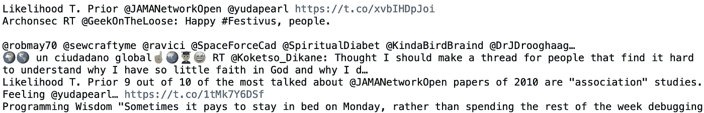
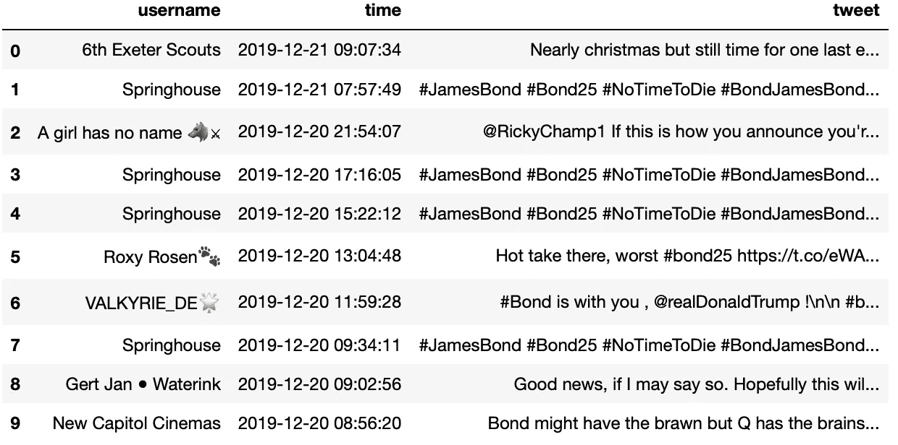
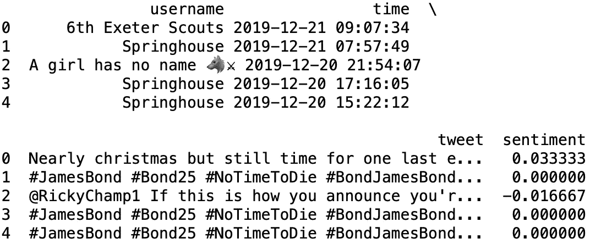
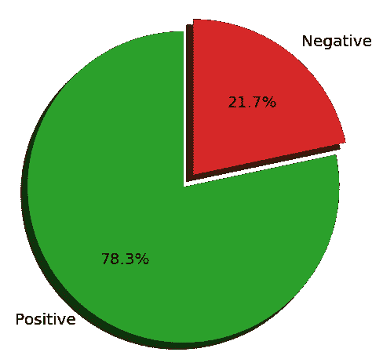
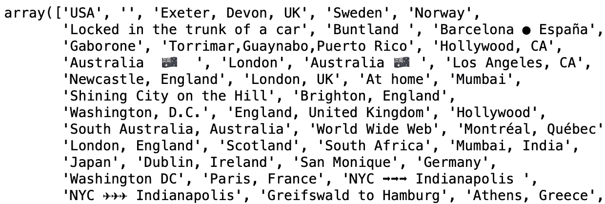
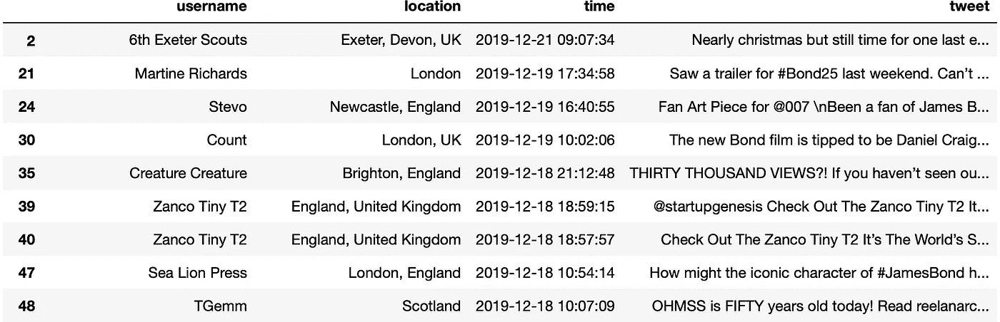
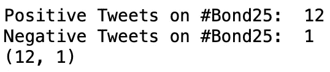
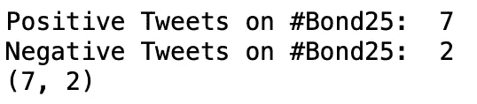
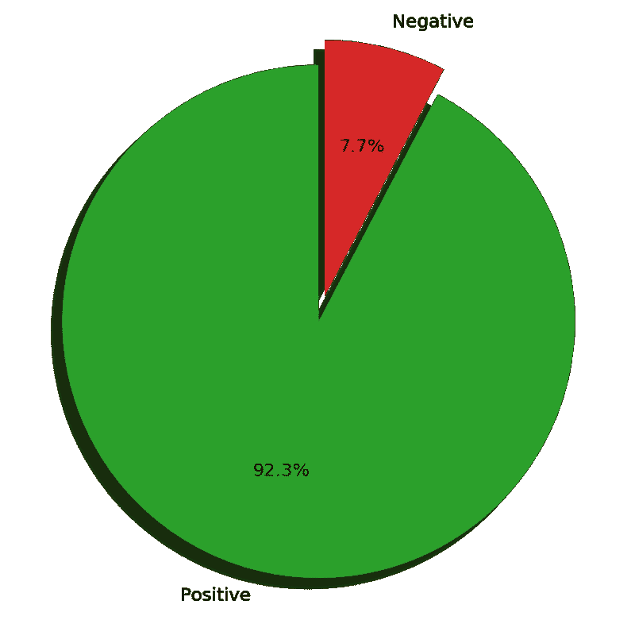
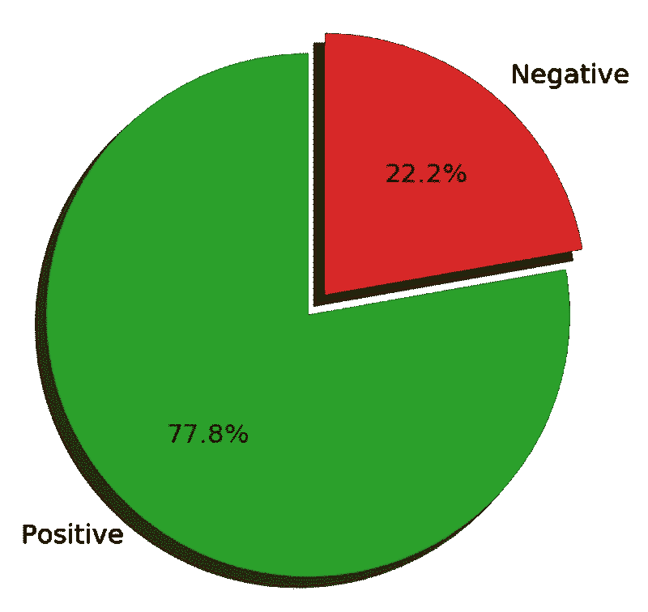

# 使用 Python 进行 Twitter 情感分析；观众对即将上映的詹姆斯·邦德电影有什么看法？

> 原文：<https://medium.datadriveninvestor.com/twitter-sentiment-analysis-using-python-what-does-the-audience-think-of-the-next-james-bond-movie-a9950adc2822?source=collection_archive---------3----------------------->

## “普通人”如何使用 Python 从任何话题的推文中提取情感“信号”


[Source](https://www.insider.com/james-bond-no-time-to-die-trailer-2019-12)

伙计们，这就结束了。“我们现在可以回家了！”

任何能够定义上述引语的人，也能清楚地理解为什么它几乎总是伴随着喜悦和余晖的情绪。就是导演说“够了！”拍摄结束了。但是，尽管一个总结派对紧随其后，但执行制片人比任何人都清楚，实际上，关键部分才刚刚开始……他们必须调查观众的欲望，以便完美地适应蒙太奇——这是一个非常乏味和困难的过程。但幸运的是，在我们这个时代，电影业拥有“工具带”中最有用的工具之一——情感分析。

这个项目是情感分析的前奏，而这项技术的基本实现正在逐步发展，有利于即将上映的詹姆斯·邦德电影。

## 情感分析

也被称为情感人工智能，它是指一套用于从大型源数据集中识别和提取主观信息的技术。最终的范围是深入、彻底、全面地研究“挖掘”出来的材料，这种方式可能会对各种主题的社会情绪产生相当深刻的见解。材料来源通常由文本组成，应用的技术包括(但不限于)自然语言处理(NLP)、计算语言学和文本分析。

[](https://www.datadriveninvestor.com/2019/01/23/which-is-more-promising-data-science-or-software-engineering/) [## 数据科学和软件工程哪个更有前途？数据驱动的投资者

### 大约一个月前，当我坐在咖啡馆里为一个客户开发网站时，我发现了这个女人…

www.datadriveninvestor.com](https://www.datadriveninvestor.com/2019/01/23/which-is-more-promising-data-science-or-software-engineering/) 

如今，除了先锋派公司，许多初创公司都虔诚地实施这种分析，试图“编码”、量化和解释客户对其产品的情感状态。当然，社交媒体平台也不能幸免于这种倾向，尤其是现在他们已经固化了庞大的数据库…

## 项目

这个项目的范围是在 Twitter 数据上建立一个情绪分析的基本实现，旨在确定观众对即将上映的电影“没有时间去死”的态度，该电影最早被称为#Bond25(又名该系列的第 25 部)。我们将使用一系列免费的 **Python** 库(Pandas、Tweepy、TextBlob)和用于数据收集的 Twitter API(**网络搜集)**，最终描绘出几个**数据可视化**，以更好地传达调查结果的微妙叙述。

## 1.建立

在这一节中，我们将设置应用分析技术所需的环境。如果您已经准备了下面列出的任何部分，您可以分别跳过。

*   申请一个 Twitter 开发者账户，创建一个 Twitter 应用。*【在此过程中，您将需要安装 Python 3 和 Twython Python 模块】*您可以轻松遵循的全面指南是[这里](https://projects.raspberrypi.org/en/projects/getting-started-with-the-twitter-api)。
*   安装[Jupyter](https://jupyter.org/index.html)Notebook——一个开源网络应用程序，用于创建/共享包含实时代码、方程式、可视化和叙述性文本的文档。你可以在这里按照步骤。
*   安装[Tweep](https://tweepy.readthedocs.io/en/latest/getting_started.html)y——一个用于访问 Twitter API 的 Python 库。您可以使用 CLI(命令行界面)或 Jupyter 笔记本来运行以下命令:

```
pip install tweepy
```

*   安装 [TextBlob](https://textblob.readthedocs.io/en/dev/) ，这是一个用于处理文本数据的 Python 库，提供了一个简单的 API 来处理一些任务，如情感分析。同样，您可以使用 CLI 或 Jupyter 笔记本来运行以下命令:

```
pip install textblob
```

## 2.Twitter API

首先，我们在 Jupyter 笔记本文件中导入 Tweepy 和 Pandas 库，接下来我们继续进行所需的身份验证:

```
import tweepy
import pandas as pdconsumer_key = "12GMddCerYjkU3UpRdwqYtpy2gJ" 
consumer_secret = "Q88Ytpy2gJrYy2jJtkkU3UpwqY"
access_token = "B4BDDwqerYpwy2qrderYpwy2wqYtpy2gJ"
access_token_secret = "klYU3UpwBpjJtdCerYkk4BDDwm"
```

> 上面显示的键是指示性的。它们和你已经获得的代币都是私有的，应该同样对待；他们连接到你的个人 Twitter 账户。在这种情况下，任何人检索他们能够访问您的帐户没有密码⚠️

然后，我们创建一个“OAuthHandler”实例，并将其传递给 API 方法，如下所示:

```
auth = tweepy.OAuthHandler(consumer_key, consumer_secret)
auth.set_access_token(access_token, access_token_secret)api = tweepy.API(auth)
```

我们现在准备测试查询 Twitter API 的功能(向远程 web 服务器发出请求并检索我们需要的数据)。我们运行下面的代码片段，它基本上返回我们此时的时间线:

```
public_tweets = api.home_timeline()
for tweet in public_tweets:
print(tweet.user.name, tweet.text)
```



Result of API request

得到一个相似的结果，意味着你能够提出请求并继续下一步。

## 3.情感分析

首先，我们获取分析所需的数据。出于可重用性的目的，我们选择创建一个函数，该函数获取一个参数(“hastag”)作为输入，并返回必要信息的数据帧。简而言之，功能要素是:

*   Tweepy 的“Cursor”对象，我们在其中传递可调用的“api.search”方法(*记住，我们不能将参数“q”和“count”直接传递给该方法，而是按照* [*文档*](https://tweepy.readthedocs.io/en/latest/cursor_tutorial.html) 传递给游标构造函数方法)。我们将前者设置为字符串“Bond25 ”,将后者设置为 2000，记住不要超过 Twitter 的速率限制。
*   允许我们循环访问对象的“item()”方法。
*   两个条件语句过滤掉转发的消息，让只使用英语的消息通过，从而将`user`、`created_at`和`text`属性添加到各自的列表中。
*   一种数据帧结构，以使数据操作更有效。

```
def **fetch_tweets**(hashtag):
    tweet_user = []
    tweet_time = []
    tweet_string = []

    for tweet in tweepy.Cursor(api.search,q=hashtag, count=2000).items(2000):
            if (not tweet.retweeted) and ("RT @" not in tweet.text):
                if tweet.lang == "en":
                   tweet_user.append(tweet.user.name)
                   tweet_time.append(tweet.created_at)
                   tweet_string.append(tweet.text)

    df = pd.DataFrame({"username":tweet_user, "time": tweet_time, "tweet": tweet_string})
    return df
```

将相关的 hashtag 传递给函数，输出 dataframe:

```
bond_df = fetch_tweets("Bond25")
```



Segment of the returned dataframe

此时，我们准备好使用 TextBlob 库并取回基于极性的情感得分(更多关于此[在此](https://textblob.readthedocs.io/en/dev/api_reference.html#textblob.blob.TextBlob.sentiment))。创建一个“lambda”函数，返回每条 tweet 的极性得分，并作为参数直接传递给“apply()”函数。后者将前者应用于“tweet”栏。

```
bond_df["sentiment"] = bond_df["tweet"].apply(lambda tweet: TextBlob(tweet).sentiment.polarity)
print(bond_df.head())
```



Segment of the ‘enriched’ dataframe

然后，我们计算情绪的积极和消极得分:

```
bond_df_pos = bond_df[bond_df["sentiment"] > 0.0]
bond_df_neg = bond_df[bond_df["sentiment"] < 0.0]
print("Positive Tweets:", len(bond_df_pos))
print("Negative Tweets:", len(bond_df_neg))
```

现在，上述所有操作都可以封装在一个函数中，使我们的代码更加有效:

```
def **calc_sentiment**(hashtag):
    df = fetch_tweets(hashtag)
    df["sentiment"] = df["tweet"].apply(lambda tweet: TextBlob(tweet).sentiment.polarity)
    df_pos = df[df["sentiment"] > 0.0]
    df_neg = df[df["sentiment"] < 0.0]
    print("Positive Tweets on #{}: ".format(hashtag), len(df_pos))
    print("Negative Tweets on #{}: ".format(hashtag), len(df_neg))
    return (len(df_pos), len(df_neg))
```

最后，通过使用 Python 2D 绘图库“Matplotlib ”,我们可以使用以下函数轻松地在饼状图上描绘我们的结果:

```
%matplotlib inline
import matplotlib.pyplot as pltdef **draw_sentiment**(pos,neg,hashtag):
    fig1, ax1 = plt.subplots(figsize=(4,4))
    labels = ["Positive", "Negative"]
    sizes = [pos,neg]
    explode = (0, 0.1)  # only "explode" the 2nd slice tb_10_green = (44/255,160/255,44/255)
    tb_10_red = (214/255,39/255,40/255)
    colors=[tb_10_green, tb_10_red] ax1.pie(sizes, explode=explode, labels=labels, autopct="%1.1f%%", colors=colors, shadow=True, startangle=90)
    ax1.axis("equal")  # Equal aspect ratio ensures that pie is drawn as a circle.
    ax1.set_title("Twitter Sentiment Analysis on #{}: ".format(hashtag), fontsize=13)plt.show()draw_sentiment(len(bond_df_pos), len(bond_df_neg), “Bond25”)
```



Twitter Sentiment Analysis on the #Bond25 Movie

> 在经过分析的推文中，有 78%的人对即将上映的电影《007》持积极态度。进一步探索不同国家的这一结果可能会非常有趣。下一节向我们揭示了这个方向。

## 4.基于位置的情感分析

在项目的这一部分，我们调查了特定国家的潜在情绪趋势。换句话说… *英国人会因为他的出身而更倾向于支持他们的传统经纪人吗？面对一部不属于他们好莱坞体系的大片，美国人如何定位自己？*

幸运的是，Twitter 为开发人员提供了一个相当“成熟”的 API，任何人都可以在其中找到 Tweet 对象的一长串“根级别”属性，就像那些已经被使用的属性一样:`id`、`created_at`和`text.`为了获取关于该主题的 Tweet 用户的必要位置数据，我们将利用`user`对象，该对象被进一步分析为“子”属性的字典(访问此[链接](https://developer.twitter.com/en/docs/tweets/data-dictionary/overview/tweet-object)以访问属性的完整列表)。`location`服务于我们的目的，为每个帐户的配置文件提供用户定义的位置，尽管它并不总是代表一个位置，也不是机器可解析的。

在利用上述内容的同时，我们用一个新的布尔参数“locate”来丰富“fetch_tweets”函数，该参数触发获取“location”属性的过程。

```
def **fetch_tweets**(hashtag, locate):
    tweet_user = []
    tweet_user_location = []
    tweet_time = []
    tweet_string = []

    for tweet in tweepy.Cursor(api.search, q=hashtag, count=2000).items(2000):
       if (not tweet.retweeted) and ("RT @" not in tweet.text):
       if tweet.lang == "en":
           tweet_user.append(tweet.user.name)
           tweet_time.append(tweet.created_at)
           tweet_string.append(tweet.text)
           if locate:
               tweet_user_location.append(tweet.user.location)
               df = pd.DataFrame({"username":tweet_user, "location":tweet_user_location, "time": tweet_time, "tweet": tweet_string})
               else:
               df = pd.DataFrame({"username":tweet_user, "time": tweet_time, "tweet": tweet_string})

    return df
```

通过评估新引入的色谱柱的独特位置，我们可以简单了解如何有效地操作它们:

```
loc_bond_df = fetch_tweets(“Bond25”,locate=True)
loc_bond_df["location"].unique()
```



Unique values of the ‘location’ column

显然，英国被用户用了很多名字，包括:英国，英格兰，伦敦等等。为了跨越这个障碍，我们明智地行动，选择创建一个正则表达式([正则表达式](https://docs.python.org/3.4/library/re.html))。通过这种方式，我们能够在这个“模糊”的名称池中“捕捉”我们感兴趣的位置，通过引用任何与伦敦接壤的地方(*这同样适用于美国案例*)。如你所见，结果相当有收获！

```
import re
uk_pattern = r"\bEngland\b|\bUK\b|\bLondon\b|\bScotland\b"
uk_bond_df = loc_bond_df.copy()
uk_bond_df = uk_bond_df[uk_bond_df["location"].str.contains(uk_pattern,flags=re.I)]us_pattern = r"\bUSA\b|\bUS\b|\bNYC\b"
us_bond_df = loc_bond_df.copy()
us_bond_df = us_bond_df[us_bond_df["location"].str.contains(us_pattern,flags=re.I)]
```



Near London places captured by the RegEx

最后，还可以优化“计算情绪”功能；这一次，我们额外传递了基于位置的数据帧(英国或美国)作为参数。

```
def **calc_sentiment**(hashtag, dataframe):
    df = dataframe
    df["sentiment"] = df["tweet"].apply(lambda tweet: TextBlob(tweet).sentiment.polarity)
    df_pos = df[df["sentiment"] > 0.0]
    df_neg = df[df["sentiment"] < 0.0]
    print("Positive Tweets on #{}: ".format(hashtag), len(df_pos))
    print("Negative Tweets on #{}: ".format(hashtag), len(df_neg))
 return (len(df_pos), len(df_neg))
```

我们最终得到以下结果:

```
uk_sentiment = calc_sentiment(“Bond25”, uk_bond_df)
us_sentiment = calc_sentiment(“Bond25”, us_bond_dfdraw_sentiment(uk_sentiment[0], uk_sentiment[1], “Bond25”)
draw_sentiment(us_sentiment[0], us_sentiment[1], “Bond25”)
```



Resulting Sentiment Scores from the UK and USA, respectively



Sentiment Scores in Pie Charts from the UK and USA, respectively

> 出乎意料的是，英国人以更富表现力的方式接受了他们的“00”经纪人，并期待着即将上映的电影。在经过分析的推特样本中，有 92%的人对这部电影给予了肯定。在(大西洋的)另一边，美国人没有表现出这样的兴奋。然而，他们也表达了对这部电影的积极情绪，约 78 %的样本推文。

## 结论

就像许多主要行业一样，电影 one 也可以通过采用来自数据科学的最先进技术来获得回报。从社交媒体数据中提取有意义的见解的时代已经到来，前景广阔。

在这个项目中，我们引入了一个基本版本的情感分析，通过在不同地点实施该技术，推断出观众对电影的感受，并轻松地得出了几个丰富的推论。由此产生的推文数量可能非常少(对于 Twitter 的免费开发者账户而言)，但我们最感兴趣的不是绝对值本身，而是分析的潜在“机制”。在这种情况下，任何人都可以很容易地支持这种技术，以及电影业如何进一步发展和完善这种技术。

有相当多的额外分析要执行，扩展这个。欢迎你向你喜欢的任何方向扩展和塑造你的人生。例如，在电影预告片于 12 月 4 日发布之前，观众在 Twitter 上的反应如何？之后又如何？*提示:基于* `*created_at*` *属性的相应分析可以很容易地开发。*

感谢您的阅读！特别感谢 [Sadrach Pierre 博士](https://medium.com/u/120b86134681?source=post_page-----a9950adc2822--------------------------------)的支持。代码可在 [GitHub](https://github.com/makispl/Sentiment-Analysis) 上获得。祝你度过愉快的一周，并永远记住…


[Source](https://pixabay.com)

> 秘密行动，保留你的证件，secret⚠️