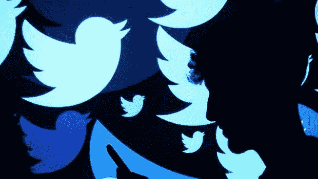
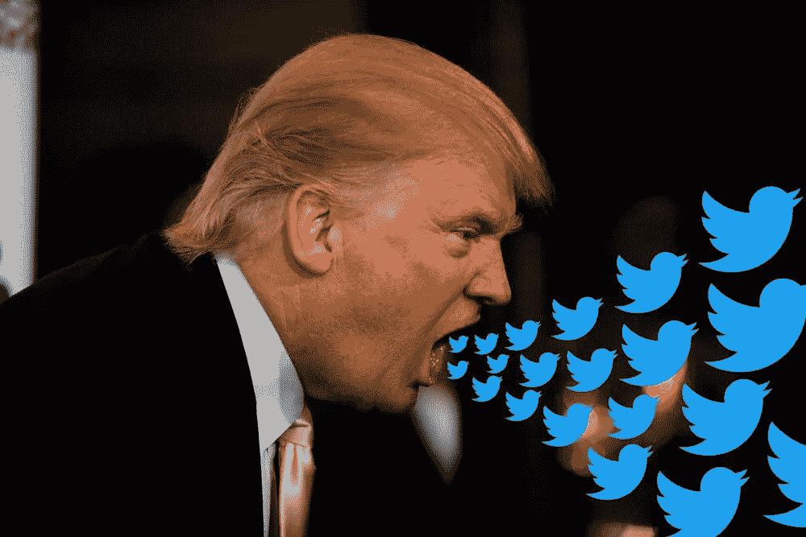
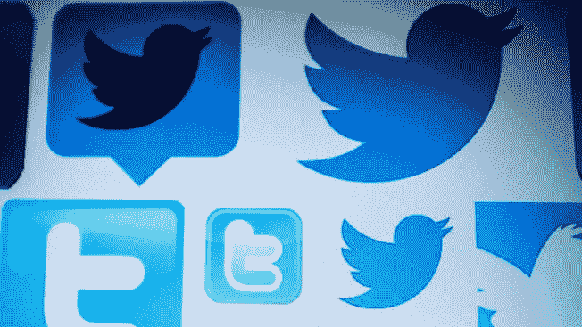

# Twitter 清除虚假粉丝的冲动

> 原文：<https://medium.datadriveninvestor.com/twitters-urge-to-purge-fake-followers-4c0104e235f9?source=collection_archive---------3----------------------->

## 禁止高音首席…

如果你在 Twitter 上，到目前为止，由于虚假账户的清理，你已经失去了多少粉丝？一百？万一呢？一万？或多或少？

不管怎样，即使你的大量粉丝一夜之间消失了，也不要怨恨 Twitter。记住，你并不孤单。

我同样不高兴的是，我的一大群追随者在周四消失了。然而，在我最初的沮丧消退后，我意识到这是为了平台的更大利益，并将有益于整体用户体验。

> **推特最近的自我净化实际上是变相的好消息。**

也就是说:Twitter 在 7 月 11 日的公司博客中就这些变化发表了以下声明(全文如下):

*   “粉丝数量是一个明显的特征，我们希望每个人都相信这些数字是有意义的和准确的。”
*   “大多数人会看到四个或更少的追随者的变化；其他拥有大量追随者的人会经历更大幅度的下降。”
*   “我们知道这对一些人来说可能很难，但我们相信准确性和透明度使 Twitter 成为更值得信赖的公共对话服务。”

Twitter 首席执行官杰克·多西在推特上发布了以下新进展:

虽然你可能会在微观层面上感受到短期的痛苦(通过追随者的流失)，但你会在宏观层面上实现长期的收益(更少的巨魔和机器人，更少的垃圾邮件和假新闻)。

Twitter 清理平台的努力有一个崇高的目标:增强用户信任和透明度，同时促进更多的公民参与(或 Twitter 语言中的“健康对话”)。

> 在一个拥挤喧闹、充斥着欺诈活动和腐臭言论的社交媒体空间，Twitter 清除虚假粉丝是一个值得欢迎的进展。

 [## 对追随者数量的信心

### 作为我们正在进行的全球努力的一部分，在 Twitter 上建立信任和鼓励健康的对话，每一部分…

blog.twitter.com](https://blog.twitter.com/official/en_us/topics/company/2018/Confidence-in-Follower-Counts.html) 

## **推特澄清**

Twitter 的首席财务官 Ned Segal 在公司的最后一次收益电话会议上谈到了这些变化。他说了以下的话:

*   “从 Twitter 上删除垃圾邮件和可疑账户的更广泛的健康计划将继续影响 MAU…”(月活跃用户)
*   “我们总是会做正确的事情，以确保服务对那些应该使用它的人来说是伟大的。”

负面方面，关于 Twitter 实施所谓“信息质量努力”的新闻报道导致该公司股票价值在 7 月 9 日周一下跌 8%。这是数月来最大的单日百分比跌幅。

> **从好的方面来看，在过去一年中，Twitter 的股价上涨了约 146%，因为该公司在 2018 年初首次实现了盈利。**

> 据报道，与前一季度相比，Twitter 上的月活跃用户数量在 4 月份增加了 600 万，总数达到 3.36 亿。

## **没有例外**

对大多数 Twitter 用户来说，关注者数量很重要。推理是基于传统智慧，即感知是社交媒体上的现实:

> 对于任何给定的用户来说，大量的关注者与更高的声望和社交媒体影响力相关联。

对于名人、品牌、首席执行官、媒体、记者和政治家，以及地方、州和国家一级的公司和政府来说尤其如此。

Twitter 估计，6%的用户将受到此举的影响，这相当于超过 2000 万个账户。但有可能这个数字只是一个低球估计。

Twitter 表示，删除锁定账户的新政策没有例外。虚假粉丝的流失影响了从美国总统到当地商会主席的每一个人。

 [## 以下是特朗普、奥巴马和其他人在推特清理锁定账户中失去的粉丝数量

### 包括巴拉克·奥巴马和凯蒂·佩里在内的几个最受欢迎的推特账户失去了数百万粉丝…

www.washingtonpost.com](https://www.washingtonpost.com/technology/2018/07/13/heres-how-many-followers-trump-obama-others-lost-twitters-purge-locked-accounts/?utm_term=.fedd6f72d697) 

据《华盛顿邮报》报道:

*   歌手凯蒂·佩里和贾斯汀比伯都失去了近 300 万粉丝。他们是最受欢迎的两个 Twitter 账户，在大清洗前分别拥有 1.1 亿和 1.07 亿粉丝。”
*   "电视明星奥普拉·温弗瑞、艾伦·德杰尼勒斯和金·卡戴珊·韦斯特都失去了超过一百万的粉丝."
*   自 7 月 4 日以来，全球足球巨星克里斯蒂亚诺·罗纳尔多失去了 90 万名粉丝，他在世界杯期间获得的 50 万粉丝也化为乌有
*   “截至周五上午，奥巴马失去了 200 多万名粉丝，比他本周初拥有的 1.04 亿粉丝略高 2%。”

> “特朗普总统的个人账户在 5300 万粉丝中减少了 20 多万。”—《华盛顿邮报》

## 倾倒高音首席

特朗普总统对推特上的最新消息有自己独特的看法。他利用这个机会再次抨击新闻媒体，这是美国建国以来民主的主要内容。

美国的首席推特用户经常不喜欢也不同意所谓的[第四等级](https://en.wikipedia.org/wiki/Fourth_Estate)的真实准确报道——但是，有趣的是，只有当一个故事反映了他的总统任期不好的时候。

因此，特朗普在主要媒体上释放了他的毒液，这是他经常用来转移公众注意力和扩大他狂热的政治基础的可悲的公关策略。

虽然特朗普对自由和独立媒体的强烈蔑视可能是因为他的专制倾向，但任何一位美国总统公开表达对一个运转良好的民主国家的重要机构的如此敌意仍然令人困惑和不恰当。

 [## 白宫公关欺骗创下新低

### 特朗普和桑德斯编织纠结的网…

medium.com](https://medium.com/@DBGrinberg/white-house-deception-reaches-new-heights-40f509ac2767) 

> **川普称自由媒体为“人民的敌人”，这令人愤慨**

这种愚蠢的口头攻击通常只适用于第三世界国家的领导人和香蕉共和国的统治者。特朗普对媒体和其他民主机构的反美情绪只会有助于独裁者和专制政权的利益。

> 令人不安的是，特朗普将推特变成了他在社交媒体上首选的总统讲坛，玷污了推特。

## 特朗普玷污推特

特朗普总统被许多人认为是推特的连续滥用者。证明这一点的是，他故意传播恶意的错误信息，并为党派和个人利益进行政治宣传，他将党派和个人利益置于国家利益之上。

特朗普每天对推特的滥用无耻地表现在他不计后果的咆哮和严厉的话语攻击每个人，从新闻媒体到国家安全机构，到美国的长期全球盟友，以及任何敢于反对他的陈腐观点的人或实体。

 [## 独立日:特朗普的专制倾向

### 为自由和平等而战仍在继续…

medium.com](https://medium.com/@DBGrinberg/independence-day-trumps-tyrannical-tendencies-d452e952ed79) 

这提出了一个棘手的问题，反映了 Twitter 在社交媒体领域的管理和领导力:

> **作为促进真相、透明和健康对话的努力的一部分，Twitter 应该彻底抛弃川普吗？**

> **如果 Twitter 渴望成为社交媒体的榜样，那么答案是肯定的。**

很明显，这位首席推特用户继续用骚扰性仇恨言论玷污推特，同时公开拥抱在线欺凌、小丑和钓鱼策略。这对于在网上推广公民话语来说是一种诅咒。

我们也不要忘记一名联邦法官最近在纽约南区的法院裁决，称特朗普侵犯了他在推特上阻止的公民的言论自由权，因为他们的政治观点不同。

 [## 特朗普的推特使用是否违反言论自由？

### 社交媒体屏蔽的合法性…

medium.com](https://medium.com/@DBGrinberg/does-trumps-twitter-use-violate-free-speech-21d57a37260e) 

## **最终想法**

一些社交媒体用户一直对 Twitter 爱恨交加。然而，尽管面临来自脸书和 Instagram 等更大竞争对手的竞争，该平台仍在流行文化中占据特殊地位。

有趣的是，Twitter 清除数百万虚假账户的举动正值脸书仍然面临欧盟监管机构和美国国会对大规模用户隐私泄露的愤怒——更不用说对正在进行的数据崩溃的掩盖和误导性声明了。

[例如，英国刚刚因剑桥分析公司数据丑闻对脸书处以 66 万美元的罚款(这是该国数据保护法允许的最大金额),从而给了它一记大拇指。](https://www.cnbc.com/2018/07/11/facebook-faces-uk-ico-fine-after-data-scandal-found-to-be-illegal.html)

> 虽然巨额罚款对于脸书及其陷入困境的首席执行官马克·扎克伯格来说只是金钱上的“沧海一粟”，但它仍然是一项重要的象征性措施。

 [## 扎克伯格在危机沟通中被否决

### 面对脸书数据的惨败…

medium.com](https://medium.com/@DBGrinberg/zuckerberg-gets-schooled-in-crisis-communications-5faca0d37ae9) 

> 与此同时，美国越来越担心俄罗斯干涉 11 月的中期选举，这也是 Twitter 及时行动值得称赞的另一个原因。

本质上，Twitter 及其领导团队值得称赞，因为他们积极采取积极措施，在网上培养更大的信任、透明度和公民话语——特别是在社交媒体需要更多可信内容和更少来自俄罗斯等外国对手的假新闻的时候。

Twitter 值得称赞的行动发生在其他社交媒体巨头忽视或向用户和公众隐瞒隐私保护(或缺乏隐私保护)、数据泄露和虚假信息活动等令人不快的真相之际。

最后，令人耳目一新的是，Twitter 仍然喋喋不休地说要让社交媒体空间变得更好——至少在 Twitter 方面。

这有什么不好的呢？

*   *注:你也可以在 LinkedIn* *上搞一个版本的* [*这篇文章。*](https://www.linkedin.com/pulse/social-media-scare-twitter-purges-millions-fake-david-b-grinberg/?published=)

______________________________________________________________

> **关于作者:**大卫是战略传播顾问、代笔人和前政府发言人。除了在国会和联邦机构工作外，他还在白宫为比尔·克林顿总统工作过。大卫开始了他的记者生涯。你也可以在 [Twitter](https://twitter.com/DBGrinberg) 和 [LinkedIn](https://www.linkedin.com/in/davidgrinberg/) 上找到他。

**注:** *所有观点和意见仅属作者个人观点，并非任何公共部门雇主、私营部门雇主、组织或政治实体的官方声明或认可。*