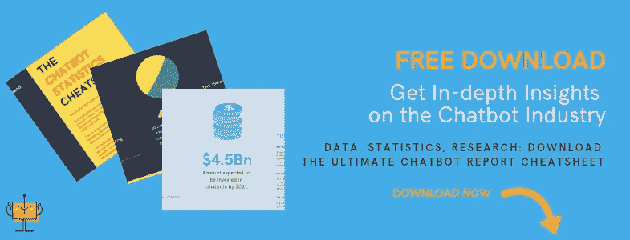
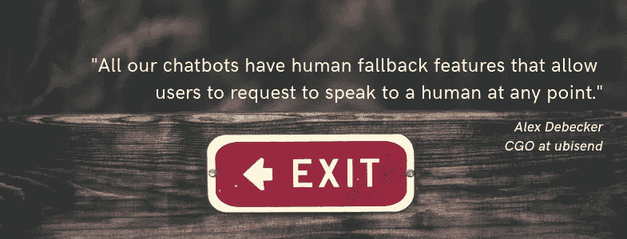

# 使聊天机器人成为完美营销渠道的两个概念

> 原文：<https://medium.datadriveninvestor.com/two-concept-that-make-chatbots-a-perfect-marketing-channel-fe0201215041?source=collection_archive---------32----------------------->

作为一名营销人员，我非常重视聊天机器人技术与营销的联系。我相信聊天机器人是一种奇妙的营销工具，原因有很多。

在这篇文章中，我将关注两个关键概念，对我来说，这两个概念使聊天机器人成为一个完美的营销渠道。尽管有更多的理由去爱它们，但现在我将把重点放在:

*推拉
*人工回退

# 推，但也拉

长久以来，市场营销就是推销。

即使以一种明智的、正直的方式完成，它仍然是关于把信息放在可能现在/这里不想要它的用户面前。

聊天机器人正在改变这个领域的游戏。

Want to learn more about chatbots and their business impact? Grab our [Chatbot Statistics Cheatsheet](https://insights.ubisend.com/chatbot-statistics-cheatsheet)!

聊天机器人的一个美妙之处在于，它们为用户提供了获取信息的机会。它不再是向你的观众传播信息(电子邮件、脸书信息、信鸽)。现在的问题是提供一个工具，让你的观众可以联系到并抓住他们需要的东西。

假设你是 SaaS 平台的骄傲营销人员。

你可以(也应该)告诉你的潜在用户，他们可以从使用你的平台中获得惊人的好处。但是，你现在也应该可以让他们直接询问。

> 你能给我发一些 X 平台用户的案例研究吗？
> “使用你们的平台，我能期望获得什么样的投资回报？”
> ‘你能发给我一份循序渐进的指南，帮我实现 X 吗？’

诸如此类。

**拉动式信息传递改变了游戏规则。你现在可以通过智能机器以对话方式大规模提供这项技术，这是一项革命性的技术。**

如果你不这样做，你的竞争对手很快就会这样做。

# 从机器到人类

对于上述好处，通常的反驳是，“好吧，如果聊天机器人没有为用户提供正确的信息呢？”。

这是一个公平的问题。

如果聊天机器人总是出错，并且不提供任何脱离自动化系统的方法，那么它们就不会是“完美的营销渠道”。

谢天谢地，行业领袖已经想到了这一点。

首先，显而易见的是:解决技术问题。训练你的聊天机器人理解更多的话语是聊天机器人 101。

> ***不确定什么是话语？我写这个是为了帮忙:*** [***聊天机器人必备词汇(针对非极客)***](https://blog.ubisend.com/discover-chatbots/chatbot-glossary) ***。***

第二，任何可靠的聊天机器人都应该有人类的后备功能。这就是你如何为你的用户提供最好的营销体验。

人类回退特性本质上标记了任何用户似乎被实际的人类卡住的对话。然后，人类可以接管机器，提供帮助，并从中汲取营养。

Read [my intervention on AMA Feed](https://techama.amafeed.com/i-launched-and-run-leading-chatbot-building-company-ubisend-456877) for more.

为什么这对营销很重要？因为你永远不会希望任何人陷入无限循环。你总想提供一条出路。

这也是革命性的。

这意味着你的用户可以全天自动与你的聊天机器人对话，即时获得所有正确的信息，无论是白天还是晚上(这是脸书、PPC、SEO 等频道无法提供的)。每当他们遇到困难时，就会有人来帮忙。

这两个关键概念与聊天机器人技术本身关系不大。

不是关于聪明的人工智能。这不是复杂的机器学习算法。它通过革命性的技术提供无缝体验。

**⬇️对此有何想法？我很想听听！⬇️**

*在这篇文章中，我扩展了我最初在这篇文章中定义的两个概念:* [*【聊天机器人基本术语表(非极客用)*](https://blog.ubisend.com/discover-chatbots/chatbot-glossary) *。如果你有兴趣了解更多，请阅读📖📖！*