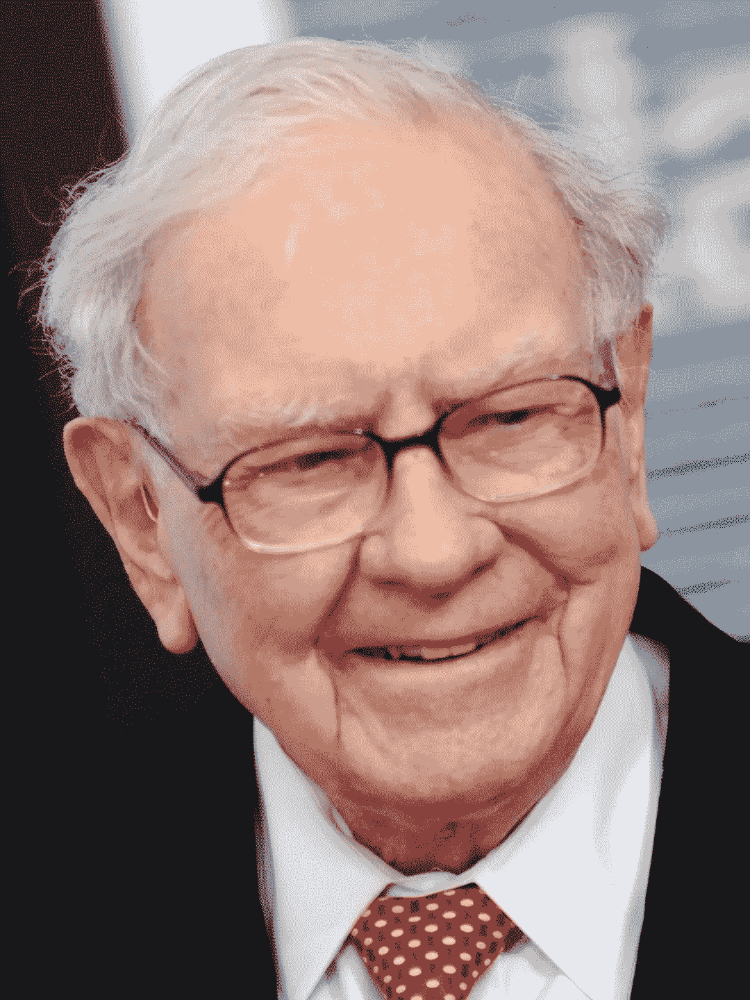

# 向沃伦·巴菲特的生产率水平迈进两步

> 原文：<https://medium.datadriveninvestor.com/two-steps-to-warren-buffetts-level-of-productivity-b76e30ff5233?source=collection_archive---------10----------------------->

With thanks to Forbes.com

沃伦·巴菲特不是傻瓜。

他为自己创造了一种生活，可以做任何他想做的事。他身价数十亿美元。

 [## 跑步摆脱疯狂:锻炼如何提高你的生产力|数据驱动的投资者

### 没有比锻炼更好的方式来开始一天的工作了。我试着一周至少做四天，在…

www.datadriveninvestor.com](https://www.datadriveninvestor.com/2018/10/23/running-to-get-rid-of-the-crazy-how-working-out-increases-your-productivity/) 

如果有人知道如何管理他的时间，那就是他。因为他知道如何一次又一次地赚取数十亿美元，人们一直要求他领导公司、投资集团，甚至一度领导美国。

他曾经向他的飞行员透露过他的工作效率秘密，就是那个驾驶巴菲特乘坐的飞机的人。迈克·弗林特(飞行员)在其职业生涯中也曾为美国总统飞过。但巴菲特，以及他告诉弗林特的，正是我们今天站在这里的原因。

这个故事弗林特已经讲过几次了，开头是巴菲特问弗林特他的职业重点。

这就是巴菲特生产率秘密出现的时候。

巴菲特要求弗林特写下他的 25 个职业目标。所以弗林特就这么做了。他也花了一些时间做这件事。想出你人生中最重要的 25 个职业目标并不容易。

下一部分更难。巴菲特让弗林特圈出他 25 个目标中的 5 个。弗林特为此花了些时间。最终，他的 5 大职业目标摆在了面前。

弗林特当时列了两份清单。通过圈出他最重要的 5 个目标，他现在有了 5 个最重要的目标作为清单 A，其他 20 个目标作为清单 b。

他告诉巴菲特，他有两份清单，巴菲特回答说，那另外 20 份呢？弗林特告诉巴菲特，他们显然没有前五名重要，所以他会尽可能地关注他们。

巴菲特告诉他，他错了。其他 20 只则不能以任何方式触碰或擒抱。他将这份清单称为“不惜一切代价避免清单”。弗林特甚至不能看这份名单，直到前五名被处理掉。

## 为什么这种方法有效

Photo by [Glenn Carstens-Peters](https://unsplash.com/@glenncarstenspeters?utm_source=medium&utm_medium=referral) on [Unsplash](https://unsplash.com?utm_source=medium&utm_medium=referral)

如果你已经列出了 25 个最优先的职业，你就已经列出了你关心的事情。如果你把范围缩小到 5 和 20，你仍然关心 20。这一点没有改变。

然而，巴菲特说，你要避免分心。在你完全完成前 5 名之前，你甚至不会看那 20 名。

这就是他如何成为截至 2019 年身价 840 亿美元的人。

你可以把这个方法应用到下个月，下个星期，下个小时。它是如此的通用，因为你所做的是真正的优先化。你正在清除你头脑中的杂念，只关注 5 件最重要的事情去做或完成。

想象一下让激光聚焦一周。

去吧。

**如果你想更像巴菲特，** [**试试看这篇**](https://amzn.to/2XVdow7) **。可能会有帮助。如果不行，至少你知道该怎么做。**

披露:上面的一些链接是附属链接，意思是，在你没有额外费用的情况下，如果你点击并购买，作者将获得佣金。