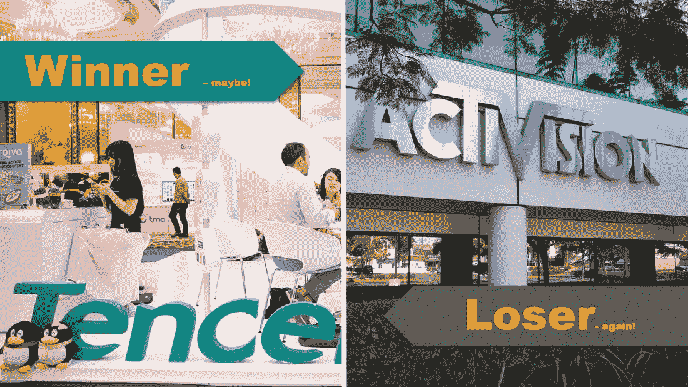

# 游戏大奖 2018 启发的两个股市故事！腾讯赢了(可能)，动视暴雪输了(又一次)！

> 原文：<https://medium.datadriveninvestor.com/two-stock-market-stories-inspired-by-the-game-awards-2018-a4e0c83417e0?source=collection_archive---------31----------------------->

当我写这篇文章时，2018 年游戏大奖颁奖典礼即将结束。游戏大奖是游戏行业的奥斯卡。当我们谈论游戏作为娱乐时，许多成年人翻了翻白眼。但是，想想吧！今年，Red Dead Redemption 2 电子游戏实现了娱乐史上最大的首映周末；不是电子游戏史，而是娱乐史。现在很明显，视频游戏和视频游戏公司将在未来几年塑造我们的生活。本周最有趣的股市故事受到 2018 年游戏奖的启发:

**赢家:腾讯控股(股票代码:TCEHY)**

这家中国视频游戏制造商经历了几个糟糕的季度。尽管拥有全球现象的制造者——堡垒之夜——Epic Games 40%的股份，但该股长期以来一直处于自由落体模式。今年早些时候，中国政府冻结了政府认为不合适的视频游戏的出版。这让该公司损失了大量收入，或许更重要的是，损失了投资者的情绪和信任。然而本周，在[的一个令人惊讶的公告](https://www.wsj.com/articles/chinas-freeze-on-new-videogames-begins-to-thaw-1544195230)中，一个新的道德委员会已经开始审查游戏名称，这个消息受到游戏高管的欢迎。它尚未在股市上取得重大胜利，但这个故事无疑是腾讯的胜利。

[立即访问腾讯股票卡……](https://stockcard.io/TCEHY)

**输家:动视暴雪**

一些公司可以如此成功，同时在股价上实现史诗般的失败。动视暴雪已经做到了。该公司是领导者，有望从电子竞技类别的出现中受益，并已在发展其电子竞技业务方面进行了大量投资。这项投资包括发展一个电子竞技联盟，运动员起草和招募规则，以及为其受欢迎的 Overwatch 特许经营权开发世界上第一个电子竞技体育场。动视暴雪是视频游戏行业的怪兽玩家。然而，自 2018 年 10 月初以来，动视暴雪公司的股价下跌了约-42%。这家视频游戏公司报告称，上一季度的活跃用户为 3.45 亿，比上一季度下降了 2%。这导致股价暴跌。此外，由于围绕其广受欢迎的 PC 游戏《暗黑破坏神》(Diablo)手机版的发布出现分歧，该公司与其粉丝群体发生了一些争吵。当前的假日季节有望改变动视暴雪的命运。只有时间会证明一切！

[现在就访问动视暴雪的股票卡……](https://stockcard.io/ATVI)

顺便问一下，考虑到美中贸易战，你应该投资中国股票吗？请收听最新一期的叛离投资者播客，寻找答案:

 [## Ep 7:即使美中贸易战没有结束，你也应该投资中国股票吗？

### 考虑到美中关税和贸易战以及过去中国公司股价的快速下跌…

www.podbean.com](https://www.podbean.com/media/share/pb-veeqh-a13ac3) 

本期就到这里！如果你觉得这个帖子有帮助，别忘了分享给你的朋友，或者鼓掌几下:)！