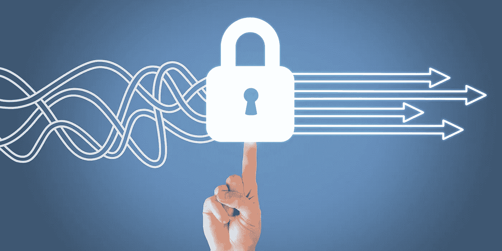
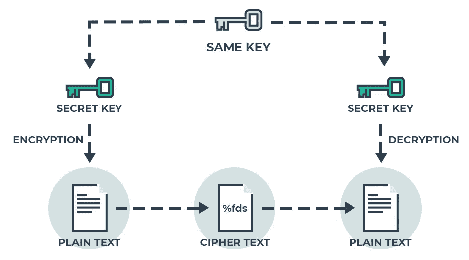

# 用 PHP 实现双向对称数据加密

> 原文：<https://medium.datadriveninvestor.com/two-way-symmetric-data-encryption-with-php-4b951e0bf8db?source=collection_archive---------4----------------------->



有没有想过用一个密钥加密机密数据的安全方法，一旦需要就可以用这个密钥来解密它？我想是这样的……嗯，我正在做一个需要这样的项目，所以我在网上做了一些搜索，想出了一个叫作 [Cryptman](https://github.com/davmixcool/cryptman) 的 PHP 包。这个包利用了 PHP 提供的 open-SSL 库，在这种情况下这是最好的，因为 open-SSL 库提供了一种安全的方法，使用一个稍后可以用来解密的密钥来动态加密您的数据。我知道你可能会问为什么我不用 [mcrypt](https://www.php.net/manual/en/book.mcrypt.php) 库进行普通的双向加密，答案很清楚。这不安全。

[](https://www.datadriveninvestor.com/2019/02/21/best-coding-languages-to-learn-in-2019/) [## 2019 年最值得学习的编码语言——数据驱动的投资者

### 在我读大学的那几年，我跳过了很多次夜游去学习 Java，希望有一天它能帮助我在…

www.datadriveninvestor.com](https://www.datadriveninvestor.com/2019/02/21/best-coding-languages-to-learn-in-2019/) 

# 为什么要数据加密

**加密**很重要，因为它可以让你安全地保护**数据**你不希望其他任何人访问…我的应用程序使用**加密**来安全地保护内容，其中可能包含电子邮件、信用卡号码或任何其他敏感信息。也就是说，让我们看看 [Cryptman](https://github.com/davmixcool/cryptman) 包是如何工作的。

# Cryptman 包如何工作

这个[包](https://github.com/davmixcool/cryptman)将一个密钥和一种加密方法作为您需要提供的选项来加密您的数据。但是，加密方法是可选的，因为包本身提供了默认的加密方法(aes-128-ctr ),当没有提供加密方法时会使用该方法。



*注意:*要解密您的数据，您必须使用与加密时相同的密钥和密码方法。

# 如何使用 Cryptman 包

要使用 [Cryptman](https://github.com/davmixcool/cryptman) 包，您必须通过 Composer 运行以下命令来包含它:

```
composer require davmixcool/cryptman
```

一旦添加了包，只需用您的密钥和加密方法初始化 [Cryptman](https://github.com/davmixcool/cryptman) 类就可以使用它了:

```
$cryptman = new Davmixcool\Cryptman([
     'key' => 'Your cipher key',
     'method' => 'Your cipher method' //optional
]);
```

初始化之后，您现在可以利用 [Cryptman](https://github.com/davmixcool/cryptman) 实例来调用加密方法。

```
//Encrypt data
$data = 'Loose lips sink ships';
$encrypted = $cryptman->cipher($data)->encrypt();
```

此外，通过使用 [Cryptman](https://github.com/davmixcool/cryptman) 实例并将散列数据作为参数传递给解密方法，可以对加密的数据进行解密。

```
//Decrypt Data
$decrypted = $cryptman->cipher($encrypted)->decrypt();
```

原来如此。 [Cryptman](https://github.com/davmixcool/cryptman) 包让你轻松加密和解密机密数据。感谢网络给了我这样的知识和机会来制作和分享这个包。请随意投稿，因为这将促进[密码人](https://github.com/davmixcool/cryptman)的成长。

# 资源

1.  在 GitHub 上查看这个包:[https://github.com/davmixcool/cryptman](https://github.com/davmixcool/cryptman)
2.  在这里查找更多密码方法:[http://php.net/openssl_get_cipher_methods](http://php.net/openssl_get_cipher_methods)