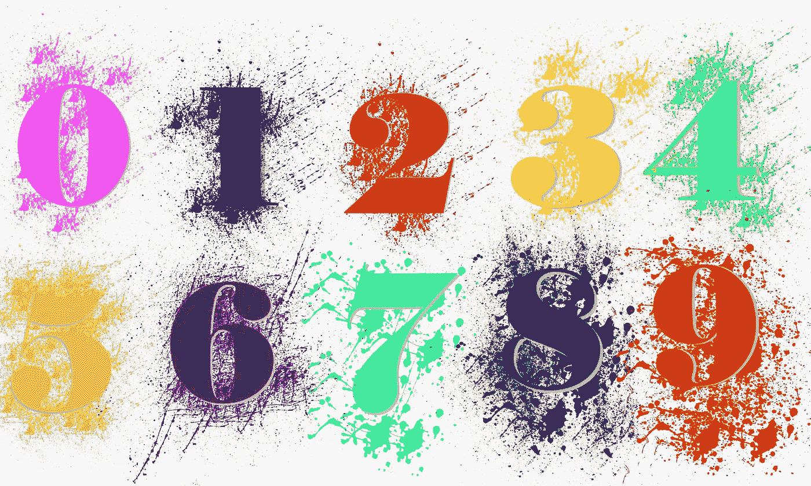

# 让我们谈谈二的补码。几乎和 1，2，3 一样简单…

> 原文：<https://medium.datadriveninvestor.com/twos-complement-a283b2448135?source=collection_archive---------10----------------------->



你知道杰克逊五兄弟歌曲《ABC》的歌词吗？我将向你展示二进制补码几乎和…1，2，3 一样简单。

> 我们很小的时候就学会了用十进制数，从 0 开始。

```
 0
   1
   2
   3
   4
   5
   6
   7
   8
   9
  10
  11
  12
  ..
  ..
  99
 100
 101
```

当我们到达数字 10 时会发生什么？最右边的数字翻转到 0，我们在左边加一个 1 开始十位。

左边的每个数字增加另一个幂。

百位+十位+一位

10² + 10¹ + 10⁰

让我们用数字 108 来说明:

(10² * 1) + (10¹ * 0) + (10⁰ * 8) = 108

> 现在来说二进制。

你的计算机以一系列 0 和 1 的形式存储一切，包括数字，它以二进制(基数 2)运行。

… + 2⁶ + 2⁵ + 2⁴ + 2³ + 2² + 2¹ + 2⁰

你看到左边的指数每次增加 1 了吗？

基数为 10 的数字 108 在基数为 2 的情况下会有所不同。

(2⁶ * 1) +(2⁵ * 1) + (2⁴ * 0) + (2³ * 1) + (2² * 1) + (2¹ * 0) + (2⁰ * 0) = 1101100

```
Base 10: 108
Base 2: 1101100
```

好，现在你试试！选择一个数字，任何数字，然后花点时间做同样的事情。

> 那么什么是二的补码呢？

二进制补码指的是数字在内存中的存储方式。最小的内存是一位。每一位可以是 0 代表“关”或 1 代表“开”

要了解计算机如何存储正数，用二进制写出这个数。让我们以数字 28(基数 10)为例。

要用二进制写出来，我用这个方法:

1.  找出不超过我的数的最大数。

2⁵ + 2⁴ + 2³ + 2² + 2¹ + 2⁰

2⁵是 32，超过了 28，所以让我们试试右边下一个最小的数字。

2⁴16 岁了，但还没有超过 28 岁。这是我的起点，我将在它下面标记 1，表示该位为“开”

2⁴
1

2.计算哪些值(从右到右)与 2⁴相加等于 28。我基本上是在计算哪些部分该打开，哪些部分该关闭。当我完成时，我将得到二进制数。

2⁴ + 2 + 2 + 2 + 2⁰
1…..1…..1…..0…..0

(2⁴ * 1) + (2³ * 1) + (2² * 1) + (2¹ * 0) + (2⁰ * 0)

```
Base 10: 28
Base 2 (binary): 11100
```

> 这相当于为某人做出改变…

假设你卖 27 美分的东西。买家给你一张一美元的钞票。

你可以选择换成 25 美分、10 美分、5 美分和 1 美分的硬币。你可以把所有的硬币(73 美分)都找回来，但那会很麻烦，而且很可能会让买家不高兴。所以让我们从最大的硬币开始归还零钱。等于 73 美分的零钱，你给他们:

两个 25 美分硬币，两个 10 美分硬币，0 个 5 美分硬币和 3 个 1 美分硬币。

> **你看到了正数是如何存储的，但是负数呢？**

要找到二的补码，翻转所有的位并加 1。

因此，让我们以同样的 28 为基数，将其转换为二进制:

00011100

现在我们翻转比特:

11100011

并补充一句:

11100100

```
Base 10: 28
28 in binary form: 00011100Base 10: -28
-28 in binary form: 11100100
```

现在你知道正数和负数是如何存储在内存中的了。这几乎和 A、B、C 一样简单。1, 2, 3….

