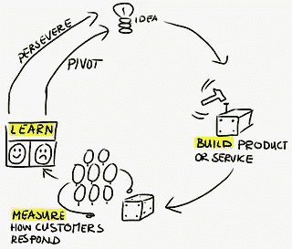
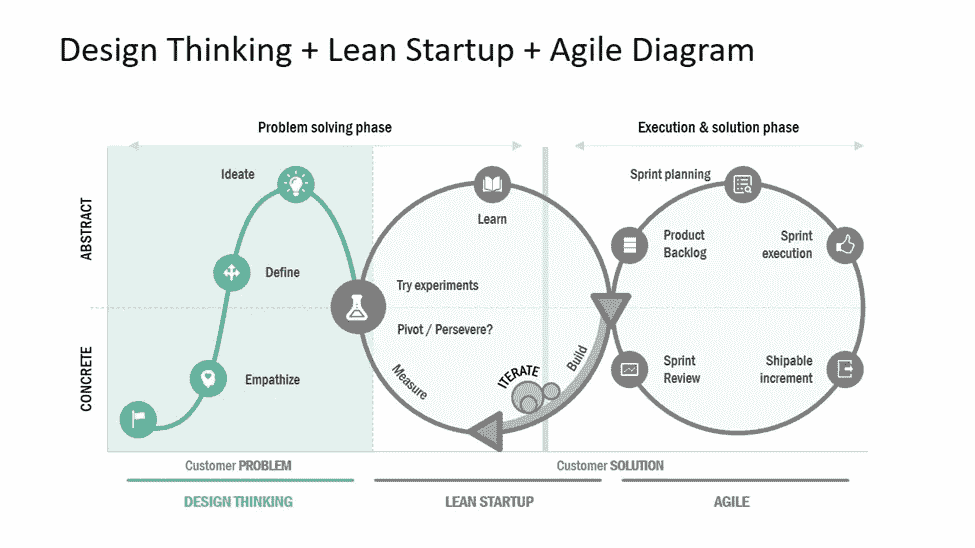

# 企业的类型，谁是企业家和企业家精神的原则

> 原文：<https://medium.datadriveninvestor.com/types-of-businesses-who-is-an-entrepreneur-and-principles-of-entrepreneurship-a7204b73323d?source=collection_archive---------0----------------------->

# 企业的类型，谁是企业家和企业家精神的原则

这是一个故事系列，我们将讨论企业家精神，想法，设计思维，精益和商业画布，价值主张，竞争，企业的类型和形式，以及 MVP。在这个故事系列的第一篇文章中，我们将讨论主要的商业类型，什么是企业家精神，谁是企业家？，创业原则。

# 业务类型[【1】](#_ftn1)

商业实体是使用经济资源或投入向客户提供商品或服务以换取金钱或其他商品和服务的组织。你的企业可能采取实物产品的形式，有一个叫做“*实体商店*”的实体店。你的企业可能是一个授权网络，而不是有形产品。

商业组织有不同的类型和不同的所有制形式。

**3 种业务类型**

有三种主要的商业类型:

**1。** **服务业务**

服务型企业提供无形产品*(没有实物形态的产品)*。服务型公司提供专业技能、专业知识、建议和其他类似的产品。

服务行业的例子有:沙龙、修理店、学校、银行、会计事务所、咨询公司和律师事务所。

**2。** **商品销售业务**

这种类型的企业以批发价购买产品，以零售价出售。他们被称为“买卖”企业。他们通过以高于购买成本的价格出售产品来获利。商业企业出售产品时不改变其形态。例如:杂货店、便利店、分销商和其他经销商。

**3。** **制造业**

与商业企业不同，制造企业购买产品的目的是将它们作为制造新产品的原料。因此，购买的产品发生了转变。制造企业也称为产品企业，其目的是根据需要生产、开发产品。制造企业在生产过程中综合了原材料、劳动力和制造费用。然后，制成品将被出售给客户。

**混合业务**

混合业务是指可以划分为一种以上业务类型的公司。例如，一家餐馆在制作美食(制造)的过程中混合各种原料，出售一瓶冰镇葡萄酒(销售)，并满足顾客的订单(服务)。

尽管如此，这些公司可以根据他们的主要商业利益进行分类。在这种情况下，餐馆更多的是服务类型——他们提供餐饮服务。

# 是什么让一个人成为企业家？

到处为每个人做任何事的人似乎都被称为“企业家”。企业家可以从事各种行业，也可以有非常不同的背景。一些人建立个人品牌，而另一些人致力于他们相信的产品或服务。任何人都可以成为企业家，只要有一个想法和合适的工具，就可以把它发展成一个实用的企业。

*企业家精神*是指**它是为了盈利或满足社会需求而创办企业或组织的过程**。一个*“企业家”*是**看到一种需求，并承担金融风险去开创一个企业来满足这种需求的人。**

实际承担开发、生产和销售产品或服务的财务风险的个人或实体。因此，企业家是创建新企业的个人或实体，承担大部分风险，享受大部分回报。企业家开发一个商业模式，获得必要的物质和人力资本来启动一个新的企业，并将其投入运营，并对其成败负责。

全球就业市场发生了转变，为企业家精神变得更加主流打开了大门。零工经济是一种自由市场体系，在这种体系中，临时职位很常见，组织与独立工作者签订短期合同。这种转变使得企业家在财务上更容易找到人让他们的企业运转起来，而不用承诺长期支付员工工资。这使得早期创业者在开发产品或服务时能够找到灵活的工作来支持自己。这并不意味着零工经济中的每个人都是企业家；它只是给了更多的人机会。

《社会科学研究网络杂志》上的一项研究发现，企业家创办公司是因为他们大多相信:

它们本来就比它们在纸上的样子更有价值。

他们为别人工作是浪费时间

他们的简历没有显示“真实的他们”

大公司不能欣赏他们的全部潜力。

他们能够将他们的内在价值转化为现实生活中的金钱。

基本上，创业者是相信自己的。

创业确实创造了一种机会文化，可能对一些非传统工作者有用。当然，每一个获得巨大成功的企业家都有过成百上千次的失败。创业的过程本身就是一次教育经历。精益创业方法是全球公认的企业家指南，由史蒂夫·布兰克和埃里克·里斯创建。

“构建-测量-学习”反馈循环是精益启动方法的核心

Lean Startup

**构建** —第一步包括定义需要解决的问题，并开发一个简单的产品原型，也称为“最小可行产品”(MVP)。最小可行产品(MVP)是最简单的试验性发布，可以开始精益开发的构建-测量-学习循环

**测量** —然后测量第一步的结果。在这里，一家公司衡量 MVP 产生的利益，并确定是否有一个强大的产品市场匹配(一个假设的产品满足一个假设的市场需求的程度)。

“产品-市场匹配”意味着产品非常适合其目标市场。换句话说，有很多真正的用户有兴趣为产品支付实际费用。

**学习**——分析上一步的结果，做两件事情中的一件:继续将 MVP 开发成一个成熟的产品，或者如果产品迭代与市场需求不一致，就转向

精益创业方法论认为，如果我们边走边学，磕磕绊绊是完全没问题的。但为了识别失败并从中吸取教训，每个企业家都必须问自己:在我看来，成功是什么样的？如何重新定义失败，如果失败确实不可避免，如何收拾残局。无论成功与否，都完全取决于你自己。并不是说成功的企业家从来没有面对过失败；而是他们没有退出。换句话说，如果你认为你有一个伟大的想法，并且与正确的团队一起很好地执行，你需要坚持下去，即使传统观点认为你错了。因此，底线是，只要有点勇气、决心和运气，任何人都可以成为企业家。

# 创业原则[【2】](#_ftn2)[【3】](#_ftn3)

基于为期三年的研究，比尔·墨菲提出了企业家精神的五项原则，并由哈佛商学院出版。

**1。** **这不是快速赚钱，也不是目标**

在开始新的冒险之前，检验想法是很重要的。它需要承诺和尝试新的商业模式，以及交易业务的新形式和范例。将你的想法塑造成可行的价值主张和商业模式。测试和验证想法并产生第一手证据。向高层领导和投资者推销你的想法和见解。

Design Thinking-Lean Startup-Agile

测试这些想法的一个方法是组织一个焦点小组。这是你的目标市场中的一小群人，他们聚在一起就你的商业想法进行有指导的讨论。焦点小组可以:

超越数字，揭示真实的潜在客户对你的想法的反应

向你展示你的想法是否有市场，以及顾客愿意为此支付多少钱

揭示你可能没有想到的潜在竞争对手

帮助微调您的产品或服务，以更好地定位成功

最好是想出一个改变游戏规则的主意，而不是去寻找那些没有出路的线索。这意味着企业家必须做好长期参与的准备。

**2。** **找到合适的机会**

关键的挑战是首先专注于发现客户的问题，然后才是寻找客户非常需要或想要的解决方案，而不是那些很好的解决方案。方法是确定对产品或服务的需求；了解客户的潜在问题，而不是向他们提供基于设想的解决方案。设计思维强调用户需求，并识别理解或假设中的潜在盲点。

Design Thinking

正确的解决方案往往来自你的个人或/和专业经验，以及你的感觉、直觉和观察。这是了解是否有迫切需要的唯一方法。企业家必须确保他们有必要的基础，以便在崛起时抓住机会，还必须有一个想法和商业模式，以便在他们发现很难让企业继续发展时创造机会。企业家可以创造无竞争的市场空间，使竞争成为无关紧要的“蓝海”，公司最好寻找方法获得“无竞争的市场空间”，而不是与类似的公司竞争。

3.**打造成功团队**

建立优秀的团队——你最重要的资产——是创业的基础。它始于挑选合适的创始人并结合最好的技能。

在开始活动之前就设计好你的团队是很重要的。这是在合适的地点找到合适的人，共同聚焦于商业模式目标，从而实现盈利的唯一途径。

确保你的团队对工作充满激情和热爱，因为强烈的激情可能是第一个品质，这是获得动力、决心、恒心和勇气所必需的，更不用说努力工作和最终成功了。

创业者必须确保团队充满激情，忠于职守，最重要的是，分享创始人的愿景和使命。换句话说，除非创始人的想法得到团队的认可，否则企业将举步维艰。

4.确保执行力至关重要。对北约原则说不

光说不做不会给新企业带来任何结果，因此，对企业家来说，确保言行一致、兑现承诺是很重要的。事实上，只有改变游戏规则的想法和优秀的团队是不够的，除非企业家懂得执行的艺术。正如互联网繁荣时期发生的那样，许多拥有伟大想法和同样伟大团队的创业公司向任何愿意倾听的人许下了难以实现的承诺。然而，他们创业失败的事实主要是由于想法和执行之间的差距。因此，企业家必须是一个说到做到的领导者，并且懂得执行的意义。

即使想法很棒，团队很好，条件很理想，创业也很难。执行得好涉及两个因素的结合:首先，平衡你的企业家对你的商业目标的信心和你让你的团队逐步建立项目的能力。第二，不断学习激励和领导他人。

此外，领导力意味着企业家不要害怕失败，相反，必须化逆境为胜利，将失败转化为成功的垫脚石。在创业中，领导力无疑是一个巨大的问题。需要两个主要的品质。

最成功的企业家可以独自工作，也可以成为团队成员，不管团队的规模有多大。他们可以为自己企业做出重要的个人贡献，并过渡到领导团队。

最成功的企业家有能力相信他们的直觉和本能，即使他们伤害了传统的规则或习惯。通过这种方式，经历逆境会培养自信和一种对正确做事方式的直觉。事实上，伟大的企业家是那些愿意相信自己的本能和直觉，并在风险尚未产生结果甚至亏损时支持自己的人。

5.**意识到你的影响**

成功的创业似乎不全是为了钱。许多成功的企业家不会改变他们的生活标准。由于他们习惯于冒险，他们没有人们通常会有的那种对未来的恐惧，尤其是在危机时期。当然，钱是重要的，但就经营而言。有两件事似乎更重要:与他人分享抓住他们喜欢的机会的能力，做对人们的生活有真正影响的工作。

问任何一个成功的企业家，他们都会说，虽然钱确实重要，利润确实必不可少，但这总是与钱无关，或者说，赚钱是唯一重要的事情。相反，伟大的企业家精神都是关于倾听内心的声音，为他人创造工作和机会，意识到企业带来的社会繁荣，而不是只有我自己的态度，最重要的是，将他们的愿景转化为成功。

例如，我们中有许多人听说过或遇到过放弃轻松工作去寻找激情、追随和追逐梦想的人。因此，成功的企业家精神就是改变世界，成为一名社会救世主，用他或她的冒险改变社会。

最后，**创业必须被视为改变自己的起点，并在这个过程中成为变革的推动者**。要做到这一点，企业家必须既能满足更大系统的环境、社会和经济期望，同时又能驱使自己追求梦想。事实上，内在愿望和外在期望之间的平衡是成功的最重要的决定因素。

事实上，技术、创新产品和团队是由纯粹的商业意识和对经济的理解所驱动的，这对企业家很有帮助，并为他们提供动力。

下一次，我们将讨论任何企业家的核心部分:他们的想法——想法从何而来，向谁提出，以及如何将想法转化为可行的业务。

[https://www . accounting verse . com/accounting-basics/types-of-business . html](https://www.accountingverse.com/accounting-basics/types-of-businesses.html)

[【2】](#_ftnref2)[http://executivebusinessaccelerator . eu/basic-principles-of-successful-entrepreneurs hip/](http://executivebusinessaccelerator.eu/basic-principles-of-successful-entrepreneurship/)

[【3】](#_ftnref3)[https://www . managementstudyguide . com/principles-of-entrepreneurs hip . htm](https://www.managementstudyguide.com/principles-of-entrepreneurship.htm)