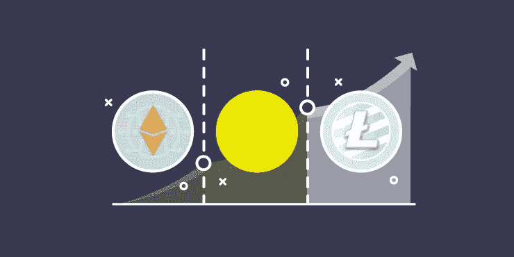
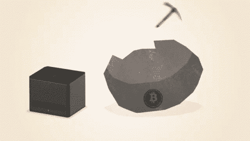
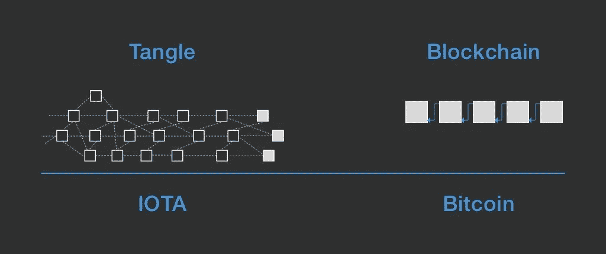
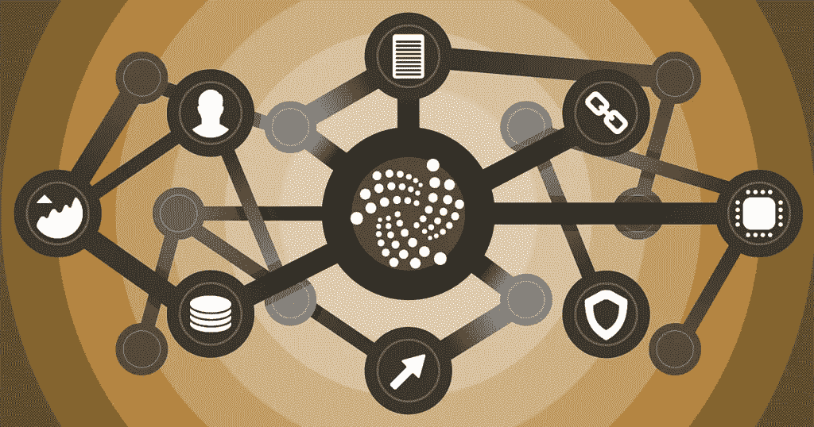
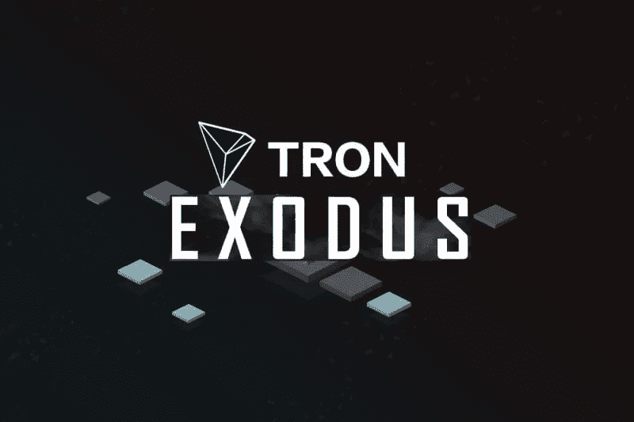
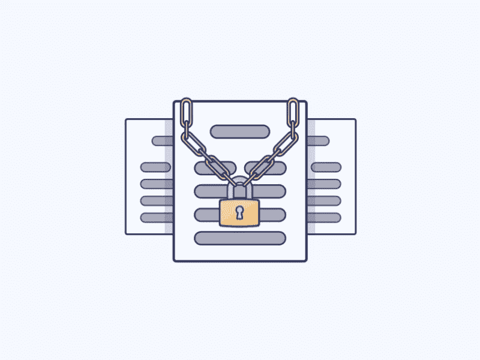

# 加密货币的类型

> 原文：<https://medium.datadriveninvestor.com/types-of-cryptocurrencies-3f260e812e00?source=collection_archive---------0----------------------->

因此，*密码*的世界会变得相当*混乱*。

一旦你意识到除了*比特币*和*矿工*之外还有更多，它很快就会变得令人望而生畏。

等等，以太坊是什么？那和以太不是一回事吗？莱特币呢？所以现在有 20 元代币了？？？为什么是 20？那是什么意思？？

 [## Azbit 旨在连接传统金融和加密货币|数据驱动的投资者

### Azbit 是下一个提供交易平台的加密项目，该平台提供保证金和算法交易。一样多…

www.datadriveninvestor.com](https://www.datadriveninvestor.com/2019/03/20/azbit-aims-to-connect-traditional-finance-and-cryptocurrency/) 

呃，20 块其实不代表什么。我可以马上回答这个问题。

但要应对不断增长的加密货币世界，了解不同的类型很重要。

*是的。有各种各样的加密货币。比特币不是一切的终结。*

我们慢慢来，好吗？

# **硬币对代币**

*这些不是一回事。*简单来说，硬币有自己的区块链。比如大家的最爱，比特币，就有自己的区块链。以太有它自己的区块链；它被称为以太坊。另一方面，代币也是价值储存手段(资产/公用事业的代表)，但它们是在预先存在的区块链上运作的。代币通过 ICO——初始硬币发行来创建和分发。

ICO 类似于传统的银行业务——首次公开募股。在加密领域，它们充当了融资机会。如果一家公司想创造一种新的硬币或代币，它将推出 ICO。

如果你有兴趣深入了解这个概念，这个视频做得很好。

# **Altcoins(替代加密货币币)**

这些硬币是比特币的替代物。大多数替代币是比特币的一个*分支*,如命名币、对等币、莱特币等。

这些都不是来源于比特币的**开源协议**(不是比特币源代码的修改版)*所有的山寨币都有自己的区块链。他们分开操作。*

当一群开发者不同意区块链网络的发展方向时——特别是如果更新减少了给予矿工的奖励。

如果他们决定分叉，开发人员首先复制比特币协议代码。然后，他们进行更改并决定何时分叉将被激活。

下面是对不同类型的替代硬币的更深入的研究——比这里的多得多。我刚刚挑选了最重要的。

# **莱特币**

*   所有支付都记录在公共账本上(区块链)
*   可以随时向世界任何地方汇款
*   交易费用远低于传统银行
*   双方都有支付发生的证据
*   只有 8400 万莱特币——没有通货膨胀会降低价值
*   与比特币相似，只是因为两者都是依赖于网络加密完整性的加密货币

莱特币想成为比特币的黄金。两者最大的区别在于其密码算法。

加密算法也称为密码，是一组用于加密/解密数据的数学指令。比特币使用 **SHA256** ，莱特币使用 **Scrypt。**

嘿，还记得矿工吗？对于比特币，许多人现在选择使用专用集成电路(ASICs)。这些是专门为挖掘比特币而制造的硬件系统。

所使用的巨大计算能力使得普通用户无法获得比特币。另一方面，Scrypt 还没有达到那个水平。

the power of ASICs

另一个区别是每种硬币可以生产多少硬币。两者其实都是无限可分的(比特币的最小可转让量是 1 亿分之一或*1 Satoshi*)

这种可分性在用户中并不流行。因此，像比特币基地和 Trezor 这样的钱包将比特币的价值显示为法定货币(像欧元或美元这样的货币)

比特币永远不会超过 2100 万个币。莱特币永远不会超过 8400 万枚。

# **涟漪**

这种加密货币的一个关键区别因素是其*治理和所有权结构。*

比特币是去中心化的、开源的，由一个同意改变(使用软分叉)的社区运行。而涟漪呢，*就有点诡异*。

它由一家私人公司所有，使用内部分类账和共识进行更改。

> 等等，如果它是私人公司的，那它怎么会是密码？这难道不意味着它不是分散的吗？

这有点令人困惑，但它仍然被认为是分散的，因为它是在一个点对点的分布式网络上运行的。

另一个区别是交易时间和费用。在比特币中，用户可能会付钱给矿商，让他们优先处理交易。Ripple 有一个强制性的最低交易成本。

# **纳米**

这种加密货币旨在创造一种*更具可扩展性的硬币*和*更快的交易。*纳米交易只有在出现问题时才会得到验证——在这个网络上运行一个节点需要的能源比像比特币的区块链这样的工作证明模型的网络少得多。他们还设计了一种叫做**块格基础设施的非循环图算法。**

如果你感兴趣的话，这个视频很好地解释了算法🔽

# 物联网替代硬币

替代硬币的这一部分有自己的子*子*部分。

区块链的可伸缩性不是特别好。IOTA 用 DAG 和 Tangle tech 解决了这个问题。

**DAG** — **有向无环图**是一个存储系统，其中各个项目相互链接。

Directed =项目之间的链接总是有方向的

非循环=不能在结构内部创建循环

每个方块代表一个包括交易细节的交易/地点。每个站点至少连接到另外两个被称为*“边缘”的交易*这些验证交易。

在混乱的结尾，您会发现没有边的事务*——这些是未确认的事务，被恰当地称为“混乱的提示”*

**如何给纠结添加一个事务？**交易必须附在其中一个提示上。算法会随机选择两个提示，并确保它们不会相互冲突。

如果这两个不兼容，比如说其中一个提示是针对一个*虚假交易*的，它将被忽略，并选择一个新的提示。如果它们兼容，则添加事务。

这个概念使得 IOTA 的 tangle 具有超级可伸缩性。

用得越多，**速度越快。tangle 每秒可以处理几乎无限量的事务。**

**如何知道交易是否可信？**在工作证明区块链中，用户查看确认的数量来确定某个块是否应该被信任。

IOTA 使用一个权重。这是节点为事务完成的工作量。这个权重就是关联交易的*累计*。

> 总和随着每一个验证位点继续增长，直到达到缠结的终点。

另一个比较是与*存储*——区块链用户在添加新的块/事务之前必须有自己的链副本。

有了 IOTA tangle，每个用户只需要一小部分来创建和验证站点。而且，IOTA 没有任何矿工。这意味着实际汇款不会产生任何费用。

这种纠结的可扩展性也将带来新的基础设施问题。在一个拥有数十亿设备的世界里，人类和机器清晰地交流将需要更高的软件和硬件标准。

事实上，IOTA 通过创造一种新的免费经济来服务机器对机器的交易。值得注意的是，IOTA 通常被视为替代方案，但实际上，它是区块链网络的延伸。

***IOTA 创造了一个基于需求的自我可持续经济。***

# **沃尔顿连锁(WTC)**

这个密码交换和区块链项目是以查理·沃顿的名字命名的，他是射频识别的发明者。RFID 是条形码的一个更好的版本——它是一个附着在物体上的标签，不需要传感器的视线就可以读取它。

RFID 技术用于收费站的自动支付，用微芯片跟踪动物等。

WTC 的目标是结合 RFID 和区块链理工大学来管理供应链。它提供产品历史信息，并分散网络访问。

这太酷了！

在这种情况下，RFID 阅读器是链上的一个节点，使用的标签是需要连接**到**链的设备。信息储存在这里。

沃尔顿硬币是真正的 T4 密码。创世纪版块的硬币总数已经设定为 1 亿。

物联网链(ITC)结合了 DAG tech 和区块链，为低计算能力的物联网设备提供动力。它利用了非对称加密——私钥。

它使用*数千个节点*和一个分布式分类帐来满足存储需求。因为它是分散的，所以不需要集中的服务器集群。该系统还利用 *PBFT(实用拜占庭容错)*达成共识，DAG tech 加速交易。

**PBFT** 是一种分布式网络必须达成共识的技能，尽管存在失效或发送错误信息的不可靠节点。该系统减少了这些腐败节点的影响。

WTC 还使用 SPV(简单支付验证)而不是使用完整的区块链来验证支付。中本聪的白皮书 中概述了这一技术。它本质上允许客户验证交易，而无需下载完整的区块链。

# **安全和隐私替代币**

## **莫内罗**

这是一种私有的不可追踪的加密货币，是字节币的一个分支。只有用户控制他/她的资金(即企业能够对供应保密)

Monero 极具扩展性，市场稳定。方块奖励永远不会低于 0.3XMR(货币符号:XMR)。

它利用了环签名来确保发送者不知道接收者何时从交易中花费资金。

*“交易混合”* ➡️发送者随机选择几个用户的资金作为潜在来源出现在交易中，因此没有人知道哪些资金是真正的来源。*“Mixin Number”*是添加的发送者数量。

查看 Kovri 项目。它目前仍在开发中，作为一个应用程序，将隐藏 Monero 上的互联网流量。

**Monero vs .比特币▶️** 比特币用户有一个公共地址，资金被接收到那里，任何人都可以看到那些资金是什么。在 Monero 上，用户的资金与他或她的公共地址没有关联，➡️的资金是不公开可见的。

当发送资金时，它们会转到随机创建的临时目的地地址。这个“秘密地址”是记录在公共记录中的。

## **字节码**

由于 CryptoNote 的存在，这个密码拥有不可追踪的交易。这是一种增强字节币基础设施的算法，并允许完全匿名，因为用户的地址不会被任何人*看到。*

字节码也使用环签名(类似于 Monero)

**字节币 vs 比特币▶️** 比特币使用 SHA-256 算法，拥有 ASIC 设备的矿工拥有巨大优势。

这创造了大量的集中化(有足够资金投资 ASIC 矿商的公司占据上风)。事实上，这种做法首先就违背了连锁经营的目的。

Bytecoin 希望通过使用一种叫做平等工作证明的改进 PoW 算法来消除集中化。这允许具有常规 CPU/GPU 的用户进行挖掘。

## **破折号**

这是使用 Masternodes 的第二层网络(与其他网络对等)。任何人都可以主持这个，但用户必须赌注 1000 破折号。

主节点的所有者参与 Dash 决策过程。每当一个块被记住，45%的产生的破折号去块的矿工。

Dash 的一个显著特点是它的 InstantSend 和 PrivateSend 这样的服务。

**instant send:**Dash 上的正常支付不到 2.5 分钟，不像比特币的 10 分钟

私有发送:让任何人都更难知道你把钱寄到哪里/从哪里来

# **太阳能替代币**

## **太阳能电池**

当太阳能生产商出示太阳能可再生能源证书时，他们可以获得太阳能税。这是一个全球性的激励计划，生产者必须在 SolarCoin 基金会注册。

例如，报酬率可以是每生产一兆瓦时 1 个太阳能币。这个系统独立于任何政府机构，仍然是分散的。

SolarCoins 可以兑换任何其他货币。目标是在未来 35 年内发行 980 亿枚硬币。

## **电力台账**

许多人希望能够在当地交易他们多余的太阳能。Power ledger 通过充当能源交易平台来实现这一点。有了它，多余的能源现在可以直接卖给邻居。

该平台由一个应用程序和一些硬件组成。这个名为 Sparks 的单位由一个名为 power tokens 的区块链支持。这些火花是能量的价值储存，也是交易的机制。

# **娱乐山寨币**

## 钢

在 Steem 平台上，用户根据他们获得的向上投票数以及他们与向上投票他人的活动，从他们的内容中获得金钱。每天都会产生新的 Steem。

## **出埃及记**

该平台的目标是利用分布式和去中心化技术创建一个免费的全球数字娱乐系统。使用的加密货币是名为 Tron 的 P2P 网络上的 Tronix (TRX)。

Tron 希望让所有用户都能在区块链的网络上托管数字娱乐内容。全球观众将向内容创作者付费，以获取他们的内容。他们目前的产品叫做《出埃及记》。

这是一个免费的 P2P 平台，用于内容的分发和存储。Exodus 目前没有使用区块链理工大学，而是一个基于网络的分布式文件系统。

计划使用区块链理工大学的 Exodus 的下一阶段叫做 Odyssey。接下来的两个阶段，大航海和阿波罗，计划让创作者通过使用个人初始硬币发行(ico)来培养他们的品牌

TRK 可以通过加密交换在 Liqui 和币安上购买，并存储在支持以太坊的数字钱包上，如 MyEtherWallet。

# **以太坊**

这是附近较大的密码之一。以太和比特币一样，是开源的。以太的区块链被称为以太坊。以太坊最酷的事情之一是智能合约。*它们不仅记录发生的交易，还对它们进行编程！*

它允许你的钱自主投资、储蓄和消费**。**

智能合同允许没有律师或公证人的交易，从而消除了中间人。以太网的一大驱动力是像巴克莱这样的大公司——他们使用智能合约交易衍生品。它们可以使用 Solidity(一种相对较新的编程语言)进行编程

the contracts are encrypted with specific metrics

这些是储存在区块链中的小型计算机程序，用于促进以太坊上的价值交换。当运行时，当满足*特定条件*时，它执行设置的任何*参数*，处理执行、管理、性能和交换。

例如，可以对其进行编程，以保留某个项目收到的所有资金，直到达到其目标总额。如果达到总额，资金将发放给最终接收人。

此外，篡改这些合同几乎是不可能的。从传统的角度来看，银行可能会在未来使用这些来提供贷款，方法是编写代码，仅在贷款人满足某些指标时才发放贷款。

以太坊允许开发人员部署他们自己的分散式应用程序(称为 DApps)。以太坊允许这些 DApps 在一个平台上运行，而不必为每个应用程序创建单独的区块链。

比特币区块链致力于追踪货币所有权，而以太坊则专注于运行 DApps 的编程代码。以太坊上的矿工会得到以太奖励，有时会得到气体奖励。

以太坊虚拟机(EVM)让任何人运行任何程序，不管编程语言。

去中心化以太坊平台的一些最大的优点是:

*   **不变性:**第三方不能更改数据
*   **腐败证据:**共识原则让审查变得不可能
*   **安全:**使用加密技术防止黑客入侵
*   **零停机:**应用从不停机

另一方面，**的一些缺点**是:

*   **无法修复错误:**如果代码中存在错误，并且已经部署了契约，则停止利用的唯一方法是进行网络普查并重写底层代码
*   **违背了区块链的宗旨:**以太坊通过摆出硬叉子，改写规则，开创了一个充满风险的先例
*   **发生的硬分叉**现在已经导致存在两个平行区块链的分裂
*   **以太坊经典:**针对即使发生黑客攻击也不同意更改区块链的用户
*   **以太坊:**同意重写区块链的一部分并归还被盗钱财的用户

许多人不知道比特币也支持智能合约——然而，它的局限性要大得多。

# **ERC20 代币**

我在文章开头提到的这种听起来很奇特的加密技术只是以太坊区块链上运行的代币的统称。有数以千计的人。实际上，任何人都可以创造自己的加密货币。我做了。

项目文章➡️ [解释 ERC20](https://medium.com/@ruhani.walia/explaining-erc20-44fb2c46d9a0)

项目视频🔽

# 关键要点

哇哦。那是 ***很多。***

祝贺你们这些一路走到这里的人——你们绝对展现了对加密货币的真正兴趣。以下是这篇文章的一些亮点😏

1.  硬币有自己的区块链，代币在现有的区块链上运行
2.  替代硬币种类繁多，既有普通的替代硬币，也有专注于安全或能源等特定问题的加密硬币
3.  以太坊是另一个大玩家——利用智能合约

*我希望你喜欢这篇对各种类型加密货币的全面研究！如果你有，给它一些👏给我一个跟随。*

也可以在 LinkedIn 上与我联系。