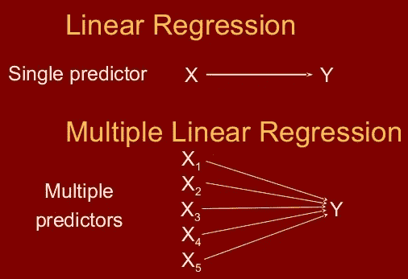
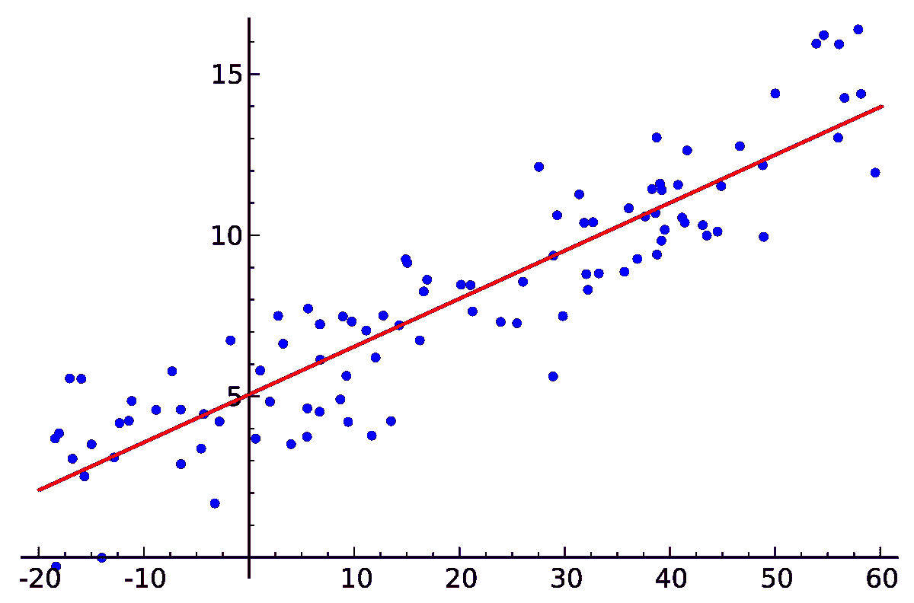
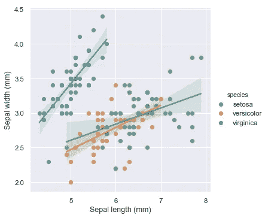

# 线性回归的类型

> 原文：<https://medium.datadriveninvestor.com/types-of-linear-regression-89f3bef3a0c7?source=collection_archive---------1----------------------->

## 简单和多元线性回归概述

Types of Linear Regression

在这篇博客中，我将简要概述不同类型的线性回归及其在现实世界中的应用。

# **线性回归一般分为两种:**

1.  简单线性回归
2.  多元线性回归

 [## 成为数据科学家所需的 8 项技能|数据驱动型投资者

### 数字吓不倒你？没有什么比一张漂亮的 excel 表更令人满意的了？你会说几种语言…

www.datadriveninvestor.com](https://www.datadriveninvestor.com/2019/02/07/8-skills-you-need-to-become-a-data-scientist/) 

# **1。简单**

在简单线性回归中，我们试图找到**单个自变量**(输入)和**一个对应因变量(输出)**之间的关系。这可以用直线的形式来表示。

同一条直线的等式可以改写为:

1.  **Y** 代表输出或因变量。
2.  **β0 和β1** 是两个未知常数，分别代表截距和系数(斜率)。
3.  **ε**(ε)为误差项。

下面是一个简单线性回归模型的示例图:

Graph of Simple Linear Regression Model

# **简单线性回归的应用包括:**

1.  根据降雨量预测作物产量:产量是因变量，而降雨量是自变量。
2.  学生根据学习时数(理想情况下)得到的分数:分数是相关的，而学习时数是独立的。
3.  根据多年的经验预测一个人的工资:因此经验成为自变量，而工资成为因变量。

# **2。多元线性回归**

在多元线性回归中，我们试图找到 **2 个或多个自变量(输入)**与相应因变量(输出)之间的关系。自变量可以是连续的，也可以是分类的。

描述 y 的预测值如何与 **p 个自变量**相关的方程称为**多元线性回归方程:**

下图是多元线性回归模型，应用于 **iris** 数据集:

Graph for Multiple Linear Regression Model

# **多元线性回归分析可以在以下方面帮助我们:**

1.  它帮助我们**预测趋势**和**未来值**。多元线性回归分析可用于获得**点估计值**。
2.  它可用于**预测变化的效果**或影响。也就是说，多元线性回归分析可以帮助理解当我们改变自变量时**因变量会发生多大的变化。**
3.  它可用于**确定自变量对因变量**的影响强度。